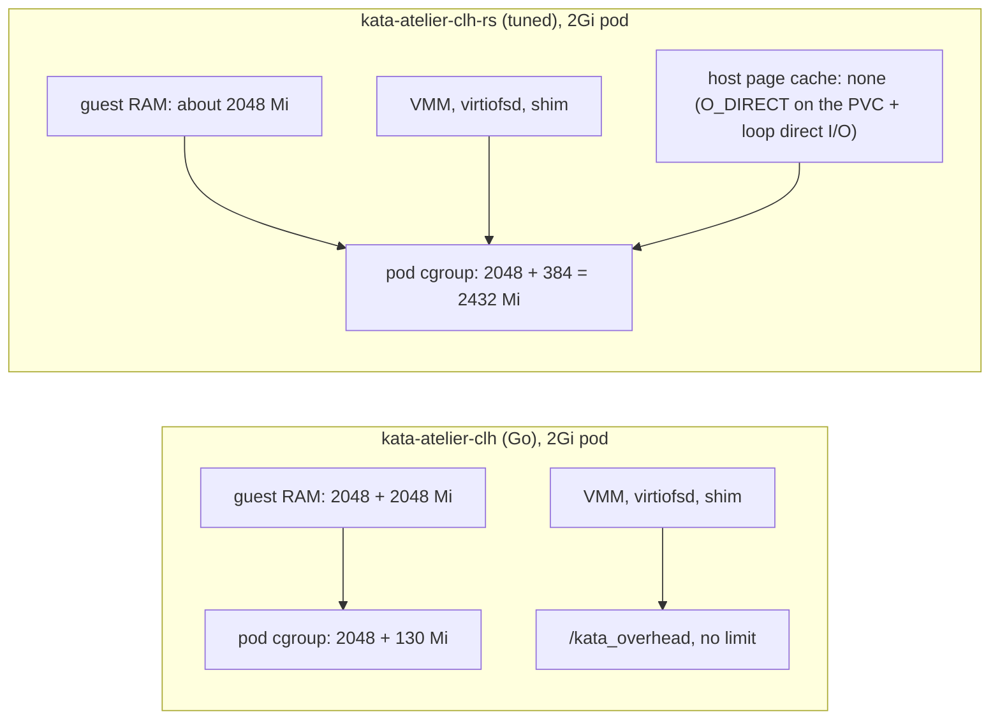

L'Atelier is my self-hosted orchestrator for AI coding agents. Each agent works in a sandbox, and each sandbox is a Kubernetes pod that Kata Containers runs inside its own Cloud Hypervisor VM, on a single Hetzner node. Earlier posts cover [why I built it](/articles/atelier/atelier-stop-babysitting/), the [move to Kubernetes](/articles/atelier/atelier-kubernetes-migration/), the [services around it](/articles/atelier/atelier-supporting-infrastructure/) and [prebuilds](/articles/atelier/atelier-prebuilds/). This one is about a single field in the pod spec: `limits.memory`.

On a plain container the kernel enforces that field inside the container's cgroup: the OOM killer acts there, and nothing outside it notices. On a VM-per-pod runtime that holds only if the runtime arranges it, and the Go Kata runtime I was running did not. The guest booted with more RAM than the pod's host cgroup allowed. A build that filled the guest's page cache pushed the VM past the cgroup limit, and the host OOM killer took the `cloud-hypervisor` process. Prebuild pods died this way on my node.

A host kill gives the guest kernel no say. The pod restarts and the in-flight work is gone. I wanted the normal container behavior back, where the runaway process dies inside the guest and the sandbox keeps running.

On 2026-09-29 the sandboxes moved to a runtime-rs class, `kata-atelier-clh-rs`. The change is merged on Atelier's main branch and runs in production at Frak, which uses the nightly build, and it has held up well there. No tagged release includes it yet; the latest tag is v3.0.0. The limit holds thanks to static guest sizing plus three settings, and a test harness proves it on every runtime change. Booting runtime-rs at all on my AMD node took a module option; two Kata patches for the root cause came afterwards.

## Where a Kata Pod's Memory Goes

Kubernetes sizes a pod's memory cgroup as the container limit plus the RuntimeClass `overhead`. What Kata puts in that cgroup depends on `sandbox_cgroup_only`. The runtime-rs clh config sets it to `true`, so everything the VM costs the host lands there: guest RAM as the guest touches it, the `cloud-hypervisor` process, `virtiofsd`, the shim, and any host page cache produced by the VM's disk I/O. The stock Go clh config leaves it `false`, which keeps only the vCPU threads (and so the guest RAM they touch) in the pod cgroup and moves the rest to an unconstrained `/kata_overhead` cgroup.



The Go runtime (`kata-atelier-clh`) boots the guest with `default_memory`, 2 GiB in the stock config, and adds the container limit on top. A 2Gi sandbox gets a 4 GiB guest in a cgroup of 2 GiB plus 130Mi of overhead. Linux uses spare RAM as page cache, so any large build eventually fills the guest, and from the host's side the VM is now over its limit. Closing that gap would take more than 2 GiB of overhead per pod, which would wreck density. No amount of tuning the pod makes the Go class safe. Shrinking `default_memory` in a Go drop-in is the obvious lever on the runtime side, and I did not go down that road. In Kata 4.x runtime-rs is the default shim and the Go runtime is deprecated, so I moved instead of tuning a runtime on its way out.

runtime-rs Cloud Hypervisor sizes the guest statically from the pod limit: `static_sandbox_resource_mgmt` is on in its stock clh config. Kata 4.2.0 adds a 32 MiB guest-side `overhead_memory` budget on top. A 2Gi pod gets a guest of about 2 GiB. A runaway process now meets the guest's OOM killer, which kills the process and leaves the VM alone.

Static sizing is the precondition. It was not enough on its own: the stock runtime-rs class that kata-deploy ships still lost VMs to the host. Reclaim should free clean page cache before a cgroup OOM-kills, but under the churn test it did not save the VM, so the fixes below stop the host from caching those blocks at all.

## Three Settings That Make the Bound Hold

### O_DIRECT on the Workspace Disk

Each sandbox's workspace is a raw block PVC (`volumeMode: Block`) on TopoLVM. Kata passes it through as virtio-blk, and the guest formats it ext4. The stock Cloud Hypervisor config opens that device through the host page cache (`block_device_cache_direct = false`). So the guest caches disk blocks in its own RAM, and the host caches the same blocks again, charged to the pod cgroup on top of the guest RAM.

`block_device_cache_direct = true` makes the VMM open the PVC with O_DIRECT. The runtime is a kata-deploy custom runtime, a drop-in over the stock config:

```yaml
# infra/k8s/v2/kata-atelier-values.yaml
customRuntimes:
  enabled: true
  runtimes:
    # --- target: runtime-rs Cloud Hypervisor ---
    atelier-clh-rs:
      baseConfig: "clh-runtime-rs" # stock runtime-rs clh (kernel, virtio-fs, static sizing)
      dropIn: |
        [hypervisor.clh]
        # ...
        block_device_driver = "virtio-blk-pci"
        # O_DIRECT on the PVC: no host page cache charged to the pod (VM OOM kills)
        block_device_cache_direct = true
      runtimeClass: |
        kind: RuntimeClass
        apiVersion: node.k8s.io/v1
        metadata:
          name: kata-atelier-clh-rs
          # ...
        handler: kata-atelier-clh-rs
        overhead:
          podFixed:
            cpu: 250m
            memory: 384Mi
```

The `block_device_driver` line restates the stock default, so an upstream change cannot quietly break the block passthrough. The two runtimes spell it differently, too: the Go `clh` runtime accepts only `"virtio-blk"`, runtime-rs wants `"virtio-blk-pci"`.

### A 384Mi Overhead

With the guest taking the whole pod limit, the RuntimeClass overhead has to pay for everything around it: `cloud-hypervisor`, `virtiofsd`, the shim and kernel memory. The kata-deploy 4.2 chart's default for clh is 130Mi. I judged that too little for them and set 384Mi. The measured peaks say most of it is margin. In the 2Gi validation run the pod cgroup peaked at 2092 MiB under a ceiling of 2432 MiB (2048 + 384), 44 MiB over the limit. At 4Gi it peaked at 4137 MiB under 4480. No run tested 130Mi with the other two settings in place, so I cannot say the default would fail. The margin costs density, covered below.

### Direct I/O on the Loop Device

The last one sits below Kubernetes. On my node, the LVM thin pool behind TopoLVM has a single physical volume, `/dev/loop0`, a loop device over a 100G image file, attached at boot by a hand-written systemd unit. A buffered loop device writes its backing file through the host page cache, and that cache is charged to the cgroup of the pod that wrote it (cgroup-aware loop I/O, in the kernel since 5.14). O_DIRECT at the VMM did not help with that: the pod still paid for host cache one layer further down.

The fix is one flag on the unit's `losetup`, `--direct-io=on`. `losetup -l -O NAME,DIO /dev/loop0` must report `1`, and a live device can be switched with `losetup --direct-io=on /dev/loop0`. This bites thin pools on a loop device over a file, and I added the flag to Atelier's setup steps for loop-backed thin pools.

My understanding is that the bound needs all of it: runtime-rs static sizing with `block_device_cache_direct = true`, the 384Mi overhead, and loop direct I/O on the node. That comes from reasoning about the mechanism more than from measurement. The harness (covered below) shows the full set passing and the stock class, with neither `block_device_cache_direct` nor the bigger overhead, failing. I did not test each setting alone.

## A Ryzen, SEV, and Two Kata Patches

Before any of that could be measured, the first runtime-rs VM had to boot, and it did not. Every start failed with `SEV not supported`.

The node is a Zen 2 Ryzen 5 3600. CPUID advertises SEV and SEV-ES but no SNP, `kvm_amd` reports `sev=Y`, and as far as I can tell SEV is not usable on this consumer part anyway. Nothing on the box uses SEV, and no sandbox asks for a confidential guest. The workaround is a module option: `options kvm_amd sev=0` in `/etc/modprobe.d/`, effective after reloading `kvm_amd` with no VMs running, or after a reboot. It is set on the node and checked by `validate.sh`, the test harness described below.

Then I went looking for why a runtime that was asked for no protection cared about SEV at all. Two bugs were stacked.

### The SEV Check Tested the SNP Bit

`arch_guest_protection()` in `kata-sys-util` reads the `kvm_amd` parameters. When `sev` is `Y`, it confirms with CPUID leaf `Fn8000_001F`, where EAX bit 1 is SEV and bit 4 is SEV-SNP. It tested bit 4 before reporting plain SEV:

```diff
         // ...
         let fn8000_001f = x86_64::__cpuid(0x8000_001f);
-        if fn8000_001f.eax & 0x10 == 0 {
-            return Err(ProtectionError::CheckFailed("SEV not supported".to_owned()));
-        }
```

On a CPU with SEV and no SNP, that returns `SEV not supported` where it should return `GuestProtection::Sev`. The patch tests bit 1 for SEV, tests bit 4 only when the `sev_snp` parameter is set, and moves the check into a function that can be unit-tested:

```rust
// src/libs/kata-sys-util/src/protection.rs
// CPUID Fn8000_001F EAX feature bits, see "Function 8000_001Fh - Encrypted
// Memory Capabilities" in the AMD64 Architecture Programmer's Manual, Vol. 3:
// bit 1 is SEV and bit 4 is SEV-SNP.
#[cfg(target_arch = "x86_64")]
const CPUID_FN8000_001F_EAX_SEV: u32 = 1 << 1;
#[cfg(target_arch = "x86_64")]
const CPUID_FN8000_001F_EAX_SEV_SNP: u32 = 1 << 4;

#[cfg(target_arch = "x86_64")]
fn sev_params_from_cpuid(eax: u32, ebx: u32, snp: bool) -> Result<(u32, u32), ProtectionError> {
    if eax & CPUID_FN8000_001F_EAX_SEV == 0 {
        return Err(ProtectionError::CheckFailed("SEV not supported".to_owned()));
    }

    if snp && eax & CPUID_FN8000_001F_EAX_SEV_SNP == 0 {
        return Err(ProtectionError::CheckFailed(
            "SEV-SNP not supported".to_owned(),
        ));
    }
    // ...
}
```

The unit test feeds it the Ryzen 5 3600's own registers: EAX `0x1000f`, which has the SEV and SEV-ES bits set and the SNP bit clear.

### A Failed Check Stopped Every VM

The first bug produced a wrong answer. The second made any wrong answer fatal. In the runtime-rs Cloud Hypervisor backend, `prepare_vm()` calls `handle_guest_protection()`, which ran the host check and returned its error (`.await??`) before looking at `confidential_guest`. A host where the check fails could start no Cloud Hypervisor VM at all, protected or not.

Upstream had fixed this pattern once already. PR #13128, merged in June and included in Kata 4.2.0, makes `virt_container`'s `sandbox.rs` skip detection when no confidential guest is requested. Its commit message describes my machine almost word for word: `kvm_amd` `sev` set to `Y`, no SNP CPUID bit, "e.g. consumer Ryzen". The Cloud Hypervisor backend runs its own check in `prepare_vm()`, so it kept failing.

Copying #13128 was not an option. Upstream's Cloud Hypervisor backend refuses a non-confidential guest on a TDX host (`TDXProtectionMustBeUsedWithCH`), so the check has to run. The patch keeps it and changes what a failure means:

```diff
         let protection =
-            task::spawn_blocking(|| -> Result<GuestProtection> { get_guest_protection() })
-                .await??;
+            task::spawn_blocking(|| -> Result<GuestProtection> { get_guest_protection() }).await?;
+
+        let protection = match protection {
+            Ok(protection) => protection,
+            // ...
+            Err(e) if !confidential_guest => {
+                warn!(sl!(), "failed to check guest protection, running without it"; "error" => format!("{e:#}"));
+                GuestProtection::NoProtection
+            }
+            Err(e) => return Err(e),
+        };
```

On x86_64 the check reports TDX before anything that can fail, so the TDX refusal still applies. A new test runs `handle_guest_protection()` against a faked `SEV not supported` error with `confidential_guest` set both ways: the confidential guest must get the error, the other must start with `NoProtection`.

On my reading of the code, either patch alone would let the node boot VMs with `sev=Y`. I have not run a patched build on it yet. The first corrects the answer on SEV-without-SNP CPUs; the second keeps a failed probe from blocking guests that never asked for protection. Both sit on a branch of my fork, [`runtime-rs-sev-probe-non-snp`](https://github.com/KONFeature/kata-containers/tree/runtime-rs-sev-probe-non-snp), committed on 2026-09-30, a few hours after the cutover commit. They are meant to go upstream; no PR is open yet. Until a Kata release fixes the probe, the node keeps `sev=0` and the harness keeps checking for it. Both commits carry a `Generated-By: Claude Opus (Anthropic)` trailer above my sign-off.

## The Harness Is the Cutover Gate

Reading the config was never going to tell me whether the limit held. I wanted a test that tries to break it, on the real node, with the real pod shape, that I can rerun after every kata-deploy upgrade, runtime drop-in change or node storage change. It lives in `infra/k8s/v2/kata-eval/`.

Its pods copy the production pod shape from `buildSandboxPod`, the function the Atelier server uses to build sandbox pods: same boot script, same raw block PVC, `requests.memory == limits.memory`. It resolves `dev-base:latest` to a digest first, so a run tests the current image and ignores whatever the node cached under the tag. Everything happens in a throwaway namespace.

Two Atelier terms show up in the checks. A toolset is a content-addressed erofs image (code-server, opencode, an org's tools) that the agent inside the guest mounts as a read-only lower layer of an overlay on `/home/dev`. Materializing is pulling those images and mounting them. `validate.sh <runtimeClass> [rollbackClass]` exits 0 only if every check passes:

| Check | What it proves |
|---|---|
| Node prerequisites | The thin-pool loop device has direct I/O; `kvm_amd sev` is off |
| Fresh boot | Block PVC passthrough, the boot script's mkfs guard (it formats only a provably new disk) formats this one, `/data` is ext4 on `/dev/atelier-data` |
| Materialize + overlay | The agent mounts toolsets and assembles the `/home/dev` overlay, sshd runs, `dev` can write |
| Lower-dir rename | Renaming a lower-layer directory sets `trusted.overlay.redirect` on the ext4 upper |
| Memory bound | Page-cache churn then an anonymous hog: the host must not OOM-kill the VM |
| Disk portability | With a rollback class, the disk resumes on it and back without reformat or data loss |
| Teardown | The pod's VMM process exits with the pod |

The memory-bound check is the one the whole migration exists for. A script copied into the guest writes and reads back three 1.5 GiB files through the block PVC, which is the workload that used to kill VMs, then allocates anonymous memory 1 MiB at a time up to 8 GiB:

```sh
# infra/k8s/v2/kata-eval/guest/stress.sh
for i in 1 2 3; do
  dd if=/dev/zero of=/data/.eval-churn$i bs=1M count=1536 status=none conv=fsync
  cat /data/.eval-churn$i > /dev/null
  # ...
done
rm -f /data/.eval-churn*; sync
python3 - <<'EOF'
blocks = []
for i in range(8192):
    blocks.append(bytearray(1024 * 1024))  # touch 1 MiB each
    # ...
EOF
echo "hog exit=$? (137 = guest OOM killer took the hog, VM alive)"
```

The verdict comes from the host. `validate.sh` reads the pod's cgroup on the node over SSH (`memory.max`, `memory.peak`, the `oom_kill` counter in `memory.events`) and the container's restart count:

```bash
# infra/k8s/v2/kata-eval/validate.sh
read -r cgmax peak oomk <<<"$(pod_memcg $P)"
echo "  host: cgroup max ${cgmax}Mi, peak ${peak}Mi, host oom_kill=$oomk, restarts=$(restarts $P)"
[ "$oomk" = 0 ] && [ "$(restarts $P)" = 0 ] && pass "VM survived; the guest OOM killer handled the hog" || fail "host OOM-killed the VM (see README: cache_direct / overhead / loop DIO)"
```

A second script, `extended.sh`, covers the other runtime-dependent paths. It builds and captures a toolset from inside the guest (`mkfs.erofs` plus `oras push`), materializes that fresh artifact in a new VM, and runs the shape of Atelier's pause and resume: guest `sync`, VolumeSnapshot of the live PVC, boot a clone of it. It finishes with `ssh dev@<pod IP>`. A third, `bench.sh`, times cold boots and runs fio and a small-file copy, one class at a time.

The results from 2026-09-29, on Kata 4.2.0:

| Class | Result |
|---|---|
| `kata-atelier-clh` (Go runtime) | Memory bound fails at any overhead |
| stock `kata-clh-runtime-rs` (130Mi, no cache_direct) | 11/15, memory bound fails with a host OOM kill |
| `kata-atelier-clh-rs` (384Mi + `block_device_cache_direct`) | 15/15 at 2Gi, 13/13 at 4Gi, `extended.sh` 8/8 |

The 4Gi run has two checks fewer because it ran without a rollback class, which skips the two portability steps. The harness also has a declared blind spot: tool ingresses, the terminal WebSocket and the server's own prebuild orchestration. Those are server-side or independent of the runtime, so I check them through Atelier after a cutover.

I gated the server config switch to the new class: it deploys only after my infra repo ships `kata-atelier-clh-rs` and `validate.sh kata-atelier-clh-rs kata-atelier-clh` passes. The branch merged into main that evening.

## What It Cost

### I/O and Boot

`bench.sh` with 4Gi pods and loop direct I/O on:

| | Go `kata-atelier-clh` | runtime-rs `kata-atelier-clh-rs` |
|---|---|---|
| Boot to agent healthy | ~6.2s | ~5.9s |
| fio randread 4k QD32 | ~125k IOPS | ~72k IOPS |
| fio randrw 4k QD1 | ~12k IOPS | ~4k IOPS |
| fio seqread 1M | ~1.1 GB/s | ~4.4 GB/s |
| fio seqwrite 1M | ~0.3-0.6 GB/s | ~0.7-0.8 GB/s |
| Copy 731 MB / 13k files into home | 4.2-6.4s | 3.8-4.1s |

Random I/O dropped by about 42% at queue depth 32 and by two thirds at queue depth 1. Boot time barely moved. My read is that the Go runtime's random-read numbers come from the host page cache, the same memory that was charged to the pod and getting VMs killed, while runtime-rs with O_DIRECT reads the disk. The bench changed the runtime and the cache mode together, so I cannot split the drop between them. Hot files still come out of the guest's own cache, inside the pod limit, so I expect everyday work to feel the drop less than the fio rows suggest. The bench did not measure that directly; the closest row is the small-file copy, which was faster on runtime-rs, as was sequential I/O.

### Density and Build Pods

384Mi of overhead per pod instead of 130Mi means the node schedules about 12 sandboxes at the 4Gi default, where it fit about 13.

Build pods got bigger too. Prebuild bakes and toolset builds booted with a 2 GiB limit, which under the Go runtime meant a 4 GiB guest in a 2 GiB cgroup. The `sandbox-pb-*` pods that died were these. Under runtime-rs they get 4 GiB, which keeps the guest RAM those builds already ran with, inside a limit that finally bounds it:

```typescript
// apps/server/src/runtime/runtime.service.ts
const BUILD_POD_RESOURCES: SandboxSpec["resources"] = {
  vcpus: 2,
  memoryMb: 4096,
};
```

While a build runs it holds 4Gi of the node's schedulable memory. The general rule changed with it: under runtime-rs, `spec.resources.memoryMb` is the guest's entire RAM, page cache included, so a sandbox has to be sized for its real workload.

I accepted both costs. A slower random read can make a cold build take longer. A host OOM kill restarts the pod and throws away the agent's in-flight work at a moment nobody chose. I can live with the first.

## Keeping the Way Back Open

Atelier's only contract with the runtime is the RuntimeClass name in its server config (`kubernetes.runtimeClass` in `30-config.yaml`). kata-deploy defines both classes side by side: `kata-atelier-clh-rs` as the target and the Go `kata-atelier-clh` as the rollback. The Go runtime is deprecated upstream since Kata 4.0 but still shipped, so it stays for now. Rolling back means flipping that one value and pausing and resuming the sandboxes.

That plan depends on one property: a workspace disk formatted under one runtime has to mount unchanged under the other. The portability check in `validate.sh` tests it directly. It writes a marker to `/data`, deletes the pod, boots the same PVC under the rollback class, checks the marker and the boot log, then does the same thing back under the target class. A boot that formatted the disk or refused it fails the check.

The boot log can say "refused" because of work earlier that same day. Before upgrading kata-deploy 3.31.0 to 4.2.0, I tightened the disk path. `sandbox-boot.sh` used to run `mkfs.ext4 -F` whenever `blkid` saw no filesystem. It now formats only with positive proof the disk is new: the server set `ATELIER_DATA_FRESH=1` because it just created that PVC blank, `blkid -p` exits exactly 2, and the first 1 MiB reads back as zeros. Anything else aborts the boot and leaves the disk alone.

## What Is Still Open

Discard does not reach the thin pool on this setup. Neither runtime passes it through for raw block PVCs, so deleted workspace data never goes back to the pool.

The SEV workaround stays on the node until the probe is fixed in a Kata release, and the two patches still need to become an upstream PR. Once a release with the fix is deployed, `sev=0` comes off the node and `validate.sh` gets rerun, like after every other runtime change.

The harness checks the outcome inside the guest, not the mechanism. The hog exits 137 and the container is not restarted. I have not traced whether the container's cgroup inside the guest or the guest-wide OOM killer picks the hog, or what keeps the Kata agent off the list.

`validate.sh` is what I trust now, and the next kata-deploy bump does not ship until it passes again.
