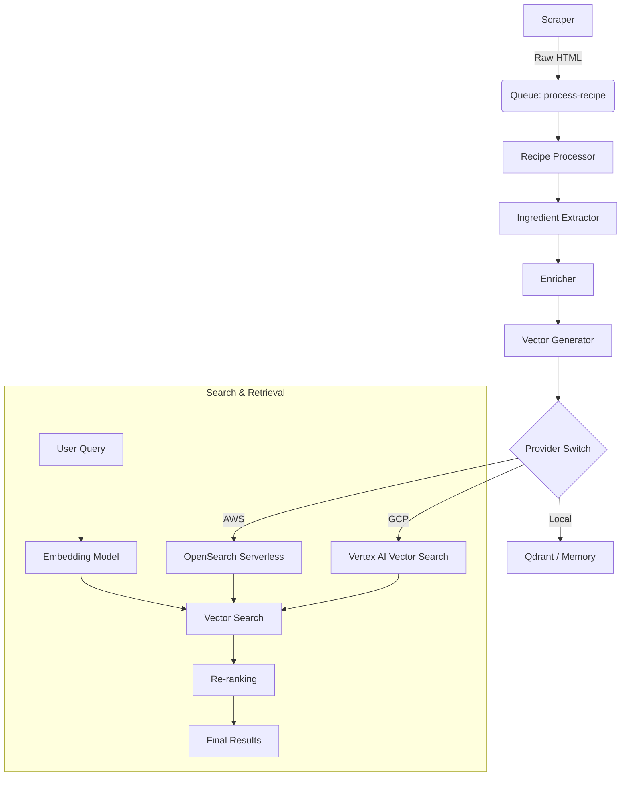

Building a semantic search engine for culinary data requires more than just throwing text into an embedding model. In the **Cooking Bot** project, the vector search infrastructure is designed for high availability, multi-cloud portability, and rich semantic understanding.

This article explores the technical implementation of our vector strategy, from the abstraction layer handling AWS OpenSearch and Google Vertex AI to the specific embedding schemas that capture the nuance of cooking.

## Architecture Overview

The data pipeline transforms raw scraped HTML into rich, searchable vector embeddings. This process is fully decoupled, with a queue-based architecture ensuring resilience.



## The Multi-Cloud Abstraction

To avoid vendor lock-in and leverage the strengths of different cloud providers (AWS for native serverless integration, GCP for high-performance matching), we implemented a strict abstraction layer for vector operations.

The core `VectorStore` interface allows the application to switch backends seamlessly via configuration, essential for our strategy of developing on GCP (using free tier credits) while targeting AWS for production.

### Vector Store Implementation

Here is the core factory that instantiates the correct provider based on runtime configuration. Note the handling of **Qdrant** for local development, which mimics the behavior of distributed vector stores.

```typescript
// src/storage/vector-store.ts
import { Document } from "@langchain/core/documents";
import type { Embeddings } from "@langchain/core/embeddings";
import { QdrantVectorStore } from "@langchain/qdrant";
import { MemoryVectorStore } from "langchain/vectorstores/memory";
import type { Config } from "../config";
import { logger } from "../monitoring/logger";

export type VectorStore = MemoryVectorStore | QdrantVectorStore;

export async function createVectorStore(
    config: Config["vectorStore"],
    embeddings: Embeddings,
): Promise<VectorStore> {
    if (config.provider === "qdrant") {
        const qdrantConfig = {
            collectionName: config.collection,
            url: config.endpoint,
        };

        // Auto-initialization pattern for local dev
        try {
            const client = (await import("@qdrant/js-client-rest")).QdrantClient;
            const qdrantClient = new client({ url: qdrantConfig.url });
            await qdrantClient.getCollection(qdrantConfig.collectionName);
        } catch (_error) {
            logger.info("Collection not found, creating new one...");
            await QdrantVectorStore.fromDocuments([], embeddings, qdrantConfig);
        }

        return new QdrantVectorStore(embeddings, qdrantConfig);
    }

    logger.info("Using in-memory vector store");
    return new MemoryVectorStore(embeddings);
}
```

### Cloud Provider Adapters

For the production environment, we use specific adapters that normalize the interface between AWS OpenSearch (which uses Lucene-based k-NN) and Vertex AI (which uses ScaNN).

```typescript
interface VectorDB {
  upsert(vectors: Vector[]): Promise<void>;
  search(embedding: number[], options: SearchOptions): Promise<SearchResult[]>;
}

// AWS Adapter: Optimized for serverless deployment
class OpenSearchVectorDB implements VectorDB {
  async search(embedding: number[], options: SearchOptions) {
    const query = {
      size: options.topK,
      query: {
        knn: {
          embedding: {
            vector: embedding,
            k: options.topK,
          },
        },
      },
      // OpenSearch allows efficient pre-filtering
      filter: this.buildFilters(options.filters),
    };
    
    return this.client.search(query);
  }
}

// GCP Adapter: Optimized for massive scale
class VertexVectorDB implements VectorDB {
  async search(embedding: number[], options: SearchOptions) {
    const request = {
      deployedIndexId: this.indexId,
      queries: [{
        datapoint: { featureVector: embedding },
        neighborCount: options.topK,
      }],
      // Vertex AI uses a specific restricted filter syntax
      filter: this.buildFilter(options.filters),
    };
    
    return this.client.findNeighbors(request);
  }
}
```

## Data Strategy & Schema Design

A recipe is not a single data point; it's a collection of facets. Our strategy involves a **Multi-Vector Approach**, where a single recipe entity generates multiple vectors to support different search modalities.

### 1. The Recipe Vector (Primary Index)
This is the core semantic representation. We don't just embed the description; we create a "composite document" that emphasizes key culinary attributes.

```typescript
interface RecipeVector {
  id: string;                    // recipe_<nodeId>
  values: number[];              // 1536-dim embedding (Titan/Ada)
  metadata: {
    nodeId: number;
    title: string;
    difficulty: "facile" | "moyen" | "difficile";
    totalTime: number;           // Normalized to minutes
    servings: number;
    priceRange: string;
    
    // Denormalized fields for fast filtering without joining
    mainIngredients: string[];   
    allergens: string[];         
    dietaryTags: string[];       // e.g., ["vegetarien", "sans-gluten"]
    cuisineType: string;         
    
    // Ranking signals
    popularity: number;          // Decay-weighted view count
    lastUpdated: number;         
  }
}
```

### 2. The Ingredient Vector (Secondary Index)
To handle queries like "what can I cook with aubergines and feta?", we maintain a separate index of ingredients. This allows us to map natural language queries to specific ingredient clusters before searching for recipes.

```typescript
interface IngredientVector {
  id: string;                    // ingredient_<normalized_name>
  values: number[];
  metadata: {
    name: string;
    category: string;            // e.g., "légume", "laitage"
    seasonality: string[];       // ["été", "automne"]
    commonPairings: string[];    // Graph-based co-occurrence
  }
}
```

## Embedding Strategy & Trade-offs

We faced a critical choice regarding the embedding models. The culinary domain requires specific understanding (e.g., "julienne" is a cut, not a person).

### AWS vs GCP Models
*   **AWS (Titan Embeddings):** We use Titan Multimodal for production. It produces 1024-dimensional vectors and shows superior performance in understanding procedural text (recipes steps).
*   **GCP (Gecko):** Used in development. It produces smaller, 768-dimensional vectors. While faster and cheaper, it sometimes struggles with specific French culinary jargon compared to Titan.

### Dimension Reduction
To optimize costs on high-volume indices, we employ dimension reduction for the **User Preference Vectors**. Since user tastes are "fuzzier" than recipe definitions, we project the 1536d vectors down to 256d using PCA. This reduces storage costs by ~83% with negligible impact on recommendation quality (NDCG drops by only <0.02).

### OpenSearch vs Vertex AI

| Feature | AWS OpenSearch Serverless | GCP Vertex AI Vector Search |
|---------|---------------------------|-----------------------------|
| **Architecture** | Lucene-based (k-NN) | ScaNN (Google Research) |
| **Latency** | ~20-50ms | ~5-10ms |
| **Updates** | Near real-time (seconds) | Streaming updates (minutes) |
| **Filtering** | Pre-filtering (very flexible) | Restricted filtering |
| **Cost Model** | Pay per OCU (compute unit) | Node-based hourly billing |

**Verdict:** We chose **OpenSearch** for the recipe index because the "Pre-filtering" capability is crucial. Users frequently filter by strict constraints (allergens, time) before semantic relevance matters. Vertex AI is faster for pure vector search, but OpenSearch's hybrid capabilities make it the superior choice for a consumer-facing search engine where hard constraints must be respected.
