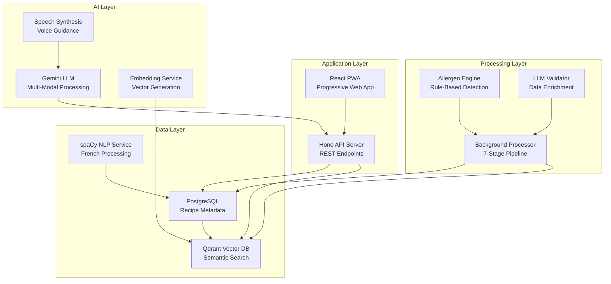

# Building a Safety-First AI Cooking Assistant

In the world of AI-powered food applications, there's no room for error when it comes to health and safety. A single mistake in allergen detection could have serious consequences. This is the story of how we built a sophisticated French cooking assistant that processes over 35,000 recipes with an unwavering commitment to safety, performance, and user experience.

## The Challenge: Beyond Simple Recipe Search

When we set out to build our cooking assistant, we weren't just trying to create another recipe aggregator. We wanted to solve the complex problem of **personalized recipe discovery** that could safely accommodate every dietary need, preference, and restriction. The challenge was multifaceted:

- **Health-critical accuracy**: Allergen detection must be 100% reliable
- **Cultural complexity**: French cuisine has intricate terminology and preparation methods
- **Scale**: Processing tens of thousands of recipes with consistent quality
- **Real-time interaction**: Users expect instant, conversational cooking guidance
- **Cost efficiency**: AI operations at scale can become prohibitively expensive

## Our Dataset: The Foundation of Quality

Our system starts with a comprehensive dataset of **35,000+ French recipes** sourced from Elle à table, one of France's most prestigious culinary publications. This isn't just a collection of ingredients lists – it's a rich tapestry of:

- **Complex ingredient expressions**: "2 c. à soupe de farine" (2 tablespoons of flour)
- **Culinary techniques**: Detailed preparation methods and cooking instructions
- **Nutritional information**: When available, for enhanced filtering
- **Seasonal data**: Ingredient availability and optimal preparation times
- **Cultural context**: Traditional French dishes with regional variations

The diversity and quality of this dataset presented both an opportunity and a challenge. While it provided excellent raw material, the complexity of French culinary language meant that simple keyword matching would never be sufficient.

## What We're Building: The Complete Vision

Our cooking assistant is designed to be a **comprehensive culinary companion** that can:

### 1. **Intelligent Recipe Discovery**
Users can search using natural language, dietary restrictions, available ingredients, or even just a vague craving. The system understands context, intent, and constraints to deliver perfectly matched recipes.

### 2. **Safety-First Personalization**
This is where we differ from every other recipe app. Our system doesn't just filter by tags – it performs **deep allergen analysis** on every recipe, considering:
- Direct allergen presence
- Hidden sources and derivatives
- Cross-contamination risks
- Processing method impacts

### 3. **Adaptive Cooking Guidance**
Once a recipe is selected, the system provides **real-time cooking assistance** through voice interaction, adapting instructions based on:
- User skill level
- Available equipment
- Household size
- Time constraints

### 4. **Intelligent Substitution**
When ingredients are unavailable or restrictions apply, the system suggests **safe alternatives** that maintain recipe integrity while respecting all dietary constraints.

## The Architecture: A Multi-Layered Approach

To achieve this vision, we designed a sophisticated multi-layered architecture that balances performance, safety, and scalability:



## Technology Stack: Modern, Efficient, Purpose-Built

Our technology choices reflect our commitment to performance, developer experience, and operational excellence:

### **Runtime & Foundation**
- **Bun**: Ultra-fast JavaScript runtime replacing Node.js
- **TypeScript**: Strict typing across the entire codebase
- **Monorepo**: Organized with workspaces for maintainability

### **Backend & API**
- **Hono**: Modern, fast web framework for our API layer
- **Drizzle ORM**: Type-safe database operations with PostgreSQL
- **Zod**: Runtime validation for API safety
- **Qdrant**: Vector database for semantic search capabilities

### **Frontend & User Experience**
- **React 19**: Latest React with concurrent features
- **TanStack Router**: Type-safe routing with excellent DX
- **TanStack Query**: Server state management and caching
- **Tailwind CSS**: Utility-first styling with Radix UI components
- **PWA**: Offline capabilities and mobile app experience

### **AI & NLP Processing**
- **spaCy**: Production-grade NLP with French language models
- **Google Gemini**: Multi-modal LLM for text and speech processing
- **Custom NLP Pipeline**: Hybrid rule-based and ML approach
- **OpenTelemetry**: Comprehensive observability for AI operations

### **Infrastructure & Deployment**
- **SST v3**: Infrastructure as Code for multi-cloud deployment
- **Docker**: Containerized development and deployment
- **Kubernetes**: Production orchestration with auto-scaling
- **AWS + GCP**: Multi-cloud strategy for resilience

## The Safety Philosophy: Deterministic Over Probabilistic

The most critical architectural decision we made was our **safety-first approach** to AI. While many systems rely entirely on LLMs for understanding and processing, we implemented a **hybrid approach** that combines:

### **1. Rule-Based Systems for Critical Functions**
Allergen detection, dietary classification, and safety-critical parsing use deterministic rule-based systems. These are:
- **100% predictable** and auditable
- **Instantly verifiable** for correctness
- **Cost-free** to operate at scale
- **Culturally aware** of French culinary specifics

### **2. LLMs for Enhancement and Validation**
We use LLMs strategically for:
- **Data enrichment** and validation
- **Natural language understanding** in user queries
- **Conversational interfaces** and cooking guidance
- **Complex reasoning** about recipe adaptations

This approach ensures that **critical safety functions never fail** due to AI hallucinations or model drift, while still leveraging the power of modern AI for user experience.

## Performance and Cost Considerations

Building a system that processes 35,000+ recipes and serves real-time user queries requires careful attention to performance and cost:

### **Processing Pipeline Efficiency**
- **Batch processing** for LLM operations to minimize API calls
- **Multi-level caching** to avoid redundant computations
- **Streaming architecture** for real-time user interactions
- **Background processing** to keep the user-facing system responsive

### **Cost Optimization Strategies**
- **Smart caching** at every layer of the stack
- **Provider abstraction** for competitive LLM pricing
- **Usage analytics** to identify optimization opportunities
- **Efficient data structures** to minimize computational overhead

## The Development Experience: Docker-Native Workflow

We believe that great systems require great development workflows. Our **Docker-native development environment** provides:

```bash
# Start the entire stack with hot reload
make dev

# Connect to staging databases for real-world testing
make remote-dev

# Run comprehensive test suites
make test-all
```

This setup gives developers:
- **Instant feedback** with hot reload across all services
- **Consistent environments** from development to production
- **Remote development** capabilities with staging data
- **Integrated testing** across TypeScript and Python components
