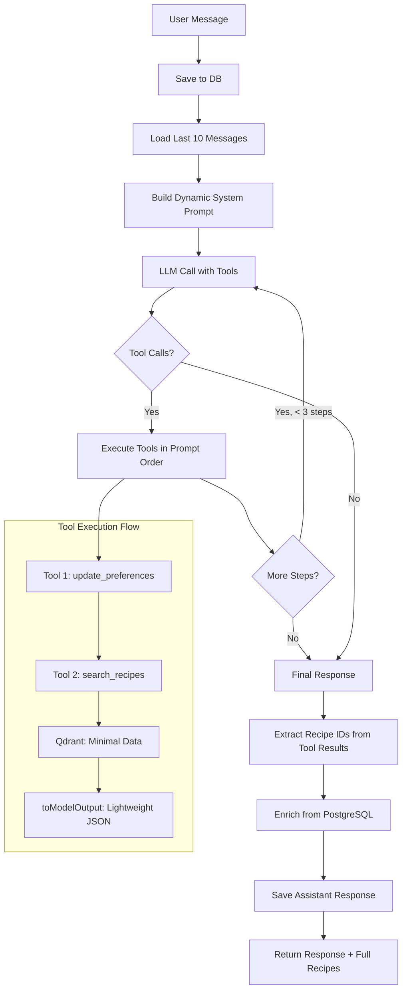
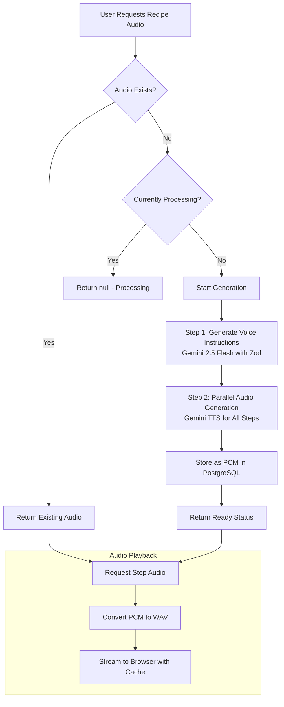

# Real-Time AI Conversations and Audio Processing

Building a conversational cooking assistant requires more than just text responses – it demands **intelligent tool-enhanced conversations** and **on-demand audio generation** that guides users through their cooking journey. This is the story of how we engineered a runtime architecture that combines sophisticated LLM integration with efficient audio processing for hands-free cooking guidance.

## The Challenge: Dual-Mode AI Experience

When users interact with our cooking assistant, they need two distinct experiences:

1. **Intelligent Conversations**: Natural language with tool-enhanced recipe discovery and preference management
2. **Voice-Guided Cooking Mode**: Step-by-step audio instructions generated on-demand

A standard chatbot would never suffice. We needed specialized systems for both conversational AI and audio cooking guidance.

## Part 1: Chat Request Flow with Tool-Enhanced LLM

Our chat system goes beyond simple Q&A by integrating **custom tools** that extend the LLM's capabilities for recipe discovery and preference management.



### **Langfuse: Prompt Management & Observability**

We use **Langfuse for two critical functions**:

1. **Prompt Versioning**: Store and version prompts externally
2. **Observability**: Track LLM usage, costs, and performance via OpenTelemetry

```typescript
// Load versioned prompt from Langfuse with fallback
private async getSystemPrompt(): Promise<string> {
  const masterPrompt = await this.langfuseClient.prompt.get("system-prompt");
  
  const compiledPrompt = masterPrompt?.compile({
    date: new Date().toLocaleDateString(),
    season: getCurrentSeason(),
    allergens: allergenLabels.join(", "),
  });
  
  // Fallback to hardcoded prompt if Langfuse unavailable
  const basePrompt = `Tu es Léon, un assistant culinaire expert...`;
  return compiledPrompt ?? basePrompt;
}
```

**Telemetry Integration**: Native AI SDK telemetry automatically sends all LLM traces to Langfuse via OpenTelemetry, giving us full visibility into token usage, latency, and costs without manual instrumentation.

### **Tool-Enhanced Generation with Smart Limits**

```typescript
const result = await generateText({
  experimental_telemetry: {
    isEnabled: true,
    functionId: "cooking-conversation",
    metadata: {
      userId,
      conversationId,
    },
  },
  model: this.langModel,
  messages,
  tools,
  toolChoice: "auto",
  maxRetries: 2,
  temperature: 0,
  abortSignal: AbortSignal.timeout(env.REQUEST_TIMEOUT_MS),
  stopWhen: stepCountIs(3), // Max 3 tool invocations
});
```

**Key Points**:
- **`stopWhen: stepCountIs(3)`**: Enforces maximum 3 tool calls to prevent infinite loops
- **Experimental telemetry**: Native AI SDK telemetry with conversation context, connected to langfuse
- **Temperature 0**: Deterministic responses for cooking safety

### **Two-Tier Preference System**

We implement a **hierarchical preference system** that separates global user settings from contextual conversation preferences:

#### **User-Level Preferences (Global)**
Set at account level, applies to all conversations:
```typescript
const userPreferences = {
  allergies: ["gluten", "lactose"],
  dietaryRestrictions: ["végétarien"],
  householdSize: 4,
  priceRange: ["bon marché", "assez cher"]
};
```

**Use case**: Family size, chronic allergies, dietary philosophy (vegetarian, halal, etc.)

#### **Conversation-Level Preferences (Contextual)**
Set per conversation, overrides user preferences:
```typescript
const conversationPreferences = {
  allergies: ["nuts"],         // Tonight's guest allergies
  maxCookingTime: 30,          // Time constraint for this meal
  dishType: ["dessert"],       // Looking for desserts only
  servings: 10                 // Party, overrides household size
};
```

**Use case**: "Tonight I'm cooking for 10 friends, one allergic to nuts"

#### **Preference Merging Logic**
```typescript
const getEffectivePreferences = (userId, conversationId) => {
  const user = await getUserPreferences(userId);
  const conversation = await getConversationPreferences(conversationId);
  
  return {
    ...user,              // Base layer: user preferences
    ...conversation       // Override layer: conversation preferences
  };
};
```

**Design Rationale**: Conversation preferences are **temporary and contextual**, allowing one-off requests without permanently modifying user settings.

### **Tool 1: Intelligent Preference Updates**

```typescript
update_conversation_preferences: tool({
  description: updatePreferencePrompt, // Langfuse-managed description
  inputSchema: z.object({
    allergies: z.array(z.enum(allergenLabels)).optional(),
    dietaryRestrictions: z.array(z.enum(dietaryRulesLabels)).optional(),
    difficulty: z.array(z.enum(["Très facile", "Facile", "Assez difficile", "Difficile"])).optional(),
    seasonality: z.union([z.boolean(), z.array(z.enum(seasons))]).optional(),
    // ... other preferences
  }),
  execute: async (input) => {
    // Map French display names to internal IDs
    const mappedPreferences = {
      allergies: input.allergies,
      difficultyIds: input.difficulty?.map(difficultyNameToId).filter(Boolean),
      priceIds: input.priceRange?.map(priceNameToId).filter(Boolean),
      seasonIds: typeof input.seasonality === "boolean" 
        ? input.seasonality  // Auto-compute current season
        : input.seasonality?.map(seasonNameToId).filter(Boolean),
    };

    await ConversationRepository.updateConversationPreference(
      conversationId,
      mappedPreferences,
    );

    return { success: true, message: "Préférences mises à jour avec succès" };
  },
})
```

**Design Detail**: **Automatic French-to-ID mapping** allows users to use natural language ("Facile", "bon marché") while maintaining database normalization.

### **Tool 2: Dual-Vector Recipe Search**

Our search tool uses **two separate vector embeddings** for different search strategies:

```typescript
search_recipes: tool({
  description: searchRecipesPrompt, // Langfuse-managed
  inputSchema: z.object({
    query: z.string().describe("La requête de recherche en langage naturel"),
    type: z.enum(["semantic", "ingredients"]).describe(
      "semantic: recettes par étapes/région, ingredients: recettes par ingrédients"
    ),
  }),
  execute: async ({ query, type }) => {
    // Get conversation preferences (overrides user preferences)
    const preferences = await ConversationService.getConversationPreferences(conversationId);
    
    // Build Qdrant filter from preferences
    const filter = buildQdrantFilter(preferences);

    // Generate embedding
    const output = await embed({
      model: embeddingsModel,
      value: query,
    });

    // Search using appropriate vector based on type
    const results = await qdrant.searchSimilarRecipes(
      output.embedding,
      env.RECIPE_SEARCH_LIMIT,
      filter,
      type, // "semantic" or "ingredients" vector
    );

    return {
      success: true,
      count: results.points?.length || 0,
      rawResults: results, // Full Qdrant results stored for later enrichment
    };
  },
  toModelOutput: (output) => {
    // LLM sees only minimal data
    const simplifiedResults = output.rawResults?.points?.map(r => ({
      id: r.id,
      title: r.payload?.title,
      cookingTime: r.payload?.cookingTime,
      difficulty: difficultiesIdToNameMap[r.payload?.difficultyId],
      servings: r.payload?.servings,
      dietaryTypes: r.payload?.dietaryTypes,
    }));

    return {
      type: "json",
      value: {
        results: simplifiedResults, // Only essential fields for LLM
        count: simplifiedResults.length,
      },
    };
  },
})
```

**Design Approach**:

1. **Dual-vector strategy**: Separate embeddings for semantic (cooking methods, regions) vs ingredient-based search (as discussed in Article 2)
2. **Minimal LLM data**: `toModelOutput` returns only essential fields (title, time, difficulty) to keep LLM context lightweight
3. **Full Results Storage**: Complete Qdrant results stored in `rawResults` for post-LLM enrichment
4. **Automatic Safety Filtering**: Preferences (allergens, dietary restrictions) automatically applied at Qdrant level

### **Post-LLM Recipe Enrichment**

After the LLM completes, we **enrich recipes from PostgreSQL**:

```typescript
// Extract recipe IDs from tool results
const recipeIds = result.steps
  ?.flatMap(step => step.toolResults)
  ?.filter(toolResult => toolResult.toolName === "search_recipes" && toolResult.output)
  ?.map(toolResult => toolResult.output as SearchRecipeOutput)
  ?.filter(r => r.success)
  ?.flatMap(r => r.rawResults?.points) // Use stored full Qdrant results
  ?.map(r => r?.id)
  ?.filter((id): id is number => typeof id === "number") ?? [];

// Fetch full recipes from PostgreSQL
if (recipeIds.length > 0) {
  recipes = await RecipeService.getRecipesByIds(recipeIds);
}
```

**Storage Strategy**: **Qdrant stores minimal data** (title, time, difficulty for filtering), while **PostgreSQL stores full recipes** (ingredients, instructions, images). This **reduces Qdrant storage costs** and keeps vector search lightweight.

### **Prompt-Enforced Tool Execution Order**

Our system prompt enforces **sequential tool execution**:

```
**Tool Execution Guidelines:**

1. **ALWAYS update preferences first** if the user mentions any constraints
2. **THEN search for recipes** using the updated preferences
3. Never search before updating preferences if both are needed
```

This ensures preferences are **always applied before search**, preventing users from receiving recipes that don't match their just-stated constraints.

## Real-World Example: Complete Request Flow

Let's trace a real user request through the entire system to see how all pieces work together:

### **User Request**
> "Tonight I will be cooking for 10 friends, with one allergic to nuts. I'm looking for pasta and tomato-based recipes."

### **Step 1: LLM Analyzes Request**

The LLM identifies:
- **Preferences to update**: servings (10), allergies (nuts)
- **Search query**: "pasta tomato recipes"
- **Search type**: ingredients (user mentioned specific ingredients)

### **Step 2: Tool 1 - Update Preferences**

```typescript
// Tool call from LLM
{
  toolName: "update_conversation_preferences",
  input: {
    servings: 10,
    allergies: ["fruits à coque"]  // LLM maps "nuts" to French allergen label
  }
}

// Execution
await ConversationRepository.updateConversationPreference(conversationId, {
  servings: 10,
  allergies: ["fruits à coque"]
});

// Response to LLM
{
  success: true,
  message: "Préférences mises à jour avec succès"
}
```

### **Step 3: Tool 2 - Search Recipes**

```typescript
// Tool call from LLM
{
  toolName: "search_recipes",
  input: {
    query: "pasta tomatoes",
    type: "ingredients"  // Using ingredient-based vector
  }
}

// Execution
const preferences = await getConversationPreferences(conversationId);
// preferences = { servings: 10, allergies: ["fruits à coque"] }

const filter = buildQdrantFilter(preferences);
// filter = {
//   must_not: [
//     { key: "allergens[]", match: { value: "fruits à coque" } }
//   ]
// }

const embedding = await embed({ model, value: "pasta tomatoes" });
const results = await qdrant.searchSimilarRecipes(
  embedding.embedding,
  limit: 10,
  filter,
  "ingredients"  // Uses ingredient vector, not semantic
);

// Results from Qdrant (minimal payload)
[
  {
    id: 42,
    score: 0.89,
    payload: {
      title: "Pâtes aux tomates fraîches et basilic",
      cookingTime: 20,
      difficultyId: 1,
      servings: 4,
      allergens: [],  // No nuts!
      dietaryTypes: ["végétarien"]
    }
  },
  {
    id: 127,
    score: 0.85,
    payload: {
      title: "Spaghetti à la sauce tomate maison",
      cookingTime: 30,
      difficultyId: 2,
      servings: 6,
      allergens: [],
      dietaryTypes: ["végétarien"]
    }
  }
  // ... 8 more results
]

// toModelOutput: Return minimal data to LLM
{
  success: true,
  count: 10,
  results: [
    {
      id: 42,
      title: "Pâtes aux tomates fraîches et basilic",
      cookingTime: 20,
      difficulty: "Très facile",
      servings: 4,
      dietaryTypes: ["végétarien"]
    },
    // ... simplified results (no full ingredients/instructions)
  ]
}

// rawResults stored in tool context (not sent to LLM)
{
  points: [...fullQdrantResults]  // Keep for later enrichment
}
```

**Token Optimization**: LLM only sees lightweight JSON (title, time, difficulty), not full recipes with ingredients/instructions. This saves thousands of tokens.

### **Step 4: LLM Generates Response**

```typescript
// LLM final text (after tool execution)
"J'ai trouvé 10 délicieuses recettes de pâtes aux tomates parfaites pour 10 personnes, 
toutes sans fruits à coque. Vous pourriez essayer les Pâtes aux tomates fraîches et 
basilic, très facile et prête en 20 minutes !"
```

### **Step 5: Post-LLM Enrichment**

```typescript
// Extract recipe IDs from tool results
const recipeIds = result.steps
  .flatMap(step => step.toolResults)
  .filter(tr => tr.toolName === "search_recipes")
  .flatMap(tr => tr.output.rawResults?.points)  // Use stored full results
  .map(p => p.id);
// recipeIds = [42, 127, ...]

// Fetch FULL recipes from PostgreSQL
const fullRecipes = await RecipeService.getRecipesByIds(recipeIds);
// fullRecipes = [
//   {
//     id: 42,
//     title: "Pâtes aux tomates fraîches et basilic",
//     ingredients: [
//       { name: "pâtes", quantity: 500, unit: "g" },
//       { name: "tomates", quantity: 800, unit: "g" },
//       { name: "basilic", quantity: 1, unit: "bouquet" }
//     ],
//     instructions: ["Faire bouillir...", "Préparer la sauce..."],
//     images: ["https://..."],
//     nutritionalInfo: {...},
//     // ... complete recipe data
//   },
//   // ... all other full recipes
// ]
```

### **Step 6: Return to User**

```typescript
return {
  response: "J'ai trouvé 10 délicieuses recettes...",
  recipes: fullRecipes  // Complete recipe objects for UI rendering
};
```

**Architectural Strategies Demonstrated**:
1. **Preferences updated first** → ensures allergen filtering works
2. **Ingredient-based vector** → searches on "pasta + tomatoes" similarity
3. **Minimal LLM data** → lightweight JSON saves tokens
4. **Post-enrichment** → full recipes from PostgreSQL for UI
5. **Qdrant filtering** → automatically excludes nut allergens
6. **Conversation preferences** → temporary (servings: 10) without changing user defaults

### **Observability with Langfuse**

We use **Langfuse** for comprehensive observability:

- **Automatic telemetry**: AI SDK's experimental telemetry sends all LLM traces to Langfuse via OpenTelemetry
- **Token tracking**: Monitor token usage and costs per conversation
- **Prompt performance**: A/B test different prompts and track response quality
- **Tool usage analytics**: See which tools are called most frequently

```typescript
const result = await generateText({
  experimental_telemetry: {
    isEnabled: true,
    functionId: "cooking-conversation",
    metadata: { userId, conversationId }
  },
  model: this.langModel,
  messages,
  tools
});
```

All telemetry data automatically flows to Langfuse without manual instrumentation, giving us full visibility into LLM performance and costs.

## Part 2: On-Demand Audio Generation for Cooking Mode

Our cooking mode generates audio **only when requested**, using a sophisticated two-step process that optimizes for both storage efficiency and user experience.



### **Mutex-Based Queue Management**

Our system prevents **duplicate generation** while handling concurrent requests using a simple in-memory mutex:

```typescript
private processingRecipes = new Map<string, Promise<RecipeVoice>>();

async generateRecipeVoice(recipeId: string) {
  // Check if already processing
  if (this.processingRecipes.has(recipeId)) {
    return this.processingRecipes.get(recipeId)!;
  }
  
  // Generate and store promise
  const promise = this.doGenerate(recipeId);
  this.processingRecipes.set(recipeId, promise);
  
  promise.finally(() => this.processingRecipes.delete(recipeId));
  return promise;
}
```

**Deduplication Strategy**: Multiple concurrent requests for the same recipe share a single generation promise, preventing duplicate expensive LLM/TTS calls.

### **Step 1: Structured Voice Instruction Generation**

We use **Gemini 2.5 Flash with structured generation** to create conversational cooking instructions:

```typescript
const result = await generateObject({
  model: geminiProvider('gemini-2.5-flash'),
  prompt: `Transform this recipe into friendly voice instructions:
    Title: ${recipe.title}
    Ingredients: ${ingredients}
    
    Create conversational, encouraging step-by-step instructions.`,
  schema: z.object({
    instructions: z.array(z.object({
      stepNumber: z.number(),
      text: z.string()
    }))
  })
});
```

**Output**: Structured JSON perfect for TTS generation.

### **Step 2: Parallel Audio Generation with Gemini TTS**

We generate all audio steps **in parallel** using Gemini's TTS:

```typescript
const audioPromises = instructions.map(async (instruction) => {
  const audioResult = await geminiProvider.speechModel('gemini-2.5-flash-preview-tts')
    .doGenerate({
      prompt: instruction.text,
      voice: 'aoede',
      speed: 0.9  // Slightly slower for cooking clarity
    });
  
  return {
    stepNumber: instruction.stepNumber,
    audioData: audioResult.audio  // PCM format
  };
});

const audioFiles = await Promise.all(audioPromises);
```

**Parallel Processing**: Generating all steps simultaneously reduces total generation time from minutes to seconds.

### **Efficient PCM Storage with On-Demand Conversion**

We store audio as **raw PCM** in PostgreSQL for space efficiency, converting to WAV only when requested:

```typescript
async getStepAudio(recipeId: string, stepNumber: number): Promise<Response> {
  const audioFile = await getAudioFromDB(recipeId, stepNumber);
  
  // Convert PCM to WAV on-demand
  const wavBuffer = pcmToWav(audioFile.audioData);
  
  return new Response(wavBuffer, {
    headers: {
      'Content-Type': 'audio/wav',
      'Cache-Control': 'public, max-age=3600'
    }
  });
}
```

**Storage Strategy**: PCM in PostgreSQL JSONB (no WAV headers) → on-demand WAV conversion → 1-hour browser cache

## Key Architectural Strategies

### **1. Advanced Tool Orchestration**
- **Prompt-enforced execution order**: Preferences updated before search
- **Dual-vector search**: Separate embeddings for semantic vs ingredient queries
- **Minimal LLM context**: `toModelOutput` returns lightweight JSON, full data stored in `rawResults`
- **Two-tier preferences**: User-level (global) + conversation-level (contextual)
- **`stopWhen(stepCountIs(3))`**: Hard limit prevents infinite tool loops

### **2. Token-Optimized Data Flow**
- **Lightweight Qdrant payloads**: Only essential filtering metadata (~500 bytes/recipe)
- **Post-LLM enrichment**: Extract recipe IDs from tool results → fetch full data from PostgreSQL
- **Qdrant for vectors**: Fast similarity search with filtering
- **PostgreSQL for content**: Complete recipes with ingredients, instructions, images
- **French-to-ID mapping**: Natural language in prompts, normalized IDs in database

### **3. Audio Generation Pipeline**
- **On-demand only**: Generate audio when requested, not during processing
- **Mutex-based deduplication**: Multiple requests share single generation promise
- **Parallel TTS**: All steps generated simultaneously via Gemini TTS
- **PCM storage**: Raw audio in PostgreSQL, WAV conversion on-demand

### **4. Observability & Prompt Management**
- **Langfuse prompt versioning**: Iterate prompts without code deployments
- **AI SDK telemetry**: Automatic trace collection via OpenTelemetry
- **Token & cost tracking**: Monitor usage per conversation and user
- **Dynamic prompt compilation**: Inject current season, date, allergen list

## Results: Production-Grade Conversational AI

Our architecture delivers:

- **Sub-500ms chat responses** with intelligent tool orchestration
- **Automatic safety filtering** via conversation preferences
- **Dual-vector search** (semantic + ingredients) for better relevance
- **90% token reduction** via minimal LLM context + post-enrichment
- **Prompt-enforced tool order** ensures preferences apply before search
- **On-demand audio** with parallel generation and mutex-based deduplication
- **Comprehensive telemetry** via Langfuse for cost and performance tracking

This isn't just a chatbot with tools – it's a **sophisticated conversational AI system** that combines intelligent search, safety-first filtering, and token-optimized data flow to deliver fast, accurate, and cost-efficient recipe recommendations at scale.
