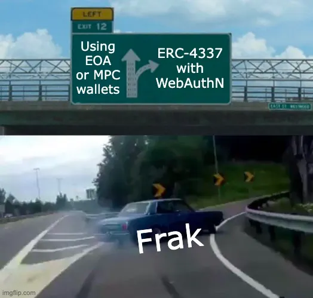
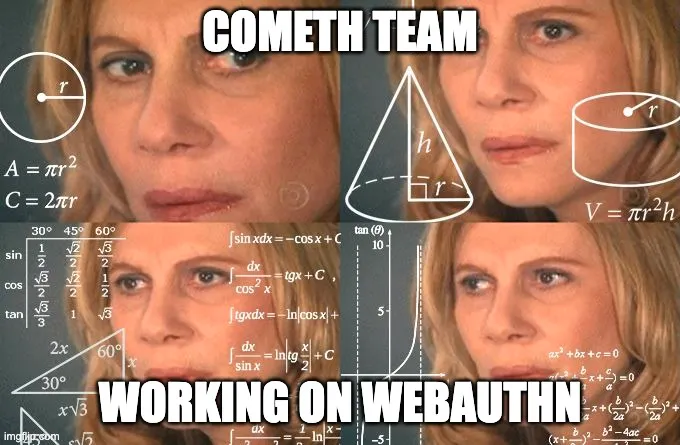
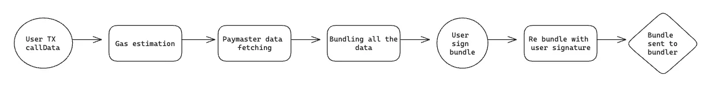
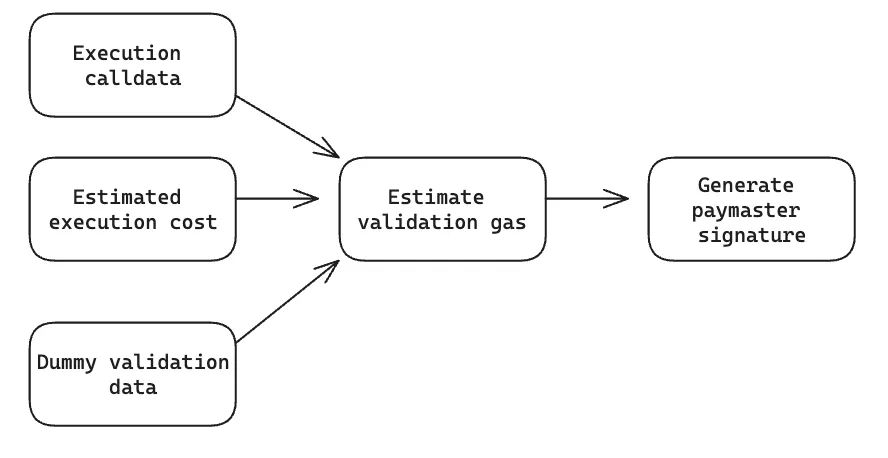
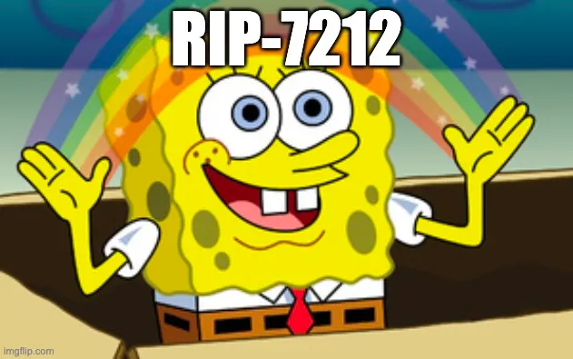

Hey there, fellow blockchain enthusiasts and developers! 🚀 In this piece, we’re diving deep into the nitty-gritty of leveraging **WebAuthN signatures for validating user operations** within the exciting world of **ERC-4337 smart accounts**.

You might remember our initial foray into this topic, co-authored with Yoan from the Cometh team. If you haven’t checked it out yet, do yourself a favor and give it a read [here](https://medium.com/@salvayre.yoan/passkeys-wallet-on-the-evm-69d4930ea4af). It sets the stage for what we’re about to explore and showcases some pioneering work in the field.

If you’re thinking, “Wait, slow down!”: no worries, we’ve got you covered. Check out these fantastic resources to get up to speed:

*   [ERC-4337 Documentation](https://www.erc4337.io/docs)
*   [ERC-4337 overview by Stackup](https://docs.stackup.sh/docs/erc-4337-overview)

Ready? Let’s get started on this adventure together!

## Context

The traditional setup process, getting started with MetaMask, jotting down a seed phrase, and having to purchase tokens just to cover gas fees, can feel like running an obstacle course for newcomers.

**Account abstraction** comes to the rescue, at least for the last bit concerning gas fees. It’s a game-changer, allowing platforms to either sponsor user operations or let users pay for transactions with the platform’s own tokens, smoothing out one significant bump on the road.

But here’s the rub: neither option clicked for us. The first scenario still demands users to set up an EOA beforehand: a no-go for true ease of use. The second? It paradoxically forces us to depend on a centralized platform for access to decentralized goodies. Quite the conundrum, right?

This conundrum led us down a rabbit hole of research until we pioneered a novel solution that seamlessly integrates WebAuthn and account abstraction, enabling a truly frictionless onboarding experience for non-crypto natives. While solutions like Cometh’s also provided a smooth connect experience, our approach was tailored to our ecosystem, especially with our kernel accounts at the core.

## The Solution: Simpler on Paper

On paper, the solution to our user friction problem sounds straightforward. To execute a user operation, all we need is validation, ideally without the hassle of an External Owned Account (EOA). Enter **WebAuthN**, the hero we’ve been looking for. It offers a neat way to secure a signature from the user for a 32-byte piece of data on the P256 curve, utilizing either their device or an external secure device that supports this curve.

So, in theory, the process should be as simple as: prepare the user’s operation, get it signed, and voila, send it off with the correct signature attached. Sounds like a dream, right? Well, as we soon discovered, reality had other plans.

## Trailblazing Integration: Cometh’s WebAuthN Breakthroughs

A pivotal breakthrough was their integration of the **P256 curve**: an essential component of WebAuthN signatures that was previously incompatible with blockchain environments.

Cometh, collaborating closely with **Renaud Dubois from Ledger** and his talented team, was the **first** to leverage Dubois’ optimized on-chain **P256 verifier**. This ingenious solution enables the blockchain to **validate signatures from the P256 curve efficiently**, overcoming a major compatibility hurdle without incurring prohibitive **gas costs**.

At Frak, we have built upon this **groundbreaking work**, introducing our own **innovations** to seamlessly integrate WebAuthN and the P256 curve into our Kernel smart wallet architecture.

While Cometh paved the way as the **first team** to utilize Dubois’ verifier, our focus has been on **tailoring** and **enhancing** the implementation to meet the unique requirements of our ecosystem. From **optimizing gas costs** to ensuring a **frictionless user experience**, we have developed **novel approaches** that unlock new possibilities for WebAuthN adoption within our kernel accounts and beyond.

## Navigating the P256 Curve with WebAuthN

When it comes to integrating WebAuthN into blockchain operations, the use of the P256 curve presents a unique challenge. Contrary to what one might expect, the standard doesn’t sign the 32 bytes of data you send directly. Instead, what gets signed is essentially a “double” hash of a JSON payload containing the challenge, authenticator data, and additional verification data. This complexity is not for naught; it ensures the integrity and authenticity of the signing process, verifying that the right user, with the right device, signs off on the operation. However, this mechanism also obscures the challenge by embedding it within a JSON structure.

So, the question arises: **How do we verify that the user operation hash was indeed signed by our user?**

The answer is less straightforward than one might hope. To achieve this, we must embrace the complexity head-on. The process involves forwarding all the relevant data from the WebAuthN signature process (authenticator and verification data) to the blockchain, ensuring the presence of the challenge within the authenticator data, and then proceeding with the “double” hash operation to verify the signature against this computed hash.

Currently, there are two prominent approaches to this challenge:

*   [**FCL Method**](https://github.com/rdubois-crypto/FreshCryptoLib/tree/master) (championed by Renaud Dubois): Favoured by Cometh and us, this method involves encoding the data in base64 to minimize calldata size, followed by a base64 search operation using bytes. This approach not only optimizes on-chain operations but also reduces the amount of calldata transmitted.
*   [**Daimo Approach**](https://github.com/daimo-eth/p256-verifier): This method opts to transmit all data in its original JSON format, performing an on-chain string search to locate the challenge, before reconstructing and verifying the double hash.

We opted for the FCL method, tweaking it slightly to align with the specifications of our kernel validator and to further reduce gas costs for these specific use cases. This decision was driven by the perceived efficiency of the FCL method in terms of on-chain operations and calldata management. Although we have not conducted extensive benchmarks to confirm our hypothesis (pending the acceptance of a PR for benchmarking different validator types by Kernel), our preliminary analysis suggests this to be the more streamlined approach.

## Tackling Paymaster Gas Estimation

As we peel back the layers of the user operation flow, especially when it’s sponsored, let’s sketch out what this looks like:

At first glance, this process might seem straightforward (maybe because I’ve simplified it a bit too much, haha), but there’s a critical step that might trip us up. Not spotting it yet? Let’s take a closer look at the **Paymaster data computing** stage.

Here’s where things get tricky. The Paymaster data computation happens before we request the signature: logical, since we’re signing the entire bundle, including Paymaster data. But, how does the Paymaster predict a transaction’s cost before actually executing it?

The answer is simpler than you might think: by running a **transaction simulation** with the call data and a dummy signature to validate the user operation. This simulation helps estimate the gas cost, determining if the project can cover it, and then calculates all the necessary Paymaster specifics (like verification gas). The challenge, however, lies in the on-chain **P256 verification** and the signature formatting steps, which are gas-intensive. How do we ensure a dummy signature can navigate through these steps without causing an early exit?

Creating a dummy signature that doesn’t prematurely exit during the formatting process seemed impossible without designing a custom Paymaster contract and server specifically for this scenario: not the most ideal solution.

That’s why I introduced a **bypass in the signature formatting step**: yes, the double hash part. When the data is clearly incoherent, this bypass allows the process to continue as if everything were normal, directly returning the provided challenge instead of the double hash value (as you can see [here](https://github.com/zerodevapp/kernel/blob/78b2a0e965e351c29dd7af9e75280e2f7818183f/src/validator/webauthn/WebAuthnFclVerifier.sol#L49)).

However, this bypass alone isn’t enough. We also needed a signature that wouldn’t trigger an early exit during the P256 verification step. After some exploration within the FCL contracts, we found the perfect signature to proceed.

Just when you think you’ve got it all figured out, there’s another twist. Remember our little double hash bypass? Or the fact that authenticator and verification data can’t be known in advance? Preparing a dummy signature requires packing it with enough calldata, so much so that the calldata and its parsing compensate for the bypass. And that’s how we end up with a dummy signature, brimming with `**uint256.max**` values, repeated 40 times.

## Streamlining On-Chain P256 Verification with RIP-7212

Alright, we’ve navigated through the intricate world of WebAuthN signatures, tackled the unique challenges of integrating them with blockchain operations, and devised ways to simulate transactions accurately. So, what’s the final hurdle in our journey? The on-chain verification of P256 signatures.

P256 verification on-chain has always been a tough nut to crack. Despite the brilliant optimization efforts (huge shoutout to Renaud for his exceptional work), we’re still looking at around 200k gas for just verifying a P256 signature.

Enter **RIP-7212**: a beacon of hope designed to significantly reduce this cost. RIP-7212 proposes adding a pre-compiled smart contract to rollups, specifically for P256 signature verification: akin to the efficiency of `**ecrecover**` or `**sha256**`.

However, as is often the case with cutting-edge solutions, RIP-7212’s recent finalization means its widespread availability is still on the horizon (currently, it’s only operational on Polygon Mumbai). This poses a question: How do we create an immutable validator without forcing our users through a costly migration once RIP-7212 becomes universally available, especially considering we aim to avoid any validator storage access?

The solution? Introduce a new flag within our signature protocol. This flag allows users to choose between the traditional on-chain P256 verification and the new, more efficient pre-compiled verification method. Of course, attempting to use the pre-compiled verification on a chain that doesn’t support it yet will result in failure. To address this, we’ve added a simple external function to the validator that checks for pre-compile support on the chain. During the initialization of the web2 client, this function is called to verify support; if pre-compile is available, we automatically adjust the signature flag for all subsequent operations.

## Conclusion

And there you have it: a whirlwind tour through the intricacies of integrating WebAuthN with ERC-4337 smart wallets, navigating the P256 curve, and streamlining the process with innovations like RIP-7212. It’s been a journey of discovery, challenge, and ultimately, innovation, showcasing the power of collaboration and the relentless pursuit of making blockchain technology more accessible and efficient.

If you found this deep dive enlightening, **please give us a clap and share this article** with your network. Your support fuels our continued exploration and sharing of breakthroughs in this exciting domain. Stay tuned for more posts as we further unravel the journey of WebAuthN implementation and its transformative potential in the blockchain ecosystem. Until then, happy coding, and let’s keep pushing the boundaries of what’s possible together!