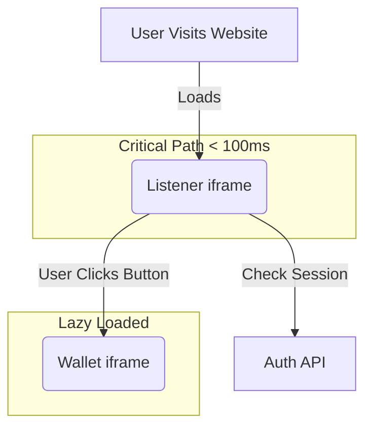

Building a Web3 wallet is usually a trade-off between security and speed. Most wallets are heavy browser extensions that inject massive scripts into every page you visit.

At Frak, we took a different approach: an embedded wallet that lives inside an iframe on our partners' websites. This brings a brutal constraint—if our wallet is heavy, we slow down the New York Times, Le Monde, or any other partner using our technology. That is unacceptable.

To achieve sub-second initial load times and invisible background processing, we had to completely rethink our frontend architecture. This isn't just about "optimizing React renders"; it's about optimizing how the browser receives and executes code.

## The Architecture: Wallet vs. Listener

We didn't build one app; we built two.

1.  **The Listener (`apps/listener`):** A microscopic, invisible application that loads in the background. Its only job is to listen for user intent (like a "Connect Wallet" click) and manage the session. It has zero UI libraries.
2.  **The Wallet (`apps/wallet`):** The full-featured React application that only loads when the user actually opens the wallet interface.



This split allows the "Critical Path" to be extremely lightweight, while the heavy crypto libraries are lazy-loaded.

## Build Strategy: Vite, Rolldown & Advanced Chunking

We use **Vite** with **Rolldown** (the Rust-based bundler) to orchestrate our builds. The default chunking strategy of most bundlers is insufficient for our needs. We need to ensure that when the user loads the Listener, they don't download a single byte of React code.

Here is our custom chunking strategy from `vite.config.ts`. We explicitly group dependencies to prevent "vendor bloat."

```typescript
// apps/wallet/vite.config.ts

build: {
    target: "baseline-widely-available",
    chunkSizeWarningLimit: 400,
    rolldownOptions: {
        treeshake: {
            moduleSideEffects: "no-external",
            propertyReadSideEffects: false,
        },
        output: {
            advancedChunks: {
                groups: [
                    // Group 1: React Ecosystem
                    // Only loaded when UI is visible
                    {
                        name: "react-vendor",
                        test: /node_modules[\\/](react|react-dom|react[\\/]jsx-runtime)/,
                        priority: 40,
                    },

                    // Group 2: Blockchain Heavyweights
                    // Viem, Wagmi, and crypto utils are massive.
                    // We isolate them so they don't block the UI paint.
                    {
                        name: "blockchain-vendor",
                        test: /node_modules[\\/](viem|0x|wagmi|@wagmi|permissionless|@noble|@scure)/,
                        priority: 35,
                    },

                    // Group 3: UI Components
                    // Radix UI, Lucide icons, etc.
                    {
                        name: "ui-vendor",
                        test: /node_modules[\\/](@radix-ui|vaul|micromark|sonner|lucide-react)/,
                        priority: 30,
                    },
                ],
            },
        },
    },
}
```

By isolating `blockchain-vendor`, we ensure that the UI can render a "Loading" skeleton *before* the heavy cryptography libraries have even finished parsing. This perceived performance improvement is massive.

## Serving Layer: Nginx Tuning

A great build is useless if the server delivers it poorly. We use Nginx, but the default configuration is too conservative for high-traffic static assets.

We tuned our `nginx.conf` to aggressively cache file descriptors and leverage pre-compression.

### 1. Open File Cache (The "Inode" Optimization)

When serving thousands of small JS chunks, the operating system spends a surprising amount of time just "opening" the files. We use `open_file_cache` to keep these file descriptors in memory.

```nginx
# apps/listener/nginx.conf

# Cache open file descriptors (improves performance significantly)
# inactive=20s means unused files are removed after 20s
# This is safe during deployments because each pod has its own cache
open_file_cache max=1000 inactive=20s;
open_file_cache_valid 30s;
open_file_cache_min_uses 2;
open_file_cache_errors on;
```

### 2. Stale-While-Revalidate for HTML

This is our "secret weapon" for the Listener.

The Listener `index.html` changes rarely (only on deployment), but we can't cache it forever because we need to be able to roll back bugs instantly.

The solution is `stale-while-revalidate`.
1.  The browser asks for `index.html`.
2.  Nginx serves the **stale** version immediately (0ms latency).
3.  In the background, the browser checks if a new version exists.
4.  If yes, it updates the cache for the *next* visit.

```nginx
# apps/listener/nginx.conf

location ~ \.html$ {
    # Serve stale content for up to 1 day while revalidating in bg
    add_header Cache-Control "no-cache, must-revalidate, max-age=0, stale-while-revalidate=86400";
    add_header X-Content-Type-Options "nosniff";
    etag on;
}
```

This gives us the speed of a permanent cache with the freshness of a non-cached file.

## Conclusion

Performance isn't a single setting; it's a chain. By optimizing the **Architecture** (Split apps), the **Build** (Rolldown chunking), and the **Delivery** (Nginx tuning), we achieved a wallet experience that feels native, even when running inside a constrained iframe environment.
