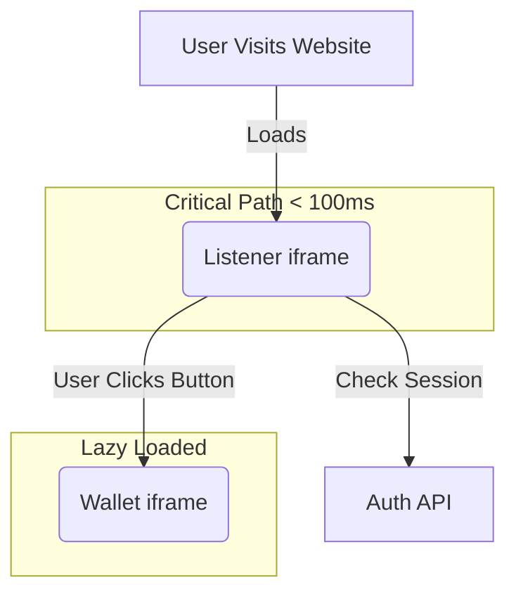

Building a Web3 wallet is usually a trade-off between security and speed. Most wallets are heavy browser extensions that inject massive scripts into every page you visit.

At Frak, we took a different approach: an embedded wallet that lives inside an iframe on our partners' websites. This brings a brutal constraint—**if our wallet is heavy, we slow down the New York Times, Le Monde, or any other partner using our technology.** That is unacceptable.

Our listener app loads across multiple websites with **hundreds of thousands of loads per day**. Every kilobyte saved translates to **multiple gigabytes** of bandwidth reduction per month.

To achieve sub-second initial load times and invisible background processing, we undertook three major optimizations:
1. **State management migration** from Jotai to Zustand (and fixing localStorage sync issues)
2. **Architectural split** between wallet and listener (30% size reduction)
3. **Infrastructure migration** from AWS S3 + CDN to self-hosted Nginx on Kubernetes (faster load times, no CDN needed)

This is the story of how we optimized every layer of the stack.

## 1. State Management: From Jotai to Zustand

Our journey started with **Jotai**. It was nice at first—minimal boilerplate, atom-based architecture, easy to get started. But as our codebase grew, we hit problems:

### The Jotai Pain Points

1. **Too easy to create anti-patterns**: Jotai's ease of use led us to create a proliferation of atoms and hooks. We ended up with **dozens of unnecessary Jotai hooks** scattered across the codebase.

2. **localStorage sync bugs**: We encountered strange, hard-to-debug issues where values would exist in `localStorage` but **not sync back to the Jotai store**. Users would refresh and lose their state, despite persistence being enabled.

3. **Mental overhead**: Debugging atom dependencies and understanding data flow became increasingly complex.

### The Zustand Migration

We migrated both the wallet and listener apps to **Zustand**. While Zustand is more "rigid" than Jotai (you must define explicit stores), this rigidity became a feature, not a bug:

- **Single source of truth**: Each domain (auth, wallet, settings) has one clear store
- **Explicit selectors**: Forces you to think about what data each component actually needs
- **No localStorage bugs**: Zustand's persistence middleware "just works"—we never encountered the sync issues we had with Jotai

```typescript
// Before: Multiple scattered Jotai atoms
const authAtom = atom(null);
const authLoadingAtom = atom(true);
const authErrorAtom = atom(null);
// ... 10+ more atoms

// After: One cohesive Zustand store
export const useAuthStore = create<AuthStore>()(
    persist(
        (set) => ({
            user: null,
            isLoading: true,
            error: null,
            login: async (credentials) => {
                set({ isLoading: true });
                // ...
            },
            logout: () => set({ user: null }),
        }),
        { name: 'auth-storage' }
    )
);

// Usage with individual selectors (critical for performance)
const user = useAuthStore((state) => state.user);
const login = useAuthStore((state) => state.login);
```

**Lesson learned**: For large-scale apps, Zustand's "opinionated rigidity" scales better than Jotai's "anything goes" flexibility.

## 2. The Architectural Split: Wallet vs. Listener

The big optimization came from **splitting the wallet and listener into separate projects**. Previously, they were bundled together, which meant the listener (loaded on every page visit) was carrying unnecessary weight.

### Why This Matters at Scale

The listener loads across multiple websites with **hundreds of thousands of loads per day**. Every kilobyte saved translates to:
- Faster page load times for our partners
- Multiple **gigabytes of bandwidth reduction** per month
- Better SEO and user experience for sites embedding our wallet

### The Split

We separated into two distinct apps:

1.  **The Listener (`apps/listener`):** A microscopic, invisible application that loads in the background. It's now a **pure Vite SPA**—no router, no heavy UI libraries, just session management and communication logic.

2.  **The Wallet (`apps/wallet`):** The full-featured React application with TanStack Router, full crypto libraries, and UI components. Only loads when the user actually opens the wallet interface.



### The Results

- **30% size reduction** for the listener app
- **Simpler mental model**: Listener is now just a React SPA with no routing complexity
- **Better isolation**: Proper package boundaries prevent accidental dependency creep
- **Less workforce needed**: Could we have achieved similar results with complex code-splitting configs? Maybe. But the split was simpler, faster to implement, and easier to maintain.

### Why Not Just Use Code Splitting?

We considered it. But:
- Complex code-splitting configs are hard to maintain
- You're still bundling and shipping code that might never execute
- Mental overhead: "Which chunks does the listener need? Which can be lazy-loaded?"
- The split gives us **physical separation**—impossible to accidentally import wallet code in the listener

## 3. Infrastructure Migration: AWS S3 → Self-Hosted Nginx

This was the most surprising win. We migrated from **AWS S3 with CloudFront CDN** to **self-hosted Nginx on our Kubernetes cluster**—and achieved **faster load times without a CDN**.

Yes, you read that right. No CDN, faster than CDN.

### The Old Setup (AWS S3 + CloudFront)

- Static files hosted on S3
- CloudFront CDN in front for global distribution
- Deployed via SST infrastructure-as-code
- Multiple moving parts: S3 bucket policies, CloudFront distributions, SSL certificates, cache invalidation

### The New Setup (Kubernetes + Nginx)

- Wallet and listener served from **Docker containers with Nginx**
- Deployed to our existing Kubernetes cluster (GCP/GKE)
- Pre-compressed assets (gzip at build time)
- Aggressive Nginx tuning (more on this below)
- Routing: `wallet.frak.id/listener` redirects directly to the listener instance

### Why Is It Faster Without a CDN?

We scratched our heads on this too. Here's what we learned:

1. **Pre-compression**: We gzip assets at build time and configure Nginx to serve `.gz` files directly if available. This eliminates runtime compression overhead.

2. **Kubernetes cluster locality**: Our Kubernetes cluster is hosted in GCP's Europe-West region, where most of our traffic originates. The "CDN edge nodes" were actually adding latency for our primary audience.

3. **Nginx tuning**: With direct control over Nginx, we could optimize file caching, compression settings, and HTTP/2 behavior in ways CloudFront didn't expose.

4. **No cache invalidation delays**: With CloudFront, cache invalidations could take 5-10 minutes. With Kubernetes, we deploy new pods and traffic shifts instantly.

### The Implementation: Infrastructure as Code

We manage all infrastructure using **Pulumi** with TypeScript. Each frontend (wallet, listener) is deployed as a Kubernetes service with its own Docker image:

```typescript
// infra/gcp/wallet.ts
const walletImage = new dockerbuild.Image("wallet", {
    context: { location: $cli.paths.root },
    dockerfile: { location: "apps/wallet/Dockerfile" },
    buildArgs: {
        NODE_ENV: "production",
        STAGE: walletEnv.STAGE,
        BACKEND_URL: walletEnv.BACKEND_URL,
        // ... other env vars
    },
    platforms: ["linux/amd64"],
    push: true,
});

const listenerImage = new dockerbuild.Image("wallet-listener", {
    context: { location: $cli.paths.root },
    dockerfile: { location: "apps/listener/Dockerfile" },
    // ... similar config
});
```

The infrastructure setup is type-safe and version-controlled—no manual kubectl commands or YAML drift.

### Build-Time Compression

At build time, Vite generates pre-compressed `.gz` files for all assets. The Nginx config then serves these directly:

```nginx
# apps/listener/nginx.conf

# Serve pre-compressed .gz files if available (from build process)
gzip_static on;

# Enable real-time gzip compression as fallback
gzip on;
gzip_vary on;
gzip_min_length 1024;
gzip_comp_level 6;
gzip_types text/plain text/css application/json application/javascript ...;
```

This hybrid approach gives us:
- **Zero CPU overhead** for pre-compressed files (gzip_static)
- **Fallback compression** for any assets not pre-compressed (gzip on)

The result: Every byte is compressed, but the server never wastes CPU doing it at request time.

## 4. Build Strategy: Vite, Rolldown & Advanced Chunking

We use **Vite** with **Rolldown** (the Rust-based bundler) to orchestrate our builds. The default chunking strategy of most bundlers is insufficient for our needs. We need to ensure that when the user loads the Listener, they don't download a single byte of React code.

Here is our custom chunking strategy from `vite.config.ts`. We explicitly group dependencies to prevent "vendor bloat."

```typescript
// apps/wallet/vite.config.ts

build: {
    target: "baseline-widely-available",
    chunkSizeWarningLimit: 400,
    rolldownOptions: {
        treeshake: {
            moduleSideEffects: "no-external",
            propertyReadSideEffects: false,
        },
        output: {
            advancedChunks: {
                groups: [
                    // Group 1: React Ecosystem
                    // Only loaded when UI is visible
                    {
                        name: "react-vendor",
                        test: /node_modules[\\/](react|react-dom|react[\\/]jsx-runtime)/,
                        priority: 40,
                    },

                    // Group 2: Blockchain Heavyweights
                    // Viem, Wagmi, and crypto utils are massive.
                    // We isolate them so they don't block the UI paint.
                    {
                        name: "blockchain-vendor",
                        test: /node_modules[\\/](viem|0x|wagmi|@wagmi|permissionless|@noble|@scure)/,
                        priority: 35,
                    },

                    // Group 3: UI Components
                    // Radix UI, Lucide icons, etc.
                    {
                        name: "ui-vendor",
                        test: /node_modules[\\/](@radix-ui|vaul|micromark|sonner|lucide-react)/,
                        priority: 30,
                    },
                ],
            },
        },
    },
}
```

By isolating `blockchain-vendor`, we ensure that the UI can render a "Loading" skeleton *before* the heavy cryptography libraries have even finished parsing. This perceived performance improvement is massive.

## 5. Nginx Tuning: Three Layers of Optimization

A great build is useless if the server delivers it poorly. We use Nginx, but the default configuration is too conservative for high-traffic static assets.

After migrating to self-hosted Nginx, we dove deep into optimization across **three layers**:
1. **Global Kubernetes Nginx Ingress Controller** (cluster-wide settings)
2. **Per-ingress annotations** (routing-specific tuning)
3. **Per-app Nginx configuration** (wallet and listener specific)

Let's break down each layer.

### Layer 1: Global Nginx Ingress Controller Configuration

The Nginx Ingress Controller runs at the cluster level and handles all incoming traffic before it reaches individual services. We heavily tuned the global ConfigMap:

```typescript
// Simplified from our actual infra config
const nginxIngressConfig = {
    // Forward client IPs properly
    "use-forwarded-headers": "true",
    "compute-full-forwarded-for": "true",
    
    // Optimize timeouts for cross-cluster latency
    "proxy-connect-timeout": "10",
    "proxy-send-timeout": "60",
    "proxy-read-timeout": "60",
    
    // Worker settings - balance memory and concurrency
    "worker-processes": "auto",
    "worker-connections": "8192",
    "worker-shutdown-timeout": "240s",
    
    // Upstream keep-alive for persistent connections to backend pods
    "upstream-keepalive-connections": "320",
    "upstream-keepalive-requests": "10000",
    "upstream-keepalive-timeout": "60",
    
    // HTTP/1.1 for upstream (required for keep-alive)
    "proxy-http-version": "1.1",
    
    // ⭐ TLS session caching - HUGE win for performance
    "ssl-session-cache-size": "30m",  // 30MB = ~120k TLS sessions per pod
    "ssl-session-timeout": "10m",
    "ssl-session-tickets": "true",
    "proxy-ssl-session-reuse": "on",
    
    // ModSecurity WAF (bot protection)
    "enable-modsecurity": "true",
    "enable-owasp-modsecurity-crs": "true",
    "modsecurity-snippet": `
SecRuleEngine On
# Reduce memory usage by limiting request body inspection
SecRequestBodyLimit 10485760
SecRequestBodyNoFilesLimit 131072
# Limit response body inspection to save memory
SecResponseBodyLimit 524288
# Disable memory-heavy rules
SecRuleRemoveById 949110
# Set paranoia level to 1 for balance
SecAction "id:900000,phase:1,nolog,pass,t:none,setvar:tx.paranoia_level=1"
# Reduce audit logging
SecAuditEngine RelevantOnly
    `.trim(),
    
    // Security
    "ssl-protocols": "TLSv1.2 TLSv1.3",
    "ssl-ciphers": "HIGH:!aNULL:!MD5",
};
```

#### Key Optimizations:

1. **TLS Session Caching**: 30MB cache stores ~120,000 TLS sessions per pod. This means returning visitors skip the expensive TLS handshake entirely—their browser reuses the cached session. For a site with hundreds of thousands of loads, this is massive.

2. **Upstream Keep-Alive**: We maintain persistent connections from the ingress to backend pods (`upstream-keepalive-connections: 320`). Without this, every request would open a new TCP connection, adding latency.

3. **ModSecurity WAF**: We balance security with performance by:
   - Limiting request/response body inspection sizes
   - Disabling memory-heavy rules (like 949110)
   - Setting paranoia level to 1 (not overly aggressive)
   - Using "RelevantOnly" audit logging

4. **Worker Tuning**: Auto-scale workers based on CPU cores, with 8,192 connections per worker—plenty of headroom for concurrent requests.

This cluster-wide config applies to **all ingresses**, so every service benefits automatically.

### Layer 2: Per-Ingress Annotations

Each service can override or extend the global config with Kubernetes Ingress annotations. We showed this earlier in the routing config—here are the key ones:

```typescript
customAnnotations: {
    // Connection pooling for this specific ingress -> pod path
    "nginx.ingress.kubernetes.io/upstream-keepalive-connections": "64",
    "nginx.ingress.kubernetes.io/upstream-keepalive-requests": "1000",
    
    // HTTP/2 optimizations
    "nginx.ingress.kubernetes.io/http2-max-concurrent-streams": "128",
    
    // Disable buffering (force ingress to stream responses)
    "nginx.ingress.kubernetes.io/proxy-buffering": "off",
}
```

These are applied **per-service**, so we can tune wallet and listener independently if needed.

### Layer 3: Per-App Nginx Configuration

Finally, each Docker container runs its own Nginx instance with app-specific tuning. Here's the listener config:

```nginx
# apps/listener/nginx.conf

# Cache open file descriptors (improves performance significantly)
open_file_cache max=1000 inactive=20s;
open_file_cache_valid 30s;
open_file_cache_min_uses 2;
open_file_cache_errors on;

# Serve pre-compressed .gz files if available (from build process)
gzip_static on;

# Enable real-time gzip compression as fallback
gzip on;
gzip_vary on;
gzip_min_length 1024;
gzip_comp_level 6;
gzip_types text/plain text/css application/json application/javascript ...;

# Static assets with aggressive caching
location ~ \.(js|css|png|jpg|jpeg|gif|ico|svg|woff|woff2|ttf|eot)$ {
    expires 1y;
    add_header Cache-Control "public, immutable";
    access_log off;
}

# HTML with stale-while-revalidate
location ~ \.html$ {
    add_header Cache-Control "no-cache, must-revalidate, max-age=0, stale-while-revalidate=86400";
    etag on;
}
```

This hybrid compression approach gives us:
- **Zero CPU overhead** for pre-compressed files (gzip_static)
- **Fallback compression** for any assets not pre-compressed (gzip on)
- **Open file cache**: File descriptors stay in memory for 20s, avoiding repeated disk I/O

For a listener app loaded hundreds of thousands of times per day, these optimizations compound into massive savings.

### Why Three Layers?

This multi-layer approach gives us:

1. **Global defaults** that benefit all services (TLS caching, WAF, keep-alive)
2. **Per-service tuning** for specific needs (e.g., wallet needs higher body size limits)
3. **Per-app optimization** for the final mile (caching strategies, compression)

Each layer is independently configurable, version-controlled, and type-safe (thanks to Pulumi).

### Routing Configuration (TypeScript, Not YAML)

We define routing in TypeScript using Pulumi, not raw YAML. This gives us type safety and prevents configuration drift:

```typescript
// infra/gcp/wallet.ts
export const walletService = new KubernetesService("wallet", {
    namespace: walletNamespace.metadata.name,
    
    ingress: {
        host: "wallet.frak.id",
        tlsSecretName: "wallet-tls",
        
        // Route /listener to the listener service
        pathRoutes: [
            {
                path: "/listener",
                pathType: "Prefix",
                serviceName: listenerService.service?.metadata?.name ?? "",
                servicePort: 80,
            },
        ],
        
        // Custom Nginx annotations for performance
        customAnnotations: {
            "nginx.ingress.kubernetes.io/proxy-body-size": "10m",
            "nginx.ingress.kubernetes.io/proxy-buffering": "off",
            
            // Connection pooling (ingress -> pod)
            "nginx.ingress.kubernetes.io/upstream-keepalive-connections": "64",
            "nginx.ingress.kubernetes.io/upstream-keepalive-requests": "1000",
            "nginx.ingress.kubernetes.io/upstream-keepalive-timeout": "60",
            
            // HTTP/2 optimizations
            "nginx.ingress.kubernetes.io/http2-max-concurrent-streams": "128",
            
            // Timeouts for static assets
            "nginx.ingress.kubernetes.io/proxy-connect-timeout": "5",
            "nginx.ingress.kubernetes.io/proxy-read-timeout": "60",
        },
    },
});
```

This gives us:
- **Type safety**: The compiler catches typos and invalid configurations
- **Single domain** for simplicity (`wallet.frak.id`)
- **Logical separation** (listener at `/listener`, wallet at `/`)
- **Independent scaling** (each service can scale separately)
- **Version control**: Infrastructure changes are reviewed like code

### Stale-While-Revalidate for HTML

This is our "secret weapon" for the Listener.

The Listener `index.html` changes rarely (only on deployment), but we can't cache it forever because we need to be able to roll back bugs instantly.

The solution is `stale-while-revalidate`.
1.  The browser asks for `index.html`.
2.  Nginx serves the **stale** version immediately (0ms latency).
3.  In the background, the browser checks if a new version exists.
4.  If yes, it updates the cache for the *next* visit.

```nginx
# apps/listener/nginx.conf

location ~ \.html$ {
    # Serve stale content for up to 1 day while revalidating in bg
    add_header Cache-Control "no-cache, must-revalidate, max-age=0, stale-while-revalidate=86400";
    add_header X-Content-Type-Options "nosniff";
    etag on;
}
```

This gives us the speed of a permanent cache with the freshness of a non-cached file.

## The Results: By The Numbers

Here's what we achieved with these optimizations:

| Metric | Before | After | Improvement |
|--------|--------|-------|-------------|
| Listener app size | Baseline | -30% | **30% smaller** |
| State management bugs | localStorage sync issues | Zero issues | **Reliability improved** |
| Infrastructure complexity | AWS S3 + CloudFront + SST | Kubernetes + Nginx | **Simpler, self-hosted** |
| Load time (no CDN) | N/A (used CDN) | Faster than CDN | **Counter-intuitive win** |
| Deployment time | 2+ min (S3 + CloudFront invalidation) | Instant (Kubernetes pod rollout) | **Instant deployments** |
| Mental model | One monolithic app | Two focused apps | **Easier to reason about** |
| TLS handshake (returning visitors) | Full handshake every time | Cached session reused | **Eliminated for repeat visits** |
| Nginx compression CPU | Runtime compression per request | Pre-compressed at build | **~0% CPU for compression** |

### Bandwidth Savings

With **hundreds of thousands of loads per day** and a **30% size reduction**:
- Estimated monthly bandwidth savings: **Multiple gigabytes**
- Faster page loads for partner sites
- Better SEO impact for sites embedding our wallet

### Performance Gains from Nginx Tuning

The three-layer Nginx optimization strategy yielded:
- **TLS session caching**: Repeat visitors skip the TLS handshake entirely (saves ~100ms per request)
- **Upstream keep-alive**: Persistent ingress → pod connections eliminate TCP handshake overhead
- **Pre-compression**: Zero CPU spent compressing assets at request time
- **Open file cache**: File descriptors stay in memory, avoiding disk I/O

## Key Takeaways

This optimization journey taught us several lessons:

### 1. State Management: Rigidity Scales Better

**Jotai → Zustand** wasn't just about fixing bugs—it was about finding the right balance between flexibility and maintainability. For large-scale apps, Zustand's opinionated structure prevents the "death by a thousand atoms" problem.

### 2. Physical Separation > Code Splitting

**Architectural split** between wallet and listener was simpler and more effective than complex code-splitting configurations. Physical separation makes it **impossible** to accidentally import heavy dependencies in the listener.

### 3. Self-Hosting Can Beat CDNs (With Proper Tuning)

**AWS S3 + CDN → Kubernetes + Nginx** was counter-intuitive, but it worked. Key factors:
- **Pre-compression** (build-time gzip, zero runtime CPU)
- **Cluster locality** (GCP Europe-West1, where most traffic originates)
- **Three-layer Nginx tuning** (cluster-wide + per-ingress + per-app)
- **TLS session caching** (30MB cache = ~120k sessions, repeat visitors skip handshake)
- **No cache invalidation delays** (instant pod rollouts vs. 5-10 min CDN invalidation)

### 4. Infrastructure as Code > YAML Hell

We manage all infrastructure with **Pulumi in TypeScript**:
- **Type safety**: The compiler catches configuration errors before deployment
- **Version control**: Infrastructure changes are reviewed like code
- **No drift**: What's in Git is what's deployed
- **No kubectl commands**: Everything is declarative and reproducible

This made the Nginx tuning process much faster—we could test configurations locally, get immediate type-checking feedback, and deploy with confidence.

### 5. Measure Everything

We didn't guess—we measured. Before each change:
1. Baseline bundle size and load times
2. Implement optimization
3. Measure again
4. Compare and validate

### 6. Bandwidth Scales, So Does TLS

When you're loaded **hundreds of thousands of times per day**:
- Every **kilobyte** matters (30% reduction = multiple GB/month saved)
- Every **TLS handshake** matters (session caching = ~100ms saved for repeat visitors)
- Every **millisecond** matters (pre-compression = zero CPU overhead)

Small optimizations compound into massive wins at scale.

## Conclusion

Performance isn't a single setting; it's a chain. By optimizing every layer—**State Management** (Zustand), **Architecture** (Split apps), **Infrastructure** (Kubernetes + Nginx), **Build** (Rolldown chunking), and **Delivery** (Three-layer Nginx tuning)—we achieved a wallet experience that feels native, even when running inside a constrained iframe environment.

The most surprising win? **Beating a CDN without a CDN.** Through aggressive tuning at three layers (cluster-wide ingress controller, per-service annotations, and per-app configuration), we achieved:
- **TLS session caching** (30MB = ~120k sessions per pod)
- **Pre-compression** (build-time gzip, zero runtime CPU)
- **Upstream keep-alive** (persistent connections, no handshake overhead)
- **Infrastructure as code** (type-safe Pulumi, no YAML drift)

All managed in **TypeScript**, version-controlled, and deployed with confidence.

When you're loaded **hundreds of thousands of times per day**, these optimizations aren't nice-to-haves—they're **multiple gigabytes of bandwidth** and **hundreds of milliseconds** saved per user.
