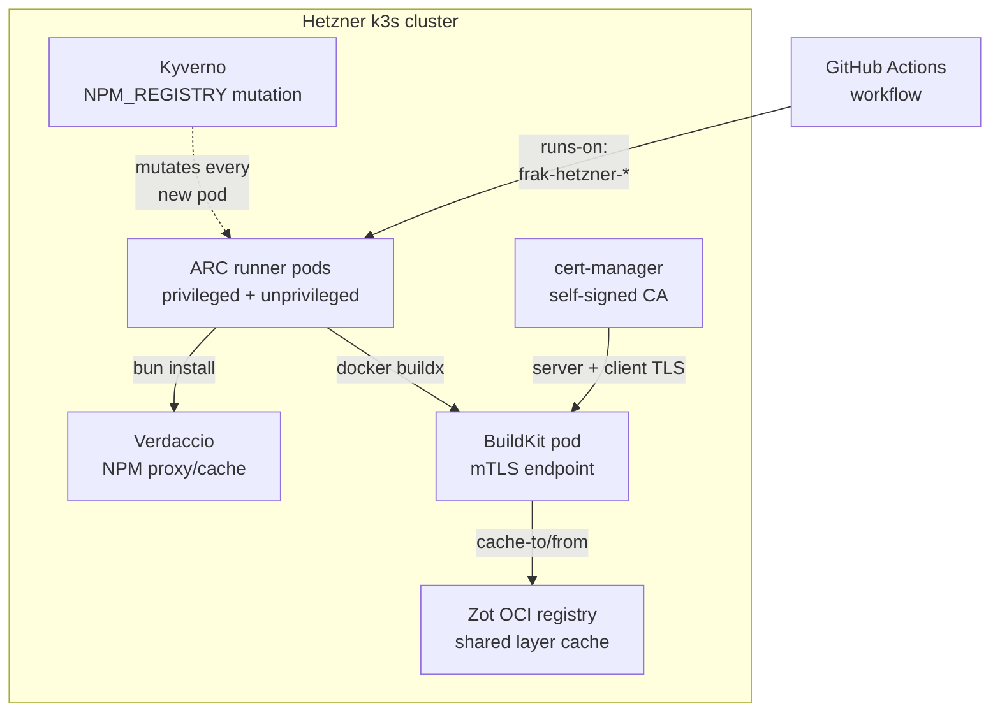

We've previously written about [moving from AWS Lambda to GKE](/articles/frak-infrastructure-iac) and adopting SST + Pulumi for our control plane. That story is about the planes that decide what runs where. This one is about the factory floor underneath: the place where our images get built, our caches get warmed, and our deploys actually execute.

For four years we were happy paying GitHub for runner minutes and AWS / GCP for everything else. Then three things piled up: GCP credits started running out, Docker Hub rate limits kept biting our PRs, and the GitHub Actions cache grew a 10 GB ceiling we couldn't tune around. Each was annoying on its own. Together they were a signal that we were paying for *operational convenience* in places where it cost us more than self-hosting would.

So we built a small platform on a single Hetzner k3s box. ARC runners that authenticate themselves via in-cluster identity. A remote BuildKit daemon behind mTLS. A Zot OCI registry as a shared layer cache. A Verdaccio NPM mirror so `bun install` stays in-cluster. And one Kyverno policy that wires the whole thing together by mutating every pod's environment.

This is what it looks like, why each piece exists, and the two days we spent losing a fight with Pulumi.

## The starting line

The operational pain points were specific:

- **GHA cache had a 10 GB per-repo quota.** Eviction was opaque. Sharing across branches was awkward enough that we ended up with branch-tagged hacks. Hitting the ceiling silently degraded our builds without warning.
- **GitHub-hosted runners cost predictable money and gave us unpredictable network performance.** When we needed to pull a multi-gigabyte base image from GHCR, we paid for it in latency every time.
- **Docker Hub rate limits.** Once we crossed the unauth'd threshold we started seeing intermittent 429s on builds. The fix is auth, which is fine, but it means another secret rotation surface and another set of pulls we're billed against.
- **GCP credits, finite.** Our compute is cheap on GKE; our intent is to stay there. But our *CI* infrastructure on GCP was a billable line item that didn't need to be cloud-resident at all.

We wanted: build artifacts that live in our cluster, runners that authenticate themselves without a per-job token rotation, caches we own and can prune on our schedule, and a story that lets us swap clouds (or providers) without rewriting CI workflows.

Why Hetzner: predictable hardware on a single dedicated box, EU-resident, no surprise egress fees, root SSH access if anything ever needs hand-holding. A single beefy node is also dramatically simpler than a real multi-node cluster: we run k3s, we mount one local-path PVC per workload that needs persistence, and we don't pretend to have high availability we don't need.

## The architecture, at a glance

Four pillars on top of k3s + cert-manager + Traefik.



Anything else that lives there (Headlamp dashboards, n8n, the WordPress and PrestaShop test environments, the CNPG Postgres clusters that back our hosted apps) is just another workload on top of the same platform. The story below sticks to the four CI-relevant pieces.

## 1. Actions Runner Controller: in-cluster GitHub runners

ARC's modern incarnation is two Helm charts. A cluster-wide `gha-runner-scale-set-controller` that reconciles `AutoscalingRunnerSet` CRs, and one `gha-runner-scale-set` release per logical runner pool. Auth happens via a GitHub App restricted to specific repos: installed on the `frak-id` org but scoped down so no other repo can dispatch jobs into our cluster.

We run three scale sets, on a two-axis split: per-repo, and per-privilege-level.

```typescript
// infra/hetzner/arc.ts
const targetRepos = [
    {
        repo: "infra-core",
        scaleSetName: "frak-hetzner-infra-core",
        privileged: true,   // runs `bun sst deploy --stage hetzner-staging`
    },
    {
        repo: "infra-core",
        scaleSetName: "frak-hetzner-infra-core-build",
        privileged: false,  // GCP image builds, no cluster API needed
    },
    {
        repo: "wallet",
        scaleSetName: "frak-hetzner-wallet",
        privileged: false,  // wallet builds, hit the buildkit pod via mTLS
    },
] as const;
```

The privileged/unprivileged distinction is the security boundary. Privileged scale sets attach a `cluster-admin`-bound ServiceAccount and an `IN_CLUSTER=true` env var; the `provider.ts` in our SST config keys on this to pick up the auto-mounted SA token instead of looking for a kubeconfig. That makes `bun sst deploy --stage hetzner-staging` work without a kubeconfig, a long-lived token, or any per-job credential plumbing.

Unprivileged scale sets fall through to the chart's default no-permission SA. The runner pod has zero RBAC on the cluster. They're for jobs that don't need to touch the k8s API at all: building images, deploying to GCP, running tests.

The threat model is staging-grade and we're honest about it. Anything that can dispatch a workflow on a privileged runner label can do anything on the cluster. We tighten the perimeter by restricting the GitHub App installation to a small set of repos. If we ever promote this pattern to production, the privileged tier needs to be scoped down per-namespace (or to a fixed set of resource kinds via Kyverno).

Workflows pick a runner by label:

```yaml
# .github/workflows/deploy.yml in frak-id/wallet
jobs:
  deploy:
    runs-on: 'frak-hetzner-wallet'
    steps:
      - uses: actions/checkout@v6
      # ...
```

Scaling bounds are tight: `minRunners: 0`, `maxRunners: 5`. ARC spawns a pod on demand and tears it down when the job finishes. The first job after a quiet period has a 30–60s cold start, which we accept for staging. The alternative is `minRunners: 1` and an always-warm pod, which we'll switch on if cold-start ever bites in production.

There's one more piece worth noting: the unprivileged build runner mounts a TLS client cert for the in-cluster BuildKit daemon. The next section explains why that exists; the mechanics are a Secret mirror from the buildkit namespace into the arc-runners namespace, projected into the runner pod as a volume:

```typescript
// infra/hetzner/arc.ts (excerpt: unprivileged scale set values)
template: {
    spec: {
        containers: [{
            name: "runner",
            image: "ghcr.io/actions/actions-runner:2.334.0",
            command: ["/home/runner/run.sh"],
            env: [
                { name: "NPM_CONFIG_REGISTRY", value: verdaccioRegistryUrl },
            ],
            volumeMounts: [{
                name: "buildkit-certs",
                mountPath: "/buildkit-certs",
                readOnly: true,
            }],
        }],
        volumes: [{
            name: "buildkit-certs",
            secret: { secretName: "buildkit-client-tls" },
        }],
    },
},
```

`runs-on: frak-hetzner-wallet` plus `/buildkit-certs` mounted means a wallet workflow can do `docker buildx --driver remote ...` and have its build executed by the cluster's BuildKit pod with no per-job cert provisioning. Which leads us to:

## 2. BuildKit-as-a-service over mTLS

We didn't want every CI job to spin up its own BuildKit, especially when half of the builds we run want multi-arch images and QEMU isn't free. So we run one BuildKit pod, talk to it over TLS, and let it carry a persistent layer cache.

The disclaimer that opens `infra/hetzner/buildkit.ts` is the one piece of this story you cannot afford to be casual about:

> Security model: mTLS only. BuildKit's TCP listener is **unauthenticated by default**. Exposing it without mTLS would give the entire internet arbitrary root-equivalent code execution. All certs are minted by an in-cluster self-signed CA managed by cert-manager.

That cert chain is a three-tier setup: a self-signed bootstrap issuer mints a CA cert, the CA backs a `ca`-typed issuer that mints both server and client certs. cert-manager owns the lifecycle:

```typescript
// infra/hetzner/buildkit.ts (excerpt)
const serverCertificate = new kubernetes.apiextensions.CustomResource(
    "buildkit-server",
    {
        apiVersion: "cert-manager.io/v1",
        kind: "Certificate",
        metadata: { name: "buildkit-server", namespace: namespace.metadata.name },
        spec: {
            secretName: "buildkit-server-tls",
            duration: "8760h", // 1y
            dnsNames: [
                buildkitHost,
                "buildkitd",
                "buildkitd.buildkit.svc.cluster.local",
            ],
            issuerRef: { name: "buildkit-ca", kind: "Issuer" },
            usages: ["server auth", "digital signature", "key encipherment"],
        },
    },
    { provider: k8sProvider, dependsOn: [caIssuer] }
);

const clientCertificate = new kubernetes.apiextensions.CustomResource(
    "buildkit-client",
    {
        apiVersion: "cert-manager.io/v1",
        kind: "Certificate",
        metadata: { name: "buildkit-client", namespace: namespace.metadata.name },
        spec: {
            secretName: "buildkit-client-tls",
            duration: "8760h",
            commonName: "buildkit-client",
            issuerRef: { name: "buildkit-ca", kind: "Issuer" },
            usages: ["client auth", "digital signature", "key encipherment"],
        },
    },
    { provider: k8sProvider, dependsOn: [caIssuer] }
);
```

`buildkit-server-tls` mounts into the BuildKit pod. `buildkit-client-tls` is what the runner pods (and our dev macs) use to authenticate to the daemon. Both have explicit `usages` lists: server certs get `server auth`, client certs get `client auth`. No re-use.

The daemon itself ships a 100 Gi local-path PVC for cache. The decision to skip `topolvm-thin` and use `local-path` instead is worth a paragraph of its own:

> Deliberate deviation from the hetzner-wide `topolvm-thin` convention: this one PVC lives on k3s's bundled `local-path` provisioner, backed by `/dev/md2` (the root fs, ~169 GB free) instead of the `sandbox-vg` LVM thin pool (~100 GB total, shared with every other Hetzner workload).
>
> Why: the wallet stack's parallel `docker-build` resources blew the 50 Gi (and would have blown a 200 Gi) PVC because the thin pool itself is only ~100 GB and ~75% reserved by other workloads. Moving the cache off the pool removes ~50 GB of pressure from `sandbox-vg` and gives buildkit real headroom on a disk no other PVC competes for.

The cost of leaving the convention: `local-path` doesn't honor `requests.storage`, so the real upper bound is the GC config in `buildkitd.toml`:

```toml
[worker.oci]
  gc = true
  reservedSpace = "10GB"
  maxUsedSpace = "80GB"
  minFreeSpace = "30GB"

[registry."zot.zot.svc.cluster.local:5000"]
  http = true
```

`reservedSpace` keeps a minimum cache always retained so GC doesn't thrash under heavy build load. `maxUsedSpace` is the hard ceiling. `minFreeSpace` is the safety guarantee: GC evicts until the underlying volume has at least 30 GB free, regardless of what BuildKit thinks it can use. The minFreeSpace cushion is what protects the root filesystem from BuildKit eating everything containerd, k3s, and the OS need.

Cross-arch builds come free with this setup. The BuildKit pod ships QEMU emulators, so CI workflows don't need `docker/setup-qemu-action` at all. Multi-arch builds happen server-side.

For local dev, the same pod is reachable over Traefik with SNI passthrough on `buildkit.hetzner-staging.frak.id:443`. Devs do a one-time `docker buildx create --driver remote ...` against their copy of the client cert and from then on every `docker buildx build` runs server-side. Same instructions as for CI, same cache, same QEMU.

The single point of contention is real: it's one BuildKit pod, one PVC. We haven't seen it bottleneck in practice (the 4-CPU / 8 GiB limit holds the wallet stack's parallel builds without queueing), but it's the kind of thing that should be on a dashboard. We have Headlamp running in the same cluster; we should be alerting on `[worker.oci]` GC pressure.

## 3. Zot: an OCI registry that costs nothing to use

Registry-side cache (`--cache-to type=registry,ref=...`) is the canonical BuildKit cache mode. The problem with pointing it at GHCR is that you pay egress on every build: both for the cache push and for the layers your build downloads from base images you've ostensibly cached locally. The cache exists to make builds faster; if it's adding round-trips to a public registry, it isn't.

Zot solves this with the smallest possible footprint. Single binary. OCI-compliant. Built-in GC. It runs in the cluster, exposed only as `ClusterIP`, listens on plain HTTP because nothing outside the cluster can reach it:

```typescript
// infra/hetzner/zot.ts (excerpt)
export const zotHostPort = `zot.zot.svc.cluster.local:${zotPort}`;
export const zotRegistryUrl = `http://${zotHostPort}`;
// Shorter alias for in-cluster DNS where single-label `zot` resolves
// to `zot.zot.svc.cluster.local` via the search list.
export const zotHostPortShort = `zot.zot.svc:${zotPort}`;
```

BuildKit's config registers it as plaintext HTTP, which is the whole reason the cache works without per-build flags. Look back at the `buildkitd.toml` above: the `[registry."zot.zot.svc.cluster.local:5000"]` stanza is what tells the daemon to skip TLS for that host.

The trust model is identical to Verdaccio's: cluster-internal only, no auth. Anything in the cluster can push and pull. That's appropriate for staging where the only push paths are our own CI runners and our own BuildKit pod. It is not appropriate for any environment where untrusted code paths might reach the registry, and that boundary needs to be guarded explicitly if we ever expand the scope.

The cleanup story is what kept us out of trouble. Without retention policies, every BuildKit `--cache-to type=registry,...,mode=max` push leaves the previous manifest tagged forever. The staging zot reached 5.8 GiB with 6 `dev-base` revisions and 39 `cli-proxy-api` revisions before we noticed:

```typescript
// infra/hetzner/zot.ts (excerpt: zot config.json)
storage: {
    rootDirectory: "/var/lib/registry",
    dedupe: false,
    gc: true,
    gcDelay: "1h",
    gcInterval: "1h",
    retention: {
        dryRun: false,
        delay: "24h", // grace period before reaping
        policies: [{
            repositories: ["**"],
            deleteReferrers: true,
            deleteUntagged: true,
            // OR semantics: a tag is retained if ANY rule matches.
            // 10 most-recent + 720h (30d) window covers active dev work
            // including continuously-rewritten `:buildcache` tags.
            keepTags: [{
                mostRecentlyPushedCount: 10,
                mostRecentlyPulledCount: 10,
                pulledWithin: "720h",
                pushedWithin: "720h",
            }],
        }],
    },
},
```

OR semantics on `keepTags` is the load-bearing detail: it keeps recently-active tags even when they fall below the count threshold, which matters for `:buildcache` tags that get rewritten every build.

The same `local-path` + `volumeType: "local"` + `pulumi.com/skipAwait: "true"` PVC trifecta we used for BuildKit cache applies here. Same reasoning: cache is regenerable, capacity isolation isn't useful, and staying off the shared `topolvm-thin` pool leaves room for everything else.

We picked Zot over Harbor or `distribution` because the operational simplicity is dramatic. Harbor is a real product, with a UI, RBAC, vulnerability scanning, an event subsystem. We don't need any of it for a layer cache. Zot is one Helm chart, one Deployment, one PVC, one ConfigMap.

## 4. Verdaccio + Kyverno: every pod's NPM lives in-cluster

Every CI run does `bun install`. Even with bun's content-addressed store, the first install of a fresh runner pod pulls from `registry.npmjs.org`. That's network + rate-limit risk + slow.

Verdaccio is the standard answer: a pull-through cache that proxies the npm registry and caches tarballs locally. First fetch warms the cache; every subsequent pod on the cluster hits the local mirror. Same trust model as Zot: `ClusterIP` only, no auth, no ingress.

```yaml
# infra/hetzner/verdaccio.ts (excerpt: verdaccio config.yaml)
storage: /verdaccio/storage/packages

uplinks:
  npmjs:
    url: https://registry.npmjs.org/
    cache: true
    maxage: 2m         # new versions show up within minutes
    fail_timeout: 5m
    timeout: 60s
    max_fails: 5
    agent_options:
      keepAlive: true
      maxSockets: 40

packages:
  "@*/*":
    access: $all
    proxy: npmjs
  "**":
    access: $all
```

`maxage: 2m` keeps version listings fresh enough that newly-published packages show up within minutes. Tarballs themselves are immutable, so they're cached forever.

The interesting part isn't the cache. It's how we tell every pod to use it.

The naive approach is per-workload: set `NPM_CONFIG_REGISTRY` as an env var on every container spec that runs `bun install` or `npm install`. We started there for the ARC runners. The problem is that it doesn't generalize. The atelier sandboxes also run npm. The Headlamp UI does. New workloads we add tomorrow will. Configuring this per workload turns a one-line piece of platform behavior into a touchpoint in every Dockerfile and every PR.

Kyverno solves this in 50 lines of YAML. A `ClusterPolicy` that mutates every newly created pod and injects `NPM_CONFIG_REGISTRY` into every container:

```typescript
// infra/hetzner/kyverno.ts (excerpt: ClusterPolicy)
new kubernetes.apiextensions.CustomResource(
    "inject-npm-config-registry",
    {
        apiVersion: "kyverno.io/v1",
        kind: "ClusterPolicy",
        metadata: { name: "inject-npm-config-registry" },
        spec: {
            failurePolicy: "Ignore",
            background: false,
            rules: [{
                name: "inject-into-pod-env",
                match: { any: [{ resources: { kinds: ["Pod"] } }] },
                exclude: {
                    any: [{
                        resources: {
                            // Don't touch the control plane or the
                            // services that are themselves the registry.
                            namespaces: [
                                "kube-system",
                                "kube-public",
                                "kube-node-lease",
                                "kyverno",
                                "verdaccio",
                                "local-path-storage",
                            ],
                        },
                    }],
                },
                mutate: {
                    foreach: [{
                        list: "request.object.spec.containers",
                        // Per-container precondition: skip if NPM_CONFIG_REGISTRY
                        // is already set, so explicit overrides win.
                        preconditions: {
                            all: [{
                                key: "NPM_CONFIG_REGISTRY",
                                operator: "AnyNotIn",
                                value: "{{ element.env[].name || `[]` }}",
                            }],
                        },
                        patchStrategicMerge: {
                            spec: {
                                containers: [{
                                    name: "{{ element.name }}",
                                    env: [{
                                        name: "NPM_CONFIG_REGISTRY",
                                        value: verdaccioRegistryUrl,
                                    }],
                                }],
                            },
                        },
                    }, /* same block for initContainers */],
                },
            }],
        },
    },
    { provider: k8sProvider, dependsOn: [kyvernoOperator] }
);
```

Two `foreach` blocks because Kyverno doesn't iterate `containers` and `initContainers` in a single declaration. Per-container precondition so explicit overrides always win: if a workload wants a private registry, it sets the env var itself and Kyverno leaves it alone.

`failurePolicy: Ignore` is critical. Kyverno admission webhook downtime never blocks pod admission; a missed mutation just falls back to the upstream registry, no outage. The policy is a performance improvement, not a correctness requirement.

Why a mutating webhook rather than a DNS rewrite or an L4 redirect? Both alternatives break TLS. Clients open `registry.npmjs.org:443` with SNI, expecting a Let's Encrypt cert; Verdaccio answers on port 4873 over plain HTTP. The only "DNS transparent" path is in-cluster MITM with a private CA distributed to every pod's trust store, which is orders of magnitude more complexity than a one-line env var.

This is the most-bang-for-buck infrastructure code we've written this year. One screen of policy, no app changes, no per-workload PRs. The kind of leverage you only get from a platform abstraction layer.

## 5. The pulumi-Bun saga

SST runs on Bun. Our IaC is SST + Pulumi. Pulumi's Node SDK is not Bun-clean. This took two days to resolve and the chronology is the entertainment.

**Day one, morning.** First attempt to deploy from the in-cluster ARC runner. The runner is a minimal `actions-runner:2.334.0` container, Bun-only: no Node binary on PATH. `bun sst deploy` aborts immediately:

```
ERR_NOT_IMPLEMENTED: v8.setFlagsFromString is not implemented in Bun
```

Pulumi's Node SDK eagerly imports a closure-serialization runtime that calls `v8.setFlagsFromString("--allow-natives-syntax")` at module top level. Bun 1.3.x throws on that call. The error happens during config evaluation, before any resources are touched.

**Day one, afternoon (`cab9061`).** We patch around it in CI with `sed`:

```yaml
# .github/workflows/deploy-hetzner.yml
- name: Patch pulumi v8 calls (Bun compat)
  run: |
    find .sst/platform/node_modules/@pulumi/pulumi/runtime/closure \
      -name 'v8*.js' \
      -exec sed -i 's|^v8\.setFlagsFromString|// Bun compat: &|' {} +
```

The commit message is honest about what we're doing: we don't serialize closures (we declare resources), so commenting out the V8 native-syntax flag is safe for our use case. Tests pass.

**Day one, evening (`e774b81`, `67456aa`).** Tests pass; the next deploy fails. We'd only patched the top-level v8 files; the inspector module had a similar pattern. Patch that. Then deploy fails again with the same error in a nested file we'd missed. Patch nested pulumi v8 files. Three commits of whack-a-mole later, the workflow is green.

We are now monkey-patching upstream binaries inside our CI workflow. This is a Smell.

**Day two, morning (`420efe0`).** New plan: bake the patch into a custom runner image. We build `frak-hetzner-arc-runner` with Node 24 + Bun 1.3.14 pre-installed. The patch step goes away. The image bake adds 8 minutes to anyone's first pull.

**Day two, midday (`5867d3a`).** ARC runner pods immediately exit. The official actions-runner image ships with `CMD ["/bin/bash"]` and no `ENTRYPOINT`. The chart's default runner container sets `command: ["/home/runner/run.sh"]`, but our custom `containers:` override replaced the default wholesale. We forgot to restate the command. Pods come up, bash exits in 0s with no logs, jobs never get picked up. Fix: restate `command: ["/home/runner/run.sh"]`.

**Day two, afternoon (`6713f9f`).** We roll back the custom image. The maintenance burden of a custom runner image (keeping it in sync with the upstream actions-runner releases, baking it on every dependency bump) is not worth the patch consolidation.

**Day two, evening (`0528b7b`).** The answer was sitting in the GCP workflow the whole time. `ubuntu-latest` ships Node alongside Bun. With Node on PATH, Pulumi's Node SDK uses Node for the closures runtime and never asks Bun for V8 APIs. So we just install Node 24 alongside Bun in the runner step:

```yaml
- name: Setup Node
  uses: actions/setup-node@v4
  with:
    node-version: '24'

- name: Setup Bun
  uses: oven-sh/setup-bun@v2
```

The patch step goes away. The custom runner image goes away. The sed scripts go away. Two days of fighting Pulumi, undone by `setup-node`.

The lesson: when you're patching upstream binaries, you've usually picked the wrong fight. Sometimes the answer is "use Node for the parts that need Node, use Bun for the parts that need Bun, and stop pretending it's all one runtime."

## 6. The supporting cast

A few pieces fill out the platform without deserving their own section.

**Headlamp** is our cluster dashboard. Web UI, OIDC-aware, runs as a workload in the same cluster. Useful for visual inspection: pod logs, resource graphs, manifest editing when we're debugging a hot incident.

**CNPG** (CloudNativePG) backs the Postgres clusters our hosted apps (n8n, Twenty, WordPress demos) consume. Operator-managed, monitoring built in, point-in-time recovery available if we ever wire backups (we haven't; explicit TODO before this platform sees production data).

**cert-manager** is the unsung hero. Every TLS surface on this cluster (BuildKit's mTLS chain, the Traefik HTTPS certs via the `letsencrypt-frak` ClusterIssuer, anything else that needs a cert) flows through it. One operator, zero manual cert rotations.

**Demo workloads** (n8n, Twenty, WordPress, PrestaShop, openwebui) live here because we wanted somewhere cheap and disposable to run them. Adding a new service is a single TypeScript file in `infra/hetzner/` plus an entry in `sst.config.ts`. The platform makes that trivial.

## What we'd do again, what we'd skip

**Would do again:**

- **Kyverno NPM_CONFIG_REGISTRY policy.** One screen of YAML, solves a problem that would otherwise be a touchpoint in every Dockerfile and every new workload PR. The single highest-leverage piece of infrastructure code in this rollout.
- **mTLS for BuildKit.** Non-negotiable. The threat model is exactly as stark as the file header says it is; if we'd skipped it we'd have a CVE waiting.
- **Two-tier ARC runners.** The privileged/unprivileged split is worth the small extra config. It lets us be honest about which workflows get cluster-admin and which don't.
- **`local-path` for BuildKit + Zot + Verdaccio caches.** Capacity isolation is useless for cache. Staying off the shared thin pool keeps the rest of the cluster healthy.

**Would skip or do differently:**

- **The custom ARC runner image.** Two days of work for negative payoff. Bumping Node 20 → 24 in the workflow YAML is one line; baking a custom image is a maintenance commitment.
- **The pulumi sed patches.** They were the right thing in the moment to unblock testing, and the wrong thing structurally. Try the smaller fix (install Node) first; reach for patches last.
- **Skipping `replicas: 1` on the controllers.** We single-replica every controller (kyverno, ARC, CNPG) because this is a single-node k3s box. We'd revisit that the moment we have more than one node.

## Where this leads

This platform is the foundation for what comes next. The wallet's CI pipeline went from 9 minutes to 2, and almost every win compounds out of the pieces above: the in-cluster runner kills network round-trip, the BuildKit pod kills setup-qemu and gives us a persistent layer cache, Zot replaces the GHA cache quota with something we control, and the Kyverno policy makes `bun install` hit Verdaccio without anyone having to think about it.

That story is the next post. If you're considering self-hosting your own CI, read this article first and the CI overhaul second: they're the same project, told from two ends.
