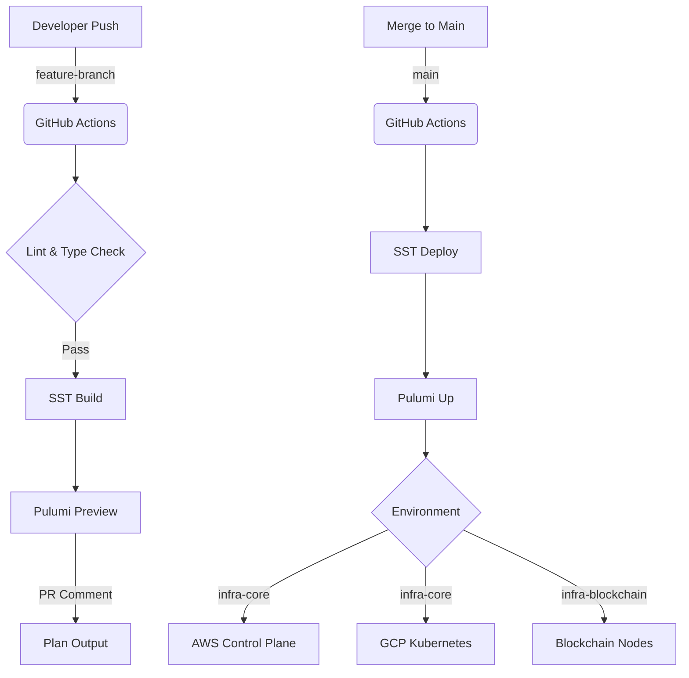

In the world of Platform Engineering, the "Terraform vs. Everyone Else" debate is eternal. At Frak, we made a deliberate choice to step away from the industry standard HCL (HashiCorp Configuration Language) and embrace a full TypeScript stack for our Infrastructure as Code (IaC).

This isn't just about language preference; it's about treating infrastructure with the same rigor, type safety, and composability as our application code. This article explores our journey, our architecture, and the specific code that powers our multi-cloud infrastructure on AWS and GCP.

## The "Why Not Terraform?" Decision

Terraform is battle-tested and robust, but for a fast-moving startup building complex Web3 infrastructure, it presented significant friction points:

1.  **State Management Pain:** While S3 backends and DynamoDB locking work, they are essentially boilerplate that needs to be managed.
2.  **The HCL Barrier:** HCL is a DSL (Domain Specific Language). It limits abstraction. You can't easily "unit test" a `.tf` file, and refactoring a massive module often feels like diffusing a bomb.
3.  **Context Switching:** Our engineers write TypeScript for the wallet, the API, and the indexer. Switching to HCL for infra creates a mental context switch that slows down "DevOps" culture adoption.

We wanted **Infrastructure as Software**. We wanted to import interfaces, use extensive linting, and leverage the full power of the NodeJS ecosystem.

## The Architecture: SST + Pulumi

We settled on a hybrid approach:
*   **SST (Serverless Stack):** For the "glue" and serverless components (AWS Lambda, orchestration, and rapid development environments). SST provides an incredible DX (Developer Experience) wrapper around Pulumi and AWS CDK.
*   **Pulumi:** For the heavy lifting, specifically our GKE (Google Kubernetes Engine) clusters and complex networking.

### The "Stack" Concept

Our infrastructure is divided into logical "stacks" to ensure isolation.
*   **infra-core:** The bedrock. VPCs, Kubernetes Clusters, Databases (Postgres/Redis). This changes rarely.
*   **infra-blockchain:** The specialized layer. Blockchain nodes, RPC proxies, Indexers.
*   **apps:** The application layer.

Each stack is deployed independently but can reference outputs from others. Crucially, we support complete environment isolation. A developer can spin up a `stage=quentin` environment that mirrors production but uses smaller instance sizes.

### Multi-Cloud Logic in `sst.config.ts`

One of the most powerful features of using TypeScript is the ability to write genuine *logic* in your configuration. We aren't just declaring resources; we are programming the deployment strategy.

Here is our actual `sst.config.ts` from `infra-core`. Notice how it gracefully handles the decision to deploy to AWS (default) or branch out into GCP for our heavy Kubernetes workloads.

```typescript
// infra-core/sst.config.ts

export default $config({
    app(input) {
        return {
            name: "infra-core",
            removal: input?.stage === "production" ? "retain" : "remove",
            home: "aws",
            provider: {
                aws: {
                    region: "eu-west-1",
                },
            },
            providers: {
                gcp: {
                    version: "8.32.0",
                    project: "frak-main-v1",
                    region: "europe-west1",
                },
                kubernetes: "4.23.0",
                postgresql: "3.15.1",
                "docker-build": "0.0.12",
            },
        };
    },
    async run() {
        const isGcp = $app?.stage?.startsWith("gcp");
        const isProd = $app?.stage?.endsWith("production");
        
        // Logic: AWS is the control plane, but GCP hosts the compute
        if (!isGcp) {
            console.warn("Not deploying on gcp, nothing to do");
            return;
        }

        // Dynamic Imports for GCP Modules
        // This prevents AWS-only runs from crashing on missing GCP creds
        await import("./infra/gcp/network");
        await import("./infra/gcp/database.ts");
        await import("./infra/gcp/redis.ts");
        await import("./infra/gcp/cluster");

        // Conditional Logic: Cost savings in Dev
        // Only deploy bastion hosts if we're NOT in production
        if (!isProd) {
            await import("./infra/gcp/bastion");
        }

        // Conditional Logic: Observability in Prod
        // Only deploy heavy monitoring stacks in production
        if (isProd) {
            await import("./infra/kubernetes/monitoring");
            await import("./infra/kubernetes/networking");
            await import("./infra/kubernetes/analytics/clickhouse");
        }
    },
});
```

This readability is unmatched. A junior engineer can look at this and immediately understand: *Ah, we don't pay for ClickHouse in dev environments.*

## Deep Dive: Managing GKE with Pulumi

Kubernetes manifests (YAML) are notoriously verbose and prone to indentation errors. Helm charts are better but often introduce an obfuscated layer of templating.

Pulumi allows us to define our GKE cluster as a strictly typed TypeScript object. We get autocomplete for every configuration option in the GCP API.

Here is a snippet from our `cluster.ts`. Note the explicit configuration of VPC-native networking and Workload Identity—crucial security features that are often "misconfigured defaults" in ClickOps.

```typescript
// infra-core/infra/gcp/cluster.ts

import * as pulumi from "@pulumi/pulumi";
import { isProd } from "../utils";
import { createNodePools } from "./clusterPools";
import { nodeServiceAccount } from "./clusterServiceAccount";
import { subnets, subnetsConfig, vpcNetwork } from "./network";

const location = "europe-west1-b";
let masterCluster: gcp.container.Cluster;

if (isProd) {
    // Define the GKE Cluster
    masterCluster = new gcp.container.Cluster(
        "master-cluster",
        {
            name: "master-cluster",
            location: location,

            // NETWORK: Connect strictly to our private VPC
            network: vpcNetwork.id,
            subnetwork: subnets.gke.id,

            // SECURITY: Workload Identity
            // Maps K8s ServiceAccounts to IAM ServiceAccounts
            workloadIdentityConfig: {
                workloadPool: `${gcp.config.project}.svc.id.goog`,
            },

            // NETWORKING: VPC Native
            // Pods get real VPC IPs, improving performance and visibility
            networkingMode: "VPC_NATIVE",
            ipAllocationPolicy: {
                clusterSecondaryRangeName: "pods",
                servicesSecondaryRangeName: "services",
            },
            
            // SECURITY: Calico Network Policies
            networkPolicy: {
                enabled: true,
                provider: "CALICO",
            },

            // MAINTENANCE: Define strict windows
            maintenancePolicy: {
                dailyMaintenanceWindow: {
                    startTime: "02:00", // 2 AM UTC
                },
            },

            // SECURITY: Private Cluster
            // Nodes have no public IPs
            privateClusterConfig: {
                enablePrivateNodes: true,
                enablePrivateEndpoint: false,
                masterIpv4CidrBlock: "172.16.0.0/28",
            },
        },
        {
            // Explicit Dependencies ensure strictly ordered creation
            dependsOn: [
                vpcNetwork,
                subnets.gke,
                nodeServiceAccount,
            ],
        }
    );

    // Modularity: Node Pools are defined in a separate function
    createNodePools(masterCluster);
}
```

### The Deployment Pipeline

Automation is the heart of SRE. We don't run `pulumi up` from our laptops. We use a strict CI/CD pipeline powered by GitHub Actions.



## Why This Matters for Reliability

By using TypeScript for our infrastructure, we've achieved several key reliability wins:

1.  **Self-Documenting Code:** The types *are* the documentation. You don't need to guess what the property for "maintenance window" is called.
2.  **Refactoring Confidence:** Renaming a subnet or changing a CIDR block isn't a search-and-replace adventure. It's a standard refactor operation in VS Code.
3.  **Shared Logic:** We share utility functions (like `isProd` or subnet calculators) between our application code and our infrastructure code.

This approach allows a small team of 3 engineers to manage a global, multi-cloud infrastructure that serves thousands of wallet users with 99.99% availability.
