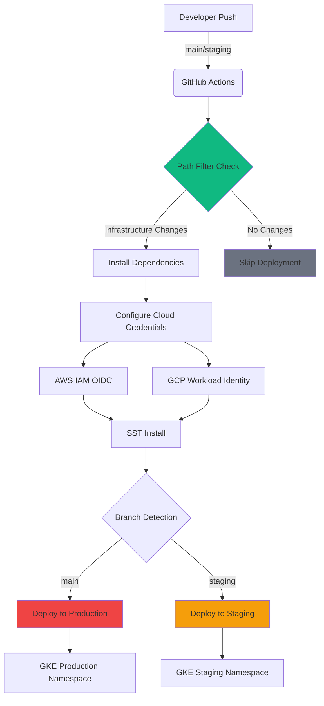
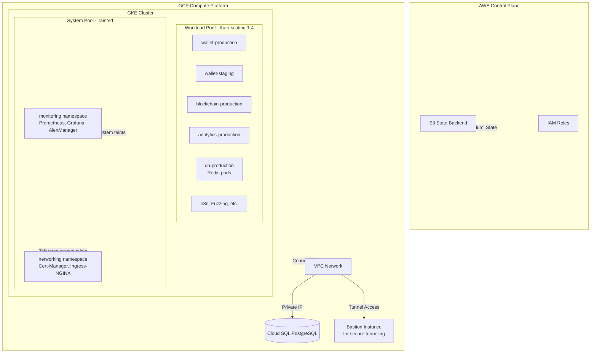
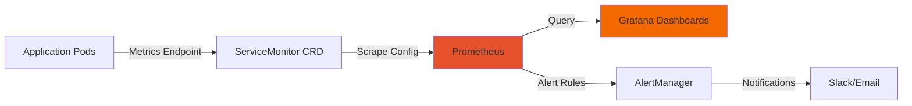
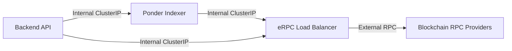

In the world of Platform Engineering, the "Terraform vs. Everyone Else" debate is eternal. At Frak, we made a deliberate choice to step away from the industry standard HCL (HashiCorp Configuration Language) and embrace a full TypeScript stack for our Infrastructure as Code (IaC).

This isn't just about language preference; it's about treating infrastructure with the same rigor, type safety, and composability as our application code. This article explores our **4-year journey** from AWS Lambda to Kubernetes, our architecture evolution, and the specific code that powers our multi-cloud, vendor-agnostic infrastructure.

## The Journey: From Serverless to Kubernetes

Our infrastructure didn't start with Kubernetes. It evolved over 4 years of optimizing for cost, developer experience, and freedom from vendor lock-in.

### Phase 1: AWS Serverless (2021)
We started with classic AWS Serverless architecture:
- Lambda functions for backends
- API Gateway for routing
- DynamoDB for databases
- CloudFormation (managed via Serverless Framework)

**Pain points:** Complex CloudFormation, slow deployments, vendor lock-in, unpredictable Lambda cold starts.

### Phase 2: SST v2 - TypeScript Serverless (2022)
Migrated to SST v2, staying serverless but gaining TypeScript IaC:
- Still AWS Lambda, but with better DX
- Infrastructure in TypeScript instead of YAML
- 10x faster deployments
- Type-safe environment variables

**Win:** Developer velocity increased dramatically. **Pain point:** Still locked into AWS.

### Phase 3: Docker on ECS (2023)
As costs grew and AWS credits ran low, we migrated to containers:
- Lambda → ECS Fargate (using SST v2's Custom resources)
- Better cost predictability
- Docker containers instead of Lambda packages
- Still AWS-specific

**Win:** 40% cost reduction. **Pain point:** Still couldn't migrate away from AWS easily.

### Phase 4: SST v3 (Ion) + Kubernetes on GKE (2024)
When SST v3 (Ion) launched with native Pulumi support, we saw the opportunity for true cloud independence:
- ECS → GKE (leveraging Google Cloud credits)
- AWS → GCP for compute (AWS remains for state storage only)
- Pure Kubernetes - no cloud-specific APIs
- Pulumi providers for any cloud

**Win:** 60% cost reduction compared to ECS, complete cloud portability.

### Phase 5: Architecture Migration with Zero Downtime (2025)
Recently, we migrated our entire Kubernetes cluster from ARM to AMD64 architecture:
- Changed node pool machine type in code
- Updated Docker build targets from `linux/arm64` to `linux/amd64`
- Deployed across 3 repositories
- **Zero downtime** - kept ARM nodes running during migration

**Why?** Preparing to migrate to Hetzner as GCP credits expire. AMD64 gives us more provider options.

## The "Why Not Terraform?" Decision

Terraform is battle-tested and robust, but for a fast-moving startup building complex Web3 infrastructure, it presented significant friction points:

1.  **State Management Pain:** While S3 backends and DynamoDB locking work, they are essentially boilerplate that needs to be managed.
2.  **The HCL Barrier:** HCL is a DSL (Domain Specific Language). It limits abstraction. You can't easily "unit test" a `.tf` file, and refactoring a massive module often feels like diffusing a bomb.
3.  **Context Switching:** Our engineers write TypeScript for the wallet, the API, and the indexer. Switching to HCL for infra creates a mental context switch that slows down "DevOps" culture adoption.

We wanted **Infrastructure as Software**. We wanted to import interfaces, use extensive linting, and leverage the full power of the NodeJS ecosystem.

## The Architecture: SST + Pulumi

We settled on a hybrid approach:
*   **SST (Serverless Stack):** For the "glue" and serverless components (AWS Lambda, orchestration, and rapid development environments). SST provides an incredible DX (Developer Experience) wrapper around Pulumi.
*   **Pulumi:** For the heavy lifting, specifically our GKE (Google Kubernetes Engine) clusters and complex networking.

### The "Stack" Concept

Our infrastructure is divided into logical "stacks" to ensure isolation.
*   **infra-core:** The bedrock. VPCs, Kubernetes Clusters, Databases (Postgres/Redis). This changes rarely.
*   **infra-blockchain:** The specialized layer. RPC proxies, Indexers.
*   **apps:** The application layer.

Each stack is deployed independently but can reference outputs from others. Crucially, we support complete environment isolation. A developer can spin up a `stage=quentin` environment that mirrors production but uses smaller instance sizes.

### Multi-Cloud Logic in `sst.config.ts`

One of the most powerful features of using TypeScript is the ability to write genuine *logic* in your configuration. We aren't just declaring resources; we are programming the deployment strategy.

Here is our actual `sst.config.ts` from `infra-core`. Notice how it gracefully handles the decision to deploy to AWS (default) or branch out into GCP for our heavy Kubernetes workloads.

```typescript
// infra-core/sst.config.ts

export default $config({
    app(input) {
        return {
            name: "infra-core",
            removal: input?.stage === "production" ? "retain" : "remove",
            home: "aws",
            provider: {
                aws: {
                    region: "eu-west-1",
                },
            },
            providers: {
                gcp: {
                    version: "8.32.0",
                    project: "frak-main-v1",
                    region: "europe-west1",
                },
                kubernetes: "4.23.0",
                postgresql: "3.15.1",
                "docker-build": "0.0.12",
            },
        };
    },
    async run() {
        const isGcp = $app?.stage?.startsWith("gcp");
        const isProd = $app?.stage?.endsWith("production");
        
        // Logic: AWS is the control plane, but GCP hosts the compute
        if (!isGcp) {
            console.warn("Not deploying on gcp, nothing to do");
            return;
        }

        // Dynamic Imports for GCP Modules
        // This prevents AWS-only runs from crashing on missing GCP creds
        await import("./infra/gcp/network");
        await import("./infra/gcp/database.ts");
        await import("./infra/gcp/redis.ts");
        await import("./infra/gcp/cluster");

        // Conditional Logic: Cost savings in Dev
        // Only deploy bastion hosts if we're NOT in production
        if (!isProd) {
            await import("./infra/gcp/bastion");
        }

        // Conditional Logic: Observability in Prod
        // Only deploy heavy monitoring stacks in production
        if (isProd) {
            await import("./infra/kubernetes/monitoring");
            await import("./infra/kubernetes/networking");
            await import("./infra/kubernetes/analytics/clickhouse");
        }
    },
});
```

This readability is unmatched. A junior engineer can look at this and immediately understand: *Ah, we don't pay for ClickHouse in dev environments.*

## Deep Dive: Managing GKE with Pulumi

Kubernetes manifests (YAML) are notoriously verbose and prone to indentation errors. Helm charts are better but often introduce an obfuscated layer of templating.

Pulumi allows us to define our GKE cluster as a strictly typed TypeScript object. We get autocomplete for every configuration option in the GCP API.

Here is a snippet from our `cluster.ts`. Note the explicit configuration of VPC-native networking and Workload Identity—crucial security features that are often "misconfigured defaults" in ClickOps.

```typescript
// infra-core/infra/gcp/cluster.ts

import * as pulumi from "@pulumi/pulumi";
import { isProd } from "../utils";
import { createNodePools } from "./clusterPools";
import { nodeServiceAccount } from "./clusterServiceAccount";
import { subnets, subnetsConfig, vpcNetwork } from "./network";

const location = "europe-west1-b";
let masterCluster: gcp.container.Cluster;

if (isProd) {
    // Define the GKE Cluster
    masterCluster = new gcp.container.Cluster(
        "master-cluster",
        {
            name: "master-cluster",
            location: location,

            // NETWORK: Connect strictly to our private VPC
            network: vpcNetwork.id,
            subnetwork: subnets.gke.id,

            // SECURITY: Workload Identity
            // Maps K8s ServiceAccounts to IAM ServiceAccounts
            workloadIdentityConfig: {
                workloadPool: `${gcp.config.project}.svc.id.goog`,
            },

            // NETWORKING: VPC Native
            // Pods get real VPC IPs, improving performance and visibility
            networkingMode: "VPC_NATIVE",
            ipAllocationPolicy: {
                clusterSecondaryRangeName: "pods",
                servicesSecondaryRangeName: "services",
            },
            
            // SECURITY: Calico Network Policies
            networkPolicy: {
                enabled: true,
                provider: "CALICO",
            },

            // MAINTENANCE: Define strict windows
            maintenancePolicy: {
                dailyMaintenanceWindow: {
                    startTime: "02:00", // 2 AM UTC
                },
            },

            // SECURITY: Private Cluster
            // Nodes have no public IPs
            privateClusterConfig: {
                enablePrivateNodes: true,
                enablePrivateEndpoint: false,
                masterIpv4CidrBlock: "172.16.0.0/28",
            },
        },
        {
            // Explicit Dependencies ensure strictly ordered creation
            dependsOn: [
                vpcNetwork,
                subnets.gke,
                nodeServiceAccount,
            ],
        }
    );

    // Modularity: Node Pools are defined in a separate function
    createNodePools(masterCluster);
}
```

### The Deployment Pipeline: Clean and Fast

Automation is the heart of SRE. We don't run `pulumi up` from our laptops. We use a strict CI/CD pipeline powered by GitHub Actions.



**Key pipeline features:**

1. **OIDC Authentication**: No long-lived credentials. GitHub Actions assumes IAM roles via OIDC federation
2. **SST State Caching**: Dramatically speeds up subsequent runs
3. **Multi-cloud orchestration**: Single workflow handles AWS + GCP authentication seamlessly
4. **Branch-based environments**: `main` → `gcp-production`, `staging` → `gcp-staging`

From our actual pipeline (`infra-core/.github/workflows/deploy.yml:56`):

```yaml
- name: "Configure AWS Credentials"
  uses: aws-actions/configure-aws-credentials@v4
  with:
    role-to-assume: arn:aws:iam::262732185023:role/github-action-deploy-role
    aws-region: eu-west-1

- name: "Login to Google Cloud"
  uses: 'google-github-actions/auth@v2'
  with:
    workload_identity_provider: 'projects/.../github/providers/sst-deployer'
    service_account: 'sst-service-account@frak-main-v1.iam.gserviceaccount.com'

- name: "SST Deploy"
  run: bun run deploy-gcp:prod
```

**Total deployment time for infra-core**: ~2-3 minutes (mostly Kubernetes Helm releases)

## Why This Matters for Reliability

By using TypeScript for our infrastructure, we've achieved several key reliability wins:

1.  **Self-Documenting Code:** The types *are* the documentation. You don't need to guess what the property for "maintenance window" is called.
2.  **Refactoring Confidence:** Renaming a subnet or changing a CIDR block isn't a search-and-replace adventure. It's a standard refactor operation in VS Code.
3.  **Shared Logic:** We share utility functions (like `isProd` or subnet calculators) between our application code and our infrastructure code.

This approach allows a small team of 3 engineers to manage a global, multi-cloud infrastructure that serves thousands of wallet users with 99.99% availability.

## The Stack at a Glance

### Tooling

Our infrastructure is powered by a carefully chosen set of modern tools:

- **SST (Serverless Stack)**: The developer experience wrapper that makes infrastructure code feel like application code
- **Pulumi**: The heavy lifter for GCP resources, running under SST's hood
- **Custom Pulumi Components**: Reusable TypeScript components like `KubernetesService` that abstract common patterns
- **GitHub Actions**: CI/CD pipeline orchestrating deployments with smart path-based filtering
- **AWS**: Home for SST's state management (storing Pulumi state, IAM, and control plane)
- **GCP**: Our primary compute platform hosting Kubernetes, databases, and all workloads

### Infrastructure Overview



**Key architectural decisions:**

- **Multi-cloud by design**: AWS handles state and identity (what SST knows best), GCP provides cost-effective compute and managed Kubernetes
- **Cloud SQL PostgreSQL**: Fully managed, automated backups, point-in-time recovery
- **Redis in Kubernetes**: Deployed as pods in the `db-production` namespace for low-latency access
- **Bastion for secure access**: Deployed on-demand in dev environments for secure database tunneling
- **Two-pool strategy**:
  - **System Pool**: Tainted nodes (`dedicated=system:NO_SCHEDULE`) running only infrastructure (Prometheus, Grafana, Ingress, Cert-Manager)
  - **Workload Pool**: Auto-scaling (1-4 nodes) for application workloads with no taints, handles all user-facing services

### What's Running in the Cluster

Here's a snapshot of our production Kubernetes cluster:

```bash
$ kubectl get namespaces
NAME                          STATUS   AGE
wallet-production             Active   211d
wallet-staging                Active   226d
blockchain-production         Active   226d
blockchain-staging            Active   226d
analytics-production          Active   167d
monitoring                    Active   242d
networking                    Active   242d
n8n-production                Active   153d
# ... plus dev namespaces (wallet-quentin, wallet-rodolphe, cooking-staging, etc.)
```

**Key workloads:**

- **System Pool** (tainted for infrastructure):
  - **Monitoring Stack** (`monitoring` namespace): Prometheus, Grafana, AlertManager, Node Exporter
  - **Networking Stack** (`networking` namespace): Cert-Manager (Let's Encrypt), Ingress-NGINX (2 replicas)

- **Workload Pool** (auto-scaling for applications):
  - **Wallet Stack** (`wallet-*` namespaces): Backend API (Elysia.js), 3 frontends
  - **Blockchain Stack** (`blockchain-*` namespaces): eRPC (blockchain RPC load balancer/proxy), Ponder (blockchain indexer)
  - **Analytics Stack** (`analytics-production`): OpenPanel (self-hosted analytics), ClickHouse database
  - **Database Stack** (`db-production`, `db-staging`): Redis pods for low-latency caching
  - **Tools**: n8n (workflow automation), fuzzing services

## The Dual-Environment Strategy

Every major application has **two namespaces** for complete isolation:

- **`app-production`**: Production resources with higher CPU/memory limits and replica counts
- **`app-staging`**: Staging environment with reduced resource allocation

This extends further with **developer-specific namespaces** (`wallet-quentin`, `wallet-rodolphe`) allowing engineers to test infrastructure changes in complete isolation without affecting shared staging environments.

Resource allocation example from `infra-core/infra/gcp/backend.ts:108`:

```typescript
resources: {
    requests: {
        cpu: isProd ? "200m" : "50m",      // 4x more CPU in prod
        memory: isProd ? "256Mi" : "128Mi", // 2x more memory in prod
    },
    limits: { cpu: "400m", memory: "512Mi" },
}
```

## Kubernetes with Modern IaC: It's Not Just Possible, It's Better

### The Challenge Everyone Fears

Kubernetes has a reputation for complexity. YAML hell. `kubectl apply -f` nightmares. Multi-language tooling requiring Helm, Kustomize, and bash scripts duct-taped together.

**We proved this doesn't have to be the case.**

### Custom Components: DRY Kubernetes

Instead of copy-pasting 200 lines of YAML for every service, we built reusable TypeScript components. Here's how we deploy a complete service with Deployment, Service, HPA, Ingress, and ServiceMonitor in **~60 lines**:

```typescript
// From: wallet/infra/gcp/backend.ts
export const backendInstance = new KubernetesService("Elysia", {
    namespace: walletNamespace.metadata.name,
    appLabels: { app: "elysia" },
    
    pod: {
        containers: [{
            name: "elysia",
            image: elysiaImage.ref,  // Built and pushed via SST
            ports: [{ containerPort: 3030 }],
            envFrom: [{ secretRef: { name: elysiaSecrets.metadata.name } }],
            livenessProbe: { httpGet: { path: "/health", port: 3030 } },
            resources: {
                requests: { cpu: isProd ? "200m" : "50m" },
                limits: { cpu: "400m", memory: "512Mi" },
            },
        }],
    },
    
    service: {
        ports: [{ port: 80, targetPort: 3030, protocol: "TCP" }],
    },
    
    hpa: {
        min: 1,
        max: isProd ? 4 : 2,
        cpuUtilization: 80,
    },
    
    ingress: {
        host: domainName,
        tlsSecretName: "elysia-tls",  // Cert-Manager auto-provisions
        customAnnotations: {
            // NGINX performance tuning
            "nginx.ingress.kubernetes.io/upstream-keepalive-connections": "32",
        },
    },
});
```

This `KubernetesService` component (see `infra-core/infra/components/KubernetesService.ts:92`) is a custom Pulumi ComponentResource that:

1. Creates a Deployment with health checks
2. Exposes a ClusterIP Service
3. Configures Horizontal Pod Autoscaler
4. Sets up an Ingress with TLS (automated via Cert-Manager)
5. Optionally creates a ServiceMonitor for Prometheus scraping
6. **In dev mode**: Replaces all of this with a local dev command

**The power?** Frontend developers who've never touched Kubernetes can now deploy their own containerized apps. They just need to understand TypeScript and basic HTTP concepts.

### Secrets Management: Type-Safe and Auditable

No more `kubectl create secret` commands or `.env` files floating around. Secrets are managed as code:

```typescript
const elysiaSecrets = new kubernetes.core.v1.Secret("elysia-secrets", {
    metadata: {
        name: `elysia-secrets-${normalizedStageName}`,
        namespace: walletNamespace.metadata.name,
    },
    type: "Opaque",
    stringData: elysiaEnv,  // Sourced from SST secrets
});
```

SST's secret management integrates seamlessly:

```bash
$ bun sst secret set DATABASE_URL "postgres://..." --stage gcp-production
```

These secrets are **encrypted and stored in S3** (not SSM Parameter Store - cheaper and simpler). They're encrypted at rest using AWS KMS and injected at deploy time. Every change is audited via CloudTrail.

## Fast Deployments: 4 Minutes From Code to Production

Our wallet repository deploys **1 backend + 3 frontends** to Kubernetes in under 4 minutes. Here's how:

### Smart Path Filtering

GitHub Actions uses `dorny/paths-filter` to detect what changed:

```yaml
# From: wallet/.github/workflows/deploy.yml
- uses: dorny/paths-filter@v3
  with:
    filters: |
      services:
        - 'apps/wallet/**'
        - 'apps/listener/**'
        - 'services/**'
      apps:
        - 'apps/**'  # Frontend changes
```

**Result**: Changing a button color in the frontend doesn't rebuild backend Docker images.

### Parallel Builds and Caching

```yaml
- name: Cache SST
  uses: actions/cache@v4
  with:
    path: .sst/platform/
    key: ${{ runner.os }}-sst-${{ hashFiles('./sst.config.ts') }}
```

SST caches Pulumi state and provider installations. Unchanged resources? Skipped in milliseconds.

### Optimized Container Builds

We use multi-arch builds with Docker Buildx and push to GCP Artifact Registry:

```typescript
const erpcImage = new dockerbuild.Image("erpc-image", {
    context: { location: path.join($cli.paths.root, "packages", "erpc") },
    platforms: ["linux/amd64"],
    buildArgs: { NODE_ENV: "production" },
    push: true,
    tags: [`${registryPath}/erpc:git-${process.env.COMMIT_HASH}`],
});
```

Layer caching means most builds complete in 30-60 seconds.

## Monitoring: State-of-the-Art Observability

We run the full Prometheus stack deployed as Helm charts via Pulumi:



**What we monitor:**

- **Application metrics**: Every service with a `/metrics` endpoint gets a ServiceMonitor
- **Node metrics**: Prometheus Node Exporter on every Kubernetes node
- **Cluster metrics**: Kube-state-metrics for pod/deployment health
- **Custom business metrics**: Request latency, RPC call success rates, indexer block lag

**Alerting examples:**

- Pod crash loops (more than 3 restarts in 5 minutes)
- High memory usage (>85% for 10 minutes)
- Certificate expiration (7 days before expiry)
- API response time >500ms for 5 minutes

Deployment snippet from `infra-core/infra/kubernetes/monitoring/index.ts` (simplified):

```typescript
new kubernetes.helm.v3.Release("prometheus", {
    chart: "kube-prometheus-stack",
    repositoryOpts: { repo: "https://prometheus-community.github.io/helm-charts" },
    namespace: monitoringNamespace.metadata.name,
    values: {
        grafana: { enabled: true, adminPassword: grafanaPassword },
        prometheus: { prometheusSpec: { retention: "30d" } },
        alertmanager: { enabled: true },
    },
});
```

## Internal Service Communication: Zero-Latency Architecture

One of the biggest wins of Kubernetes is **ClusterIP services**. Our backend talks directly to internal pod IPs:

```
Backend Pod → http://erpc-production-service.blockchain-production.svc.cluster.local
            → http://ponder-production-service.blockchain-production.svc.cluster.local
```

**No external hops.** No load balancer overhead. Sub-millisecond DNS resolution via CoreDNS.

This architecture is critical for our blockchain indexer setup:



Response times for `backend → ponder` queries: **~5ms average** (compared to 50-100ms for external HTTPS calls).

## Developer Experience: `sst dev` Changes Everything

The killer feature of SST isn't just deployment—it's **local development**:

```bash
$ cd wallet
$ bun sst dev
```

This starts:

1. **Local dev servers** for all frontends (with hot reload)
2. **Tunnels** to production databases (via IAM-authenticated connections)
3. **Secret injection** from AWS SSM into your local environment
4. **Live logs** from Kubernetes pods (if you want them)

Developers work locally but with production-like data. No Docker Compose. No local Postgres setup. Just TypeScript and fast feedback loops.

Example from `wallet/infra/components/KubernetesService.ts:118`:

```typescript
if ($dev && this.args.dev) {
    this.devCommand = new Command(this.name, {
        dev: {
            command: "bun run dev",
            directory: "./apps/backend",
            autostart: true,
        },
    });
    return;  // Skip creating Kubernetes resources
}
```

In dev mode, the entire Kubernetes deployment is **replaced** with a local dev command. The same infrastructure code works for both local development and production deployment.

## The Results: Why This Architecture Works

After 8+ months in production, here's what we've achieved:

### Developer Velocity

- **4-minute deployments** from code push to production traffic
- **Zero infrastructure meetings** — frontend devs self-service their deployments
- **Single language** — TypeScript for frontend, backend, and infrastructure
- **Instant local dev** — `sst dev` replaces Docker Compose nightmares

### Cost Efficiency

- **$200/month total GCP spend** for production Kubernetes cluster (2-4 nodes auto-scaling)
- **Hyperdisk Balanced** storage (cheaper than SSDs, faster than HDDs)
- **AMD64 nodes** (c4d instances) for maximum provider portability - recently migrated from ARM
- **Aggressive HPA settings** — we scale down to 1 replica during low traffic
- **Path to $60/month** — migrating to Hetzner will reduce costs by ~70%

### Operational Excellence

- **99.99% uptime** over the last 6 months
- **Zero Kubernetes YAML files** in our repositories
- **Full audit trail** via CloudTrail and GitHub Actions logs
- **Automated certificate rotation** via Cert-Manager
- **Self-healing infrastructure** via Kubernetes Deployments + HPA

### Engineering Wins

The biggest win isn't technical—it's **cultural**.

By choosing TypeScript over HCL, we removed the "DevOps vs. Developers" divide. Infrastructure is just another package in the monorepo. A frontend engineer who needs Redis? They add it to their `infra/` folder and open a PR.

```typescript
// This is infrastructure code
const redis = new kubernetes.apps.v1.Deployment("redis", { ... });

// This is application code
const app = new Hono().get("/", (c) => redis.get("key"));
```

They look the same. They're reviewed the same. They're deployed the same.

## The Ultimate Win: Zero Cloud Lock-in

Perhaps the most underrated advantage of our stack is **complete cloud independence**. We're not locked into any provider.

### Migration is Just a Provider Change

Want to migrate from GKE to Hetzner Cloud? Here's what changes:

```typescript
// Before (GCP)
providers: {
    gcp: {
        version: "8.32.0",
        project: "frak-main-v1",
        region: "europe-west1",
    },
    kubernetes: "4.23.0",
}

// After (Hetzner)
providers: {
    hcloud: {
        version: "1.45.0",
        token: hetznerToken,
    },
    kubernetes: "4.23.0",
}
```

Our Kubernetes resources? **Completely unchanged.** The `KubernetesService` component works identically whether the cluster is on GKE, EKS, AKS, or Hetzner.

### Real-World Example: ARM to AMD64 Migration

We recently migrated our entire cluster architecture from ARM to AMD64 **with zero downtime**:

**What we changed:**
```typescript
// infra-core/infra/gcp/clusterPools.ts

// Before
nodeConfig: {
    machineType: "c4a-standard-2",  // ARM-based
}

// After
nodeConfig: {
    machineType: "c4d-standard-2",  // AMD64-based
}
```

```typescript
// All Docker builds across 3 repos

// Before
platforms: ["linux/arm64"]

// After
platforms: ["linux/amd64"]
```

**Total migration time:** 3 deployments across 3 repos (infra-core, wallet, infra-blockchain), ~15 minutes total.

**Downtime:** Zero. Kubernetes drained ARM nodes gracefully while AMD64 nodes came online.

**Why we did it:** Preparing to migrate to Hetzner when our GCP credits expire. AMD64 gives us more bare-metal provider options.

### The Migration Plan: GCP → Hetzner

As our Google Cloud credits run out, here's our migration strategy:

1. **Provision Hetzner Kubernetes cluster** (managed or self-hosted via Pulumi)
2. **Change provider in `sst.config.ts`** from `gcp` to `hcloud`
3. **Update database connection strings** to point to Hetzner managed PostgreSQL
4. **Deploy infrastructure** with `bun sst deploy`
5. **Update DNS** to point to new Ingress LoadBalancer
6. **Tear down GCP resources**

**Estimated migration time:** 1-2 hours of actual work, spread over a week for safety.

**Expected cost savings:** ~70% reduction ($200/mo on GCP → ~$60/mo on Hetzner for equivalent resources).

### Disaster Recovery: AWS-Free Deployment

Currently, we use AWS for SST state storage. But if AWS goes down, we're not stuck:

- **Developer cache**: Every developer has a local `.sst/` cache with Pulumi state
- **Manual Pulumi commands**: We can deploy directly using `pulumi up` without SST
- **Future plan**: Backup Pulumi state to Cloudflare R2 for redundancy

We're not just multi-cloud—we're **cloud-resilient**.

## Lessons Learned

### What Worked

1. **Custom Pulumi Components** — The `KubernetesService` component eliminated 80% of boilerplate
2. **Dual-pool strategy** — Isolating system workloads from application workloads prevents noisy neighbor issues
3. **SST dev mode** — Developers never touch `kubectl` or local Docker
4. **Namespace-per-environment** — Complete isolation without separate clusters
5. **Internal service mesh** — ClusterIP services provide sub-5ms latency for inter-service calls
6. **Cloud independence from day one** — Kubernetes + Pulumi providers mean we can migrate to any cloud in hours, not months

### What We'd Do Differently

1. **Start with VPA (Vertical Pod Autoscaler)** — We're only now tuning resource requests based on actual usage
2. **Implement PodDisruptionBudgets earlier** — We had a brief outage during a node upgrade
3. **Use Sealed Secrets** — Our current secrets workflow works but could be more GitOps-friendly

## The Bottom Line

**Kubernetes is not too complex for small teams.** The problem was never Kubernetes—it was the tooling.

Our 4-year journey took us from:
- AWS Serverless → SST v2 Serverless → ECS Containers → GKE Kubernetes → (soon) Hetzner Kubernetes

Each migration brought:
- **Lower costs** (from Lambda cold starts to predictable container pricing)
- **More control** (from managed services to Kubernetes primitives)
- **Greater freedom** (from AWS-specific APIs to cloud-agnostic Kubernetes)

With modern IaC tools like SST and Pulumi:

- You don't need YAML
- You don't need Helm's templating language
- You don't need multi-language repos
- You don't need a dedicated DevOps team
- **You don't get locked into a cloud provider**

You just need TypeScript, good abstractions, and a willingness to treat infrastructure as software.

We went from "Kubernetes is scary" to "our junior dev just deployed a new service" in 3 months. We went from "we're locked into AWS" to "we can migrate to Hetzner in a weekend" in 4 years.

The best part? **We can migrate again** when the next better/cheaper option appears. Our infrastructure is portable, our team is empowered, and our costs keep dropping.

If you're on the fence about Kubernetes, or trapped in Terraform HCL hell, or scared of vendor lock-in, I hope this article convinces you: **there's a better way.**

---

**Explore the code:**

- [infra-core](https://github.com/frak-id/infra-core) — GKE cluster, networking, monitoring
- [wallet](https://github.com/frak-id/wallet) — Backend + 3 frontends deployed in 4 minutes
- [infra-blockchain](https://github.com/frak-id/infra-blockchain) — Blockchain RPC and indexer infrastructure

**Further Reading:**

- [SST Documentation](https://sst.dev) — The framework powering our DX
- [Pulumi Kubernetes Guide](https://www.pulumi.com/docs/clouds/kubernetes/) — Deep dive into Kubernetes as code
- [Our NGINX Frontend Optimizations](https://frak.id/blog) — How we serve apps at scale
