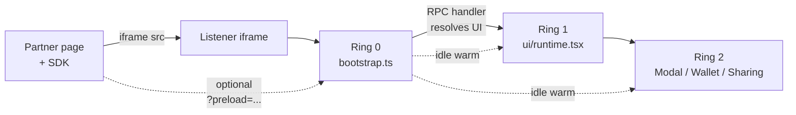

When your code runs on someone else's website, you don't get to think like an SPA team. You're a guest. Every kilobyte you ship is bandwidth your host pays for. Every parse-eval-execute cycle delays *their* time-to-interactive.

The Frak wallet lives inside an iframe embedded on partner merchant sites. We've previously written about [shrinking that iframe by 30%](/articles/frak-frontend-optimization) by swapping Jotai for Zustand and ditching S3 + CDN for a self-hosted Nginx. Those wins came from picking better building blocks. They didn't change the *shape* of the bundle, which is where the next ceiling is.

This is the story of how we redesigned that shape. The listener iframe now boots from a 3-chunk eager bundle. Everything else (Preact, i18next, the provider tree, the wallet, the modal, the sharing flow) is lazy. And the SDK running on the partner page predicts which lazy chunks the user will need, so by the time they click, the chunks are already in cache.

## The constraint nobody else has

Most web wallets are browser extensions. Their cost model is amortized over the user's whole browsing session: install once, ship as much code as you want.

The Frak wallet is the opposite. We're an iframe on a merchant's checkout page. The merchant's user has never heard of us, doesn't know they need us, and definitely does not want to wait three seconds for the page to settle while we boot a React tree to render… nothing, because they're not going to interact with anything. On a normal pageview, our happiest outcome is to do exactly enough work to be ready for an interaction that will never happen.

Concretely:

- The listener iframe loads on **hundreds of thousands of partner pageviews per day**.
- ~99% of those pageviews never trigger a single Frak UI surface.
- Every byte we ship in the eager bundle is paid for that many times.

We had two real levers left after the previous round of optimization: the rendering library itself, and the *coupling* between the RPC layer (which must boot eagerly) and the UI layer (which almost never does). This article is about pulling both.

## 1. Why we left React for the iframe shell

React was fine for the wallet app proper. It is overkill for the listener iframe, which is mostly:

1. A cross-frame RPC bridge to the partner page (no DOM).
2. A handful of UI surfaces (modal, embedded wallet, sharing page) shown to <1% of visitors.

We were paying for `react-dom` + the scheduler on every load whether or not we used them. The fix was Preact, which is API-compatible enough that the swap is mostly a Vite alias map.

The migration commit (`7ace02382`) describes the impact bluntly:

> Drops ~50 kB gzip from the eager iframe boot (vendor chunk: 294 → 130 kB raw, 92 → 43 kB gz), critical for partner-site load time since the listener iframe runs on every merchant page.

The mechanics matter a little here, because Preact's compat layer isn't always smooth in a Bun monorepo. The listener installs Preact directly, but our workspace packages (`wallet-shared`, `design-system`, `ui`) import from `"react"`. Bun's per-package `node_modules` layout means a bare specifier like `preact/compat` doesn't resolve from a sibling workspace package. We fixed it by aliasing to absolute paths:

```typescript
// apps/listener/vite.config.ts
const preactCompat = path.resolve(__dirname, "node_modules/preact/compat");
const preactCompatClient = path.resolve(
    __dirname,
    "node_modules/preact/compat/client"
);
const preactJsxRuntime = path.resolve(
    __dirname,
    "node_modules/preact/jsx-runtime"
);

// ...

resolve: {
    alias: [
        { find: /^preact$/, replacement: path.resolve(__dirname, "node_modules/preact") },
        { find: /^preact\/compat$/, replacement: preactCompat },
        { find: /^preact\/compat\/client$/, replacement: preactCompatClient },
        { find: /^preact\/jsx-runtime$/, replacement: preactJsxRuntime },
        // React shim: aliased to preact/compat so existing
        // `import ... from "react"` keeps working unchanged.
        { find: /^react$/, replacement: preactCompat },
        { find: /^react-dom$/, replacement: preactCompat },
        { find: /^react-dom\/client$/, replacement: preactCompatClient },
        { find: /^react\/jsx-runtime$/, replacement: preactJsxRuntime },
        { find: /^react\/jsx-dev-runtime$/, replacement: preactJsxRuntime },
    ],
},
```

We also disabled `reactAliasesEnabled` on `@preact/preset-vite` to keep full control: the preset's defaults compete with our absolute paths and we'd rather not debug whose wins.

The honest tradeoff: `preact/compat` is a stepping stone, not a destination. It got us a 50 kB gzip win without rewriting a single component. We'll migrate remaining React idioms to native Preact patterns over time; the swap is reversible, and the value is in the next sections, not in Preact itself.

## 2. Ring 0, Ring 1, Ring 2

The bigger change is structural. We split the listener into three concentric rings, each with a clear responsibility and a clear cost.

**Ring 0** is the eager TypeScript bootstrap. Pure TS, no JSX import at top level, no Preact runtime. It runs synchronously on iframe load. Its job is:

- Create the RPC listener and register every handler.
- Mark the document so listener-only styles apply before the first paint.
- Kick off lazy sessionStorage hydration of the shared `QueryClient`.
- Emit `iframeLifecycle: "connected"` so the SDK on the partner page knows we're alive.
- Honor a `?preload=...` URL hash to warm Ring 1/Ring 2 chunks during idle time.

**Ring 1** is the Preact provider tree. i18next, react-i18next, `@tanstack/react-query`, our root provider stack. It mounts lazily, the first time an RPC handler decides it actually needs a UI surface.

**Ring 2** is the UI surfaces themselves. Modal, embedded wallet, sharing page. Each is its own dynamic-import boundary, fetched on first display.



The bootstrap is short enough to quote almost in full:

```typescript
// apps/listener/app/bootstrap.ts
export function bootstrap(): { cleanup: () => void } {
    if (typeof window === "undefined") return { cleanup: () => {} };

    markRootListener();

    // Kick off lazy sessionStorage hydration so the singleton QueryClient
    // can serve cached entries to handlers that arrive before Ring 1 mounts.
    void ensureHydrated();

    // Vanilla factory handlers, created once, no React deps.
    const onWalletListenRequest = createWalletStatusHandler();
    const onGetMerchantInformation = createGetMerchantInformationHandler();
    const onSendInteraction = createSendInteractionHandler();
    const onDisplayModalRequest = createDisplayModalHandler();
    const onDisplayEmbeddedWallet = createDisplayEmbeddedWalletHandler();
    const onDisplaySharingPage = createDisplaySharingPageHandler();
    // ...etc

    const listener = createRpcListener<
        CombinedRpcSchema,
        WalletRpcContext,
        FrakLifecycleEvent
    >({
        transport: window,
        allowedOrigins: "*",
        middleware: [loggingMiddleware, walletContextMiddleware],
        lifecycleHandlers: { clientLifecycle: clientLifecycleHandler },
    });

    listener.handle("frak_displayModal", onDisplayModalRequest);
    listener.handle("frak_displayEmbeddedWallet", onDisplayEmbeddedWallet);
    listener.handle("frak_displaySharingPage", onDisplaySharingPage);
    listener.handle("frak_sendInteraction", onSendInteraction);
    // ...etc

    emitConnected();   // tell the SDK we're ready
    sendBootPing();    // count iframe loads for metrics
    setupPreloadHints(); // honor `?preload=modal,sharing`

    return { cleanup: () => listener.cleanup() };
}
```

Not a single import from `react`, `preact`, or `@/ui/*`. The eager bundle has no UI runtime in it.

On the typical visit, Ring 1 never mounts. The partner's user pays the Ring 0 price (a few kilobytes of vanilla TypeScript plus the connector and our store hydration) and nothing more.

## 3. Pulling RPC handlers out of React

The hardest part of the migration wasn't Preact. It was unwinding the import graph so Ring 0 could exist at all.

Before this work, our RPC handlers were React hooks. `useDisplayModalListener`, `useDisplayEmbeddedWallet`, `useSendInteraction`: every one of them imported `useQueryClient`, `useNavigate`, the i18n hook, sometimes our Zustand selectors. The act of registering the RPC listener at boot transitively pulled the entire UI runtime into the eager bundle.

The fix was a two-step refactor across several commits (`6be86ab3f`, `bd2e7f70a`).

**Step 1: introduce a uiBus.** RPC handlers don't need React; they need to *ask* React to show something. The bus separates intent from rendering:

```typescript
// apps/listener/app/uiBus.ts
type Handler = (req: UIRequest) => void;

let activeHandler: Handler | null = null;
const pending: UIRequest[] = [];

export const uiBus = {
    /**
     * Dispatch a UI request. If the provider is mounted (`attach` was called)
     * the handler runs synchronously; otherwise the request is queued and
     * delivered FIFO when a handler attaches.
     */
    request(req: UIRequest): void {
        if (activeHandler) {
            activeHandler(req);
            return;
        }
        pending.push(req);
    },

    /**
     * Subscribe a handler. Drains any queued requests synchronously, then
     * forwards every subsequent `request(...)` to the handler.
     */
    attach(handler: Handler): () => void {
        activeHandler = handler;
        if (pending.length > 0) {
            const queued = pending.splice(0);
            for (const req of queued) handler(req);
        }
        return () => {
            if (activeHandler === handler) activeHandler = null;
        };
    },
};
```

Fifty lines of vanilla TypeScript, zero runtime dependencies. Ring 0 imports it freely.

**Step 2: convert handlers to vanilla factories.** A handler is now a function that returns a function. Closures over services replace React's dependency injection. The heavy logic (store reads, analytics, the actual modal step prep) moves to an `.impl.ts` file that's only loaded on first call.

```typescript
// apps/listener/app/module/hooks/useDisplayModalListener.ts
export function createDisplayModalHandler(): OnDisplayModalRequest {
    return async (params, _context) => {
        // Trigger Ring 1 mount (preact + provider tree) in parallel with
        // the impl import. uiBus.request queues the request until the
        // provider attaches, so we don't need to await the runtime.
        void ensureUiRuntime();
        const { handleDisplayModal } = await import(
            "@/module/modal/component/Modal"
        );
        return handleDisplayModal(params, { setRequest: uiBus.request });
    };
}
```

Three things happen here:

1. `ensureUiRuntime()` kicks off the lazy `import("@/ui/runtime")` that mounts Preact.
2. `await import("@/module/modal/component/Modal")` fetches the Modal chunk in parallel.
3. The actual handler body lives in the Modal chunk and calls `uiBus.request` to ask Ring 1 to render.

The Ring 1 mount and the Ring 2 import overlap. By the time the modal handler returns, both are usually ready.

This is correct architecture, not just an optimization. Business logic shouldn't transitively depend on its rendering layer. The RPC layer is a long-lived service that happens to occasionally drive UI. Treating UI as a subscriber to a bus rather than a parent of the handler tree means each layer can be tested, reasoned about, and bundled independently.

The `QueryClient` got the same treatment (`954062db9`). It used to live inside a React context. Now it's a vanilla singleton, imported by both Ring 0 (for handler-side `fetchQuery` calls) and Ring 1 (which wraps it in `QueryClientProvider`):

```typescript
// apps/listener/app/queryClient.ts
import { createAsyncStoragePersister } from "@tanstack/query-async-storage-persister";
import { QueryClient } from "@tanstack/query-core";
import { persistQueryClient } from "@tanstack/query-persist-client-core";

export const queryClient = new QueryClient({
    defaultOptions: {
        queries: {
            gcTime: 5 * 60 * 1000,
            staleTime: 60 * 1000,
            retry: 1,
        },
    },
});

let hydrationPromise: Promise<void> | null = null;

/**
 * Restore the QueryClient from sessionStorage and start the auto-save
 * subscription. Idempotent: subsequent calls return the same Promise so
 * concurrent handlers do not double-restore.
 */
export function ensureHydrated(): Promise<void> {
    if (hydrationPromise) return hydrationPromise;
    hydrationPromise = (async () => {
        const [, restorePromise] = persistQueryClient({
            queryClient,
            persister,
            maxAge: Number.POSITIVE_INFINITY,
            dehydrateOptions: { /* ... */ },
        });
        await restorePromise;
    })();
    return hydrationPromise;
}
```

The trick is importing `QueryClient` from `@tanstack/query-core` directly instead of from `@tanstack/react-query`. The core package is the headless data layer; the react package adds observers and the provider. Ring 0 only needs the former. Ring 1 still uses `react-query` for the provider, but it operates on the same instance exported here.

## 4. The i18n chicken-and-egg

Once Ring 0 starts emitting `connected` before Ring 1 has mounted, you immediately hit an ordering problem. The SDK on the partner page sends lifecycle messages (`modal-i18n` overrides, language switches) *before* our React tree has finished loading. With React-driven i18n, those messages were silently lost.

The fix is a typed message queue (`26e64a8e1`):

```typescript
// apps/listener/app/i18nOverrideQueue.ts
type OverrideEntry = { kind: "override"; payload: I18nConfig };
type LanguageEntry = { kind: "language"; payload: Language };
type Entry = OverrideEntry | LanguageEntry;

let activeI18n: I18nType | null = null;
const pending: Entry[] = [];

export function enqueueI18nOverride(payload: I18nConfig): void {
    if (activeI18n) {
        void applyEntry(activeI18n, { kind: "override", payload });
        return;
    }
    pending.push({ kind: "override", payload });
}

export function enqueueLanguageChange(lang: Language): void {
    if (activeI18n) {
        void applyEntry(activeI18n, { kind: "language", payload: lang });
        return;
    }
    pending.push({ kind: "language", payload: lang });
}

/**
 * Bind the queue to a live i18n instance and drain everything that was
 * queued while Ring 1 was loading. Ring 1 calls this from `mountUiRuntime`
 * after `i18next.init` resolves.
 */
export function drainPendingI18nOverrides(i18n: I18nType): void {
    activeI18n = i18n;
    if (pending.length === 0) return;
    const queued = pending.splice(0);
    for (const entry of queued) {
        void applyEntry(i18n, entry);
    }
}
```

Ring 0 calls `enqueueI18nOverride` / `enqueueLanguageChange` directly from the lifecycle handler. Ring 1, after i18next initializes, calls `drainPendingI18nOverrides(i18next)`. After draining, subsequent calls replay through the live instance, so the queue stays useful for late-arriving messages too.

The same pattern works for any "early-arriving message, late-mounting consumer" problem. We picked a typed queue over an event emitter because the queue's contents are part of the contract: anything you can enqueue, you can replay. Generic event emitters are less expressive about ordering and replay semantics.

A parallel piece of work scoped pairing-reconnect to the Modal and Embedded Wallet trees only (`db086b785`). Previously the reconnect ran in the root provider, which meant every iframe boot opened a pairing client even when the user never triggered any UI. Now it only runs inside the trees that actually need it. Same principle: don't pay Ring 1 costs from Ring 0.

## 5. Killing the long tail of tiny chunks

With Ring 0/1/2 split, we had a working system that emitted 32 chunks. Many of them were 1–3 kB phantoms produced by Rolldown's heuristics around dynamic-import boundaries: re-export barrels that collapsed to nearly nothing but still incurred a `import "./<chunk>.js"` side-effect import in every consumer.

The cleanup happened in two passes.

**Pass A: kill phantom chunks and `.impl` shims** (`11e58549e`, 32 → 22). The vite config grew a custom plugin that scans the emitted bundle, finds zero-byte chunks, and strips the dangling side-effect imports referencing them:

```typescript
// apps/listener/vite.config.ts
function stripOrphanCrossChunkImports() {
    const LAZY_ORPHAN_RE =
        /import\s*"\.\/(?:blockchain-vendor|BaseProvider|ui-vendor|ui-runtime|lazy-shared|Modal|Wallet|SharingPage)-[A-Za-z0-9_-]+\.js";/g;
    return {
        name: "strip-orphan-cross-chunk-imports",
        apply: "build" as const,
        generateBundle(_options, bundle) {
            // Pass 1: drop chunks whose code is empty (zero-byte phantoms
            // produced by Rolldown when a side-effect-free re-export barrel
            // collapses to nothing).
            const orphanFileNames: string[] = [];
            for (const [key, file] of Object.entries(bundle)) {
                if (file.type !== "chunk" || !file.fileName) continue;
                if (typeof file.code === "string" && file.code.trim() === "") {
                    orphanFileNames.push(file.fileName);
                    delete bundle[key];
                }
            }
            // Pass 2: strip orphan side-effect imports from surviving chunks.
            // ...
        },
    };
}
```

The plugin also strips side-effect imports of *known lazy chunks* (`blockchain-vendor`, `Modal`, `Wallet`, `SharingPage`, etc.) when they appear in eager chunks. Rolldown sometimes hoists those imports even when no bound symbols cross the boundary; that would force the iframe to download lazy chunks on cold boot for no reason.

**Pass B: consolidate the remaining tiny chunks** (`6957f37dc`, 22 → 15, eager 8 → 3). The commit message is direct about what got folded:

> Drop the dedicated `vite-preload` group and route its module through the wider `common` regex along with `sdk/core/src/`, listener's eager `uiBus`/`queryClient`/`i18nOverrideQueue`, and `wallet-shared/pairing/types`. Folds six tiny eager chunks (vite-preload, b64, sso, uiBus, queryClient, errors) into `common`: saves five HTTP requests on cold boot.

The end-state chunking config is opinionated and dense. The shape is:

```typescript
// apps/listener/vite.config.ts (excerpt)
codeSplitting: {
    minShareCount: 2,
    // Disable Rolldown's default "pull all transitive deps into the same
    // group as the matched module". With it on, `ui-runtime` (preact +
    // @tanstack/react-query) dragged every transitive dep (zustand,
    // @tanstack/query-core, @elysiajs/eden, idb-keyval) into the lazy
    // chunk, so the eager queryClient.ts had to statically import it.
    includeDependenciesRecursively: false,
    groups: [
        // EAGER: react-bindings + i18n + listener provider tree
        { name: "ui-runtime", test: /.../, priority: 45, minShareCount: 1 },

        // EAGER: zustand, idb-keyval, elysia client, headless tanstack
        { name: "vendor", test: /.../, priority: 40, minShareCount: 1 },

        // LAZY: viem + wagmi + permissionless + BaseProvider glue
        { name: "blockchain-vendor", test: /.../, priority: 35, minShareCount: 1 },

        // LAZY: @radix-ui + qr + micromark
        { name: "ui-vendor", test: /.../, priority: 30 },

        // LAZY: design-system + sonner + lucide + shared UI primitives
        { name: "lazy-shared", test: /.../, priority: 25, minShareCount: 1 },

        // EAGER shared-with-lazy: stores, sdk/core, listener eager files
        { name: "common", tags: ["$initial"], test: /.../, priority: 28, minShareCount: 1 },
    ],
},
```

The `includeDependenciesRecursively: false` line is the load-bearing one. With Rolldown's default on, naming a lazy group pulls every transitive dependency into it, which then forces eager modules that share those deps to import the lazy chunk statically. Turning it off lets each group claim only modules its `test` regex actually matches.

Tiny details that matter:

- The `qr` library replaced `cuer` (`0520ea983`). Same QR code rendering, materially smaller, no React peer dependency. Every dependency is a budget line.
- We restrict Vite's HTML `modulePreload` to eager-only chunks. Vite eagerly emits `<link rel="modulepreload">` for every chunk reachable from the entry, including dynamic imports, which defeats the lazy strategy. A filter prunes the preload list:

```typescript
modulePreload: {
    resolveDependencies: (_filename, deps, { hostType }) => {
        if (hostType !== "html") return deps;
        return deps.filter(
            (d) => !/(?:blockchain-vendor|BaseProvider|Modal|Wallet|SharingPage|ccip|secp256k1|lazy-shared|ui-vendor|ui-runtime)-/.test(d)
        );
    },
},
```

The cost of tiny chunks is easy to underestimate. HTTP/2 multiplexing helps, but each chunk is still a request line on the waterfall, its own module record in the browser, and its own parse cost. Five tiny chunks merged into one eager `common` chunk is five fewer requests on cold boot and zero downside, because every consumer already needed all five.

## 6. The SDK side: predicting what to preload

This is the part of the architecture that doesn't have an analog in normal SPA work.

The iframe is a passive consumer. It boots when the partner loads it, and it has no idea which Frak features the partner is actually using on this page. But the *SDK* (the script the partner loads on their page) does know. If there's a `<frak-button-share>` in the DOM, the user is going to click it soon. If there's a `<frak-banner>`, same. The SDK can tell the iframe to warm those chunks before the click.

The implementation is small and lives in two files. First, a scanner that detects which Frak components are on the page (`detectListenerPreloads`):

```typescript
// sdk/components/src/utils/dom/detectListenerPreloads.ts
const FRAK_COMPONENT_SELECTOR = [
    "frak-button-share",
    "frak-button-wallet",
    "frak-open-in-app",
    "frak-post-purchase",
    "frak-banner",
].join(",");

/**
 * Dynamically compute the iframe preload list based on which Frak components
 * are present in the current document.
 *
 *  - No `frak-*` element on the page → `[]` (caller should skip the
 *    `#preload=...` hash entirely so the listener doesn't warm chunks no one
 *    will use).
 *  - At least one `frak-*` element → `["sharing"]`. Every public component
 *    eventually opens the sharing flow, so a single hint covers the whole
 *    surface without bloating the iframe URL.
 */
export function detectListenerPreloads(): ListenerPreloadOption[] {
    if (typeof document === "undefined") return [];
    const hasFrakComponent =
        document.querySelector(FRAK_COMPONENT_SELECTOR) !== null;
    return hasFrakComponent ? ["sharing"] : [];
}
```

Then `initFrakSdk` (`3e78469b1`) injects the result as a config field, which the iframe-helper packs into the iframe URL hash:

```typescript
// sdk/components/src/bootstrap/initFrakSdk.ts
function withDynamicPreload(config: FrakWalletSdkConfig): FrakWalletSdkConfig {
    if (config.preload !== undefined) return config;
    return { ...config, preload: detectListenerPreloads() };
}
```

```typescript
// sdk/core/src/utils/iframe/iframeHelper.ts
function buildListenerUrl({ walletUrl, clientId, preload }: { /* ... */ }): string {
    const base = `${walletUrl}/listener?clientId=${encodeURIComponent(clientId)}`;
    if (!preload || preload.length === 0) return base;
    return `${base}#preload=${preload.join(",")}`;
}
```

The hash (not a query param) keeps the preload hint out of any cache keys. The iframe reads it in Ring 0:

```typescript
// apps/listener/app/bootstrap.ts (excerpt)
function setupPreloadHints(): void {
    const hash = window.location.hash.slice(1);
    const urlParams = new URLSearchParams(hash);
    const preloadRaw = urlParams.get("preload");
    if (!preloadRaw) return;

    const preloads = preloadRaw.split(",");
    const wantsModal = preloads.includes("modal");
    const wantsSharing = preloads.includes("sharing");
    const wantsWallet = preloads.includes("wallet");
    if (!wantsModal && !wantsSharing && !wantsWallet) return;

    const handler = async () => {
        // Always warm Ring 1 (preact + provider tree) when any UI is hinted.
        const promises: Promise<unknown>[] = [import("@/ui/runtime")];
        if (wantsModal) promises.push(import("@/module/modal/component/Modal"));
        if (wantsSharing) promises.push(import("@/module/sharing/component/SharingPage"));
        if (wantsWallet) promises.push(import("@/module/embedded/component/Wallet"));
        await Promise.all(promises);
    };

    if ("requestIdleCallback" in window) {
        window.requestIdleCallback(handler);
        return;
    }
    setTimeout(handler, 0);
}
```

`requestIdleCallback` is the load-bearing detail. The preload doesn't compete with anything the partner page is doing. By the time the user actually clicks a Frak component, Ring 1 and the relevant Ring 2 chunk are already in cache, and the lazy boundary is invisible.

Two more pieces fall out of this. The iframe helper now also injects `<link rel="preconnect">` for the wallet and backend origins, so the very first network request doesn't pay for a cold DNS/TLS handshake. And `detectListenerPreloads` is honest: an explicit `config.preload = []` is respected as an escape hatch, so partners who want to defer everything can still do so.

## What we'd do differently

Three honest reflections.

**The vanilla-factory refactor should have come first.** We did the Preact swap before unwinding the React imports from RPC handlers. That meant the migration diff was bigger than it needed to be: every handler had to be touched twice (once for Preact compat, once for the factory split). If we ran it again, we'd ship the uiBus + vanilla-factory refactor on the React codebase first, prove the eager bundle shrinks, *then* swap to Preact.

**`preact/compat` is a stepping stone.** We've still got React idioms (`StrictMode`, some Suspense usage, `createRoot`) that ship through the compat layer. The compat layer isn't free, and some Radix primitives lean on it harder than we'd like. Native Preact patterns (signals, no StrictMode) will save another few kB and remove the alias map. Not urgent, but on the list.

**Chunk naming via Vite/Rolldown `manualChunks` is fragile.** The current config is finely tuned regexes that depend on the bundler's behavior. Two Rolldown upgrades during this work changed the chunking output enough that we had to retune. We treat it as a regression risk now and check chunk counts in CI on every PR. A proper integration test (assert exactly 15 chunks, assert no chunk is < 1 kB, assert eager chunks contain no `blockchain-vendor` references) is the next thing we'll add.

## Where this goes next

The Ring model gives us a budget envelope for new features. Anything Ring 0 ships forever, on every iframe boot, on every partner pageview. Anything Ring 1 ships only when the user actually opens UI. Anything Ring 2 ships only when they open *that specific surface*. New features ask the right question by default: which ring does this belong in?

An open question we haven't answered: should the SDK send a "predictive open" signal so the iframe pre-mounts Ring 2 invisibly when, say, the user scrolls a Frak component into view? That would make the click-to-paint latency effectively zero. The tradeoff is bandwidth: we'd ship Ring 1 + a Ring 2 chunk to every user who scrolls past one, not just those who click. We have the telemetry to answer it; we just haven't run the experiment yet.

There's a sister story to this one on the platform side. Building this many small commits in a tight feedback loop only became cheap once we'd rebuilt our CI infrastructure. The next two articles are about that: a Hetzner-based platform with in-cluster GitHub runners, and the resulting CI rewrite that took the wallet's deploy from 9 minutes to 2.
