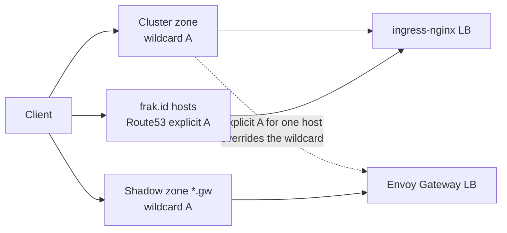
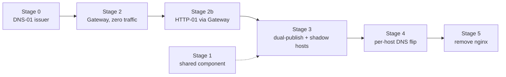

The ingress-nginx project reached end-of-life in March 2026. No more releases, no more CVE patches. On Frak's GKE cluster it was still the only way in: controller v1.15.1, two replicas behind one GCP L4 load balancer, terminating TLS for every production hostname we serve. 18 Ingresses across 11 namespaces, 28 hostnames and 18 cert-manager Certificates, all funnelled through a single IP.

I wrote the migration plan at the start of September. On paper it looked like a rewrite: about ten annotations per Ingress, a Pulumi component, copied into seven repositories, that generates those Ingresses, plus a WAF, basic auth, CORS and streaming endpoints. Checking what nginx did with those annotations shrank the list to a handful of real policies. The risks sat elsewhere: certificates that stop renewing weeks after a cutover, a client IP anyone can forge today, Envoy Gateway defaults that 504 or 503 traffic nginx served fine, and that copy-pasted component.

This is the state on 2 October 2026. Our Hetzner k3s box serves all the web apps of infra-core, our platform repo, through Traefik's Gateway API. On GKE, an Envoy Gateway has been running since 1 October with real certificates, and since 2 October with real backends. Every infra-core app is published on it next to its Ingress, and the staging deployment of Frak's wallet app joined the same day. No production hostname resolves to the Gateway yet. Extracting one shared `KubernetesService` component, the largest piece of work, has not started.

## What the Edge Looked Like

The controller's HPA allowed up to 10 replicas, the load balancer used `externalTrafficPolicy: Cluster`, TLS came from cert-manager v1.21.1 through one ClusterIssuer, `letsencrypt`, and no Gateway API CRDs were installed.

DNS is split over two providers. Two Cloud DNS zones dedicated to the cluster, one per environment (written `<zone>` below), are managed by infra-core and hold a wildcard `*` A record pointing at the nginx load balancer. The public names under `frak.id` (`wallet.frak.id`, `business.frak.id` and friends) live in Route53, in another AWS account, as explicit A records to the same IP. There is no CDN or proxy in front. Public DNS points straight at nginx.

## The Wildcard Record Is the Switch

The wildcard makes this migration cheap. A DNS wildcard only answers for names that have no record of their own. So if `*.<zone>` points at nginx and I create an explicit `wallet.<zone>` A record pointing at the Gateway, exactly that one hostname moves to the new stack. Deleting the record moves it back, within one TTL. The trap: a name that only exists as the parent of another record also counts, so a per-host `_acme-challenge.wallet.<zone>` record would take `wallet.<zone>` out of the wildcard. Our challenge records sit at the zone level.



The `*.gw` shadow zone always points at the Gateway, for testing in Stage 3. The public apps (the wallet's four and the fuzzing metrics host) also answer on two names: an `<app>.<zone>` alias under the wildcard, and a public `.frak.id` name in Route53. We plan to use that as a canary: flip the alias first, let it soak, then edit the Route53 record. It is a partial rehearsal, since the public name uses its own listener and certificate.

I rejected swapping the selector on the existing load balancer Service: one all-or-nothing flip, with a second global flip as the rollback.

The rollout builds on the switch in stages 0 to 5. Both stacks run in parallel the whole time, and every step can be reverted on its own. The dotted arrow is Stage 1, extracting the shared component: I wanted it done before Stage 3, and it has not happened.



## Why Envoy Gateway on GKE

The two serious options were self-hosted Envoy Gateway and GKE's managed Gateway on Google Cloud Load Balancing. I chose Envoy Gateway on 3 September. Its data plane is an in-cluster `Service type=LoadBalancer`; GKE Gateway instead reprograms a Google Cloud load balancer on every change, which typically takes minutes. Envoy Gateway also has policy CRDs for every annotation in the audit except the WAF. GKE Gateway has no native basic auth (its identity options, IAP and authorization policies, are a different model), and its CORS filter exists on some GatewayClasses only. The per-host DNS switch would work with either.

The accepted cost is that we own an edge proxy again, and its patch cadence. One constant, `envoyGatewayVersion = "v1.9.1"`, pins the controller chart, the CRD chart and the Grafana dashboards together. The cluster sets no `gatewayApiConfig`, so GKE leaves the Gateway API CRDs to us: we install the standard channel at v1.6.1, the version Envoy Gateway v1.9.1 bundles. HTTPRoutes port between implementations; ListenerSets, policy CRDs and Envoy's defaults do not.

## Sizing the Work: Most Annotations Do Nothing

Before translating anything, I checked each annotation against the `nginx.conf` generated inside the running pod. Five annotation keys, 62 occurrences in total, turned out to do nothing:

| Annotation | Count | Why it is dead |
|---|---|---|
| `nginx.ingress.kubernetes.io/rewrite-target: /` | 13 | No `rewrite` directive generated: target equals path, and every path is `/`. |
| `kubernetes.io/ingress.class: nginx` | 11 | Deprecated; `spec.ingressClassName` is already set on all 18. |
| `nginx.ingress.kubernetes.io/ssl-redirect: "true"` | 18 | Already the default whenever TLS is configured. |
| `nginx.ingress.kubernetes.io/force-ssl-redirect: "false"` | 2 | Already false. |
| `kubernetes.io/tls-acme: "true"` | 18 | Legacy kube-lego, superseded by `cert-manager.io/cluster-issuer`. |

`rewrite-target` is still emitted by default in every copy of our `KubernetesService` component (in the wallet's, as a backward-compatibility default) and has never produced a single directive. Deleting all five takes 62 entries off the porting list without changing what nginx does. One GKE caveat: our cluster leaves the HTTP load balancing add-on on, and its ingress-gce controller has historically claimed Ingresses without a `kubernetes.io/ingress.class` annotation. Confirm your version skips ones whose `ingressClassName` names another controller before deleting it.

Routing, TLS secrets and the HTTPS redirect map to native Gateway API objects; the redirect becomes one route on the Gateway's port-80 listener. The rest maps to Envoy Gateway's policy CRDs: proxy timeouts (in `BackendTrafficPolicy`), basic auth on Alertmanager, body size limits, keepalive tuning on six hosts, HTTP/2 limits and `proxy-buffering: off` on two wallet hosts. Envoy pools upstream connections and streams by itself, so the keepalive and buffering tuning gets checked on the shadow hosts instead of ported.

One item is hard. The chart enables ModSecurity with the OWASP Core Rule Set globally, and then 14 of the 18 Ingresses switch it straight back off. Checked against the live config, the WAF only enforces on four Ingresses (five hostnames: Alertmanager, eRPC (our blockchain RPC proxy) in both environments, and the fuzzing metrics host under two names) plus the catch-all server. Replacing it means Coraza on Envoy Gateway (it consumes the same OWASP CRS) or Cloud Armor. That is a scoped problem on four Ingresses, so it can wait until late in the rollout.

## Landmine One: Certificates That Stop Renewing Weeks Later

The existing ClusterIssuer solves ACME challenges over HTTP-01, pinned to the nginx ingress class:

```yaml
solvers:
- http01:
    ingress:
      class: nginx
```

As soon as a hostname's DNS points at the Gateway, cert-manager keeps publishing that host's challenge as an nginx Ingress, and nginx no longer receives the host's traffic. The challenge fails, and nothing breaks that day because the current certificate is still valid. cert-manager renews at two-thirds of a certificate's life, and Let's Encrypt still issues 90-day certificates by default (64-day from February 2027), so renewals start failing around day 60 of the certificate and it expires at day 90, within three months of the flip depending on its age. Our alerting has no certificate-expiry rule yet, though cert-manager already exports `certmanager_certificate_expiration_timestamp_seconds`.

### Nine Certificates Span Two DNS Providers

The obvious fix, a DNS-01 issuer on Cloud DNS, decouples issuance from whichever proxy serves the host, but it cannot work alone. A cert-manager `Certificate` needs every one of its `dnsNames` solvable by its issuer, and nine of ours pair a Cloud DNS alias with a Route53 name (`wallet.frak.id` and its `<zone>` alias, likewise for business, backend and the Shopify extension in both environments, plus the metrics host). I settled on one new ClusterIssuer, `letsencrypt-v2`, with solvers selected per DNS zone, and left the old issuer renewing through nginx meanwhile.

### What Actually Landed

We went further than I first planned on two points. First, Stage 0 was going to scope cert-manager's IAM binding per zone instead of granting project-wide `roles/dns.admin`. Per-zone scoping would still let cert-manager rewrite the very wildcard records that drive the cutover. So every `_acme-challenge.<name>` is a CNAME into a delegated `acme` subzone, the only zone cert-manager can write to, through Workload Identity with no key:

```typescript
// infra/kubernetes/networking/cert-manager.ts (infra-core, excerpt)
/**
 * DNS-01 without handing cert-manager the production zones: every
 * `_acme-challenge.<domain>` is a CNAME into this delegated zone, and it is
 * the only zone cert-manager can write to. A leaked credential can mint
 * challenge records, not repoint the wildcard records driving the cutover.
 * ...
 */
// ...
const acmeZoneDns01 = {
    cnameStrategy: "Follow",
    cloudDNS: {
        project: project.projectId,
        hostedZoneName: acmeZone.name,
    },
};
// ...
solvers: [
    {
        dns01: acmeZoneDns01,
        selector: {
            dnsZones: dnsZones.map(({ domain }) => domain),
        },
    },
    {
        dns01: acmeZoneDns01,
        selector: {
            dnsZones: ["frak.id"],
            matchLabels: acmeDnsDelegatedLabel,
        },
    },
    {
        http01: {
            gatewayHTTPRoute: {
                parentRefs: [
                    { ...gatewayRef, kind: "Gateway", sectionName: "http" },
                ],
                // ...
            },
        },
        selector: {
            dnsZones: ["frak.id"],
        },
    },
],
```

Only names with a CNAME into the acme subzone can use DNS-01. For the cluster zones that costs nothing: the Gateway serves them with one wildcard certificate per zone, which HTTP-01 could never issue. So the cert split I had planned turned out to be unnecessary; each app's own certificate now carries only its `frak.id` name.

Second, the public `.frak.id` names. The first version solved them over HTTP-01 through the Gateway, which only works once the host's DNS points there, so each flip would have opened with minutes of TLS errors. On 2 October I created `_acme-challenge` CNAMEs in Route53 by hand for the eight wallet hosts and the metrics host, pointing into the same acme subzone. A Certificate labelled `frak.id/acme-solver: dns01-delegated` now gets the DNS-01 solver and can be `Ready` before the DNS changes; without the label, it falls through to HTTP-01.

One ordering trap: cert-manager only detects Gateway API at startup, and enabling `config.gatewayAPI.enabled` before the CRDs exist crash-loops it. We install the CRDs as their own chart and make cert-manager `dependsOn` it; the config change then rolls the controller with no manual restart.

## Landmine Two: A Forgeable Client IP

The nginx config sets `use-forwarded-headers: "true"`, so the controller trusts the inbound `X-Forwarded-For` header. Nothing trusted sits in front of it: clients connect straight to a GCP L4 load balancer, and any client can pick its own apparent source IP by sending the header.

Envoy Gateway makes you state the trust policy explicitly. Our Gateway's data plane sits behind a passthrough network load balancer with `externalTrafficPolicy: Local`, which means the TCP peer Envoy sees is the real client, and no forwarded header is trusted:

```typescript
// infra/kubernetes/networking/gateway.ts (infra-core, excerpt)
envoyHpa: { minReplicas: 2, maxReplicas: 6 },
envoyPDB: { minAvailable: 1 },
// Passthrough NLB + Local policy: Envoy sees the real
// client address, no proxy hop to trust.
envoyService: {
    type: "LoadBalancer",
    loadBalancerClass: "networking.gke.io/l4-regional-external",
    externalTrafficPolicy: "Local",
    // ...
},
// ...
// Never trust a client-supplied X-Forwarded-For (see envoyService)
clientIPDetection: { xForwardedFor: { numTrustedHops: 0 } },
```

`Local` has a cost: only nodes running an Envoy pod pass the load balancer's health check, so scale-downs rely on that check draining nodes in time. Downstream, the wallet backend's rate limiter reads the right-most `X-Forwarded-For` entry, assuming one proxy that appends the address it saw. Envoy appends the client address the same way; the staging soak has to confirm it.

## The Long Pole: Seven Copies of One Component

`infra/components/KubernetesService.ts` is the Pulumi component that turns a few lines of TypeScript into a Deployment, Service, HPA, Ingress and ServiceMonitor (the [SST and Pulumi article](/articles/frak/frak-infrastructure-iac/) shows it in use). It generates the Ingress for almost every app we run, and each repo has its own copy. When I wrote the plan, the seven copies ran 349 to 413 lines, and the most drifted one showed 662 lines of diff against infra-core's.

Adding HTTPRoute support means writing it seven times and keeping seven copies consistent through months of dual-running. I sized this stage L and every other one S or M: Stage 1 is the bulk of the project.

We have not done it. Instead, two copies grew their own Gateway support: infra-core's (23 September) emits one `HTTPRoute` with a catch-all rule, and the wallet's (2 October) adds per-path rules and an Envoy `BackendTrafficPolicy` per route and rule. They are now 469 and 593 lines, and the wallet's fixes for policy merging and idle timeouts exist in one repo only. That is the main debt this migration is building.

## The Rollout: Zero Traffic First

Stage 2 installs Envoy Gateway on the system node pool, behind a reserved static IP, with a PodMonitor, a ServiceMonitor and the upstream Grafana dashboards wired in before any traffic arrives. The nginx controller and every DNS record stay as they were.

Stage 3 makes each app reachable on the real Gateway without touching production. `KubernetesService` gained an `httpRoute` option that publishes an `HTTPRoute` next to the existing `Ingress`, never in place of it. Each route lists the real host, inert until its DNS moves, and a shadow host, `<app>.gw.<zone>`, live today.

A wildcard TLS certificate covers exactly one label, so `*.<zone>` cannot serve `wallet.gw.<zone>`. One `*.gw` A record per zone, plus a `*.gw` name on each zone's wildcard certificate, covers every shadow host; per-host HTTP-01 certs would each have counted against Let's Encrypt's limit of 50 new certificates per registered domain per week, shared across all of `frak.id`.

On 2 October the infra-core apps went dual-published in production: the OpenPanel dashboard and API, the RustFS-backed CDN, Grafana and Alertmanager. The CDN got a CORS `SecurityPolicy` mirroring its nginx annotations. Alertmanager needed a new password file, because Envoy Gateway's basic auth only accepts `{SHA}` htpasswd entries and ours was bcrypt. Unsalted SHA-1 is a weaker hash, so the Gateway route got its own new password. Its `SecurityPolicy` is created before the route, so the route never exists unprotected.

## What Dual-Publishing the Wallet Taught Us

The wallet's `KubernetesService` copy now renders an `HTTPRoute` plus one `BackendTrafficPolicy` per route, and another per rule when a rule needs different settings:

```typescript
// infra/components/KubernetesService.ts (frak-wallet, excerpt)
/**
 * What ingress-nginx does for us today: 5s connect, no total cap, 60s without
 * a byte. Upstream idle stays below nginx's 75s keep-alive in the SPA pods.
 */
const edgeTrafficDefaults: Required<EdgeTraffic> = {
    connectTimeout: "5s",
    requestTimeout: "0s",
    streamIdleTimeout: "60s",
    connectionIdleTimeout: "60s",
    compression: false,
};
// ...
function trafficPolicySpec(traffic: Required<EdgeTraffic>) {
    // ...
    return {
        // Without it, a route policy replaces the Gateway-level one wholesale
        mergeType: "StrategicMerge",
        // ...
    };
}
// ...
const routeTraffic = { ...edgeTrafficDefaults, ...route.traffic };
const policies = [
    this.createTrafficPolicy(routeName, undefined, routeTraffic),
    // A rule policy replaces the route one for that rule, so it carries both
    ...rules.flatMap((rule) =>
        rule.traffic
            ? [this.createTrafficPolicy(routeName, rule.name, {
                  ...routeTraffic,
                  ...rule.traffic,
              })]
            : []
    ),
];
// ...
// Policies first: the route never serves on Envoy's 15s default timeout
{
    ...this.opts,
    parent: this,
    dependsOn: [this.service, ...policies],
}
```

The backend uses it with a longer idle window for the WebSocket that waits on a wallet pairing:

```typescript
// infra/gcp/backend.ts (frak-wallet)
httpRoute: {
    ...gatewayRoute("backend", "backend"),
    rules: [
        {
            name: "pairing-ws",
            path: "/user/wallet/pairings/ws",
            pathType: "Exact",
            // Bun's `websocket.idleTimeout`: a pairing can wait minutes
            traffic: { streamIdleTimeout: "300s" },
        },
    ],
    traffic: { ...backendUpstreamTraffic, compression: true },
},
```

What behaved differently from nginx:

- Envoy's default caps a request's total duration at 15 seconds; nginx had a 60-second read timeout and no total cap. Slow API calls would 504 and SSE streams would be cut, so a Gateway-level policy sets `requestTimeout: "0s"` and `streamIdleTimeout: "60s"`.
- A route-level `BackendTrafficPolicy` replaces the Gateway-level one unless it sets `mergeType`. A rule-level policy also replaces the route-level one, which is why each rule policy is rendered as route settings merged with rule settings.
- A `compressor` entry without its empty settings object (`brotli: {}`) is dropped by Envoy Gateway v1.9, and the policy still reports `Accepted`.
- The upstream `connectionIdleTimeout` has to stay below each app's own keep-alive, or Envoy reuses a pooled connection the app has just closed and the request fails with a 503. The backend's Bun server is configured with `idleTimeout: 30` (Bun's default is 10), so its routes get 25s. The Shopify app's Express server runs on Bun's node:http layer and drops idle connections after 5 seconds, so it gets 4s. (Node's own default depends on the version: 65 seconds since v26.)
- Vanity certificates must carry only the vanity name. A certificate with a SAN that overlaps the Gateway's cluster-zone wildcards dropped the overlapping port-443 listeners (all of ours) to HTTP/1.1. That is Envoy Gateway's guard against HTTP/2 connection coalescing, reported as an `OverlappingTLSConfig` condition.
- The Gateway sent no `Strict-Transport-Security` header, and the nginx controller did. A `ClientTrafficPolicy` now sets `max-age=31536000; includeSubDomains` through `headers.lateResponseHeaders` on the Gateway's own listeners. ListenerSet listeners need their own policy, and the wallet's does not have one yet.

The wallet's vanity names fall outside the Gateway's wildcards, so the wallet repo attaches its own HTTPS listeners and certificates as a ListenerSet in its namespace, which Envoy Gateway supports from v1.8 once the Gateway sets `allowedListeners.namespaces.from: All`. Those certs carry the delegated DNS-01 label, so they are issued before any DNS change.

Request body limits moved into the apps. The nginx config enforced 10m globally; Envoy streams request bodies with no default cap, and a per-route cap (`BackendTrafficPolicy.requestBuffer`) buffers the whole body, which breaks streaming uploads and WebSockets. Each server now caps bodies at 15 MiB itself: the Bun backend through `serve.maxRequestBodySize`, the Shopify app through a header guard, because node:http has no limit and Shopify's webhook authentication buffers the whole body before checking its HMAC. Refusing chunked bodies assumes legitimate clients send a `Content-Length`:

```javascript
// apps/shopify/server.js (frak-wallet, excerpt)
const MAX_BODY_BYTES = 15 * 1024 * 1024;
// ...
    const length = req.headers["content-length"];
    if (length !== undefined && Number(length) > MAX_BODY_BYTES) {
        res.set("Connection", "close").sendStatus(413);
        return;
    }
    // A chunked body declares no length, so it would dodge the cap above
    if (length === undefined && req.headers["transfer-encoding"]) {
        res.set("Connection", "close").sendStatus(411);
        return;
    }
```

Those wallet changes went out through the `dev` branch on 2 October, which deploys the wallet's staging stage. The production wallet is not dual-published yet.

The nginx load balancer IP also turned out to be ephemeral: it must be promoted to a reserved address before Stage 5, or deleting the nginx Service loses it.

## Hetzner: Traefik Already Speaks Gateway API

The [Hetzner k3s box](/articles/frak/frak-hetzner-platform/) already ran Traefik, which is maintained and supports Gateway API, so it stays. Adopting the out-of-band Helm release took two commits on 23 September, an import and then the change, deployed separately. The second moved the chart to 41.6.0 (Traefik v3.7.13) with the Gateway provider on, and upgraded the v1.4.0 Gateway API CRDs an older chart had left behind to v1.6.1.

Released Traefik (v3.7) has no ListenerSet support (it is merged for v3.8), so each public host gets its own HTTPS listener on the one Gateway. The certificate landmine does not apply here: Traefik keeps its Ingress provider running, so certs still solve HTTP-01 through it. Each host's certificate is awaited before its listener exists, and the old Ingresses are deleted at the end of the run:

```typescript
// infra/hetzner/gateway.ts (infra-core, excerpt)
/**
 * Issued (HTTP-01 through the Traefik Ingress solver) before the Gateway
 * references them: `waitFor` holds the listener, and therefore the switch
 * away from each app's Ingress, until the cert is Ready.
 */
// ...
metadata: {
    name,
    namespace: namespace.metadata.name,
    annotations: { "pulumi.com/waitFor": "condition=Ready" },
},
```

That change moved six apps onto HTTPRoute and reached the box with the merge into our staging branch on 28 September (the box is our `hetzner-staging` stage, which also runs our CI). BuildKit keeps its TLS-passthrough `IngressRouteTCP`, and the out-of-band sandbox workloads keep their Ingresses. When the demo shops came back on 2 October, PrestaShop showed that a Gateway 404 can mean the route was never created: its installer tripped on the volume's root-owned `lost+found`, so the pod never went ready.

## Where It Stands on 2 October

| Stage | State |
|---|---|
| 0, DNS-01 issuer, acme subzone, wildcard certs | Deployed on GKE production, 1 October |
| 1, shared `KubernetesService` package | Not started; the no-op cleanup ships with it, since it touches all seven copies |
| 2, Envoy Gateway with zero traffic | Deployed, 1 October |
| 2b, HTTP-01 through the Gateway | Deployed, 1 October; DNS-01 for vanity hosts added 2 October |
| 3, dual-publish and shadow hosts | infra-core apps in production; wallet apps in staging |
| 4, per-host DNS flip | Prep only: 60 s TTL on the 9 Route53 records and the Cloud DNS wildcards (those were 300) |
| 5, remove nginx | Not started |
| Hetzner | Done for infra-core's web apps |

In Stage 4 each step proves one new capability: two staging apps first for routing and TLS, Alertmanager for basic auth, eRPC for the WAF replacement, and the production wallet last, one hostname at a time. Several apps on that list live in repos whose `KubernetesService` copy has no `httpRoute` option yet, and the Coraza work has not started. A soak has no defined pass yet: the dashboards are in place, the thresholds are not. Also open: a public Envoy Gateway issue reports a v1.9.1 regression in route attachment on shared ports, and we pin v1.9.1; whether it hits our layout is unchecked.

After the last host has an explicit record, the wildcard moves to the Gateway, everything soaks for at least two weeks and one full certificate renewal cycle, and only then do the Ingress objects and the nginx chart go away.

Whether this stays boring depends on the step I have postponed: one versioned `KubernetesService` package, so that the wallet's merge rules, idle-timeout values and policy-first dependencies reach the other six copies as a version bump instead of six hand-copied patches.
