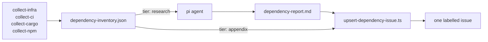

Frak's wallet monorepo (the web apps, the backend, a Tauri mobile app and the SDKs) got its first dependency report on the evening of 21 September 2026, as GitHub issue #319. Before midnight, five upgrade commits had landed on top of it: the SST and Pulumi provider set, sha pins on 146 `uses:` sites, a Changesets major, and replacing or dropping three deprecated packages. Two of those commits cite the issue by number.

The same report also said, with full confidence, that those three deprecated packages were transitive and had to be tracked down with `bun why`. All three were direct entries in `services/backend/package.json`. Six hours later, a rerun with a revised prompt took a Shopify dependency it had first marked "Security: none found" and made it the most urgent item of the week, citing an upstream advisory.

The wrong claim and the late catch both come from the agent. The design keeps it on a short leash: it never discovers a version, and it never sees the routine bumps.

The report covers five kinds of pin, grouped into four surfaces: 27 tracked `package.json` files sharing a Bun catalog (`npm`), the Rust crates of the Tauri app and its seven plugins (`cargo`), the Dockerfiles and the provider block in `sst.config.ts` (`infra`), and every `uses:` line under `.github/` (`ci`). No bot watched any of them for upstream releases. There was no `renovate.json` and no `dependabot.yml`. I split the job at the line between what a tool already knows and what somebody has to read.

## Where It Started: infra-core

The pattern came from infra-core, our infrastructure repo, a week earlier. Most of its pins are invisible to a bot without custom regex rules, and we had none. Helm chart versions, container tags and Pulumi provider plugins are hand-pinned inside `infra/**/*.ts` with no lockfile. On 2026-09-14 I added a dependency checker there. One 865-line `scripts/dependency-inventory.ts` with five collectors resolves the versions. An agent explains the deltas, run non-interactively through pi, a coding-agent CLI (`@earendil-works/pi-coding-agent` on npm). An upsert script keeps a single labelled issue current. Its first report tracked 44 dependencies, 21 of them behind.

A preflight step checks the proxy credential before the agent starts. CLIProxy is the team's LLM proxy, [described in the L'Atelier infrastructure article](/articles/atelier/atelier-supporting-infrastructure/); for this pipeline it is an Anthropic-compatible endpoint behind one bearer token.

Porting that pipeline to the wallet as-is was not going to work: not the same dependency shape, not the same goal. infra-core's agent researches every outdated item, and the wallet's npm surface alone was 868 declared entries. An agent reading all of them would write a report that is either enormous or shallow.

I first planned to leave npm to Renovate. Then I noticed we don't run Renovate at all, so nothing covered those 868 entries. The wallet collects everything, and code decides what the agent may read.

## The Split

The wallet version landed on 2026-09-21 in one commit: 21 files, 3,424 lines added.



One rule came over from infra-core unchanged: version discovery never moves into the agent. The prompt opens by telling the agent it explains versions and does not discover them, then makes that concrete:

> A version, tag, sha or digest that is not already in `dependency-inventory.json` must never appear in your report. Do not scan the worktree for versions; read them from the inventory.

A collector that cannot resolve something emits `latest: null` with a `lookup-failed` flag and a `note`, and the prompt sends that item to an Unresolved section as one line.

## Let the Package Managers Resolve

The collectors shell out instead of reimplementing. `collect-npm.ts` runs `bun outdated --filter '*'`, which already resolves the workspace graph and the catalog. `collect-cargo.ts` runs `cargo metadata --format-version 1 --no-deps` per manifest, which returns normalised requirements, kinds and targets. No TOML parser, no catalog resolver. Both collectors were three to five times longer when they did that work themselves.

The workflow skips `bun install` too. In our runs, `bun outdated` worked from the committed `bun.lock` with no `node_modules`.

File discovery goes through `git ls-files`, never a filesystem glob. `plugins/magento/vendor/` and `plugins/prestashop/.cache/` are gitignored vendored trees, and they are the difference between 47 `package.json` files on disk and 27 tracked ones.

Scope is four surfaces: `infra` (the Dockerfiles and `sst.config.ts`), `ci`, `cargo`, `npm`. `sdk/android` and `sdk/ios` are left out on purpose, because `check:native-versions` and `check:ios-floor` already gate their version sites (the [Kotlin SDK ABI article](/articles/frak/native-sdk-abi-freeze-kotlin/) covers the first). The PHP plugins are out of scope too. Gradle got cut for cost: a weekly writeup of the Gradle catalog was 689 lines of collector for 25 items nobody acts on.

One sweep exists purely because version deltas miss a whole class of finding. A package deprecated at its final version is never outdated, so it never appears in `bun outdated`. `deprecatedButCurrent()` sweeps every declared name against the registry's deprecation flag. On the first CI run that was 121 up-to-date packages, and it produced the three deprecations that turned into commits that evening.

## Tiers Keep the Report Finite

Every item carries a `tier`, either `research` or `appendix`. One function decides it:

```typescript
// scripts/dependency/types.ts
const STANDALONE_FINDINGS: Flag[] = [
    "mutable-tag",
    "unpinned-action",
    "deprecated",
    "lookup-failed",
];

/**
 * The one place tiering is decided. npm and cargo are the only surfaces large
 * enough to drown the report, so they are the only ones whose routine bumps are
 * demoted to the mechanical appendix.
 */
export function tierFor(
    item: Pick<InventoryItem, "surface" | "delta" | "flags" | "needsUpdate">
): Tier {
    const standalone = item.flags.some((flag) =>
        STANDALONE_FINDINGS.includes(flag)
    );
    if (standalone) return "research";
    if (!item.needsUpdate) return "appendix";
    if (item.flags.length > 0) return "research";
    if (item.surface !== "npm" && item.surface !== "cargo") return "research";
    return item.delta === "major" || item.delta === "unknown"
        ? "research"
        : "appendix";
}
```

Read top to bottom: a finding that stands on its own is researched even when nothing moved. `mutable-tag` marks an action ref that is not a version at all, such as `stable`; `unpinned-action` marks a version tag (not a sha) inside a workflow that holds publishing credentials; the other two are a registry deprecation and a failed lookup. An up-to-date item without one of those is skipped, and any other flag on an outdated item promotes it. Infra and CI items are few enough to research whenever they move; for npm and cargo, only majors and unparseable versions get through.

`dependency-inventory.ts` then re-runs `tierFor` on every item instead of trusting the collectors, so a collector that forgets to call it cannot silently promote hundreds of npm patches into the agent's reading list.

The flags carry repo knowledge the agent could not derive. `scripts/dependency/traps.ts` holds a table of rules matched against package names, and each rule attaches a flag and a one-line `trap` note explaining why the bump costs more here. `@pulumi/kubernetes` is `paired` with the `kubernetes` entry in `sst.config.ts`, which SST never bumps from `package.json`. `vite`, `rolldown` and `tsdown` are `floor-coupled` because they decide what syntax ships.

The same file declares five gated floors, among them the ES2022 / Safari 15.4 browser target, the CDN gzip budget and iOS 16 for the Tauri wallet, each with the command that fails when it is crossed. For a `floor-coupled` item, the prompt makes the agent say whether that gate runs before or after the merge. "That timing is the finding."

On the first CI run, the collector summary line read:

```text
Summary: 124 tracked, 92 outdated (61 to research, 45 routine), 28 flagged, 0 unresolved
```

"Tracked" counts inventory items: every infra, CI and cargo pin, but only the npm packages that are outdated or flagged, which is why 868 declared npm entries shrink to 62 items. The 121 swept packages are the current npm names checked for deprecation. 61 and 45 add up to more than 92 because the research count includes flagged items that are already current, such as the three deprecated packages.

## Two Guards Against an All-Green Report

A dependency report fails quietly. A collector that returns nothing looks exactly like good news, so I added two guards.

The first is the table. In Bun 1.4.2, the version pinned here, `bun outdated` has no `--json`; its only output is a padded ASCII table whose format Bun does not document. So the parser asserts the header before reading a single row:

```typescript
// scripts/dependency/collect-npm.ts
const HEADER = ["Package", "Current", "Update", "Latest", "Workspace"];

/**
 * Asserts the table shape before reading a row: a Bun release that reshapes it
 * must break the build rather than quietly report nothing outdated.
 */
export function parseOutdated(stdout: string): OutdatedRow[] {
    // ...
    if (header?.join(" | ") !== HEADER.join(" | ")) {
        const preview = stdout.split("\n").slice(0, 3).join("\n");
        throw new Error(/* expected header, actual header, then `preview` */);
    }
    // ...
}
```

That throw alone does not stop the job. `main()` runs each collector inside a `try`/`catch`, logs a crash and moves on to the next one, so the crashed surface simply contributes no items. The second guard turns an empty surface into a failure with a minimum item count per surface (the code calls them floors, unrelated to the compatibility floors above):

```typescript
// scripts/dependency-inventory.ts
/**
 * A collector that silently yields nothing produces a cheerful report saying
 * everything is current, and nobody notices for months. These are floors well
 * under the real counts, so only a break trips them.
 */
const FLOORS_BY_SURFACE: Record<Surface, number> = {
    npm: 20,
    cargo: 10,
    infra: 5,
    ci: 15,
};
```

If any surface that ran yields fewer items than its minimum, `assertPlausible` throws "implausibly thin inventory" and tells the reader to "treat this as a broken collector, not as good news." A reshaped `bun outdated` table, a crashed collector and a runner without `cargo` all end the same way. The surface comes back empty, its minimum trips, and the job goes red with no report posted.

The credential preflight from infra-core came along too. One minute after the wallet pipeline landed, I swapped its `eval` indirection for bash's `${!name}` after actionlint flagged SC1083. I took the warning for a real hole at the time, a way for an unset secret to slip through. A local repro of the old line detects an unset or empty variable correctly, so the change is a cleanup, and a worthwhile one: it keeps a secret value out of `eval`.

## The Agent's Box

The agent half is one `pi` process with a deliberately small configuration:

```yaml
# .github/workflows/dependency-report.yml (excerpt)
          # The endpoint is a secret, so the catalogue is generated rather than
          # committed. `$CLIPROXY_API_KEY` stays a literal for pi to expand.
          jq -n --arg baseUrl "${CLIPROXY_BASE_URL}" -f .github/pi/models.jq \
            > "${PI_CODING_AGENT_DIR}/models.json"

          # No settings.json: a fresh config dir already defaults to no packages
          # and no extensions, so the model choice is the only thing left to say.
          pi \
            --name "dependency-report" \
            --no-extensions \
            --no-skills \
            --model cliproxy/claude-sonnet-5 \
            --thinking medium \
            --tools read,write,bash,grep,find,ls \
            -p @.github/pi/dependency-report.prompt.md \
            "Today is $(date -u +%Y-%m-%d). The workflow run url is ${RUN_URL}. Write dependency-report.md now."
```

I pinned the `pi` CLI at `0.86.1` so a pi release cannot silently change agent behaviour mid-week. The model is only a name passed to CLIProxy, so it is not pinned the same way. The job holds `contents: read` and `issues: write`, checks out with `persist-credentials: false`, and runs on `ubuntu-latest`. infra-core had committed its `models.json` with the proxy URL inside; in the wallet the URL is a secret, and CI generates the catalogue from `.github/pi/models.jq` on each run.

The box is built against hallucination, and it is weaker against hostile input. The agent reads upstream release notes and changelogs, which anyone can write. Its step environment holds the CLIProxy key and URL plus the job's `GITHUB_TOKEN`, which can write issues but not code, and the `bash` tool has open internet access. Nothing stops an injected instruction from making `bash` send the proxy key somewhere. The upsert checks the marker and the size of the agent's body and posts the rest verbatim. A tighter box would give the agent's step a read-only token, move the issue write to a separate job, and restrict the network. None of that is done.

The prompt's tier section forbids reading, researching or rendering appendix items:

> Reading the appendix is the single biggest way to waste this run and blow the size limit.

The research rules cap effort at roughly three lookups per research-tier item, from GitHub releases, the npm registry, or a raw `CHANGELOG.md` at the tag, and they spell out what failure looks like ("file location" was added after the first report):

> Never invent a version, CVE id, date, sha, release note, or file location. If research fails or is inconclusive, write `research: inconclusive` for that item and move on. A short honest entry beats a confident wrong one.

The prompt also fixes the report's shape, down to a per-item block of `Priority`, `Security`, `Changes`, `Apply` (as `file:line`) and `Risk here`, which must engage with the item's `trap` instead of restating the changelog. Unpinned actions collapse into one table.

On 22 September I grouped the npm section by workspace, using the `Workspace` column of `bun outdated` that the first version threw away. On that tree, 16 of 26 research-tier npm items belonged to `apps/shopify`, which a flat alphabetical list had hidden.

## The Appendix Is Rendered, Never Written

The 45 routine bumps still appear in the issue. `upsert-dependency-issue.ts` renders them from the inventory as a collapsed table after the agent's body, and the agent never sees them. That ordering is what makes truncation safe. GitHub rejects an issue body over 65,536 characters, the prompt holds the agent's body under 40,000, and the appendix gets whatever budget is left:

```typescript
// scripts/upsert-dependency-issue.ts
/** The agent's report with the appendix appended last, so truncation is safe. */
export function composeBody(agentBody: string, inventory: Inventory): Composed {
    const body = agentBody.trim();
    if (!body.includes(REPORT_MARKER)) {
        return { ok: false, error: /* the agent run probably failed or was truncated */ };
    }
    const stamp = BODY_SEPARATOR + stampOf(inventory);
    // ... refuse if the agent's body alone is over the limit
    const appendix = renderAppendix(
        inventory,
        ISSUE_BODY_LIMIT - body.length - stamp.length - BODY_SEPARATOR.length
    );
    // ...
}
```

When the budget is short, `renderAppendix` keeps the largest prefix of rows that fits, patches dropped first, and says how many it left out. The dry run on 21 September came to 37,837 characters, 2,918 of them appendix, so nothing was cut.

Without the `<!-- frak-dependency-report -->` marker the upsert refuses to post. The marker also means only an open `dependencies` issue that carries it gets rewritten, never a human-opened one. Each run rewrites the body and adds a one-line "Refreshed" comment, so the description is the current state and the comments are the history.

## What the First Report Changed

Times are Paris time; #319 opened at 18:36, from a temporary push trigger reverted straight after.

| Time | Change | Relation to #319 |
|---|---|---|
| 18:37 | the collector records where a deprecated-but-current package is declared | fixes the collector gap behind the transitive claim |
| 18:56 | nginx, sst and the Pulumi providers bumped | references the issue |
| 18:56 | every action sha-pinned, runner-action majors taken | references the issue |
| 20:32 | Changesets v3 and `changesets/action` v2 | no reference; the issue paired the CLI, its changelog plugin and the action |
| 20:37 | `prom-client` replaced with `@prometheus-io/client` | no reference; listed in the issue |
| 20:44 | `@oslojs/crypto` and `@oslojs/otp` dropped | no reference; listed in the issue |

The infra bump moved exactly the versions the report listed, nginx and sst plus four Pulumi providers together, because SST bundles its own provider plugin versions. The report had flagged that `sst.config.ts` pinned the `kubernetes` provider at `4.28.0` while `package.json` declared `^4.34.1`.

The report was input, and several of its recommendations lost. It rated `gradle/actions` v6 as recommended. I held it at v5.0.2, because v6 makes a proprietary caching component under Gradle's Terms of Use the default. It asked for `keep-a-changelog-action` v3.0.0. That tag only accepts bump keywords, and our plugin release flow passes an explicit version, which the action supports only since its upstream PR #86. So I put both steps that use it on the upstream commit carrying that PR.

It did get `dtolnay/rust-toolchain` right. That action floats by design, so the fix was a `toolchain:` pin (1.98.1) instead of a sha. When sha-pinning, I had also held `changesets/action` at v1, since v2 expects Changesets CLI v3. Later that evening I moved the CLI, the changelog plugin and the action as one set, which is how the report had paired them.

## What It Got Wrong

For `@oslojs/crypto`, `@oslojs/otp` and `prom-client`, the agent wrote that no location was recorded, called each one "transitive only", and told the reader to run `bun why`. Two things failed in sequence. The deprecation sweep in that first version emitted its items with an empty `locations` array; I fixed that within two minutes of the issue opening. Then the agent read an empty field as evidence and wrote a confident claim on top of it. The collector cannot emit a transitive package at all, because `bun outdated` reads workspace manifests, `cargo metadata` runs with `--no-deps`, and the sweep walks the same manifests.

The prompt fix states that invariant, forbids the word and the `bun why` suggestion, and says that an empty `locations` array is a collector failure to list under Unresolved. It also adds a rule about the general failure:

> Never infer a fact about an item that the inventory does not state. [...] This is the one failure mode that reads as confident and is unfalsifiable by the reader.

The same issue put the one `actions/upload-artifact@v4` site at `apps/wallet/apps.yaml:483`. The line number was right. The file is `.github/workflows/apps.yaml`, and `apps/wallet/apps.yaml` does not exist. Both errors are the agent asserting a fact about a pin instead of copying it from the inventory.

The research also varies between runs. The first report listed `i18next-http-backend` `3.0.6` to `4.0.2` as "Security: none found" and not deprecated, and noted it had not read the changes exhaustively, given the low blast radius. Six hours later the next run opened its summary with that package and GHSA-xvq9-wjp8-hwqf, an SSRF fixed in 4.0.2 that the upstream repository had published on 2026-09-02. Same versions in both inventories; the second run had a revised prompt and 32 items to research against 61, and it read further. A "none found" from the agent means it did not find one within its budget, and I read it that way now.

## Running on Every Dev Push

The report ran only on Mondays at 06:00 UTC, so a push that fixed a finding left it standing for up to a week. Running the agent on every push was out: `dev` took 170 manifest-touching commits in the previous 60 days. The collector is cheap and the agent is not, so I split the triggering between them.

Since 22 September the upsert script stamps a fingerprint of the inventory into the issue body as an HTML comment. A push to `dev` that touches a file a collector reads runs the collector, then `--check-changed` compares the fresh fingerprint with the stamped one and gates every later step on the result:

```typescript
// scripts/upsert-dependency-issue.ts (trimmed)
/**
 * Everything the report would read differently if it moved. `generatedAt` is
 * excluded on purpose: a run resolving the same versions an hour later must
 * hash the same, or a push-triggered run could never be skipped.
 */
export function fingerprint(inventory: Inventory): string {
    const projection = inventory.items
        .map((item) =>
            [
                item.id,
                item.current,
                item.latest ?? "",
                item.delta,
                item.tier,
                // ... sorted flags, projects and file:line locations
            ].join("\u0000")
        )
        .sort();
    return createHash("sha256")
        .update(projection.join("\n"))
        .digest("hex")
        .slice(0, 16);
}
```

A push that moves nothing costs one collector run and no tokens. The weekly and manual runs pass `--force`, so a prompt-only change still lands. An unstamped issue reads as moved. Pushes share a concurrency group with `cancel-in-progress`, so a burst of pushes collapses to the newest. The path filter leaves out the `infra/` directory on purpose, since its Pulumi code references only first-party images; the `infra` surface reads `sst.config.ts` and the Dockerfiles under `apps/` and `services/`.

The first gated run logged `fingerprint 498bbdbfe8059aa4, issue holds none`, which counts as moved, and rewrote #319.

The three runs on 21 and 22 September, from the job's step timestamps:

| Run started (Paris) | Collector | Agent | Result |
|---|---|---|---|
| 18:16, dry run | 6 s | 6 min 36 s | 37,837-character body, not posted |
| 18:31 | 12 s | 4 min 7 s | opened #319 |
| 00:35, fingerprint-gated | 6 s | 2 min 57 s | rewrote #319 |

Between the second and third run the totals dropped to 113 tracked, 77 outdated and 32 to research, mostly from the evening's commits: the newly sha-pinned actions dropped the `unpinned-action` flag. I have no cost figure. `models.jq` declares a cost of zero for its models, and nothing in the job meters the requests that go through CLIProxy.

## Next to Renovate and Dependabot

Renovate and Dependabot do things this pipeline does not. They open pull requests, so an update arrives as a diff with CI already run against it. This pipeline opens one issue and changes nothing; somebody still writes every commit. Both bots cover npm, cargo, Dockerfiles and GitHub Actions, and Renovate can keep a single Dependency Dashboard issue of its own. For the npm and cargo minor tail they are the better tool.

Renovate's dashboard also warns about registry-deprecated packages. The report adds repo-specific ranking. It puts a tag-pinned action inside a workflow holding Maven Central or App Store credentials above a bigger version jump in a dev-only package, and it knows from `traps.ts` which bumps have to move together.

## What Is Still Open

`scripts/` sits outside every typecheck target, so I typecheck the pipeline's TypeScript by hand, with a fixed command I keep for it. The agent's per-surface table is written by the agent, so its numbers deserve the same suspicion as its prose; the collector's summary line is the one I trust.

Two larger gaps remain. A bot for the routine tail is still on my list, with no `renovate.json` or `dependabot.yml` in the repo. And security verdicts still come from the agent, which is the one place the pipeline breaks its own rule. Inventory first would mean resolving advisories in the collector, against OSV or the GitHub Advisory Database, and leaving the agent to explain them.
