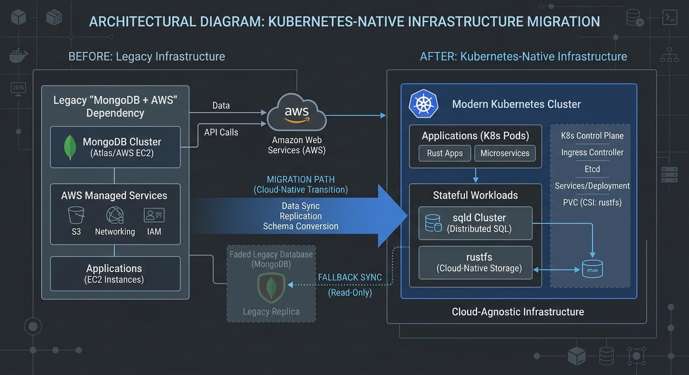
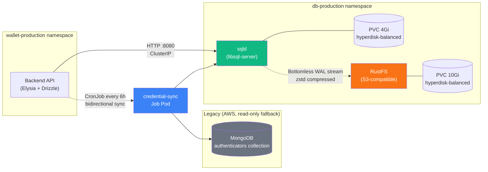
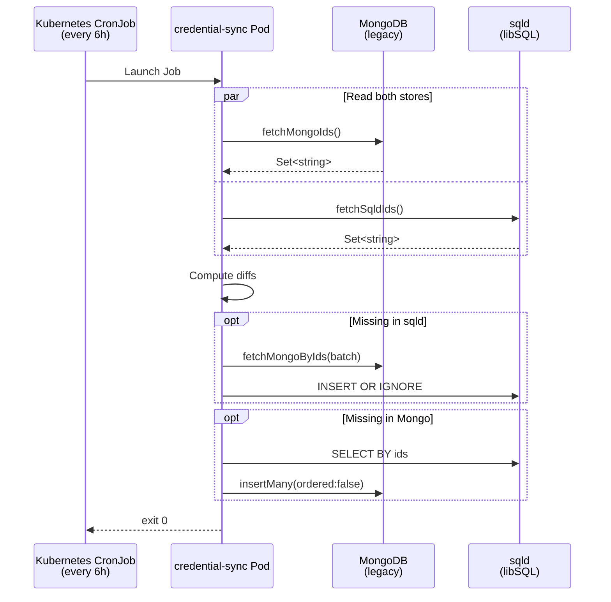

At Frak Labs, our infrastructure philosophy is uncompromising: keep it **Kubernetes-native**, keep the cloud lock-in to **zero**. Over the last few years we've rewritten our stack to make exactly that true — [infra-core](https://github.com/frak-id/infra-core) provisions everything from VPCs to ClickHouse via Pulumi, and we can, in theory, repoint the whole thing at a new cloud in an afternoon.

Yet one dependency stubbornly remained: a single MongoDB collection, hosted outside the cluster, storing our **WebAuthn authenticator credentials**. It was a relic — left over from a time when we mixed AWS-managed services with our own Kubernetes workloads. Everything else migrated cleanly to PostgreSQL on GKE. This one collection didn't, because "it worked."

In an environment that prizes **agility, portability, and unified tooling**, "it works" isn't enough. It needed to be native.

This article is the story of how we retired it — and the infrastructure we built to replace it: [sqld](https://github.com/tursodatabase/libsql) (the open-source core of [Turso](https://turso.tech)) and [RustFS](https://github.com/rustfs/rustfs), both running on our own Kubernetes cluster, glued together with Drizzle ORM and a safety net.

## The Constraint: One Table, Every Environment

The collection in question held something very specific: the WebAuthn authenticator public keys for every Frak wallet ever created. A single row looks like this in our new schema:

```typescript
// services/backend/src/domain/auth/db/schema.ts
import { integer, sqliteTable, text } from "drizzle-orm/sqlite-core";

/**
 * Authenticator credentials table for WebAuthn
 *  - Stored in sqld (libSQL) instead of MongoDB
 *  - Append-only: credentials are inserted once and never updated or deleted
 *  - Shared across all environments (origin-bound WebAuthn credentials)
 */
export const authenticatorsTable = sqliteTable("authenticators", {
    id: text("id").primaryKey(),
    smartWalletAddress: text("smart_wallet_address"),
    userAgent: text("user_agent").notNull(),
    publicKeyX: text("public_key_x").notNull(),
    publicKeyY: text("public_key_y").notNull(),
    credentialPublicKey: text("credential_public_key").notNull(),
    counter: integer("counter").notNull(),
    credentialDeviceType: text("credential_device_type").notNull(),
    credentialBackedUp: integer("credential_backed_up", {
        mode: "boolean",
    }).notNull(),
    transports: text("transports", { mode: "json" }).$type<string[]>(),
});
```

That last line in the comment — *"Shared across all environments"* — is the whole puzzle.

Every WebAuthn credential is bound to an `rpId` (relying party ID) set to our root domain (`frak.id`). By specification, a passkey created against `frak.id` must be resolvable from `frak.id`, regardless of which subdomain (or environment) the request comes from. On top of that, our **wallet addresses are deterministic**: they're derived from the authenticator's public key, so the same passkey must resolve to the same wallet address on both Arbitrum and Arbitrum Sepolia — in dev, staging, **and** production. The on-chain side of that derivation — how a WebAuthn signature validates an ERC-4337 user operation — is covered in [our earlier post on WebAuthn + ERC-4337](./4337-webauthn).

This rules out a per-environment database. We need a **single source of truth for credentials, shared across every stage**, with near-zero administrative overhead.

For four years, that source was MongoDB. Not for any document-store reason — just inertia.

## Why Not Just Keep MongoDB? (or: Just Use Postgres?)

Every time this migration came up, we heard two counter-arguments. Both are reasonable. Both turned out to be wrong for our case.

**"It works, why touch it?"** — Because every external dependency is a potential migration blocker. Our existing Kubernetes stack is provider-agnostic; swap Pulumi's `gcp` provider for `hcloud` and redeploy. MongoDB Atlas introduced a second control plane we had to think about during every disaster-recovery tabletop: extra IAM, extra network paths, extra egress costs, extra auth secrets. Pruning it was the last step to genuinely reaching "redeploy the whole company in an afternoon."

**"Just put it in your existing Postgres."** — Tempting. We already run Cloud SQL PostgreSQL for the 20+ tables backing the backend: `merchants`, `campaigns`, `attribution`, `rewards`, `pairing`, etc. Adding one more table is trivial. But the authenticators table has a very specific shape:

- **Append-only.** We never update or delete a row. Once written, a credential is immutable for the lifetime of the wallet.
- **Origin-bound, shared globally.** It can't live per-environment.
- **Read-heavy, tiny writes.** Every authentication flow does a single `SELECT BY id`.

This workload is, almost literally, the SQLite sweet spot. And libSQL + sqld gives us exactly that — SQLite semantics with an HTTP protocol, running as a normal Kubernetes service — without bolting another Postgres schema onto a database that has its own migration story to tell.

## Why libSQL + sqld, Not Raw SQLite?

SQLite is a file. A file that needs a process to serve it, a backup strategy, and a sane story for pods that might get rescheduled. [sqld](https://github.com/tursodatabase/libsql) — the server daemon for [libSQL](https://github.com/tursodatabase/libsql) (the SQLite fork that powers Turso) — solves all three:

1. **HTTP/WebSocket protocol.** Clients talk to it via plain HTTP, not a proprietary wire format. `@libsql/client` in Node is essentially a thin `fetch` wrapper — we can hit it from anywhere in the cluster.
2. **Bottomless replication.** sqld can stream WAL snapshots to any S3-compatible bucket, continuously, with zstd compression. Restore-from-scratch is as simple as pointing a fresh pod at the bucket.
3. **Concurrent write optimisations.** libSQL is a SQLite fork explicitly tuned for concurrent writes and high density — the exact problem that historically hurt vanilla SQLite in a server context.

Crucially for us, sqld is **small**. The container (`ghcr.io/tursodatabase/libsql-server:v0.24.31`) runs comfortably on **10m CPU and 64Mi of memory** requests. That's a fraction of what a managed MongoDB cluster costs — in dollars, or in operational complexity.

## Why RustFS for the Backup Target?

To get sqld's bottomless replication, we need something that speaks S3. The obvious choice used to be [MinIO](https://min.io/) — which we've used in other contexts — but its licensing has drifted, and the project's velocity has slowed. We went looking for alternatives.

We landed on [RustFS](https://github.com/rustfs/rustfs). Three reasons:

- **Memory safety & performance.** Written in Rust, it's designed for high-density S3-compatible storage with the concurrency model Rust makes easy to get right.
- **Apache 2.0 & community-driven.** A genuine open-source alternative, not a rug-pull waiting to happen.
- **Small footprint.** One binary, one volume. Perfect for "a Kubernetes Pod that exists so sqld can dump WAL frames to it."

It's **alpha** — we're running `rustfs/rustfs:1.0.0-alpha.90` — and we know it. That shaped our rollout strategy (more on that below).

## The Target Architecture

Before diving into the Pulumi code, here's the end state we built:



Three things to notice:

1. **Everything runs in our cluster.** The only thing outside is the old MongoDB instance, now relegated to a read/write fallback role.
2. **sqld → RustFS is a dotted line.** It's asynchronous WAL streaming, not a hard dependency. sqld serves reads and writes from its local PVC; RustFS is the durability backstop.
3. **The sync job is scheduled, not realtime.** We run it on a Kubernetes `CronJob` every 6 hours. Good enough for a collection that grows by a few rows per day.

## Deploying sqld on Kubernetes

`infra-core` is where the cluster primitives live. Adding sqld was a single file: [`infra/gcp/sqld.ts`](https://github.com/frak-id/infra-core). Here's the deployment (trimmed for brevity):

```typescript
// infra-core/infra/gcp/sqld.ts (excerpt — StorageClass + PVC elided)
export const sqldInstance = new KubernetesService("sqld", {
    namespace: dbNamespace.metadata.name,
    pod: {
        replicas: 1,
        strategy: { type: "Recreate" },
        terminationGracePeriodSeconds: 90,
        containers: [{
            name: "sqld",
            image: "ghcr.io/tursodatabase/libsql-server:v0.24.31",
            ports: [{ containerPort: 8080 }, { containerPort: 9090 }],
            env: [
                { name: "SQLD_NODE", value: "primary" },
                { name: "SQLD_DB_PATH", value: "/data" },
                { name: "SQLD_SOFT_HEAP_LIMIT_MB", value: "96" },
                { name: "SQLD_HARD_HEAP_LIMIT_MB", value: "128" },
                // Bottomless replication → RustFS
                { name: "SQLD_ENABLE_BOTTOMLESS_REPLICATION", value: "true" },
                {
                    name: "LIBSQL_BOTTOMLESS_ENDPOINT",
                    value: $interpolate`http://rustfs-${normalizedStageName}-service.${dbNamespace.metadata.name}:9000`,
                },
                { name: "LIBSQL_BOTTOMLESS_BUCKET", value: "sqld-bottomless" },
                { name: "LIBSQL_BOTTOMLESS_COMPRESSION", value: "zstd" },
                // ... plus AWS-style key/secret refs pointing at rustfs-credentials
            ],
            resources: {
                requests: { cpu: "10m", memory: "64Mi" },
                limits: { cpu: "200m", memory: "256Mi" },
            },
        }],
    },
    // Prometheus scrapes port 9090 for sqld metrics
    serviceMonitor: { port: "admin", path: "/metrics", interval: "30s" },
});
```

A handful of details earn their line in that file:

- **`replicas: 1`, `strategy: Recreate`.** sqld is a SQLite-backed primary. There is no "rolling update" for a stateful single-writer. We stop the old pod, wait for the PVC to detach, start the new one.
- **`terminationGracePeriodSeconds: 90`.** Enough time for sqld to flush its WAL and gracefully close connections. The 60-second `SQLD_SHUTDOWN_TIMEOUT` matches.
- **`SQLD_SOFT_HEAP_LIMIT_MB: 96` / `HARD: 128`.** Paired with the container's 256Mi memory limit, this gives sqld predictable headroom and prevents OOMKill under load.
- **The PVC uses `reclaimPolicy: Retain` (elided from the excerpt above).** Deleting it doesn't nuke the underlying disk — a panicked `kubectl delete` won't lose our credentials.
- **`ServiceMonitor`.** Drops directly into our existing Prometheus/Grafana stack (see [our previous infra-iac post](./frak-infrastructure-iac)), so sqld's health is visible alongside every other service from day one.

Notice the bottomless replication block. Three environment variables and a Kubernetes Secret reference, and sqld is continuously streaming WAL frames to RustFS, zstd-compressed. There's no second sidecar, no external backup tool, no cron job dumping `.sqlite` files to a bucket. It's just part of the process.

## Deploying RustFS

RustFS is even simpler — it's a single binary that speaks S3. The [`infra/gcp/rustfs.ts`](https://github.com/frak-id/infra-core) file handles credentials, storage, and the service in ~180 lines. The interesting bits:

```typescript
// infra-core/infra/gcp/rustfs.ts (excerpt)
import * as random from "@pulumi/random";

// --- Credentials ---
// Generated once per stage, pushed to both GCP Secret Manager
// and a Kubernetes Secret so sqld can mount them.
const rustfsAccessKey = new random.RandomPassword("rustfs-access-key", {
    length: 24, special: false,
});
const rustfsSecretKey = new random.RandomPassword("rustfs-secret-key", {
    length: 48, special: false,
});

export const rustfsCredentials = new kubernetes.core.v1.Secret(
    "rustfs-credentials",
    {
        metadata: { name: `rustfs-credentials-${normalizedStageName}` },
        type: "Opaque",
        stringData: {
            "access-key": rustfsAccessKey.result,
            "secret-key": rustfsSecretKey.result,
        },
    }
);

// --- Service ---
export const rustfsInstance = new KubernetesService("rustfs", {
    pod: {
        replicas: 1,
        strategy: { type: "Recreate" },
        containers: [{
            name: "rustfs",
            image: "rustfs/rustfs:1.0.0-alpha.90",
            ports: [{ containerPort: 9000 }],
            env: [
                { name: "RUSTFS_ACCESS_KEY", valueFrom: { /* from rustfsCredentials */ } },
                { name: "RUSTFS_SECRET_KEY", valueFrom: { /* from rustfsCredentials */ } },
                { name: "RUSTFS_VOLUMES", value: "/data" },
                { name: "RUSTFS_ADDRESS", value: "0.0.0.0:9000" },
                { name: "RUSTFS_REGION", value: "europe-west1" },
            ],
        }],
    },
});
```

**Credentials are generated in TypeScript and mirrored to both GCP Secret Manager and a Kubernetes Secret.** The first gives us a break-glass recovery path (we can read them back via the GCP console if the cluster is gone); the second is what sqld actually mounts to authenticate to RustFS. They're the same 24- and 48-character random strings — generated once, stored twice.

Both files are wired into `sst.config.ts` behind a production-only guard, so a single `bun sst deploy --stage gcp-production` brings up the pair, mounts their secrets, provisions their PVCs, and registers them with Prometheus.

## The Backend Side: a 40-line Drizzle Client

With sqld running, the backend needs to talk to it. Because it lives inside the cluster and is only reachable via an internal ClusterIP, the "connection string" is just a DNS name — `http://sqld-production-service.db-production.svc.cluster.local:8080`. No auth token, no TLS dance, no peering config. That single line replaces an entire MongoDB Atlas connection-string-plus-IAM-role-plus-peering-config flow. The full backend client is 40 lines of Drizzle:

```typescript
// wallet/services/backend/src/infrastructure/persistence/libsql.ts
import { type Client, createClient } from "@libsql/client";
import { drizzle, type LibSQLDatabase } from "drizzle-orm/libsql";
import * as authSchema from "../../domain/auth/db/schema";

let cachedDb: LibSQLDatabase<typeof authSchema> | undefined;
let cachedClient: Client | undefined;

/**
 * Get the libsql drizzle database instance
 *  - Connects to the sqld server via HTTP
 *  - No auth token required (same K8s cluster)
 *  - Lazy init on first call, cached for subsequent calls
 */
export function getLibsqlDb(): LibSQLDatabase<typeof authSchema> {
    if (cachedDb) return cachedDb;

    const client = createClient({ url: process.env.LIBSQL_URL as string });
    cachedClient = client;
    cachedDb = drizzle(client, { schema: authSchema });
    return cachedDb;
}
```

And the repository — the thing that actually runs in the auth flow — is pure Drizzle. No ORM plumbing, no document-to-domain mapping gymnastics:

```typescript
// wallet/services/backend/src/domain/auth/repositories/AuthenticatorRepository.ts
import { getLibsqlDb } from "@backend-infrastructure";
import { eq } from "drizzle-orm";
import { authenticatorsTable } from "../db/schema";

export class AuthenticatorRepository {
    public async getByCredentialId(credentialId: string) {
        const db = getLibsqlDb();
        const [row] = await db
            .select()
            .from(authenticatorsTable)
            .where(eq(authenticatorsTable.id, credentialId));
        return row ?? null;
    }

    public async createAuthenticator(authenticator: AuthenticatorDocument) {
        const existing = await this.getByCredentialId(authenticator._id);
        if (existing) throw new Error("Credential already exists");

        const db = getLibsqlDb();
        await db.insert(authenticatorsTable).values({ /* ... */ });
    }
}
```

The wins here aren't philosophical — they're concrete:

- **Zero `mongodb` dependencies in the backend.** A grep of `services/backend/package.json` now returns nothing for `mongo`. That's ~800KB of driver code, its BSON codec, its connection pool, and its DNS/TLS machinery gone from our production image.
- **Type-safe schemas.** The Drizzle schema *is* the type. `row.publicKeyX` is `string`, full stop. No `z.infer`, no manual mapping.
- **Noticeably faster hot path.** Authentication flows used to do a Mongo round-trip across the AWS/GCP boundary. They now do a single in-cluster HTTP call. We haven't published formal benchmarks yet, but the tail latencies visible in our Grafana dashboards dropped markedly the day we flipped the switch.

## Pragmatic Safety: A Bidirectional Sync Service

This is the piece the first draft of this post got wrong. We called this a "directional sync service." It isn't.

Migrating live credential data is **the scariest kind of migration** — if a row is missing, a user's wallet is simply unrecoverable. So we built a proper safety net and wrote the code that enforces it: [`services/credential-sync`](https://github.com/frak-id/wallet) is explicitly, deliberately **bidirectional**. New credentials written to sqld are backfilled to Mongo. Legacy credentials still in Mongo are replicated into sqld. As long as this job runs, both stores converge to the same set of rows.

The job's own `package.json` spells it out — its `description` field reads *"Bidirectional MongoDB to sqld credential sync service"*, and it pulls in both `@libsql/client` and `mongodb` as runtime dependencies. The core logic is ~100 lines: it reads the id sets from both stores, computes the missing rows on each side, and batches inserts in both directions:

```typescript
// wallet/services/credential-sync/src/sync.ts
export async function runBidirectionalSync(): Promise<{
    mongoToSqld: number;
    sqldToMongo: number;
}> {
    const [mongoIds, sqldIds] = await Promise.all([
        fetchMongoIds(),
        fetchSqldIds(),
    ]);

    console.log(
        `[credential-sync] Found ${mongoIds.size} in MongoDB, ${sqldIds.size} in sqld`
    );

    const toSqld = await syncMongoToSqld(mongoIds, sqldIds);
    const toMongo = await syncSqldToMongo(mongoIds, sqldIds);

    return { mongoToSqld: toSqld, sqldToMongo: toMongo };
}

async function syncMongoToSqld(
    mongoIds: Set<string>,
    sqldIds: Set<string>
): Promise<number> {
    const missingInSqld = [...mongoIds].filter((id) => !sqldIds.has(id));
    if (missingInSqld.length === 0) return 0;

    let inserted = 0;
    for (const batch of chunk(missingInSqld, BATCH_SIZE)) {
        const docs = await fetchMongoByIds(batch);
        const rows = docs.map(mongoToSqld);
        inserted += await insertIntoSqld(rows);
    }
    return inserted;
}
```

Two details matter:

- **`INSERT OR IGNORE` on the sqld side** (`onConflictDoNothing`) and **`ordered: false`** on the Mongo side. Both are dedupe-friendly: if the job runs while another pod is concurrently writing, duplicate-key errors are swallowed silently and the job still converges.
- **Binary public keys are base64-encoded during conversion.** Mongo stores them as BSON `Binary`; sqld stores them as text. One helper function handles the marshalling in both directions.

And it runs on a plain old Kubernetes `CronJob` — nothing exotic:

```typescript
// wallet/infra/gcp/credential-sync.ts (excerpt)
new kubernetes.batch.v1.CronJob("credential-sync-cronjob", {
    spec: {
        schedule: "0 */6 * * *",       // every 6 hours
        concurrencyPolicy: "Forbid",   // never run two at once
        jobTemplate: { /* pod template: image, envFrom mongo+sqld secrets, 50m CPU / 128Mi */ },
    },
});
```

Every six hours: read both stores, diff, reconcile, exit. If the reconciler falls over, the next scheduled run picks up where it left off. If sqld or RustFS does something surprising during this alpha period, we still have Mongo as a hot replica — a single config flip in the backend would put us back on it.



This is the core insight of the whole migration: **you don't cut the cord, you let the old thing become the safety net.** We're running a genuinely new architecture in an "alpha-first" mode, but with a fallback that's battle-tested. Six months from now, once sqld + RustFS have proven themselves over a full year of production load and a handful of incident drills, we'll delete the CronJob, archive the Mongo snapshot, and be done.

## What We Got

Counting the wins after a few weeks of both stores running in parallel:

### Infrastructure

- **Zero MongoDB dependencies in the main backend.** The driver, its BSON codec, and its connection pool machinery are gone — roughly 800KB shaved off the production image, and one fewer thing to patch on CVE Tuesday.
- **One cluster, one control plane.** Every stateful workload — Postgres on Cloud SQL, Redis pods, sqld, RustFS — now sits inside the same Pulumi stack. `bun sst deploy` is the only deployment command.
- **Full Prometheus/Grafana integration for free.** sqld exposes metrics on its admin port (9090), the `ServiceMonitor` picks them up automatically, and the same dashboards we use for every other service now show WAL frame rate and checkpoint latency.
- **Retain-on-delete PVCs + bottomless replication.** Two independent layers of durability, both living in the cluster, neither depending on a managed AWS service.

### Developer experience

- **Schema changes are TypeScript.** A new column is a PR against `schema.ts`, a `drizzle-kit generate`, and a migration file. No Atlas UI, no `mongosh`, no schema-less footguns.
- **Local dev just works.** `sst dev` still replaces the whole backend with a local watch process; the backend connects to the production sqld over the bastion tunnel if needed, or to a local sqld for offline work.
- **Type-safe queries end-to-end.** `db.select().from(authenticatorsTable).where(eq(...))` is fully typed, and a schema mistake fails TypeScript compilation before it ever hits a pod.

### Operational complexity

- **One less vendor.** One less dashboard. One less invoice. One less IAM boundary.
- **Migrations are just code.** Which means they're code-reviewed, PR'd, and version-controlled — same as everything else.

## What We're Watching

This is an alpha rollout, and we're explicit about the caveats:

1. **sqld runs as a single replica.** libSQL has clustering/replication (Turso's hosted product uses it), but we haven't needed it for a workload that writes a handful of rows per day. If the write volume ever justifies it, we'll swap in the replica model.
2. **RustFS is pre-1.0.** We're on `1.0.0-alpha.90`. Our data durability story leans on two things: the bottomless zstd stream to RustFS **and** the continued existence of the MongoDB fallback. We're not ready to trust RustFS alone yet, and the bidirectional sync is exactly how we make that bet safely.
3. **No cross-region replication — yet.** The whole stack lives in `europe-west1`. For credentials, that matches our current regulatory footprint. If that changes, libSQL's replica model is the most likely answer.
4. **Backup restore drills are scheduled, not automated.** We haven't yet wired up automatic "spin up a fresh sqld from the RustFS bucket and diff it against production" tests. That's on the backlog.

None of these are blockers. All of them are known. The alternative — leaving an AWS-hosted MongoDB in the critical path for another year — was a worse set of trade-offs.

## Taking Stock

Four years ago, Frak's infra was a classic AWS-serverless stack — Lambdas, DynamoDB, CloudFormation, and a MongoDB cluster for the things Dynamo couldn't model. Today, every single one of those has been replaced with something that runs on a Kubernetes cluster we control, defined in TypeScript, in a mono-repo we can read end-to-end in an afternoon.

The MongoDB → sqld migration is a small piece of that story in terms of LOC — a new file in `infra-core`, a new service in the wallet monorepo, a 22-line Drizzle schema. But it's the piece that made the *whole* story true. Until this month, "we can migrate to Hetzner in an afternoon" had an asterisk. Now it doesn't.

For the rest of that journey: [the SST + Pulumi IaC deep-dive](./frak-infrastructure-iac) walks through the Kubernetes foundation everything in this post sits on top of, and [our eRPC + Ponder post](./cost-effective-infra) covers how we kept RPC costs sane across multiple chains without sacrificing reliability.

That's the real win: **no asterisks**.

---

**Explore the code:**

- [infra-core](https://github.com/frak-id/infra-core) — sqld, RustFS, the whole Kubernetes stack
- [wallet](https://github.com/frak-id/wallet) — the backend + credential-sync service

**Related posts:**

- [Building Frak's Infrastructure with SST + Pulumi](./frak-infrastructure-iac) — the Kubernetes foundation this migration sits on top of
- [Cost-Effective Blockchain Infrastructure with eRPC and Ponder](./cost-effective-infra) — how we got RPC costs under control across multiple chains
- [WebAuthN Meets ERC-4337](./4337-webauthn) — how the credentials stored in this table validate user operations on-chain

**Further reading:**

- [libSQL on GitHub](https://github.com/tursodatabase/libsql) — the SQLite fork powering Turso and sqld
- [Turso](https://turso.tech) — the hosted product; we run the open-source core ourselves
- [RustFS](https://github.com/rustfs/rustfs) — Apache 2.0, Rust, S3-compatible storage
- [Drizzle ORM](https://github.com/drizzle-team/drizzle-orm) — the type-safe ORM we use for every TypeScript database interaction
- [sqld bottomless replication docs](https://github.com/tursodatabase/libsql/blob/main/docs/BOTTOMLESS.md) — how the WAL streaming to S3 actually works
