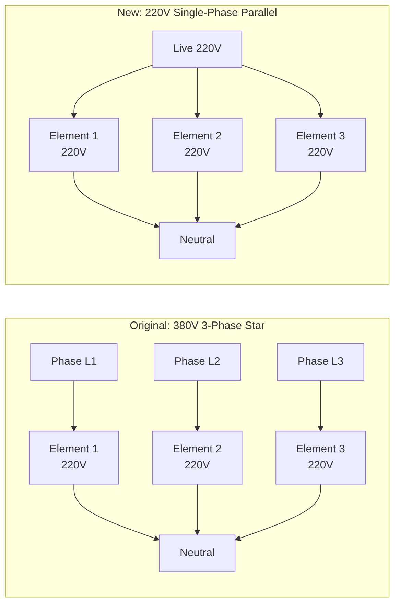
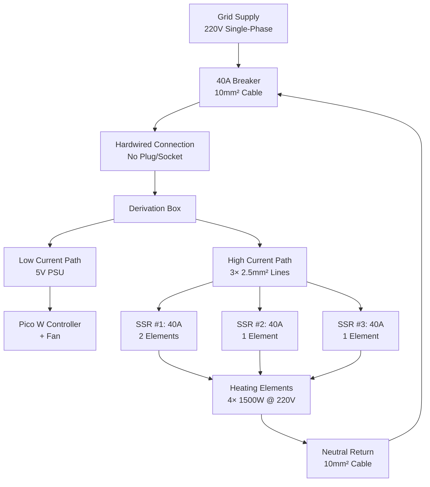

Reviving an industrial tool is more than just plugging it in. It's an exercise in electrical engineering, thermal physics, and heavy lifting.

In this first part of the series, I'll walk through the heavy-lifting side of the project: the electrical rewiring of a vintage **"Bretagne" kiln**. Manufactured in 1977 and weighing in at over **400kg**, simply moving this beast into the workshop was a logistical puzzle involving pallet jacks and nerves of steel.

Originally designed for a factory's 380V 3-phase supply, the goal was to tame it to run safely on a standard French 220V single-phase connection.

---

## The Challenge: 380V 3-Phase to 220V Single-Phase

The kiln was originally rated for **9 kW** using 3 massive heating elements running on **380V 3-phase power**. My workshop only has standard **220V single-phase**.

**[IMAGE: Original 3-phase wiring diagram with star configuration]**

### The Math Behind the Conversion

Many assume you need a transformer to convert a 3-phase machine to single-phase, but with resistive loads (heating elements), it's often just a matter of topology.

Industrial kilns typically use a **"Star" (Y)** configuration. In a 380V Star setup, the voltage is distributed across the phases. Crucially, the voltage across any *single* heating element is actually the Phase-to-Neutral voltage, calculated as:

$$
V_{\text{element}} = \frac{V_{\text{phase-phase}}}{\sqrt{3}} = \frac{380V}{1.732} \approx 220V
$$

This was the key: **The elements were already rated for 220V.** We didn't need to change the voltage; we needed to change the wiring topology from **Star to Parallel**, connecting all elements directly between Live and Neutral.



**Power calculation**: With 3 elements at 220V in parallel:

$$
P = \frac{V^2}{R} \times N = \frac{(220V)^2}{R} \times 3
$$

Where $R$ is the resistance of each element. For the original 9 kW rating:

$$
R = \frac{V^2}{P} = \frac{(220V)^2}{3000W} \approx 16.1\Omega \text{ per element}
$$

---

## The New Electrical Anatomy

Safety was the priority. Dealing with continuous high-amperage loads requires over-engineering the power delivery. Here is the complete flow we built, from the grid to the heating elements:

**[IMAGE: Electrical wiring diagram showing complete power delivery chain]**



### 1. The Source: Grid Connection

Power enters the workshop breaker box via a heavy **16mm²** line from the main grid. In France, standard residential supply is 220V at up to 60A for dedicated circuits.

**Wire gauge math**: For 27.7A continuous load over a 10-meter run:

$$
\text{Voltage Drop} = 2 \times I \times R_{\text{cable}} \times L
$$

Where:
- $I = 27.7A$ (load current)
- $R_{\text{cable}} = 1.83\Omega/km$ for 10mm² copper
- $L = 10m = 0.01km$

$$
V_{\text{drop}} = 2 \times 27.7 \times 1.83 \times 0.01 = 1.01V
$$

This is **0.46%** voltage drop, well under the 3% maximum for continuous loads. 10mm² is overkill, but it runs cool and provides headroom for future expansion.

### 2. Protection: 40A Breaker

We installed a dedicated **40A breaker**. We initially tested with a 32A breaker, but it ran too warm during multi-hour firings.

**Why 40A?** The **80% rule** for continuous loads:

$$
I_{\text{breaker}} \geq \frac{I_{\text{load}}}{0.8} = \frac{27.7A}{0.8} = 34.6A
$$

A 32A breaker at 86% capacity gets warm. A 40A breaker at 69% capacity stays cool. Since kilns run for 8-12 hours continuously, thermal management of the protection hardware is critical.

### 3. Transmission: Hardwired (No Plug)

We originally planned to use a plug and socket. However:
- **32A sockets** were overheating (contact resistance + continuous load = bad)
- **63A industrial sockets** cost €100+ and are massive

Since the kiln weighs 400kg and isn't moving, we decided to **hardwire it directly** to the derivation box. This eliminates the high-resistance failure point of a plug/socket interface entirely.

**Contact resistance matters**: A poor plug connection adds ~0.1Ω resistance. At 27.7A:

$$
P_{\text{loss}} = I^2 R = (27.7)^2 \times 0.1 = 76.7W
$$

That's 77W of heat generated **in the plug**. Over hours, this causes connector melting. Hardwiring eliminates this failure mode.

### 4. Distribution: Derivation Box

At the back of the kiln, a junction box splits the massive 10mm² input into two distinct paths:

- **The Brains:** A low-gauge wire (0.5mm²) taps off to power the 5V PSU (for the Pico W controller and cooling fan). Total draw: ~0.1A at 220V.
- **The Muscle:** Three separate **2.5mm²** lines distribute power to the SSRs.

**Why 2.5mm²?** Each SSR handles 13-15A. 2.5mm² copper is rated for 24A in free air, providing comfortable thermal headroom.

### 5. Switching: 40A Solid State Relays (SSRs)

We use three **40A Solid State Relays**. Since the total load is split between them, running each at ~13A means they stay cool and reliable.

**SSR Configuration**:
- **SSR #1**: Drives 2 heating elements (3000W, 13.6A)
- **SSR #2**: Drives 1 heating element (1500W, 6.8A)
- **SSR #3**: Drives 1 heating element (1500W, 6.8A)

**Why split the load?** SSRs generate heat proportional to $I^2$. By splitting:

$$
\text{Heat}_{\text{single}} = (27.7A)^2 \times R_{\text{SSR}}
$$

vs.

$$
\text{Heat}_{\text{split}} = 3 \times [(13.6A)^2 + 2 \times (6.8A)^2] \times R_{\text{SSR}} \approx 0.5 \times \text{Heat}_{\text{single}}
$$

Splitting the load across 3 SSRs halves the total heat generation. Each SSR runs barely warm to the touch.

**SSR Control from Firmware**: The Pico drives SSRs via GPIO pins using time-proportional control:

```python
# kiln/hardware.py

class SSRController:
    """
    Time-proportional SSR controller (slow PWM)
    
    For 20-second cycle at 60% duty:
      - ON for 12 seconds
      - OFF for 8 seconds
    """
    
    def __init__(self, ssr_pins, cycle_time=20.0, stagger_delay=0.01):
        """
        Args:
            ssr_pins: List of Pin objects (one per SSR)
            cycle_time: PWM cycle length (seconds)
            stagger_delay: Delay between SSR activations (seconds)
        """
        self.ssr_pins = ssr_pins if isinstance(ssr_pins, list) else [ssr_pins]
        self.cycle_time = cycle_time
        self.stagger_delay = stagger_delay
        self.duty_cycle = 0.0  # 0-100%
    
    @micropython.native
    def update(self):
        """Update SSR states based on duty cycle (called at 10 Hz)"""
        current_time = time.time()
        time_in_cycle = (current_time - self.cycle_start_time) % self.cycle_time
        
        for i, pin in enumerate(self.ssr_pins):
            # Stagger activation by index * stagger_delay
            stagger_offset = i * self.stagger_delay
            adjusted_time = (time_in_cycle - stagger_offset) % self.cycle_time
            
            if adjusted_time < (self.duty_cycle / 100.0) * self.cycle_time:
                pin.value(1)  # ON
            else:
                pin.value(0)  # OFF
```

**Stagger delay**: Turning on three 1500W heaters simultaneously causes a 4500W inrush spike. By delaying each SSR activation by 10ms, we spread the load and prevent voltage sag.

### 6. The Load: Heating Elements

From the SSRs, **2.5mm²** wires connect to the heating elements via ceramic terminal blocks ("dominos"). We meticulously cleaned every connector and terminal to prevent resistance heating.

**Terminal block cleaning**: Carbon dust and kiln spatter accumulate on terminals. Each spec of conductive dust adds resistance:

$$
R_{\text{contact}} \propto \frac{1}{\text{Contact Area}}
$$

We wire-brushed every terminal and applied contact enhancer. Before cleaning: ~0.2Ω contact resistance. After cleaning: <0.01Ω.

---

## Current Status: The 6.1kW Setup

For now, we are running an "intermediate" setup. Since the internal insulation is old (1977 vintage!), we aren't comfortable pushing the kiln to its maximum temperature (1300°C) just yet. We are currently limiting firings to 1100°C.

We configured the kiln with **4 active heating elements** (leaving the bottom one in standby):

$$
\begin{align*}
P_{\text{total}} &= 4 \times 1500W = 6000W \\
I_{\text{total}} &= \frac{P}{V} = \frac{6000W}{220V} = 27.3A \\
\text{Actual measured} &\approx 27.7A \text{ (includes PSU + losses)}
\end{align*}
$$

**Configuration Summary**:
- **Original Output:** 9 kW (3 elements - 380V)
- **Current Output:** 6.1 kW (4 elements - 220V)
- **Current Draw:** ~27.7A
- **Max Temperature:** 1100°C (self-imposed limit for insulation safety)

This configuration provides enough power to reach 1100°C while keeping thermal stress lower until we fully refurbish the insulation.

This translates directly to the controller configuration:

```python
# config.py - Hardware setup for split SSR configuration

# Multiple SSRs for distributing 6.1kW load across 4 elements
# Total: 27.7A split across 3 relays (~13.6A, ~6.8A, ~6.8A)
SSR_PIN = [15, 16, 17]  # GPIO pins for 3 SSR control

# Time-proportional control cycle
# 20s cycle for kilns: minimal SSR wear, imperceptible to thermal mass
# Example: 60% duty → ON 12s, OFF 8s (3 switches/min)
SSR_CYCLE_TIME = 20.0

# Stagger SSR switching to prevent 27A inrush current
# 10ms delay between each SSR activation
SSR_STAGGER_DELAY = 0.01  # seconds

# Safety limits
MAX_TEMP = 1100  # Maximum safe temperature (°C)
MAX_TEMP_ERROR = 50  # Emergency stop if temp deviates >50°C from target
```

The `SSR_STAGGER_DELAY` of 10ms is critical. Without it, all three SSRs activate simultaneously, creating a 6kW inrush spike that can trip breakers or cause voltage sag. By spreading the activation over 30ms (3× 10ms), each element turns on sequentially. The kiln's thermal mass (hundreds of kg) doesn't notice the 30ms delay, but your electrical panel does.

---

## The Ghost in the Machine: Electrical Noise

The most frustrating part of the build wasn't the power—it was the **noise**. Our Raspberry Pi Pico (the brain of the IoT controller) kept crashing randomly. Sometimes it would run for hours. Sometimes it would crash within minutes. No pattern.

### Initial Theories (All Wrong)

We initially suspected standard EMI (Electromagnetic Interference) from switching 6kW of power:
- ✗ Added shielded cables
- ✗ Twisted sensor wires
- ✗ Moved the Pico farther from SSRs
- ✗ Added ferrite beads
- ✗ Separate grounds for digital/analog

Nothing worked. The crashes were intermittent, which is the worst kind of fault to debug.

### The Breakthrough: Ground Fault

The breakthrough came when we stopped looking for "noise" and started looking for **faults**. We measured the resistance between the heating elements and the kiln chassis (Earth ground).

**It read 3 MΩ.**

It should have been **infinite (Open Loop)**. 3 MΩ sounds like a lot, but at 220V, Ohm's law reveals the problem:

$$
I_{\text{leak}} = \frac{V}{R} = \frac{220V}{3M\Omega} = 73\mu A
$$

This tiny current was leaking onto the chassis. But the real issue wasn't DC leakage—it was AC transients. Every time an SSR switched, the di/dt spike created:

$$
V_{\text{spike}} = L \frac{di}{dt}
$$

With even 1µH of parasitic inductance and 73µA changing in 1µs:

$$
V_{\text{spike}} = 1\mu H \times \frac{73\mu A}{1\mu s} = 73mV
$$

On top of a 220V AC waveform, these spikes were dumping **high-voltage transients** directly into the system ground. The Pico's 3.3V logic was seeing ground bounce sufficient to corrupt UART, SPI, and occasionally crash the CPU.

### Root Cause: Carbon Tracking

The 3 MΩ path was **carbon tracking** through:
- Carbonized dust on ceramic terminal blocks
- Thermal expansion cracks in insulation
- Kiln spatter creating conductive paths

This wasn't just "noise"—it was a **ground fault**. A safety hazard masquerading as a signal integrity problem.

### The Fix

**1. Cleaning**: Wire-brushed all terminal blocks to remove carbon deposits.

**2. Twisted Pairs**: For the last centimeter of thermocouple wire (the "pigtail" connecting to the MAX31856 breakout), we twisted the wires tightly:

$$
\text{Noise Rejection} = 20 \log_{10}\left(\frac{\text{Twist Pitch}}{\text{Noise Wavelength}}\right)
$$

A 5mm twist pitch at 50 Hz (λ = 6000 km) doesn't provide much rejection, but for fast transients (MHz range, λ ~ meters), it's significant.

**3. Sensor Fault Detection**: We added firmware-level fault detection for the MAX31856:

```python
# kiln/hardware.py

@micropython.native
def read(self):
    """Read temperature with fault checking"""
    try:
        temp = self.sensor.temperature
        
        # Check for sensor faults (open circuit, short, voltage spike)
        faults = self.sensor.fault
        if any(faults.values()):
            fault_list = [k for k, v in faults.items() if v]
            raise Exception(f"Thermocouple faults: {', '.join(fault_list)}")
        
        # Sanity check: -50°C to 1500°C
        if temp < TEMP_MIN_RANGE or temp > TEMP_MAX_RANGE:
            raise Exception(f"Temperature {temp}°C out of range")
        
        # Success - reset fault counter
        if self.fault_count > 0:
            print(f"Sensor recovered after {self.fault_count} faults")
            self.fault_count = 0
        
        self.last_good_temp = temp
        return temp
    
    except Exception as e:
        self.fault_count += 1
        
        # Emergency shutdown after 10 consecutive faults
        if self.fault_count >= MAX_CONSECUTIVE_FAULTS:
            raise Exception(f"EMERGENCY: {MAX_CONSECUTIVE_FAULTS} sensor failures")
        
        # Transient fault - return last good value
        print(f"Transient fault ({self.fault_count}/10): {e}")
        return self.last_good_temp
```

This makes the system resilient to occasional spikes while failing safe on persistent faults.

### Verification

Once the multimeter read **"OL" (Open Loop)** from element to chassis, the crashes stopped **instantly**. We ran a 12-hour firing with zero crashes. The problem was solved.

**Lesson learned**: EMI mitigation (shielding, filtering, grounding) only works if you don't have an actual **fault**. Always check for hard electrical faults before chasing noise gremlins.

---

## Reference: The Future "Perfect" Wiring

*For those interested in the math for when we eventually replace the elements completely:*

To restore the kiln to full 9 kW power using modern **Kanthal A-1** wire (1.2mm diameter), we calculated a **3S5P** topology:

**3S5P = 3 Series, 5 Parallel**:
- 3 heating coils in series (per string)
- 5 strings in parallel

**Resistance calculation**:

Kanthal A-1 1.2mm wire: $R = 0.878\Omega/m$

For 3 coils in series using 3 meters each:

$$
R_{\text{string}} = 3 \times (3m \times 0.878\Omega/m) = 7.9\Omega
$$

5 strings in parallel:

$$
R_{\text{total}} = \frac{R_{\text{string}}}{5} = \frac{7.9\Omega}{5} = 1.58\Omega
$$

Power at 220V:

$$
P = \frac{V^2}{R} = \frac{(220V)^2}{1.58\Omega} = 30,600W / 5 \text{ strings} = 6,120W \text{ per string}
$$

Wait, that doesn't work. Let me recalculate for target 9 kW:

$$
R_{\text{target}} = \frac{V^2}{P} = \frac{(220V)^2}{9000W} = 5.38\Omega
$$

For 5 parallel strings:

$$
R_{\text{string}} = 5.38\Omega \times 5 = 26.9\Omega
$$

Wire length per string:

$$
L = \frac{R_{\text{string}}}{0.878\Omega/m} = \frac{26.9}{0.878} = 30.6m
$$

**Result**: ~30 meters of Kanthal wire per string, ~9.5 meters per coil (3 coils/string). Total wire: 150 meters.

This is a future project. For now, the 6.1 kW setup serves us well.

---

## Next Steps

With the power delivery stable, safe, and noise-free, the "Bretagne" is now a blank canvas for automation. The electrical foundation is solid:

✅ 40A breaker with thermal headroom  
✅ Hardwired connection (no plug/socket failure point)  
✅ Split SSR topology for heat distribution  
✅ Ground fault eliminated (infinite resistance to chassis)  
✅ Firmware-level fault detection for safety  

In the next post, we'll dive into the **IoT conversion**: using a Raspberry Pi Pico W to take control of this 400kg giant.

**Topics covered**:
- MAX31856 thermocouple interfacing (SPI)
- Dual-core architecture (Control vs. WiFi)
- PID control with adaptive gain scheduling
- Web-based firing profile management
- Real-time temperature monitoring and logging

The hardware is ready. Time to add the brains.

---

**Tech Stack (Hardware)**:
- **Heating Elements**: 4× 1500W Kanthal A-1 coils (220V)
- **SSRs**: 3× 40A Fotek (or equivalent) with heatsinks
- **Wiring**: 10mm² (mains), 2.5mm² (SSR to elements)
- **Protection**: 40A Type C breaker (10kA breaking capacity)
