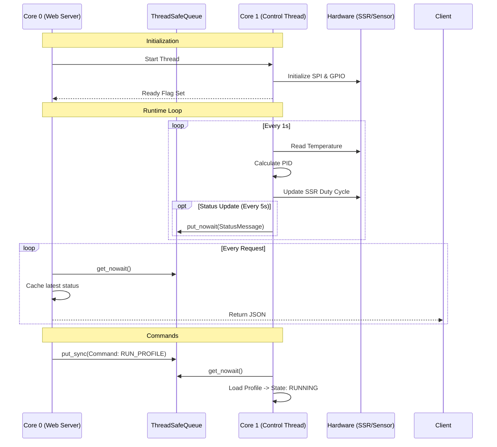

The `pico-kiln` firmware converts a $6 Raspberry Pi Pico W into an industrial-grade kiln controller. Unlike hobbyist Arduino loops that mix WiFi handling with pin toggling, this project leverages the RP2040's dual-core architecture to strictly separate **Control** (Real-Time) from **Connectivity** (Best-Effort).

This article dissects the control theory, thread synchronization patterns, and state machine logic that powers the kiln.

## Dual-Core Architecture

The RP2040 offers two ARM Cortex-M0+ cores. We exploit this to prevent network latency from affecting thermal stability.

*   **Core 0 (Connectivity):** Runs the `asyncio` web server (`Microdot`), handles WiFi negotiation, serves the React frontend, and manages the filesystem (logs/profiles). This core is "noisy" in terms of timing jitter.
*   **Core 1 (Control):** Runs a dedicated, infinite control loop. It owns the hardware pins (MAX31856 SPI, SSR GPIO). It executes the PID algorithm at a strict 1Hz frequency and the SSR PWM at 10Hz.

Communication between cores happens exclusively via custom `ThreadSafeQueue` instances, ensuring no race conditions on shared state.



## PID Controller Implementation

The controller implements a **Velocity Form** PID algorithm. Unlike the standard "Positional" form ($u(t) = K_p e(t) + K_i \int e(t) dt + K_d \frac{de}{dt}$), the velocity form computes the *change* in output, then integrates it. However, for clarity and anti-windup robustness in this specific implementation, we use a modified positional form with strict integral clamping.

### The Math

The core update logic in `kiln/pid.py`:

$$
u(t) = \underbrace{K_p e(t)}_{\text{Proportional}} + \underbrace{K_i \sum_{0}^{t} e(\tau) \Delta t}_{\text{Integral}} + \underbrace{K_d \frac{e(t) - e(t-1)}{\Delta t}}_{\text{Derivative}}
$$

Crucially, **Anti-Windup** is implemented by clamping the integral term dynamically based on the output limits. If the system is saturated (SSR at 100%), accumulating more integral error is pointless and dangerous (overshoot).

```python
# kiln/pid.py

# Integral term with anti-windup
self.integral += error * dt

# Map output limits to integral limits based on Ki
if self.ki != 0:
    integral_max = self.output_limits[1] / abs(self.ki)
    integral_min = self.output_limits[0] / abs(self.ki)
    self.integral = max(min(self.integral, integral_max), integral_min)
```

## Adaptive Gain Scheduling

Kilns are non-linear systems. At $1000^\circ\text{C}$, heat loss via radiation is massive (Stefan-Boltzmann law: $P \propto T^4$). A PID tuned for $200^\circ\text{C}$ will be sluggish and unable to maintain temperature at cone 6 ($1222^\circ\text{C}$).

To solve this without complex gain tables, we use a physics-based **Adaptive Gain Scheduling** formula. We scale the PID gains linearly with the temperature delta above ambient.

$$
\text{Scale} = 1 + h \cdot (T_{current} - T_{ambient})
$$

Where $h$ is a heat loss coefficient (derived experimentally, typically $\approx 0.001$).

*   At $25^\circ\text{C}$: Scale = 1.0
*   At $1025^\circ\text{C}$ (with $h=0.001$): Scale = 2.0

The controller effectively doubles its "aggression" at high temperatures to counteract the rapid heat loss.

```python
# kiln/control_thread.py

# Physics: gain_scale(T) = 1 + h*(T - T_ambient)
gain_scale = 1.0 + thermal_h * (current_temp - thermal_t_ambient)

kp = pid_kp_base * gain_scale
ki = pid_ki_base * gain_scale
kd = pid_kd_base * gain_scale

# Only update if changed significantly to avoid jitter
if abs(kp - self._current_kp) > 0.01:
    self.pid.set_gains(kp, ki, kd)
```

## Thread-Safe Communication

MicroPython's `_thread` module is primitive. To ensure data integrity between the web server and the control loop, we implemented a `ThreadSafeQueue` using strict locking.

The `_thread.allocate_lock()` primitive is used to guard the underlying `deque`. This allows `put_nowait` and `get_nowait` operations to be atomic.

```python
# kiln/comms.py

class ThreadSafeQueue:
    def __init__(self, maxsize=10):
        self._queue = deque((), maxsize)
        self._lock = allocate_lock()

    def put_sync(self, item):
        self._lock.acquire()
        try:
            if self.maxsize > 0 and len(self._queue) >= self.maxsize:
                raise Exception("Queue full")
            self._queue.append(item)
        finally:
            self._lock.release()
```

We also use a `StatusCache` pattern on Core 0. Instead of blocking on the queue for every HTTP request, Core 0 drains the queue into a local cache. HTTP requests simply read from this cache, ensuring 0ms latency for the UI even if Core 1 is busy.

## Automated Tuning State Machine

Tuning a PID controller manually is tedious. The firmware includes a `ZieglerNicholsTuner` class that executes a robust state machine to characterize the kiln's thermal properties automatically.

It runs a "Step Test":
1.  **Heat to 60% Output:** Open loop heating.
2.  **Detect Plateau:** Wait for $\frac{dT}{dt} \approx 0$.
3.  **Cool:** Cut power to 0%.
4.  **Analyze:** Use the maximum slope and dead time from the heating curve to calculate $K_p, K_i, K_d$ using Ziegler-Nichols reaction curve methods.

The state machine is implemented as a sequence of `TuningStep` objects:

```python
# kiln/tuner.py

class ZieglerNicholsTuner:
    def _build_step_sequence(self):
        return [
            TuningStep(
                step_name="heat_60pct_plateau",
                ssr_percent=60,
                timeout=2700,
                plateau_detect=True
            ),
            TuningStep(
                step_name="cool_to_ambient",
                ssr_percent=0,
                target_temp=50, # Cool to 50C below peak
                timeout=3600
            )
        ]
```

Data is streamed to CSV during this process, allowing for offline verification of the calculated parameters using Python scripts.
