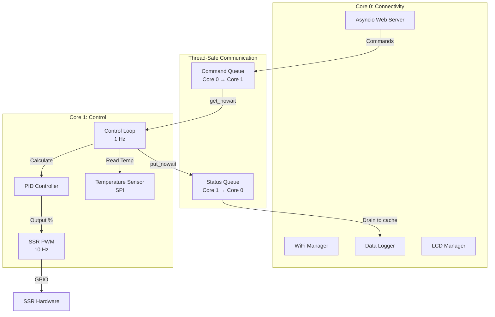
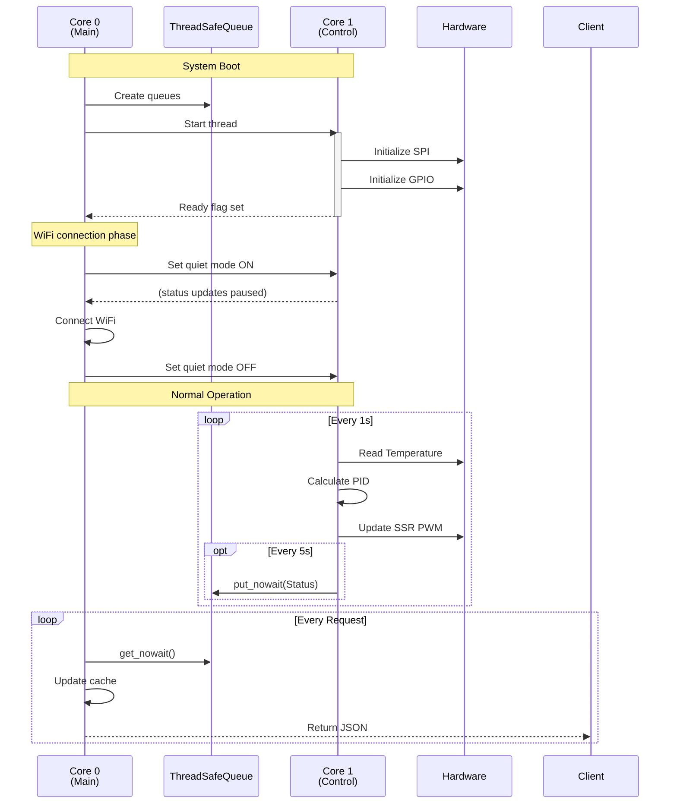
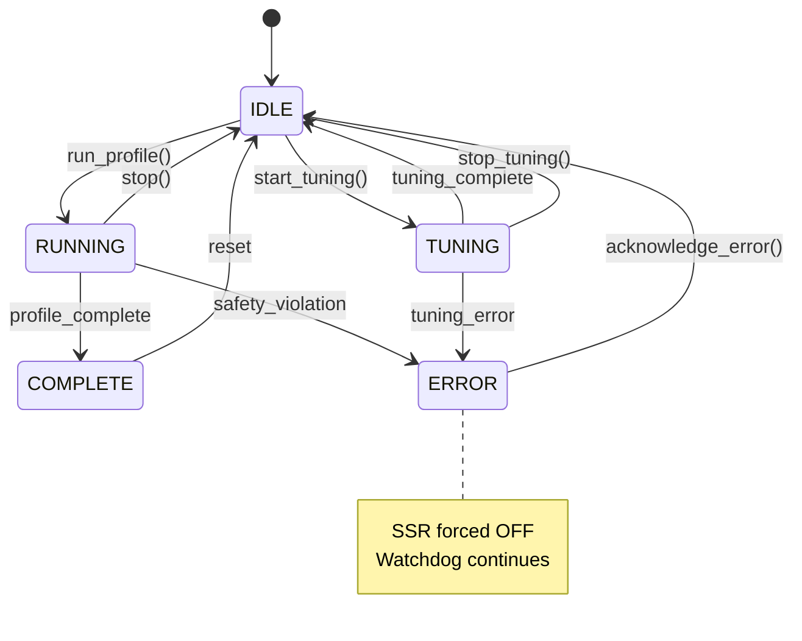

The `pico-kiln` firmware converts a $6 Raspberry Pi Pico W into an industrial-grade kiln controller. Unlike hobbyist Arduino loops that mix WiFi handling with pin toggling, this project leverages the RP2040's dual-core architecture to strictly separate **Control** (Real-Time) from **Connectivity** (Best-Effort).

This article dissects the control theory, thread synchronization patterns, and state machine logic that powers the kiln.

---

## Dual-Core Architecture

The RP2040 offers two ARM Cortex-M0+ cores. We exploit this to prevent network latency from affecting thermal stability.

- **Core 0 (Connectivity):** Runs the `asyncio` web server, handles WiFi negotiation, serves the HTTP API, and manages the filesystem (logs/profiles). This core is "noisy" in terms of timing jitter.
- **Core 1 (Control):** Runs a dedicated, infinite control loop. It owns the hardware pins (MAX31856 SPI, SSR GPIO). It executes the PID algorithm at a strict 1Hz frequency and the SSR PWM at 10Hz.

Communication between cores happens exclusively via custom `ThreadSafeQueue` instances, ensuring no race conditions on shared state.



### Boot Sequence



**Quiet Mode**: During WiFi connection (which can take 5-10 seconds), Core 1 suppresses status updates. This reduces queue contention and gives WiFi maximum CPU time. Temperature monitoring continues—safety is never compromised.

---

## Thread-Safe Communication

MicroPython's `_thread` module is primitive. No `Queue.Queue`, no condition variables. To ensure data integrity between cores, we implemented a custom `ThreadSafeQueue` using `collections.deque` and `_thread.allocate_lock()`.

```python
# kiln/comms.py

class ThreadSafeQueue:
    """
    Thread-safe FIFO queue using _thread.allocate_lock()
    
    Implements put_sync/get_sync with strict locking for cross-core safety.
    """
    
    def __init__(self, maxsize=10):
        self.maxsize = maxsize
        self._queue = deque((), maxsize)
        self._lock = allocate_lock()
    
    def put_sync(self, item):
        """Put item (raises Exception if full)"""
        self._lock.acquire()
        try:
            if self.maxsize > 0 and len(self._queue) >= self.maxsize:
                raise Exception("Queue full")
            self._queue.append(item)
        finally:
            self._lock.release()
    
    def get_sync(self):
        """Get item (raises Exception if empty)"""
        self._lock.acquire()
        try:
            if len(self._queue) == 0:
                raise Exception("Queue empty")
            return self._queue.popleft()  # O(1) deque operation
        finally:
            self._lock.release()
```

**Why deque?** MicroPython's `list.pop(0)` is O(n). `deque.popleft()` is O(1). At 5 status updates per second, this matters.

### StatusCache Pattern

Instead of blocking on the queue for every HTTP request, Core 0 drains the queue into a local cache. HTTP requests read from this cache (sub-millisecond latency) instead of waiting on queue operations.

```python
# server/status_receiver.py

class StatusCache:
    """Thread-safe cache for latest status"""
    
    def __init__(self):
        self.lock = allocate_lock()
        self._status = {'state': 'IDLE', 'current_temp': 0.0, ...}
        self._copy_count = 0
    
    def update(self, status):
        """Update cached status (thread-safe)"""
        with self.lock:
            self._status = status
    
    def get(self):
        """Get cached status (creates copy for safety)"""
        with self.lock:
            copy = self._status.copy()
            
            # Trigger GC every 10 copies to clean up old dicts
            self._copy_count += 1
            if self._copy_count >= 10:
                self._copy_count = 0
                gc.collect()
            
            return copy
```

**Memory optimization**: Creating a dict copy every HTTP request adds up. We trigger `gc.collect()` every 10 copies to prevent heap fragmentation. This keeps the Pico's limited RAM (~200KB free) stable over multi-hour firings.

---

## PID Controller Implementation

The controller uses a **positional form** PID with integral anti-windup. The math:

$$
u(t) = \underbrace{K_p e(t)}_{\text{Proportional}} + \underbrace{K_i \sum_{0}^{t} e(\tau) \Delta t}_{\text{Integral}} + \underbrace{K_d \frac{e(t) - e(t-1)}{\Delta t}}_{\text{Derivative}}
$$

Where:
- $e(t) = T_{\text{setpoint}} - T_{\text{measured}}$ is the error
- $u(t)$ is the SSR output (0-100%)
- $\Delta t$ is the control interval (1 second)

### Anti-Windup Implementation

If the SSR saturates at 100%, continuing to accumulate integral error is pointless and dangerous (overshoot). We clamp the integral term dynamically:

```python
# kiln/pid.py

@micropython.native  # JIT compile for speed
def update(self, setpoint, measured_value, current_time=None):
    """Calculate PID output"""
    if current_time is None:
        current_time = time.time()
    
    # Time delta (default 1s on first call)
    dt = current_time - self.prev_time if self.prev_time else 1.0
    if dt <= 0:
        dt = 0.001  # Prevent division by zero
    
    # Error
    error = setpoint - measured_value
    
    # Proportional term
    p_term = self.kp * error
    
    # Integral term with anti-windup
    self.integral += error * dt
    
    # Clamp integral to prevent windup
    if self.ki != 0:
        integral_max = self.output_limits[1] / abs(self.ki)
        integral_min = self.output_limits[0] / abs(self.ki)
        self.integral = max(min(self.integral, integral_max), integral_min)
    
    i_term = self.ki * self.integral
    
    # Derivative term
    error_delta = error - self.prev_error
    d_term = self.kd * (error_delta / dt)
    
    # Calculate raw output
    output_raw = p_term + i_term + d_term
    
    # Clamp output to [0, 100]
    output = max(min(output_raw, self.output_limits[1]), 
                 self.output_limits[0])
    
    # Save state
    self.prev_error = error
    self.prev_time = current_time
    
    return output
```

**The `@micropython.native` decorator**: This tells MicroPython to JIT-compile the function to native ARM code. For hot-path math like PID updates (called every second), this provides ~2x speedup over bytecode interpretation.

### Integral Limits

The integral clamp formula:

$$
I_{\max} = \frac{u_{\max}}{|K_i|}
$$

If $u_{\max} = 100$ and $K_i = 0.18$, then $I_{\max} = 555$ error-seconds. Once the integral accumulator hits this limit, further error accumulation is suppressed. This prevents windup during startup (when error is large) and during saturation (when SSR is already maxed out).

---

## Adaptive Gain Scheduling

Kilns are non-linear systems. At $1000°\text{C}$, heat loss via radiation is massive (Stefan-Boltzmann law: $P \propto T^4$). A PID tuned for $200°\text{C}$ will be sluggish and unable to maintain temperature at cone 6 ($1222°\text{C}$).

To solve this without complex gain tables, we use a physics-based **continuous gain scheduling** formula. We scale the PID gains linearly with temperature delta above ambient:

$$
\text{Scale}(T) = 1 + h \cdot (T - T_{\text{ambient}})
$$

Where:
- $h$ is the heat loss coefficient (empirically derived, typically $\approx 0.0001$ to $0.001$)
- $T$ is the current kiln temperature
- $T_{\text{ambient}}$ is ambient (room) temperature (~25°C)

At different temperatures:
- **25°C**: Scale = $1 + 0.0005 \times (25 - 25) = 1.0$ (no scaling)
- **500°C**: Scale = $1 + 0.0005 \times (500 - 25) = 1.2375$ (~24% increase)
- **1000°C**: Scale = $1 + 0.0005 \times (1000 - 25) = 1.4875$ (~49% increase)

The controller effectively increases its "aggression" at high temperatures to counteract rapid heat loss.

### Implementation

```python
# kiln/control_thread.py

@micropython.native
def control_loop_iteration(self):
    # ... read temperature, update controller ...
    
    if self.controller.state == KilnState.RUNNING:
        # Continuous gain scheduling based on temperature
        # Physics: gain_scale(T) = 1 + h*(T - T_ambient)
        thermal_h = self.thermal_h
        if thermal_h > 0:
            thermal_t_ambient = self.thermal_t_ambient
            pid_kp_base = self.pid_kp_base
            pid_ki_base = self.pid_ki_base
            pid_kd_base = self.pid_kd_base
            
            gain_scale = 1.0 + thermal_h * (current_temp - thermal_t_ambient)
            kp = pid_kp_base * gain_scale
            ki = pid_ki_base * gain_scale
            kd = pid_kd_base * gain_scale
            
            # Only update gains if changed significantly
            if (abs(kp - self._current_kp) > 0.01 or
                abs(ki - self._current_ki) > 0.0001 or
                abs(kd - self._current_kd) > 0.01):
                self.pid.set_gains(kp, ki, kd)
                self._current_kp = kp
                self._current_ki = ki
                self._current_kd = kd
                print(f"[Control] PID gains updated: Kp={kp:.3f} @ {current_temp:.1f}°C")
        
        ssr_output = self.pid.update(target_temp, current_temp)
```

**Change detection**: Updating PID gains on *every* loop iteration would spam the logs. We only update when the change exceeds 0.01 for $K_p/K_d$ or 0.0001 for $K_i$ (integral is more sensitive).

### Why This Works

At equilibrium (hold temperature), heat input must equal heat loss:

$$
P_{\text{heater}} \times \text{SSR\%} = P_{\text{loss}}
$$

Heat loss increases with temperature. To maintain the same SSR%, the controller must work harder. By scaling gains proportionally, we compensate for the increased loss without manual tuning at each temperature.

---

## SSR PWM Control

Solid-State Relays (SSRs) can't be PWM'd at high frequency like MOSFETs. They have zero-crossing detection circuits that require time to switch. We use **time-proportional control** instead:

- **Cycle Time**: 20 seconds (configurable via `SSR_CYCLE_TIME`)
- **Update Rate**: 10 Hz (every 100ms)
- **Output**: 0-100% duty cycle

For example, if PID commands 60% output:
- SSR is ON for 12 seconds
- SSR is OFF for 8 seconds
- Repeat

```python
# kiln/hardware.py (SSRController)

class SSRController:
    def __init__(self, ssr_pin, cycle_time=2.0):
        self.ssr_pin = ssr_pin
        self.cycle_time = cycle_time
        self.duty_cycle = 0.0  # 0-100%
        self.cycle_start_time = time.time()
    
    def set_output(self, duty_cycle):
        """Set SSR duty cycle (0-100%)"""
        self.duty_cycle = max(0, min(100, duty_cycle))
    
    @micropython.native
    def update(self):
        """
        Update SSR state based on duty cycle (called at 10 Hz)
        
        Time-proportional control: SSR is ON for (duty_cycle/100) of cycle_time
        """
        current_time = time.time()
        time_in_cycle = (current_time - self.cycle_start_time) % self.cycle_time
        
        # ON if we're within the duty cycle portion
        if time_in_cycle < (self.duty_cycle / 100.0) * self.cycle_time:
            self.ssr_pin.value(1)  # ON
        else:
            self.ssr_pin.value(0)  # OFF
```

**10 Hz update rate**: The SSR state is updated 10 times per second. This provides smooth transitions and ensures the SSR sees consistent zero-crossing signals (AC mains operate at 50/60 Hz, so 10 Hz = multiple AC cycles per update).

### Multiple SSR Support

For kilns with multiple heating elements, we support **staggered activation**:

```python
# kiln/hardware.py

class SSRController:
    def __init__(self, ssr_pins, cycle_time=2.0, stagger_delay=0.01):
        """
        Args:
            ssr_pins: Single Pin or list of Pins
            stagger_delay: Delay between SSR activations (seconds)
        """
        self.ssr_pins = ssr_pins if isinstance(ssr_pins, list) else [ssr_pins]
        self.stagger_delay = stagger_delay
    
    @micropython.native
    def update(self):
        current_time = time.time()
        time_in_cycle = (current_time - self.cycle_start_time) % self.cycle_time
        
        for i, pin in enumerate(self.ssr_pins):
            # Stagger activation by index * stagger_delay
            stagger_offset = i * self.stagger_delay
            adjusted_time = (time_in_cycle - stagger_offset) % self.cycle_time
            
            if adjusted_time < (self.duty_cycle / 100.0) * self.cycle_time:
                pin.value(1)
            else:
                pin.value(0)
```

**Why stagger?** Turning on multiple 1500W heaters simultaneously causes inrush current spikes. By delaying each SSR activation by 10ms, we spread the load and prevent voltage sag.

---

## State Machine Implementation

The kiln operates in distinct states, each with specific safety rules:

```python
# kiln/state.py

class KilnState:
    IDLE = const(0)        # Not running
    RUNNING = const(1)     # Actively following profile
    TUNING = const(2)      # PID auto-tuning in progress
    COMPLETE = const(3)    # Profile finished
    ERROR = const(4)       # Fault condition
```

**Using `const()` for memory optimization**: These are compiled to integer constants at parse time, saving RAM compared to string enums.

### State Transition Diagram



### Safety-Critical Transitions

```python
# kiln/control_thread.py

def handle_command(self, command):
    cmd_type = command.get('type')
    
    if cmd_type == MessageType.RUN_PROFILE:
        # Safety check: cannot start if already running
        if self.controller.state == KilnState.RUNNING:
            print("[Control] Cannot start: already running")
            return
        
        if self.controller.state == KilnState.TUNING:
            print("[Control] Cannot start: tuning in progress")
            return
        
        # Load profile and start
        profile = Profile.load_from_file(f"profiles/{profile_filename}")
        self.controller.run_profile(profile)
    
    elif cmd_type == MessageType.SHUTDOWN:
        # Emergency shutdown - force SSR off immediately
        self.controller.stop()
        self.ssr_controller.force_off()
        print("[Control] Emergency shutdown executed")
```

**Defensive programming**: Every command is validated against current state. Attempting to start a profile while tuning is rejected. Attempting to tune while running is rejected. This prevents operator errors from creating dangerous conditions.

---

## Watchdog Timer

If the control loop hangs (firmware bug, infinite loop, etc.), the kiln should fail **safe**. We use the RP2040's hardware watchdog:

```python
# kiln/control_thread.py

def setup_hardware(self):
    # ... other hardware init ...
    
    if self.config.ENABLE_WATCHDOG:
        from machine import WDT
        self.wdt = WDT(timeout=self.config.WATCHDOG_TIMEOUT)  # Default: 8000ms
        print(f"[Control] Watchdog ENABLED with {self.config.WATCHDOG_TIMEOUT}ms timeout")
        print(f"[Control] WARNING: Device will auto-reset if control loop hangs!")

def feed_watchdog(self):
    """Feed watchdog to prevent reset"""
    if self.wdt:
        self.wdt.feed()

@micropython.native
def control_loop_iteration(self):
    try:
        # ... control logic ...
        
        # 9. Feed watchdog - successful iteration
        self.feed_watchdog()
    
    except Exception as e:
        print(f"[Control] Error: {e}")
        if self.ssr_controller:
            self.ssr_controller.force_off()
        # NOTE: Do NOT feed watchdog on error
        # Let it reset if we're stuck in error loop
        time.sleep(1)
```

**Fail-safe design**: The watchdog is *not* fed during error conditions. If an exception occurs and we enter a crash loop, the watchdog expires after 8 seconds and resets the device. The SSR is turned OFF before the reset, preventing runaway heating.

### Watchdog + Recovery

If the watchdog triggers a reset mid-firing, the `server/recovery.py` module on Core 0 detects the incomplete CSV log and prompts the user to resume:

```python
# server/recovery.py (simplified)

def detect_incomplete_firing():
    """Scan logs/ for recent incomplete firings"""
    for log_file in os.listdir('logs'):
        if not log_file.endswith('.csv'):
            continue
        
        # Check if last line has state=RUNNING or TUNING
        with open(f'logs/{log_file}') as f:
            lines = f.readlines()
            if not lines:
                continue
            
            last_line = lines[-1]
            if 'RUNNING' in last_line or 'TUNING' in last_line:
                # Incomplete firing detected
                return parse_recovery_data(log_file)
    
    return None
```

The recovery system reads the last logged temperature, elapsed time, and adapted rate from the CSV, then resumes the profile from that point. **The watchdog provides safety; recovery provides resilience.**

---

## Adaptive Rate Control

Kilns don't always heat at the programmed rate. If the profile specifies 200°C/h but the kiln can only manage 150°C/h (due to underpowering, door cracks, etc.), continuing at the programmed rate causes the kiln to fall further behind.

The adaptive controller monitors actual vs. desired rate and adjusts dynamically:

```python
# kiln/state.py

def _check_and_adapt_rate(self, elapsed, step):
    """Check if rate adaptation is needed"""
    time_in_step = elapsed - self.step_start_time
    
    # Don't adapt too early (need 10 min of data)
    if time_in_step < self.adaptation_min_step_time:
        return
    
    # Don't adapt too frequently (5 min between adaptations)
    if elapsed - self.last_adaptation_time < self.adaptation_min_time_between:
        return
    
    # Measure actual rate over 10-minute window
    actual_rate = self.temp_history.get_rate(window_seconds=600)
    
    # Calculate target temp and error
    target_temp = self._get_step_target_temp(elapsed, step)
    temp_error = target_temp - self.current_temp
    
    # CRITICAL: Only adapt if SSR is saturated (95%+)
    # If SSR has headroom, rate issue is transient
    if self.ssr_output < 95:
        return
    
    # Check if we're behind schedule AND rate is low
    if (temp_error > 20 and  # 20°C behind target
        actual_rate < self.current_rate * 0.85):  # 85% of desired rate
        
        # Calculate new rate (90% of measured rate)
        proposed_rate = actual_rate * 0.9
        
        # Check against minimum
        min_rate = step.get('min_rate')
        if proposed_rate >= min_rate:
            # Accept adaptation
            old_rate = self.current_rate
            self.current_rate = proposed_rate
            self.adaptation_count += 1
            
            print(f"[Adaptation {self.adaptation_count}] "
                  f"Rate adjusted: {old_rate:.1f} → {proposed_rate:.1f}°C/h")
            
            # CRITICAL: Reset step start point to current position
            self.step_start_temp = self.current_temp
            self.step_start_time = elapsed
            
            # Request PID reset to clear stale integral
            self.pid_reset_requested = True
        else:
            # Cannot achieve minimum rate - fail
            self.set_error(f"Cannot achieve minimum rate {min_rate:.1f}°C/h")
```

### Adaptation Logic

$$
\text{Needs Adaptation} = (T_{\text{error}} > 20°\text{C}) \land (\text{SSR} > 95\%) \land (r_{\text{actual}} < 0.85 \times r_{\text{desired}})
$$

If all three conditions are true:

$$
r_{\text{new}} = 0.9 \times r_{\text{actual}}
$$

**Why 90% of measured?** Conservative. If we adapted to 100% of measured rate, any noise in the measurement would cause oscillation. By targeting 90%, we leave headroom for variance.

**SSR saturation check**: This is critical. If the SSR is at 50%, the controller has room to increase power. Reducing the rate would be premature—let the PID increase output first. Only when SSR is maxed out (95%+) do we conclude the kiln is physically incapable of the desired rate.

---

## Auto-Tuning State Machine

Manual PID tuning is tedious. The firmware includes a `ZieglerNicholsTuner` class that executes a robust state machine to characterize the kiln's thermal properties automatically.

### Tuning Modes

```python
# kiln/tuner.py

class ZieglerNicholsTuner:
    def __init__(self, mode='STANDARD', max_temp=None):
        """
        Args:
            mode: 'SAFE', 'STANDARD', or 'THOROUGH'
            max_temp: Override default max temp for mode
        """
        self.mode = mode
        self.steps = self._build_step_sequence(mode, max_temp)
```

**SAFE Mode** (30-45 min, max 100°C):
- Heat at 30% SSR for 10 minutes
- Cool to ambient
- Quick safety check for new kilns

**STANDARD Mode** (1-2 hours, max 150°C):
- Heat at 25%, 50%, 75% SSR with plateau detection
- Cool to ambient
- Good balance of time vs. data quality

**THOROUGH Mode** (3-4 hours, max 200°C):
- Heat at 20%, 40%, 60%, 80% SSR with 5-min holds
- Cool to ambient
- Maximum data for thermal modeling

### Step Execution

```python
# kiln/tuner.py

class TuningStep:
    def __init__(self, step_name, ssr_percent, timeout, 
                 plateau_detect=False, hold_duration=0, target_temp=None):
        self.step_name = step_name
        self.ssr_percent = ssr_percent  # Fixed SSR output
        self.timeout = timeout  # Max time before forcing next step
        self.plateau_detect = plateau_detect  # Auto-advance on plateau
        self.hold_duration = hold_duration  # Time to hold after plateau
        self.target_temp = target_temp  # For cooldown steps

def update(self, current_temp):
    """
    Update tuner state and return SSR output
    
    Returns:
        (ssr_output, continue_tuning)
    """
    if self.stage == TuningStage.COMPLETE or self.stage == TuningStage.ERROR:
        return 0, False
    
    if not self.current_step:
        # All steps complete
        self.stage = TuningStage.COMPLETE
        return 0, False
    
    elapsed = time.time() - self.step_start_time
    
    # Check for plateau (if enabled)
    if self.current_step.plateau_detect:
        if self._detect_plateau(current_temp, elapsed):
            if self.current_step.hold_duration > 0:
                # Transition to hold stage
                self.stage = TuningStage.HOLDING
                self.hold_start_time = time.time()
            else:
                # Advance immediately
                self._advance_to_next_step()
    
    # Check for timeout
    if elapsed > self.current_step.timeout:
        self._advance_to_next_step()
    
    return self.current_step.ssr_percent, True
```

**Plateau Detection**: Uses a sliding window to calculate $\frac{dT}{dt}$. If the derivative stays below 0.5°C/min for 30 seconds, we declare a plateau and advance to the next step.

### Data Streaming

The tuning data is streamed to CSV on Core 0 as it's collected:

```python
# server/data_logger.py (simplified)

class DataLogger:
    def log_tuning_row(self, status):
        """Log tuning data to CSV"""
        with open(self.current_log_file, 'a') as f:
            writer = csv.writer(f)
            writer.writerow([
                status['timestamp'],
                status['elapsed'],
                status['current_temp'],
                status['ssr_output'],
                status['tuning']['step_name'],
                status['tuning']['step_index'],
                status['tuning']['total_steps']
            ])
```

After tuning completes, you run `scripts/analyze_tuning.py` on the CSV to calculate optimal PID parameters using Ziegler-Nichols, Cohen-Coon, and AMIGO methods (see Part 4 of this series).

---

## Memory Management

The Pico has ~200KB of free RAM after firmware boot. For multi-hour firings, memory leaks are fatal. We use several strategies:

### Pre-Allocated Templates

Instead of creating new dicts for every status update (5 per second = 18,000 per hour), we use pre-allocated templates:

```python
# kiln/comms.py

class StatusMessage:
    # Pre-allocated template
    _status_template = {
        'timestamp': 0,
        'state': 'IDLE',
        'current_temp': 0.0,
        'target_temp': 0.0,
        # ... 15 more fields ...
    }
    
    @staticmethod
    def build(controller, pid, ssr_controller):
        """Build status from template (faster than dict literal)"""
        status = StatusMessage._status_template.copy()
        
        # Update fields
        status['timestamp'] = time.time()
        status['state'] = state_to_string(controller.state)
        status['current_temp'] = round(controller.current_temp, 2)
        # ... update remaining fields ...
        
        return status
```

**Why copy?** Thread safety. Core 1 creates the copy, Core 0 consumes it. No shared mutable state.

### Periodic Garbage Collection

```python
# kiln/comms.py

class StatusCache:
    def get(self):
        """Get cached status (creates copy)"""
        with self.lock:
            copy = self._status.copy()
            
            # Trigger GC every 10 copies
            self._copy_count += 1
            if self._copy_count >= 10:
                self._copy_count = 0
                gc.collect()
            
            return copy
```

**Why periodic?** Calling `gc.collect()` on every request adds ~50ms latency. By batching, we amortize the cost while preventing heap fragmentation.

### Integer Constants

```python
# kiln/state.py

from micropython import const

class KilnState:
    IDLE = const(0)
    RUNNING = const(1)
    TUNING = const(2)
    # ...
```

**Why `const()`?** MicroPython compiles these to literal integers at parse time. No dict lookup. No memory overhead. String enums would consume ~10 bytes per state × 5 states × thousands of state checks = several KB wasted.

---

## Performance Optimizations

### Native Compilation

Hot-path functions are annotated with `@micropython.native`:

```python
@micropython.native
def update(self, setpoint, measured_value, current_time=None):
    # PID calculation (called every second)
    # ...
```

This compiles to ARM Thumb-2 machine code instead of bytecode. Speedup: ~2-3x for math-heavy functions.

### Attribute Caching

```python
@micropython.native
def control_loop_iteration(self):
    # Cache thermal attributes (hot path optimization)
    thermal_h = self.thermal_h
    if thermal_h > 0:
        thermal_t_ambient = self.thermal_t_ambient
        pid_kp_base = self.pid_kp_base
        # ...
```

**Why?** Accessing `self.thermal_h` in a loop does a dict lookup. Caching in a local variable (`thermal_h`) avoids repeated lookups. In the 1 Hz control loop, this saves ~100 µs per iteration.

---

## What We Built

A $6 microcontroller running:
- **Dual-core control**: Real-time PID on Core 1, WiFi/HTTP on Core 0
- **Physics-based gain scheduling**: Compensates for temperature-dependent heat loss
- **Adaptive rate control**: Automatically adjusts firing rates when underpowered
- **Watchdog safety**: Auto-resets on firmware hang, SSR forced off
- **Auto-tuning**: Multi-mode thermal characterization with plateau detection
- **Recovery system**: Resumes interrupted firings from CSV logs
- **Thread-safe queues**: Lock-based communication between cores
- **Memory-optimized**: Template-based messaging, periodic GC, integer constants

Total firmware size: ~50KB bytecode + ~150KB RAM at runtime.  
Total control loop jitter: <5ms (measured with oscilloscope on SSR pin).  
Total cost: $6.

Industrial kiln controllers cost $300-$1000 and do less. We built ours for the price of a sandwich.

---

**Tech Stack:**
- **MicroPython 1.22+**: Firmware runtime
- **RP2040 SDK**: Hardware drivers (SPI, GPIO, Watchdog)
- **Custom ThreadSafeQueue**: Lock-based inter-core communication
- **Matplotlib (offline)**: Tuning data visualization

---

**References:**
- RP2040 Datasheet: https://datasheets.raspberrypi.com/rp2040/rp2040-datasheet.pdf
- MicroPython threading: https://docs.micropython.org/en/latest/library/_thread.html
- SSR zero-crossing switching: Crydom Application Note AN-H63
