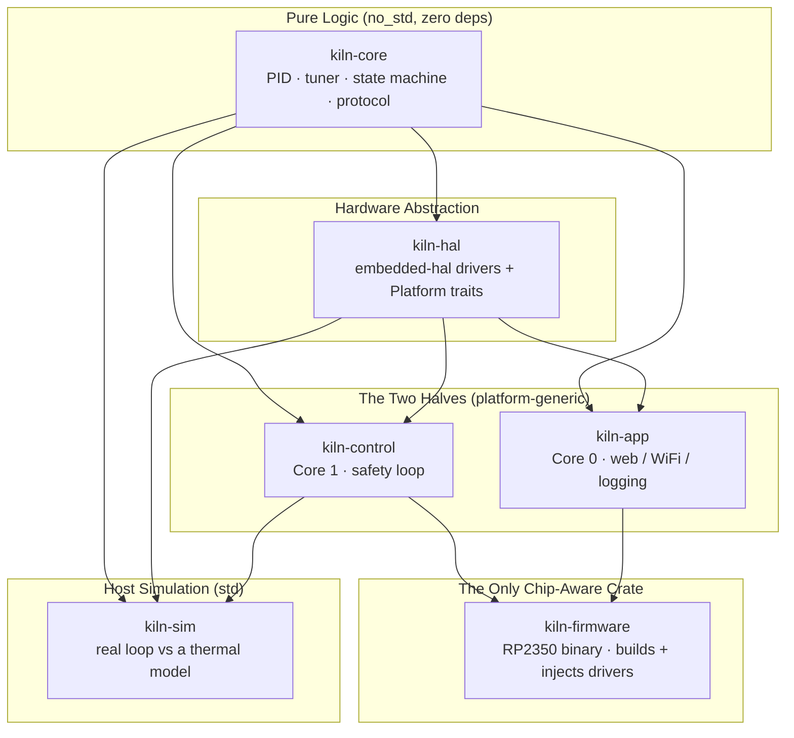
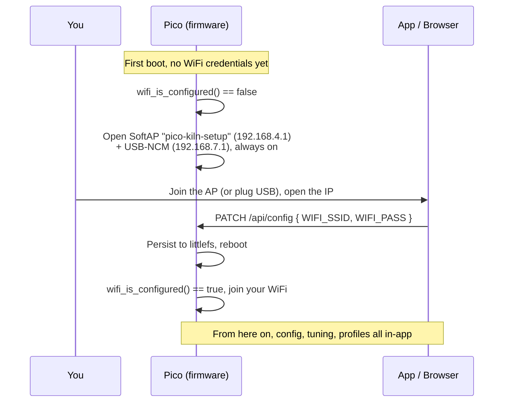

A kiln is a box that holds 1200°C for hours, unattended, in a workshop. The software driving it has exactly one job it is not allowed to get wrong: keep the heat under control. If anything goes sideways, cut the power. Everything else (the web UI, the graphs, the WiFi, the auto-tuning) is a nice-to-have bolted onto that one non-negotiable.

The first four parts of this series built that box out in MicroPython. It worked. It fired real pots. And then I tore the firmware out and rewrote it from scratch in bare-metal Rust.

This is the story of why, and what we got for the trouble.

The short version: it now connects to WiFi in a blink, syncs NTP in a few milliseconds, and has not crashed, frozen, or hiccuped once since it went on the kiln. I sleep through overnight firings now. The long version is about a garbage collector, a compile-time wall, an ironic stack overflow, and the difference between *a thing that runs* and *a thing you can forget about*.

---

## Starting in MicroPython (and why that was right)

I did not start in Rust, and I'd make the same call again.

When you build a controller, the language is not the hard part. The hard part is figuring out what the thing should even *do*. What does the PID loop look like at 1000°C versus 100°C? How do you schedule gains across temperature bands? How do you auto-tune a kiln from cold? What happens if the Pico reboots mid-firing? How do you split the work across two cores so the web server can never starve the control loop?

MicroPython answered all of those fast. There's no build step and no flashing dance. You edit a `.py` file, push it over USB with `mpremote`, reset, and watch the serial console. Iteration was sub-minute. In a handful of evenings the entire feature set was roughed out and, more importantly, *validated against a real kiln*:

- A positional-form PID with integral anti-windup and bumpless gain changes.
- A physics-based thermal model doing continuous gain scheduling, $g(T) = 1 + h\,(T - T_{ambient})$, to fight the $T^4$ radiative heat loss that makes a kiln nonlinear.
- A multi-mode auto-tuner (SAFE / STANDARD / THOROUGH) that characterises the kiln's thermal response.
- Firing-profile scheduling with adaptive rate control and stall detection.
- Crash-recovery logic that resumes an interrupted firing from its CSV log.
- A hard dual-core split: time-critical control on one core, WiFi and HTTP on the other.
- An embedded web server, CSV logging, and an LCD readout.

That MicroPython firmware (Parts 2 through 4) is still in the repo under `python/`, and I'm glad it is. It was the design document that happened to run. Throwing it away to start in Rust would have meant designing the whole controller in the slowest, least forgiving medium available. Bad trade.

---

## The Ceiling

The problems with MicroPython were never conceptual. The design was sound. I'd proven it on real clay. The problem was that **the runtime sat between me and the hardware**, and that gap got expensive the moment I stopped wanting a demo and started wanting something I could trust unattended.

- **It was slow where it mattered.** Web requests, file writes, JSON serialisation: each one paid interpreter and allocation overhead. Part 2 is full of the workarounds: `@micropython.native` decorators to JIT hot paths, pre-allocated status templates, hand-rolled `ThreadSafeQueue`s. Clever, and necessary, and a sign I was fighting the runtime.
- **The garbage collector punched in at random.** Part 2 literally schedules `gc.collect()` every 10 status copies to keep the heap from fragmenting over a multi-hour firing. A GC pause is a non-deterministic stall, and a non-deterministic stall in a loop that drives a 9 kW heating element is exactly the kind of thing you don't want to reason about at 2 a.m.
- **The Pico would, occasionally, just freeze.** Not often. Often enough. For a device you leave running overnight, "occasionally freezes" is not a bug, it's a disqualification.
- **Hardening it meant fighting an opaque box.** Every fix was a workaround for a layer I couldn't see into. The implementation stopped going anywhere, not because the features were missing, but because the reliability I needed wasn't reachable from inside the interpreter.

The features were done. The robustness wasn't, and I couldn't get there from where I was standing. So I dropped a level: direct Pico firmware, in Rust.

---

## The Architecture: A Compile-Time Wall

The whole rewrite is organised around a single sentence:

> **The brain never touches the world.**

Every control decision lives in pure, host-testable logic. The device drivers are generic over `embedded-hal` traits. And the safety boundary, the thing that in MicroPython was a *convention* ("Core 1 doesn't do web stuff, please"), is now a **compile-time wall** the linker enforces for me.

The firmware is a small Cargo workspace of five shipping crates plus an optional host sim. Dependencies point strictly inward; `kiln-core` depends on nothing.



| Crate | `no_std` | Role |
|-------|:---:|------|
| `kiln-core` | yes | All decision logic + the protocol types. **Zero dependencies.** Runs under `cargo test` on a laptop, unchanged. |
| `kiln-hal` | yes | Thin drivers over `embedded-hal` (MAX31856, SSR, LCD) + the `Platform` traits the halves are generic over. |
| `kiln-control` | yes | **Core 1** runs the real-time safety loop: read → filter → PID → SSR → feed the watchdog. |
| `kiln-app` | yes | **Core 0**: web server, WiFi, CSV logging, LCD. All best-effort. |
| `kiln-firmware` | yes | The **only** crate that names `embassy-rp` / `cyw43`. Builds the concrete drivers, owns init, dispatches the cores. |
| `kiln-sim` | no | Optional `std` harness that drives the *real* control loop against a software thermal model. |

Here is the entire dependency manifest of the safety loop, the code that decides whether the relay is on or off:

```toml
# kiln-control/Cargo.toml: the real-time safety loop
[dependencies]
kiln-core = { path = "../kiln-core" }
kiln-hal  = { path = "../kiln-hal" }
# That's the whole list. No picoserve, no cyw43, no embassy-net,
# no embassy-rp. The network stack is not a dependency, so it
# physically cannot be linked into the fire-control core.
```

That's the wall. In MicroPython, nothing stopped me from `import`-ing the web server into the control thread by accident at 1 a.m. Here, the network stack isn't in scope. You couldn't pull it into the safety loop if you tried; `cargo` would refuse to resolve it.

The only thing that crosses the boundary is a small, `Copy` protocol type carried over an `embassy-sync` channel:

```rust
// kiln-core/src/protocol.rs: no_std, ZERO dependencies (no serde, no alloc)

#[derive(Debug, Clone, Copy)]
pub struct Status {
    pub timestamp: i64,      // whole epoch seconds: exact, off the soft-float path
    pub state: KilnState,    // typed enum, not a string
    pub current_temp: f32,
    pub target_temp: f32,
    pub ssr_output: f32,
    pub error: Option<KilnError>,
    // ...
}
```

`kiln-core`'s dependency list is intentionally empty. No serde, no alloc, no heap strings. Errors are typed enums. That emptiness is the feature: it's what lets the exact same crate compile for the RP2350 *and* run under `cargo test` on a laptop in milliseconds.

The wiring lives in exactly one place. `kiln-firmware` is the only crate that knows an RP2350 exists; it builds the concrete drivers and *injects* them into two generic `run<P>` entry points:

```rust
// kiln-firmware: the ONLY place that names embassy_rp / cyw43 / spawn_core1.
let p = embassy_rp::init(Default::default());

let sensor = Max31856::new(spi_device);   // embedded-hal SpiDevice
let ssr    = Ssr::new(p.PIN_15.degrade()); // embedded-hal OutputPin
let wdt    = Rp2350Watchdog::new(p.WATCHDOG);

// Cross-core channels MUST use CriticalSectionRawMutex.
static CMD:    Channel<CriticalSectionRawMutex, Command, 8> = Channel::new();
static STATUS: Watch<CriticalSectionRawMutex,   Status,  4> = Watch::new();

// Core 1: the real-time safety loop, pinned here at dispatch time.
spawn_core1(p.CORE1, CORE1_STACK.init(Stack::new()), move || {
    CONTROL_EXEC.init(Executor::new())
        .run(|s| kiln_control::run(s, sensor, ssr, wdt, CMD.receiver(), STATUS.sender()));
});

// Core 0: the app layer, handed a running network Stack, not raw peripherals.
EXEC0.init(Executor::new())
    .run(|s| kiln_app::run(s, net, CMD.sender(), STATUS.receiver()));
```

Underneath the wall are the backstops, layered so that no single failure energises an empty kiln:

- `kiln-control` feeds the **hardware watchdog** every tick. If the safety loop hangs, the chip resets.
- `panic = "abort"` plus an **SSR-off-on-`Drop` guard** in `kiln-hal` means any fault, anywhere, de-energises the relay on the way down. There's even a raw, allocation-free `raw_ssr_off()` on the panic path.
- Crate names describe *responsibility*, not core number. If a task ever moves cores, nothing gets renamed; affinity is decided once, in the shim.

---

## Proving the Port: Golden Replays and a Host That Lies

Rewriting a controller that drives fire is not something you eyeball. The MicroPython version was the reference implementation, and I wanted proof, not vibes, that the Rust port behaved identically.

Two things made that possible.

**Golden-replay tests.** Because `kiln-core` is pure and dependency-free, I could capture real MicroPython execution traces and replay them through the Rust PID, tuner, profile, state machine, rate monitor, temperature filter, SSR schedule, and recovery logic, then assert the outputs match to within **1e-6 to 1e-9**. The PID port is expression-for-expression identical, down to the non-obvious bits: derivative computed before integral, the anti-windup that predicts saturation from P+I only, the bumpless `set_gains` that rescales the integral by `old_ki/ki`. The MAX31856 driver is register-for-register faithful. A dozen of these replay tests pin the fire-relevant maths to the original behaviour, and they run on every change.

**A 9-block parity audit.** Before merging, I ran the whole port through a structured audit: nine feature blocks, each cross-checking constants, branch conditions, comparison operators, and edge cases against the MicroPython source, cited line by line. The verdict where it counts: *the brain is excellent.* The audit was also brutally specific about the gaps it found: an unsubstituted HTML template, a recovery-resume logging path that wasn't wired up, a CORS preflight, a single PID default that disagreed by 28% between two files. All of them got fixed before this shipped. The audit document is in the repo. It is the reason I trust the result.

Then there's the part I'm quietly proudest of. Because `kiln-control` is generic over the platform rather than bound to `embassy-rp`, the host simulator can import and drive **the real control loop**, not a reimplementation of it:

```rust
// kiln-sim: a std binary. Drives the SHIPPING kiln-control loop on a laptop,
// using embassy-time's std driver + mock sensor/SSR/watchdog, against a
// software thermal model. No hardware, full firing, in seconds.
```

I can run an entire 10-hour firing profile on my laptop, in seconds, against a simulated kiln, exercising the actual orchestration that runs on the device, not a copy that drifts out of sync with it. Across the workspace, **196 host tests** run green in milliseconds. The dangerous logic is proven *off* the device.

---

## The Stack-Overflow Saga

Bare-metal means you own the memory. There's no garbage collector to hide behind, and on a microcontroller the stack and the static data (`.bss`) grow toward each other in the same RAM. They seesaw.

During bring-up, the web core would occasionally die. The root cause was perfect, painful irony: I was optimising the firmware for size with `opt-level = "z"`, and that setting **disabled the compiler's stack-slot coloring**, the optimisation that lets disjoint locals reuse the same stack space. Without it, the `picoserve` serve-poll frame bloated until it punched straight through the top of `.bss`. The "leak" wasn't a leak. It was the size optimisation eating my stack.

The fix had three parts:

1. **Pin `opt-level = 2`** (not `"z"`). Slightly larger image, correct stack frames.
2. **Drop from 3 picoserve workers to 1.** Each worker carried ~84 KiB of `.bss`; three of them shoved the stack floor up by ~168 KiB. One worker is plenty for a single-user kiln.
3. **Add a hardware stack guard.** The RP2350 is ARMv8-M (Cortex-M33), which has `MSPLIM`, a purpose-built stack-limit register.

```rust
// kiln-firmware/src/stack.rs
use cortex_m::register::msplim;

// 512 B reserve so the overflow fault's OWN exception frame stacks
// above .bss instead of corrupting it.
const GUARD_RESERVE: u32 = 512;

/// Arm the per-core MSP stack-limit guard. MSPLIM raises STKOF the instant
/// SP would cross the limit, BEFORE the offending write, so a runaway
/// stack traps at the boundary instead of silently smashing `.bss`.
pub fn arm_guard_at(bottom: u32) {
    unsafe { msplim::write(bottom + GUARD_RESERVE) }
}
```

When the stack pointer would cross the limit, the core raises a fault *before* the bad write, which escalates to the existing HardFault handler and gets decoded as `[STACK OVERFLOW]`. No more silent corruption that crashes somewhere unrelated three seconds later. The guard is armed on both cores. I also added on-device high-water telemetry, so stack depth is a number I can read instead of a thing I guess at:

| Region | Stack size | Measured peak | Headroom |
| :--- | :--- | :--- | :--- |
| **Core 0 (Web / App)** | 331 KiB | 271 KiB | 60 KiB (18%) |
| **Core 1 (Control)** | 16 KiB | 7.2 KiB | 8.8 KiB (55%) |

All the agonising over picoserve's RAM turned out to be aimed at the comfortable core. The real risk was Core 1: the fire-control loop peaked at 7,188 bytes on an 8 KiB stack, about 500 bytes from its own guard. So I bumped it to 16 KiB. You do not run a fire-control core with 500 bytes of margin.

---

## Killing the Abstraction Layer

The user-visible parts got dramatically faster, and the reason is boring: I deleted a whole layer of interpretation.

In MicroPython, an HTTP request walked through interpreted `asyncio`, an interpreted router, interpreted JSON, and interpreted file I/O before a single byte hit the flash. In Rust, `picoserve` serves compiled async routes, and `littlefs2` writes straight to a dedicated flash partition. There is no interpreter between the request and the metal. WiFi association is effectively instant; NTP sync lands in milliseconds at boot; file writes and config reads happen at a speed the MicroPython build never approached.

Owning the metal also means owning the timing trade-offs, explicitly:

- **CSV rows are batched in RAM and flushed periodically** through an 8 KiB buffer, so the control core isn't constantly paused to wait on a flash write. The buffer size is load-bearing and chosen on purpose, not left to a runtime.
- **The hot path is integer-time.** The RP2350's FPU is single-precision; anything `f64` falls onto a slow soft-float path. The control loop carries time as integer milliseconds and epoch seconds as `i64`, keeping the tick off soft-float entirely. That's the comment you saw on `Status::timestamp`.

This is the part the original context undersold as "removed a layer of abstraction." It's really the whole reason the thing feels instant: every byte now has a known, compiled path to the hardware, and I get to decide what each one does.

---

## Flash It and Forget It

The old workflow was a chore: edit `config.py`, recompile to bytecode, redeploy over USB, sync the profiles. The new firmware is genuinely plug-and-play. You flash it once, and then you never touch a cable again unless you want to.



A fresh board has no WiFi credentials, but credentials are set through the web API, which historically needed WiFi. Classic chicken-and-egg. Two extra network interfaces break it, and both serve the *same* picoserve router as WiFi does:

| Interface | When | Device IP |
| :--- | :--- | :--- |
| **USB-CDC-NCM** | Always, whenever the cable is enumerated | `192.168.7.1` |
| **SoftAP** (open, `pico-kiln-setup`) | Only while WiFi is unconfigured | `192.168.4.1` |
| **WiFi STA** | Once configured | DHCP or static |

The cyw43 radio can't run station and access-point mode at once, so it's one or the other, chosen at boot from `KilnConfig::wifi_is_configured()`. USB-NCM lives on the USB peripheral, independent of the radio, so it's always there as a wired escape hatch. DHCP for both is served on-device. (The open setup AP is a deliberate trade for cable-free provisioning: it only exists while WiFi is unset, runs with NTP-gated firings still gated, and vanishes the moment the board joins your network. Provision somewhere you trust.)

After that, everything happens in the app, over the HTTP API:

- **Configuration is in-app.** `GET` / `POST` / `PATCH /api/config` reads and merges the config; edits persist to flash and apply on reboot. No more editing a Python file and reflashing.
- **Tuning is in-app, end to end.** Run an auto-tune on the kiln, and the app analyses the resulting curve *on the spot*, fitting a First-Order-Plus-Dead-Time model and computing suggested gains by Ziegler-Nichols, Cohen-Coon, and AMIGO. If that sounds familiar, it should: it's the exact analysis from Part 4's offline Python script, reimplemented in TypeScript and moved into the app. You push the suggested PID values straight back into the config from the same screen.

Flash the Pico. Join its network. Set your WiFi, run a tune, accept the gains, fire. Every step after the flash is done from the app, the same React/Tauri app from Part 3, which also bypasses the browser's mixed-content rules talking to a plain-HTTP device on your LAN.

---

## The Numbers

The whole point of dropping to the metal was control, and control shows up as a small, predictable, measurable footprint. These are from a real release build (`opt-level = 2`, fat LTO) for `thumbv8m.main-none-eabihf`:

| Section | Size | Lives in | Notes |
| :--- | :--- | :--- | :--- |
| `.text` | 433,440 B (~423 KiB) | Flash | Executable code |
| `.rodata` | 304,112 B (~297 KiB) | Flash | Read-only data, dominated by the embedded web UI |
| `.data` | 160 B | Flash → RAM | Initialised statics |
| `.bss` | 200,616 B (~196 KiB) | RAM | Zero-initialised statics |

- **Flash image: 737,732 B ≈ 720 KiB → 28.1% of the 2560 KiB image budget.** The whole stack (drivers, dual-core executors, async web server, WiFi, the embedded UI), interpreter-free, in under a third of the flash budget.
- **Static RAM (`.data` + `.bss`): 200,688 B = 38.3% of the 512 KiB SRAM.**

The packed `.uf2` on disk is 2.1 MB, but that's just XIP padding to the partition boundary; the real image is 720 KiB. The flash is partitioned on purpose: a hard-capped 2560 KiB program region that *cannot* grow into the filesystem, and a separate 1536 KiB `littlefs2` partition holding config, profiles, and run logs, which **survives a reflash**. Update the firmware, keep your tuning.

And the figure that actually matters, the one no benchmark captures: since it went on the in-house kiln, it has not crashed, frozen, or hiccuped once. The MicroPython freezes are gone. The GC pauses are gone. I sleep through firings.

---

## What We Built

We replaced a \$300–\$1000 commercial controller with a \$6 Raspberry Pi Pico 2 W running:

- **Dual-core async firmware** on Embassy, `no_std`, bare metal.
- **A compile-time safety wall:** the network stack is not a dependency of the control core, so it cannot be linked into it.
- **A verified port**: golden-replay tests against the original MicroPython at 1e-6 tolerance, a 9-block parity audit, and a host sim that runs the real loop. 196 tests, all green on a laptop.
- **Hardware stack guards** (MSPLIM) and on-device high-water telemetry, on both cores.
- **Plug-and-play provisioning** over USB-NCM and a fallback SoftAP, with config and PID auto-tune analysis done entirely in-app.

The MicroPython version got us a kiln controller. The Rust version got us a kiln controller we can forget is even running, which, for a box holding 1200°C in the workshop overnight, is exactly the feeling I was after.

---

**Tech Stack:**
- **Rust (Nightly)**: Bare-metal `no_std` firmware (TAIT for the async app layer)
- **Embassy**: Async executor + time/sync primitives for the RP2350
- **picoserve**: Async HTTP server on Core 0
- **littlefs2**: Power-loss-resilient filesystem for config, profiles, and logs
- **cortex-m / MSPLIM**: Hardware stack-overflow guard on both cores
- **Tauri**: Cross-platform companion app (React + Rust), from Part 3

---

**References:**
- [pico-kiln GitHub Repository](https://github.com/KONFeature/pico-kiln)
- [Embassy: async embedded Rust](https://embassy.dev/)
- [RP2350 Datasheet](https://datasheets.raspberrypi.com/rp2350/rp2350-datasheet.pdf)
- [ARMv8-M Stack Limit (MSPLIM), Armv8-M Architecture Reference Manual](https://developer.arm.com/documentation/ddi0553/latest)
- [embedded-hal: portable driver traits](https://github.com/rust-embedded/embedded-hal)
