The kiln logs every firing to CSV: timestamp, temperature, target, SSR output, PID terms. One second resolution. A 10-hour firing generates 36,000 rows. Most people would load this into Excel, squint at a chart, and call it done.

We built a physics engine instead.

## Quick Visualization: `plot_run.py`

Before diving into control theory, sometimes you just want to see what happened. The `plot_run.py` script generates publication-quality graphs from any firing or tuning CSV.

```bash
python scripts/plot_run.py logs/cone6_glaze_2025-11-15.csv
```


The script auto-detects:
- **Run type** (firing vs tuning)
- **Step transitions** (from CSV metadata)
- **Rate adaptations** (for adaptive profiles)
- **Duration and temperature range**

The output is a 4-panel matplotlib figure:
1. **Temperature vs Time**: Current temp (blue) vs target (red dashed), with step boundaries
2. **SSR Duty Cycle**: Filled area chart showing heater output percentage
3. **Step Visualization**: Color-coded regions with step names overlaid
4. **Heating Rate** (if available): Shows adaptive rate changes

This is the "I just want to know what happened" tool. One command, zero configuration. Useful for quick sanity checks or spotting obvious issues (like "why did it overshoot by 30°C at 1000°C?").

For deeper analysis, we have two specialized tools:
- `analyze_pid_performance.py` — Closed-loop analysis of production firings
- `analyze_tuning.py` — Open-loop thermal characterization for PID design

Let's talk about the interesting one.

---

## The PID Tuning Problem

A kiln is not a linear system. At 100°C, the heater might raise the temperature 2°C per second. At 1000°C, the same heater barely moves the needle—heat loss increases quadratically with temperature.

The standard approach is to run the kiln through a test sequence, measure the step response, and calculate PID parameters using classical methods (Ziegler-Nichols, Cohen-Coon, etc.). This works if you have:
1. A well-defined step response
2. Consistent system dynamics
3. A human who knows what they're doing

Kilns fail all three.

### The Three-Mode Tuning System

The firmware supports three auto-tuning modes, each with different trade-offs:

```python
# SAFE Mode: 30-45 min, max 100°C
# Quick safety check for new kilns
phases = [
    ("heat", 30, timeout=600),  # 30% SSR for 10 min
    ("cool", 0, target=ambient)
]

# STANDARD Mode: 1-2 hours, max 150°C (recommended)
# Balanced data collection with plateau detection
phases = [
    ("heat", 25, plateau=True, timeout=600),
    ("heat", 50, plateau=True, timeout=600),
    ("heat", 75, plateau=True, timeout=600),
    ("cool", 0, target=ambient)
]

# THOROUGH Mode: 3-4 hours, max 200°C
# Comprehensive thermal modeling
phases = [
    ("heat", 20, plateau=True, hold=300, timeout=600),
    ("heat", 40, plateau=True, hold=300, timeout=600),
    ("heat", 60, plateau=True, hold=300, timeout=600),
    ("heat", 80, plateau=True, hold=300, timeout=600),
    ("cool", 0, target=ambient)
]
```

The Pico runs the sequence, logs everything to CSV, and shuts down. The analysis happens offline.

---

## Phase Detection: Physics Over Metadata

The naive approach: use the step names from the CSV (`step_name="heat_60pct_to_100C"`). This breaks when:
- The kiln doesn't reach the target (timeout)
- The plateau detector fails (temperature drifts)
- The firmware crashes mid-step (recovery state)

Instead, we detect phases from **actual measurements**:

```python
def detect_phases(data, plateau_threshold=0.5, ssr_change_threshold=10.0):
    """
    Detect phases using physics-based measurement analysis.
    
    Phase boundaries = significant SSR output changes
    Phase types = actual temperature behavior
    
    Classification:
      - COOLING: SSR < 5% (natural cooling, no heat input)
      - HEATING: SSR ≥ 5% AND dT/dt > threshold
      - PLATEAU: SSR ≥ 5% AND |dT/dt| ≤ threshold (equilibrium)
    """
    phases = []
    current_ssr = ssr[0]
    phase_start = 0
    
    for i in range(1, len(ssr)):
        # Detect phase boundary: SSR change > threshold
        if abs(ssr[i] - current_ssr) > ssr_change_threshold:
            phase_end = i - 1
            phase_duration = time[phase_end] - time[phase_start]
            
            # Calculate measurements
            avg_ssr = mean(ssr[phase_start:phase_end+1])
            temp_change = temp[phase_end] - temp[phase_start]
            rate_per_min = (temp_change / phase_duration) * 60
            
            # Classify phase type (physics, not names!)
            if avg_ssr < 5.0:
                phase_type = 'cooling'
            elif rate_per_min > plateau_threshold:
                phase_type = 'heating'
            elif abs(rate_per_min) <= plateau_threshold:
                phase_type = 'plateau'
            else:
                phase_type = 'cooling'
            
            phases.append(Phase(phase_start, phase_end, phase_type, 
                              avg_ssr, temp[phase_start], temp[phase_end]))
            
            phase_start = i
            current_ssr = ssr[i]
    
    return phases
```

This approach is **robust to failures**. If the kiln timeouts before reaching plateau, we still detect the heating phase. If the temperature drifts during a hold, we classify it correctly as heating or cooling based on $\frac{dT}{dt}$.


The algorithm looks for **SSR discontinuities** (when the controller changes power level) and classifies the resulting behavior by inspecting the temperature derivative. No assumptions about step names. No reliance on firmware state. Just physics.

---

## Thermal Modeling: First Principles

Once we have clean phases, we fit a **First-Order Plus Dead Time (FOPDT)** model:

$$
G(s) = \frac{K e^{-Ls}}{Ts + 1}
$$

Where:
- $K$ = Steady-state gain (°C per % SSR)
- $L$ = Dead time (seconds)
- $T$ = Time constant (seconds)

This model captures three critical behaviors:
1. **Dead time ($L$)**: Delay before temperature starts rising (thermal mass + sensor response)
2. **Time constant ($T$)**: How fast the system responds (exponential rise to 63% of final value)
3. **Steady-state gain ($K$)**: Final temperature change per unit input

### Extracting Parameters from Data

```python
def fit_thermal_model(data, phases):
    model = ThermalModel()
    
    # 1. AMBIENT TEMPERATURE (baseline)
    model.ambient_temp = mean(temp[:10])
    
    # 2. DEAD TIME (L) - time before temp starts rising
    heating_phase = [p for p in phases if p.phase_type == 'heating'][0]
    phase_temp = temp[heating_phase.start_idx:heating_phase.end_idx+1]
    
    initial_temp = phase_temp[0]
    temp_threshold = initial_temp + 0.5  # 0.5°C rise threshold
    
    for i, t in enumerate(phase_temp):
        if t >= temp_threshold:
            dead_time_idx = i
            break
    
    model.dead_time_s = time[dead_time_idx] - time[0]
    
    # 3. TIME CONSTANT (τ) - time to reach 63% of final value
    temp_start = phase_temp[dead_time_idx]
    temp_final = phase_temp[-1]
    temp_63 = temp_start + 0.63 * (temp_final - temp_start)
    
    for i in range(dead_time_idx, len(phase_temp)):
        if phase_temp[i] >= temp_63:
            tau_idx = i
            break
    
    model.time_constant_s = time[tau_idx] - time[dead_time_idx]
    
    # 4. STEADY-STATE GAIN (K) - CRITICAL: Use plateau phases!
    plateau_phases = [p for p in phases if p.phase_type == 'plateau' 
                     and p.avg_ssr > 20 and duration(p) > 60]
    
    if plateau_phases:
        # At equilibrium: K * SSR = (T_plateau - T_ambient)
        # Therefore: K = (T_plateau - T_ambient) / SSR
        best_plateau = min(plateau_phases, key=lambda p: p.temp_end)
        
        plateau_temp = best_plateau.temp_end
        temp_above_ambient = plateau_temp - model.ambient_temp
        model.steady_state_gain = temp_above_ambient / best_plateau.avg_ssr
        model.gain_confidence = "HIGH"
    else:
        # Fallback: estimate from heating phase (less accurate)
        model.steady_state_gain = 0.5
        model.gain_confidence = "LOW"
    
    return model
```

**Why plateau phases matter**: During heating, heat input ≠ temperature rise. Some energy goes into raising the temperature, some is lost to the environment. At **plateau**, the system is at **equilibrium**:

$$
\text{Heat Input} = \text{Heat Loss}
$$

This gives the **true steady-state gain** without transient effects.

**[DIAGRAM: Mermaid flowchart showing thermal model fitting pipeline]**

```mermaid
graph TD
    A[CSV Data] --> B[Phase Detection]
    B --> C{Phase Type}
    C -->|Heating| D[Extract L, τ]
    C -->|Plateau| E[Calculate K at equilibrium]
    C -->|Cooling| F[Fit heat loss coefficient]
    D --> G[FOPDT Model]
    E --> G
    F --> G
    G --> H[PID Calculation]
```



---

## Heat Loss: The Temperature-Dependent Problem

Here's the issue: $K$ is not constant. At 100°C, the kiln loses 50W to the environment. At 1000°C, it loses 500W. The same SSR output produces less temperature rise at high temperatures.

We model this as a **heat loss coefficient** $h$:

$$
K_{\text{eff}}(T) = \frac{K_{\text{base}}}{1 + h \cdot (T - T_{\text{ambient}})}
$$

Where:
- $K_{\text{base}}$ = Gain at low temperature (from lowest plateau)
- $h$ = Heat loss coefficient (units: 1/°C)
- $T$ = Kiln temperature (°C)
- $T_{\text{ambient}}$ = Ambient temperature (°C)

At low temperatures ($T \approx T_{\text{ambient}}$), $K_{\text{eff}} \approx K_{\text{base}}$.  
At high temperatures, $K_{\text{eff}}$ decreases proportionally to $(T - T_{\text{ambient}})$.

### Fitting the Heat Loss Coefficient

We extract $h$ from multiple plateau phases at different temperatures:

```python
def fit_heat_loss_coefficient(gain_points, base_gain, ambient_temp):
    """
    Fit heat loss coefficient from K_eff vs T data.
    
    Model: K_eff(T) = K_base / (1 + h*ΔT)
    Rearranging: h = (K_base/K_eff - 1) / ΔT
    """
    h_estimates = []
    
    for point in gain_points:
        delta_T = point['temp'] - ambient_temp
        if delta_T > 10:  # Significantly above ambient
            K_eff = point['gain']
            if K_eff > 0 and base_gain > 0:
                h = (base_gain / K_eff - 1.0) / delta_T
                
                # Validate range (typical: 0.0001 to 0.01 for kilns)
                if 0 < h < 0.1:
                    h_estimates.append(h)
    
    # Use median for robustness
    h_estimates.sort()
    return h_estimates[len(h_estimates) // 2]
```

This coefficient feeds into **gain scheduling**: adjusting PID parameters dynamically based on temperature.

$$
K_p(T) = K_{p,\text{base}} \times (1 + h \cdot (T - T_{\text{ambient}}))
$$

At 1000°C, if $h = 0.0005$ and $T_{\text{ambient}} = 25°C$:

$$
K_p(1000) = K_{p,\text{base}} \times (1 + 0.0005 \times 975) = K_{p,\text{base}} \times 1.4875
$$

The proportional gain increases by ~50% to compensate for heat loss.

---

## PID Parameter Calculation: Three Methods

With the FOPDT model ($K$, $L$, $T$), we calculate PID parameters using **three classical methods**:

### 1. Ziegler-Nichols (1942)

Fast response, moderate overshoot (~25%). Good for general-purpose control.

$$
\begin{align*}
K_p &= \frac{1.2T}{KL} \\
T_i &= 2L \\
T_d &= 0.5L
\end{align*}
$$

Convert to standard form:

$$
\begin{align*}
K_i &= \frac{K_p}{T_i} \\
K_d &= K_p \cdot T_d
\end{align*}
$$

**Characteristics**: Aggressive. Will overshoot. Responds quickly to disturbances. Can oscillate if $K$ is inaccurate.

### 2. Cohen-Coon (1953)

Optimized for systems with significant dead time ($L/T > 0.3$). Better disturbance rejection.

$$
\begin{align*}
K_p &= \frac{1}{K} \cdot \frac{T}{L} \cdot \left(1 + \frac{L}{12T}\right) \\
T_i &= L \cdot \frac{30 + 3(L/T)}{9 + 20(L/T)} \\
T_d &= L \cdot \frac{4}{11 + 2(L/T)}
\end{align*}
$$

**Characteristics**: Similar overshoot to Z-N but faster response. Better for systems where $L$ is large relative to $T$.

### 3. AMIGO (2006) — Recommended for Kilns

**Approximate M-constrained Integral Gain Optimization**. Designed for minimal overshoot (<5%).

$$
\begin{align*}
K_p &= \frac{1}{K} \cdot \left(0.2 + 0.45 \cdot \frac{T}{L}\right) \\
T_i &= \frac{(0.4L + 0.8T)(L + 0.3T)}{L + 0.1T} \\
T_d &= \frac{0.5LT}{0.3L + T}
\end{align*}
$$

**Characteristics**: Very conservative. Smooth, stable response. Designed for processes where overshoot is unacceptable (like kilns, where 10°C overshoot can ruin a glaze).

**[DIAGRAM: Comparison of step responses for Z-N, Cohen-Coon, and AMIGO]**


### Implementation

```python
def calculate_amigo(model: ThermalModel):
    L = model.dead_time_s
    T = model.time_constant_s
    K = model.steady_state_gain
    
    # AMIGO formulas
    Kp = (0.2 + 0.45 * (T / L)) / K if K > 0 else 0.45 * (T / L)
    Ti = (0.4 * L + 0.8 * T) * (L + 0.3 * T) / (L + 0.1 * T)
    Td = 0.5 * L * T / (0.3 * L + T)
    
    # Convert to standard form
    Ki = Kp / Ti if Ti > 0 else 0
    Kd = Kp * Td
    
    return PIDParams(Kp, Ki, Kd, method="AMIGO",
                     characteristics="Minimal overshoot (<5%), smooth response")
```

The script calculates all three methods and reports them side-by-side. For kilns, **AMIGO is almost always the best choice**.

---

## Method Selection Logic

The script auto-selects the best method based on system characteristics:

```python
def select_recommended_method(model, test_quality):
    ratio = model.dead_time_s / model.time_constant_s
    
    if test_quality == 'POOR':
        return 'amigo'  # Conservative choice for poor data
    elif ratio > 0.3:
        return 'cohen_coon'  # High dead time
    else:
        return 'amigo'  # Kilns prioritize minimal overshoot
```

**Reasoning**:
- **L/T < 0.3**: System is dominated by thermal inertia ($T$), not transport delay ($L$). AMIGO works great.
- **L/T > 0.3**: Dead time is significant (e.g., thick insulation, slow sensor). Cohen-Coon compensates better.
- **Poor data quality**: AMIGO is most forgiving. Z-N and Cohen-Coon amplify measurement errors.

---

## Running the Analysis

```bash
python scripts/analyze_tuning.py logs/tuning_2025-11-15_14-30-00.csv
```

**Output:**

```
================================================================================
                    ADVANCED KILN TUNING ANALYZER
================================================================================

📂 Loading data from: logs/tuning_2025-11-15_14-30-00.csv
✓ Loaded 7,234 data points
🔍 Detecting test phases...
✓ Detected 5 phases
🔬 Fitting thermal model...
✓ Model fitted (L=8.2s, τ=142.5s)
🧮 Calculating PID parameters using multiple methods...
✓ Calculated 3 PID parameter sets
✓ Test quality: EXCELLENT
✓ Results saved to: tuning_results.json

┌─ THERMAL MODEL ────────────────────────────────────────────────────────────
│  Dead Time (L):          8.2 seconds
│  Time Constant (τ):      142.5 seconds
│  Steady-State Gain (K):  0.847 °C per % SSR
│  Heat Loss Coeff (h):    0.000423 per °C
│  Ambient Temp:           24.3°C
│
│  Gain Confidence:        HIGH (from plateau equilibrium)
│  L/T Ratio:              0.058 (low dead time, AMIGO recommended)
└────────────────────────────────────────────────────────────────────────────

┌─ PID PARAMETERS ───────────────────────────────────────────────────────────
│
│  METHOD: AMIGO (RECOMMENDED) ⭐
│  ─────────────────────────────────────────────────────────────────────────
│    Kp = 18.3   Ki = 0.0421   Kd = 73.8
│
│    Characteristics:
│      Very conservative tuning with minimal overshoot (<5%).
│      Smooth, stable response. Excellent for preventing overshoot in kilns.
│
│  METHOD: Ziegler-Nichols
│  ─────────────────────────────────────────────────────────────────────────
│    Kp = 24.7   Ki = 0.0752   Kd = 101.4
│
│    Characteristics:
│      Fast response with moderate overshoot (~25%).
│      May oscillate if system is noisy.
│
│  METHOD: Cohen-Coon
│  ─────────────────────────────────────────────────────────────────────────
│    Kp = 26.1   Ki = 0.0824   Kd = 97.2
│
│    Characteristics:
│      Optimized for significant dead time (L/T > 0.3).
│      Faster response, better disturbance rejection.
│
└────────────────────────────────────────────────────────────────────────────

┌─ GAIN SCHEDULING ──────────────────────────────────────────────────────────
│  Heat loss increases with temperature. PID gains should scale:
│
│    Kp(T) = 18.3 × (1 + 0.000423 × (T - 24.3))
│
│  Examples:
│    T = 100°C  →  Kp = 18.9  (3% increase)
│    T = 500°C  →  Kp = 22.0  (20% increase)
│    T = 1000°C →  Kp = 25.9  (42% increase)
│
│  To enable continuous gain scheduling, add to config.py:
│    GAIN_SCHEDULE_ENABLED = True
│    GAIN_SCHEDULE_H = 0.000423
└────────────────────────────────────────────────────────────────────────────

┌─ NEXT STEPS ───────────────────────────────────────────────────────────────
│  1. Update config.py with recommended AMIGO parameters
│  2. Run a test firing profile
│  3. Analyze performance with: python scripts/analyze_pid_performance.py
│  4. If overshoot occurs, try gain scheduling or reduce Kp by 10-15%
└────────────────────────────────────────────────────────────────────────────
```

The JSON output includes:
- Full thermal model parameters
- All three PID methods with metadata
- Gain vs temperature data points
- Test quality assessment
- Phase-by-phase breakdown

---

## Closed-Loop Analysis: `analyze_pid_performance.py`

Once you've tuned the PID and run a firing, you want to know: **Did it work?**

This script analyzes closed-loop performance from production firings:

```bash
python scripts/analyze_pid_performance.py logs/cone6_glaze_2025-11-15.csv
```

It calculates **6 key metrics** for each segment (ramp/hold):

### 1. Overshoot

Maximum temperature excursion above target during heating.

$$
\text{Overshoot} = \max_{t}(T(t) - T_{\text{target}}(t)) \quad \text{where } T(t) > T_{\text{target}}(t)
$$

**Grading**:
- Excellent: < 2°C
- Good: < 5°C
- Acceptable: < 10°C
- Poor: ≥ 10°C

### 2. Settling Time

Time to enter and stay within ±5°C of target for 60 seconds.

$$
T_s = \min \{ t : |T(t') - T_{\text{target}}(t')| < 5°C \; \forall t' \in [t, t+60s] \}
$$

**Context-aware grading** (uses thermal model):

$$
T_{s,\text{expected}} = 4\tau
$$

Where $\tau$ is the system time constant. A kiln with $\tau = 150s$ should settle in ~600s.

### 3. Steady-State Error

Average temperature error during the last 25% of a hold segment.

$$
e_{ss} = \frac{1}{N} \sum_{i=0.75N}^{N} |T(i) - T_{\text{target}}(i)|
$$

**Grading**:
- Excellent: < 1°C
- Good: < 3°C
- Acceptable: < 5°C
- Poor: ≥ 5°C

### 4. Oscillation Detection

Zero-crossing analysis to detect sustained oscillation.

```python
def detect_oscillation(data, segment, min_cycles=3):
    # Calculate error signal
    errors = [temp[i] - target[i] for i in range(start, end)]
    
    # Find zero crossings (sign changes)
    zero_crossings = []
    for i in range(1, len(errors)):
        if errors[i-1] * errors[i] < 0:  # Sign change
            zero_crossings.append(i)
    
    # Need at least min_cycles * 2 crossings (2 per cycle)
    if len(zero_crossings) < min_cycles * 2:
        return None
    
    # Calculate period (time between peaks = 2 crossings)
    periods = []
    for i in range(0, len(zero_crossings) - 2, 2):
        period = time[zero_crossings[i+2]] - time[zero_crossings[i]]
        periods.append(period)
    
    avg_period = mean(periods)
    
    # Calculate amplitude (peak-to-peak)
    amplitudes = []
    for i in range(len(zero_crossings) - 1):
        segment_errors = errors[zero_crossings[i]:zero_crossings[i+1]]
        peak = max(abs(e) for e in segment_errors)
        amplitudes.append(peak * 2)  # Peak-to-peak
    
    return {
        'period': avg_period,
        'amplitude': mean(amplitudes),
        'cycles': len(zero_crossings) // 2
    }
```

**Grading**:
- Excellent: No oscillation
- Acceptable: Amplitude < 5°C
- Poor: Amplitude ≥ 5°C

**Oscillation diagnosis**:
- **Fast oscillation** (period < 30s): $K_d$ too high (derivative noise amplification)
- **Slow oscillation** (period > 60s): $K_p$ too high (proportional overshoot)

### 5. Tracking Lag (Ramps Only)

Average temperature error during ramp segments.

$$
\text{Lag}_{\text{avg}} = \frac{1}{N} \sum_{i=0}^{N} |T_{\text{target}}(i) - T(i)|
$$

**Context-aware grading**:

$$
\text{Lag}_{\text{threshold}} = \text{scale\_factor} \times \tau / 100
$$

Where scale\_factor adjusts for system time constant. Slow systems naturally have more lag.

### 6. Control Effort

SSR output variability and saturation time.

$$
\text{Effort}_{\text{std}} = \sqrt{\frac{1}{N} \sum_{i=0}^{N} (\text{SSR}(i) - \overline{\text{SSR}})^2}
$$

High variability indicates erratic control (usually from excessive $K_d$).

---

## Actionable Recommendations

The script doesn't just report metrics—it **diagnoses issues** and **suggests fixes**:

```python
def generate_recommendations(data, segments, thermal_model):
    recommendations = []
    
    # Issue 1: High temperature overshoot
    high_temp_overshoot = [s for s in segments 
                          if s.target_end > 1000 
                          and s.metrics['overshoot']['max_overshoot'] > 5.0]
    
    if high_temp_overshoot:
        max_overshoot = max(s.metrics['overshoot']['max_overshoot'] 
                           for s in high_temp_overshoot)
        
        recommendations.append(Recommendation(
            priority=1,
            issue=f"High Temperature Overshoot ({max_overshoot:.1f}°C at >1000°C)",
            cause="System dynamics change with temperature, gains too aggressive",
            fix="Reduce Kp by 15-20% OR implement gain scheduling",
            temp_range="HIGH (>1000°C)"
        ))
    
    # Issue 2: Oscillation (with physics-based diagnosis)
    oscillating_segments = [s for s in segments 
                           if s.metrics['oscillation'] is not None]
    
    if oscillating_segments:
        osc = oscillating_segments[0].metrics['oscillation']
        period = osc['period']
        
        if thermal_model:
            tau = thermal_model['time_constant_s']
            expected_period = 4 * tau
            
            if period > expected_period * 0.5:
                osc_type = "Kp-induced (physics-limited)"
                fix = "Reduce Kp by 15-20%"
            else:
                osc_type = "Kd-induced (noise amplification)"
                fix = "Reduce Kd by 20-30%"
        
        recommendations.append(Recommendation(
            priority=2,
            issue=f"Oscillation (Period {period:.0f}s, {osc_type})",
            cause="Derivative gain amplifying noise" if "Kd" in fix else "Proportional gain too high",
            fix=fix
        ))
    
    return sorted(recommendations, key=lambda r: r.priority)
```

**Example output**:

```
┌─ RECOMMENDATIONS ───────────────────────────────────────────────────────────
│  OVERALL ASSESSMENT: GOOD
│  ────────────────────────────────────────────────────────────────────────
│  The PID controller performs well with minor issues.
│  Consider the recommendations below for optimization.
│
│  SPECIFIC ISSUES:
│  ────────────────────────────────────────────────────────────────────────
│  1. High Temperature Overshoot (8.3°C at >1000°C)
│     Cause:  System dynamics change with temperature, gains too aggressive
│     Fix:    Implement gain scheduling: Kp(T) = 18.3 × (1 + 0.000423×(T-24.3))
│     Range:  HIGH (>1000°C)
│
│  2. Tracking Lag Increases with Temperature (12.1°C -> 18.7°C)
│     Cause:  Thermal mass increases, time constant grows with temperature
│     Fix:    Implement gain scheduling OR reduce ramp rate above 800°C
│     Range:  HIGH (>800°C)
│
│  RECOMMENDED ACTIONS:
│  ────────────────────────────────────────────────────────────────────────
│  Priority 1 (Critical):
│    - Implement gain scheduling: Kp(T) = 18.3 × (1 + 0.000423×(T-24.3))
│    - Enable GAIN_SCHEDULE_ENABLED = True in config.py
│
│  Priority 2 (Important):
│    - Monitor tracking lag during high-temp ramps
│    - Consider reducing ramp rate from 200°C/h to 150°C/h above 800°C
│
│  NEXT STEPS:
│  1. Apply recommended PID adjustments to config.py
│  2. Run another test profile
│  3. Re-analyze with this tool to verify improvements
└────────────────────────────────────────────────────────────────────────────
```

The recommendations are **temperature-range-specific** and **physics-informed**. If you have oscillation at 1000°C but not at 100°C, it tells you to implement gain scheduling, not just "reduce Kp" (which would make low-temp control sluggish).

---

## The Full Workflow


The scripts form a **closed feedback loop** for PID optimization:
1. Characterize the system (tuning)
2. Design the controller (thermal modeling + PID calculation)
3. Deploy and test (production firing)
4. Analyze performance (closed-loop metrics)
5. Iterate (apply recommendations)

---

## Why This Works

Most PID tuning guides say "adjust Kp until it oscillates, then back off." This is fine for linear systems with constant dynamics. Kilns are neither.

By modeling the **physics** (FOPDT + heat loss), we:
- Design controllers that work across the full 0-1300°C range
- Diagnose issues by comparing expected vs actual behavior
- Provide **quantitative recommendations** ("reduce Kp by 15%") instead of vague advice ("tune the controller")

The math is classical (Ziegler-Nichols is from 1942). The insight is applying it **rigorously** with **context-aware analysis**. A 10°C overshoot at 100°C is fine. At 1000°C, it ruins the firing. The grading system knows the difference.

---

**Tech Stack:**
- **Python 3.10+**: Core analysis engine
- **NumPy-free**: Pure Python (to avoid binary dependency hell)
- **Matplotlib**: Visualization (`plot_run.py`)
- **CSV parsing**: Standard library (`csv` module)
- **Math**: First-order differential equations, linear regression, exponential fitting

---

**References:**
- Ziegler, J. G., & Nichols, N. B. (1942). *Optimum settings for automatic controllers*. Transactions of the ASME, 64(11).
- Cohen, G. H., & Coon, G. A. (1953). *Theoretical consideration of retarded control*. Transactions of the ASME, 75.
- Hägglund, T., & Åström, K. J. (2006). *Revisiting the Ziegler-Nichols tuning rules for PI control*. Asian Journal of Control, 4(4), 364-380.
