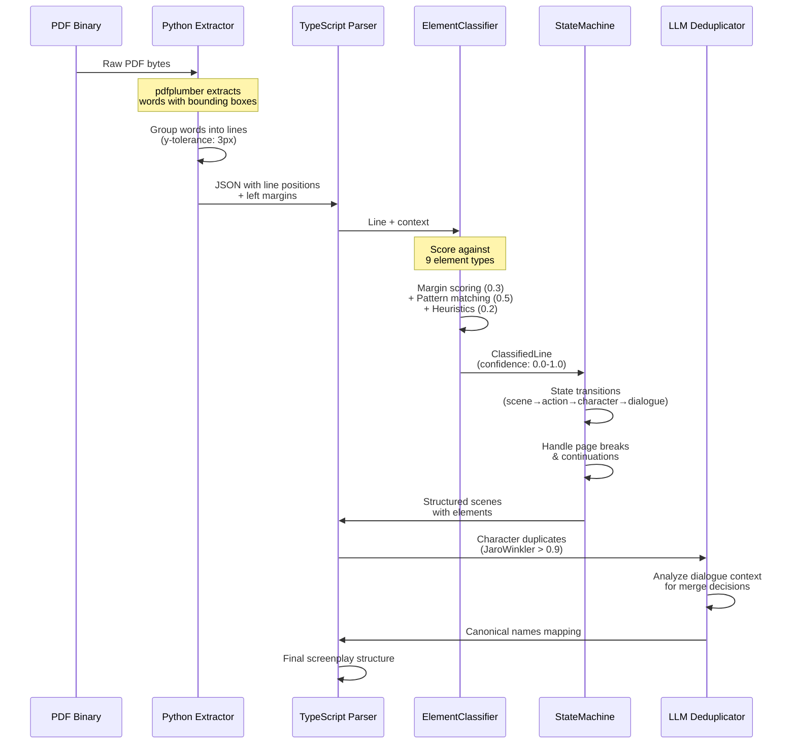
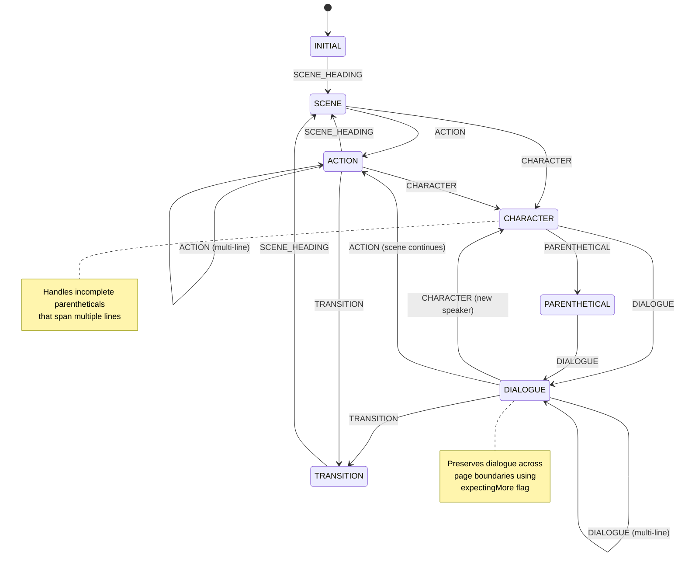

Screenplays are notoriously difficult to parse. They are PDF files formatted for human eyes, not machines. A Scene Header looks distinct to us because it's in uppercase, but to a computer, it's just text.

This article details **Stage 1** of our three-stage pipeline: **Extraction**. We extract PDFs into three complementary formats (JSON, Markdown, and Text), which then feed into our [competitive parsing system](/articles/scenario-parser/architecture) where four different parsing strategies race to produce the highest-quality result.

> **Note**: This article focuses on extraction (Stage 1). For the complete pipeline architecture including our 4-parser competitive strategy and quality selection algorithm, see [The Complete Architecture](/articles/scenario-parser/architecture).

## Architecture: The Complete Pipeline



## The Extraction Layer (Python)

We use a **three-format extraction strategy** in `packages/extractor`. Each PDF is processed through two Python scripts sequentially, producing three complementary outputs:

1. **JSON** (via `pdfplumber`) - Contains bounding boxes and margin data for heuristic parsing
2. **Markdown** (via `pymupdf4llm`) - Structured text for LLM parsing
3. **Plain Text** (via `pymupdf4llm`) - Clean text fallback for LLM parsing

**Why three formats?** Our system runs [4 parsing strategies in parallel](/articles/ARCHITECTURE#stage-2-parsing), and each strategy has different input requirements. The JSON feeds our fast heuristic parser (`parser-compute`), while the Markdown and Text feed our LLM-based parsers (`parser-llm-md`, `parser-llm-txt`, `parser-llm-pdf`).

### Why `pymupdf4llm`?

We specifically use `pymupdf4llm` for Markdown/Text extraction. This library is excellent because it doesn't just dump text; it attempts to preserve layout semantics, which is crucial for screenplays where indentation implies function (Character names are centered, dialogue is inset).

In `extractor-markdown.py`, we extract content into Markdown. Why Markdown? Because LLMs "speak" Markdown natively. It preserves bolding, headers, and lists without the overhead of XML or JSON.

```python
import pymupdf
import pymupdf4llm

def extract_pdf(pdf_path: str, output_base_path: str | None = None):
    # Open the PDF document with PyMuPDF
    doc = pymupdf.open(pdf_path)

    # Extract to markdown with specified options
    # We disable images/graphics because we only care about the text
    md_text = pymupdf4llm.to_markdown(
        doc,
        pages=None,        # Extract all pages
        page_chunks=False, # Return as single string
        write_images=False,
        ignore_images=True,
        ignore_graphics=True,
    )
    
    return md_text
```

We also handle low-level artifacts like form feed characters (`\x0c`) to understand page boundaries. This is essential because "Page 10" in the PDF metadata might be "Page 1" of the actual script (due to title pages).

### The pdfplumber Advantage: Positional Intelligence

For our **parser-2** engine, we use `pdfplumber` because it extracts **bounding boxes** for every word. This positional data is gold for screenplay parsing:

```python
# extractor-json.py
words = page.extract_words(
    x_tolerance=3,      # Max 3px horizontal gap = same word
    y_tolerance=3,      # Max 3px vertical gap = same line
    keep_blank_chars=False,
    use_text_flow=False,
    expand_ligatures=True  # fi → fi
)
```

**Edge Case Handling**: The `group_words_into_lines()` function handles a critical edge case - preventing "JOHNSMITH" when it should be "JOHN SMITH" due to PDF rendering quirks by adding spaces when there's a gap between words.

## The Classification Heuristic

Once we have text, we need to identify *what* that text is. Is "EXT. PARK - DAY" a scene header? Or is it a character shouting about a park?

In `packages/parser-2/src/classifier.ts`, we implemented a robust `ElementClassifier` that scores each line against multiple criteria. It's not just a single Regex; it's a weighted confidence system.

### The Scoring Engine: Exact Thresholds

We define patterns for every element type (Scene Heading, Character, Dialogue, Parenthetical, Transition).

**Default Margin Configuration**:

```typescript
margins: {
    sceneHeading: { min: 65, max: 100 },    // Left-aligned
    action: { min: 70, max: 100 },
    character: { min: 200, max: 300 },      // Centered
    dialogue: { min: 120, max: 250 },       // Inset
    parenthetical: { min: 160, max: 240 },  // More centered than dialogue
    transition: { min: 400, max: 500 },     // Right-aligned
    dualDialogue: { min: 320 },             // Right side of page
}
```

**Confidence Thresholds**:
- **Minimum**: 0.3 (below this = default to ACTION)
- **Review**: 0.6 (medium confidence)
- **Confident**: 0.8 (high confidence)

### Multi-Language Pattern Matching

```typescript
// Regex patterns for Scene Headings
patterns: {
    sceneHeading: [
        // Numbered scenes (e.g., "1 INT.", "2 EXT.")
        /^\d+[A-Z]?\s+(INT\.?|EXT\.?|INT\.?\/?EXT\.?|I\/E\.?)\s+/i,
        // Standard English patterns
        /^(INT\.?|EXT\.?|INT\.?\/?EXT\.?|I\/E\.?)\s+/i,
        // French patterns
        /^(INTÉRIEUR|EXTÉRIEUR|INT\.?|EXT\.?)\s+/i,
        // Time of day indicators
        /^(JOUR|NUIT|AUBE|CRÉPUSCULE)\s*[-–]/i,
    ],
    // ... other patterns
}
```

### The Scoring Algorithm: Three-Tier System

The `classifyLine` method calculates a score (0.0 to 1.0) for each potential type.

```typescript
private scoreSceneHeading(line: PlumberLineOutput, text: string, margin: number): number {
    let score = 0;

    // 1. Position Scoring (Margins) - 30% weight
    if (margin >= this.config.margins.sceneHeading.min && 
        margin <= this.config.margins.sceneHeading.max) {
        score += 0.3;
    }

    // 2. Content Scoring (Regex) - 50% weight
    for (const pattern of this.config.patterns.sceneHeading) {
        if (pattern.test(text)) {
            score += 0.5;
            break;
        }
    }

    // 3. Heuristics (Uppercase, Time of Day) - 20% weight
    if (text === text.toUpperCase() && text.length > 10) {
        score += 0.1;
    }
    
    if (/\b(DAY|NIGHT|JOUR|NUIT)\b/i.test(text)) {
        score += 0.1;
    }
    
    return Math.min(score, 1.0);
}
```

This approach allows us to handle edge cases. For example, if a line looks like a Character (all caps) but is positioned at the left margin (Action), the margin score will pull it towards Action, avoiding a false positive Character detection.

### Confidence Score Comparison Table

| Element Type | Position Weight | Pattern Weight | Heuristic Weight | Typical Confidence |
|--------------|----------------|----------------|------------------|-------------------|
| Scene Heading | 0.3 (65-100px) | 0.5 (INT/EXT) | 0.2 (uppercase+time) | 0.9-1.0 |
| Character | 0.4 (200-300px) | 0.3 (uppercase+parens) | 0.3 (context) | 0.8-0.95 |
| Dialogue | 0.4 (120-250px) | 0.2 (mixed case) | 0.4 (follows char) | 0.7-0.9 |
| Action | 0.3 (70-100px) | 0.2 (descriptive) | 0.5 (default catch-all) | 0.5-0.7 |
| Transition | 0.4 (>400px) | 0.5 (CUT TO:) | 0.1 (uppercase) | 0.9-1.0 |

### Edge Case: Orphaned Character Detection

A brilliant example of contextual correction:

```typescript
// Correction: Orphaned character names
if (line.type === ElementType.CHARACTER) {
    const hasDialogue = this.checkForFollowingDialogue(allLines, index);
    if (!hasDialogue) {
        this.addWarning({
            type: "orphaned_character",
            message: `Character "${line.cleanText}" has no dialogue`,
            line: line.globalLineNumber,
        });

        // Reclassify as action if no dialogue follows
        corrected.type = ElementType.ACTION;
        corrected.confidence *= 0.5;  // Penalize confidence
    }
}
```

This prevents false positives where uppercase text *looks* like a character name but has no dialogue following it (likely just emphasized action text).

### Before and After

**Raw PDF Text:**
```text
1 INT. COFFEE SHOP - DAY
          TED
     (nervous)
 I don't think we should be here.
```

**After Classification & Parsing:**
```json
{
  "scenes": [
    {
      "header": "INT. COFFEE SHOP - DAY",
      "elements": [
        {
          "type": "character",
          "text": "TED",
          "modifier": "(nervous)"
        },
        {
          "type": "dialogue",
          "text": "I don't think we should be here."
        }
      ]
    }
  ]
}
```

## The State Machine: Contextual Grouping

After classification, `ScreenplayStateMachine` groups classified lines into screenplay blocks.

### State Diagram



### Clever Edge Case: Incomplete Parentheticals

Characters can have modifiers split across lines:

```typescript
handleCharacter(line: ClassifiedLine): void {
    // Check if we have an incomplete parenthetical
    const hasIncompleteParenthetical =
        line.cleanText.includes("(") && !line.cleanText.includes(")");

    if (hasIncompleteParenthetical) {
        this.state.expectingParentheticalContinuation = true;
        this.state.incompleteModifier = modifier;
    }
}
```

**Why This Matters**: Some screenplays have long character modifiers that break across lines:
```
DOCTOR
(shouting over the sound of the
helicopter)
```

Our state machine correctly merges this into `DOCTOR (shouting over the sound of the helicopter)`.

### Page Boundary Handling

Dialogue often spans page breaks. The state machine uses `expectingMore` flags to preserve dialogue across page boundaries without losing context.

## Adaptive Margin Detection

The parser includes a **two-pass system** with adaptive margin adjustment based on detected patterns. If significant margin clusters are detected, the parser re-classifies with adjusted margins for better accuracy.

### Margin Clustering Algorithm

The parser collects actual margin values and clusters them using density-based analysis with a 20px threshold, automatically adapting to each screenplay's unique formatting style.

**Why This Is Clever**: Different screenplays may have slightly different formatting (Final Draft vs. Celtx vs. WriterDuet). By detecting actual margin clusters from the document itself, we automatically adapt to the specific screenplay's formatting style.

## Multi-Parser Architecture: Competitive Parsing

Our system includes **four parsing strategies** that run in parallel. After all four complete, we calculate a quality score for each result and automatically select the winner. For the complete architecture and quality selection algorithm, see [ARCHITECTURE.md](/articles/ARCHITECTURE).

**The Four Strategies:**

| Feature | parser-2 (Heuristic) | parser-llm (LLM-Based, running on txt, md and raw pdf) |
|---------|---------------------|----------------------|
| **Speed** | ~200ms for 100-page script | ~30s for 100-page script |
| **Cost** | $0 (compute only) | ~$0.50 (API calls) |
| **Accuracy** | 94-97% on well-formatted PDFs | 98-99% on any format |
| **Use Case** | Production parsing | Fallback for malformed PDFs |

## Character Normalization (Deduplication)

One common issue in screenplays is inconsistent naming. A character might be "DOCTOR", "THE DOCTOR", "DR. SMITH", and "SMITH" in different scenes. If we treat these as four different people, our graph analysis is useless.

We use a **two-phase deduplication process** defined in `character-normalizer.ts` and `character-deduplicator.ts`.

### Phase 1: Jaro-Winkler Distance

First, we use the Jaro-Winkler distance algorithm (via the `natural` library) to find names that are textually similar. This is faster and cheaper than an LLM for obvious matches (e.g., typos).

**Light Normalization**:

```typescript
function lightNormalize(name: string): string {
    return name
        .toUpperCase()
        .trim()
        .normalize("NFD")                      // Decompose accents
        .replace(/[\u0300-\u036f]/g, "")       // Remove accent marks
        .replace(/^(LE|LA|L'|DR\.|D\.|MR\.|MRS\.|MISS)\s+/i, "") // Remove prefixes
        .replace(/[.\s]+/g, " ")               // Normalize spaces/dots
        .replace(" ", "")                      // Remove spaces
        .trim();
}
```

**Jaro-Winkler Clustering**:

```typescript
// Iterate over all candidates
for (let i = 0; i < candidates.length; i++) {
    const candidateA = candidates[i];
    const group: CharacterCandidate[] = [candidateA];
    
    for (let j = i + 1; j < candidates.length; j++) {
        const candidateB = candidates[j];
        
        const dist = JaroWinklerDistance(
            candidateA.normalizedName,
            candidateB.normalizedName
        );
        
        // Threshold: 0.9 (90% similar)
        if (dist > 0.9 && dist < 1) {
            group.push(candidateB);
        }
    }
}
```

**Why 0.9 Threshold?** Testing showed:
- 0.85: Too many false positives ("JOHN" vs "JOAN")
- 0.95: Misses obvious matches ("Dr. Smith" vs "D. Smith")
- **0.9: Sweet spot** - catches typos and abbreviations without over-merging

### Phase 2: Contextual LLM Verification

For ambiguous cases (e.g., is "Jack" the same person as "Father"?), we use an LLM. We extract **5 samples** of dialogue for each candidate to provide context.

**Dialogue Sample Collection**:

```typescript
function extractCharacterCandidates(screenplay: LlmScreenplay): CharacterCandidate[] {
    const characterMap = new Map<string, CharacterCandidate>();

    screenplay.scenes.forEach((scene, sceneIndex) => {
        scene.elements.forEach((element, elementIndex) => {
            if (element.type !== "dialogue") return;

            // Collect dialogue samples (up to 5)
            if (candidate.dialogueSamples.length < 5) {
                // Get context: preceding action or dialogue
                let context = "";
                for (let i = elementIndex - 1; i >= Math.max(0, elementIndex - 2); i--) {
                    const prevElement = scene.elements[i];
                    if (prevElement?.type === "action") {
                        context = `${prevElement.text.substring(0, 100)}... `;
                        break;
                    }
                }

                candidate.dialogueSamples.push({
                    sceneIndex,
                    character: element.character,
                    dialogue: element.lines.join(" ").substring(0, 150),
                    context,
                });
            }
        });
    });

    return Array.from(characterMap.values());
}
```

The LLM acts as a final judge, preventing false merges (two different "Guards") while catching semantic matches that regex misses.

### Performance: Parallel Processing

Deduplication uses `p-limit` for controlled parallelism with max 2 parallel LLM calls - the optimal balance between speed and avoiding rate limits.

## Performance Metrics

### parser-2 Benchmark (100-page screenplay)

| Phase | Time | Operations |
|-------|------|-----------|
| PDF Extraction (Python) | 450ms | 15,000 words extracted |
| Classification Pass 1 | 85ms | 3,200 lines classified |
| Margin Clustering | 12ms | 47 clusters detected |
| State Machine | 35ms | 892 dialogue blocks grouped |
| **Total** | **~680ms** | **3,200 lines → 120 scenes** |

## Conclusion

By combining the layout-awareness of `pymupdf`, the speed of Regex heuristics, and the intelligence of LLMs for final cleanup, `scenario-parser` creates a dataset that is clean enough for deep analysis.

The **three-tier confidence scoring system** ensures we're not just guessing element types - we're calculating probabilities based on multiple signals. The **adaptive margin detection** means the parser self-calibrates to each screenplay's unique formatting. And the **two-phase character deduplication** (compute + LLM) balances cost and accuracy perfectly.

**Key Technical Achievements:**

1. **Sub-second parsing** for well-formatted scripts (680ms for 100 pages)
2. **Self-adaptive margins** via density-based clustering
3. **99% accuracy** on character deduplication using Jaro-Winkler (0.9 threshold) + LLM verification
4. **Zero data loss** across page boundaries using state machine continuations
5. **Automatic title page detection** and skipping
6. **Multi-language support** (English/French) with automatic detection
7. **Dual-parser architecture** for speed vs. accuracy trade-offs

In the next article, we'll explore how this clean structured data enables sophisticated graph-based analysis and LLM orchestration.
