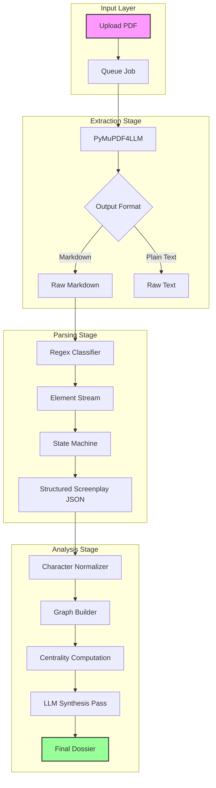

When building `scenario-parser`, the primary challenge wasn't just "calling an LLM." It was orchestration. A typical screenplay analysis involves processing hundreds of entities, thousands of interactions, and maintaining a coherent state across multiple asynchronous stages.

This article dissects the architecture of the pipeline, specifically focusing on concurrency control with `p-limit` and the implementation of Social Network Analysis (SNA) using `graphology`.

## The Pipeline Architecture

The system is designed as a linear, state-aware pipeline. Each PDF uploaded triggers a sequence of distinct stages: `Extractor`, `Parser`, and `Analyzer`. We use an event-driven approach where the completion of one artifact triggers the processing of dependent artifacts.

Here is the high-level flow of data through the system:



### Concurrency Control with `p-limit`

One of the most critical engineering decisions was how to handle scale. When analyzing a TV series season, we might have 10+ scripts processing simultaneously. Each script generates dozens of LLM calls (one per scene, one per character).

Blindly firing `Promise.all()` is a recipe for disaster:
1.  **Rate Limits:** OpenAI/Anthropic APIs will instantly 429.
2.  **Memory Pressure:** Node's heap will explode with thousands of pending promises.
3.  **Database Locks:** Writing results concurrently can deadlock the DB.

We solved this using `p-limit`. It’s a lightweight barrier pattern that restricts the number of promises running in parallel.

Here is the actual implementation from our `pipeline.ts`:

```typescript
import pLimit from "p-limit";
import { createComponentLogger } from "@scenario-parser/common";

// Global concurrency limiter: max 20 concurrent artifact processing jobs
// This ensures we don't flood the worker pool or external APIs
const processingLimit = pLimit(20);

/**
 * Trigger processing for a specific artifact type.
 * The job is wrapped in the limiter to ensure we respect global thresholds.
 */
export async function triggerArtifact(
    pdfId: string,
    artifactType: ArtifactType,
): Promise<void> {
    logger.info({ pdfId, artifactType }, "Triggering artifact");

    const processor = getProcessor(artifactType);
    const version = processor.getVersion();

    // Mark as pending immediately in the DB
    await ArtifactRepository.markAsPending(pdfId, artifactType, version);

    // Queue the processing job with concurrency control
    // Note: We don't await the limit() call here because we want to return 
    // to the API immediately while the job processes in the background.
    processingLimit(() => processArtifactInternal(pdfId, artifactType))
        .catch((err) =>
            logger.error({ pdfId, artifactType, err }, "Unhandled processing error"),
        );
}
```

This pattern allows us to "fire and forget" from the API controller's perspective, while the background worker efficiently chews through the queue at a safe, constant velocity.

## Social Network Analysis (SNA)

Once we have parsed the screenplay into structured data (Scenes, Characters, Dialogue), we don't just ask an LLM "who is important?". We *measure* it mathematically.

We use the `graphology` library to build a weighted undirected graph where:
*   **Nodes** are Characters.
*   **Edges** represent interactions (speaking in the same scene).
*   **Weights** are derived from the number of shared scenes and dialogue exchanges.

### The Metrics

We compute four distinct centrality metrics to determine a character's narrative role. This is a deterministic layer that grounds the LLM's later qualitative analysis.

#### 1. Degree Centrality (Social Breadth)
Simple count of connections. "How many people do you know?"
*   *Interpretation:* High degree characters are social hubs (e.g., the host of a party).

#### 2. Betweenness Centrality (Information Broker)
This is the most computationally interesting metric. It measures how often a node acts as a bridge along the shortest path between two other nodes.

The mathematical formulation for Betweenness Centrality $C_B(v)$ of a node $v$ is:

$$ C_B(v) = \sum_{s \neq v \neq t} \frac{\sigma_{st}(v)}{\sigma_{st}} $$

Where:
*   $\sigma_{st}$ is the total number of shortest paths from node $s$ to node $t$.
*   $\sigma_{st}(v)$ is the number of those paths that pass through $v$.

In our codebase, we use `graphology-metrics` to compute this efficiently:

```typescript
import Graph from "graphology";
import betweennessCentrality from "graphology-metrics/centrality/betweenness";
import { degreeCentrality } from "graphology-metrics/centrality/degree";
import eigenvectorCentrality from "graphology-metrics/centrality/eigenvector";

export function computeCentralityMetrics(
    graph: Graph,
    logger?: Logger,
): CentralityMetrics {
    // ... setup ...

    const degree = degreeCentrality(graph);
    
    // High betweenness indicates a "Connector" - someone who links disparate social groups.
    // In a screenplay, this is often the Protagonist or a key Messenger.
    const betweenness = betweennessCentrality(graph);

    // Eigenvector centrality can fail to converge on star graphs (common in TV pilots).
    // We wrap it in a try/catch to ensure pipeline resilience.
    let eigenvector: Record<string, number>;
    try {
        eigenvector = eigenvectorCentrality(graph);
    } catch (error) {
        logger?.warn("Eigenvector centrality failed to converge, using zeros");
        eigenvector = Object.fromEntries(graph.nodes().map((node) => [node, 0]));
    }

    return { degree, betweenness, eigenvector };
}
```

#### 3. Harmonic Centrality (The "Protagonist" Metric)
Standard Closeness Centrality fails in disconnected graphs (which screenplays often are—think A-plot and B-plot). If two characters are in separate storylines, the distance is infinite.

We use **Harmonic Centrality** instead, which sums the inverse distances:

$$ H(x) = \sum_{y \neq x} \frac{1}{d(y, x)} $$

If $d(y,x) = \infty$, the term becomes 0, handling disconnected components gracefully.

```typescript
/**
 * Computes harmonic centrality for all nodes.
 * Better than closeness centrality for graphs with disconnected components.
 */
function harmonicCentrality(graph: Graph): Record<string, number> {
    const result: Record<string, number> = {};
    const nodes = graph.nodes();
    const n = nodes.length;

    for (const source of nodes) {
        let harmonicSum = 0;
        for (const target of nodes) {
            if (source === target) continue;

            // Bidirectional shortest path (Dijkstra/BFS)
            const path = bidirectional(graph, source, target);

            if (path) {
                const distance = path.length - 1;
                if (distance > 0) {
                    harmonicSum += 1 / distance;
                }
            }
        }
        // Normalize
        result[source] = n > 1 ? harmonicSum / (n - 1) : 0;
    }
    return result;
}
```

### The Importance Score

Finally, we combine these raw metrics into a single "Importance Score" used to auto-classify characters as Leads, Supporting, or Day Players. This score is a weighted heuristic refined over analyzing hundreds of scripts.

```typescript
export function buildCharacterMetrics(
    name: string,
    dossier: CharacterDossier,
    graph: Graph,
    centralityMetrics: CentralityMetrics,
): CharacterGraphMetrics {
    const degree = centralityMetrics.degree[name] ?? 0;
    const betweenness = centralityMetrics.betweenness[name] ?? 0;
    const closeness = centralityMetrics.closeness[name] ?? 0; // Harmonic
    const eigenvector = centralityMetrics.eigenvector[name] ?? 0;

    // The Secret Sauce:
    // Harmonic centrality (0.3) is the strongest predictor of Protagonist status.
    // Dialogue count (0.2) is a brute-force check against silent observers.
    // Degree (0.15) captures social butterflies.
    // Betweenness (0.15) captures plot drivers.
    // Eigenvector (0.1) captures "friends of the king".
    
    const importanceScore =
        closeness * 0.3 +          // Story centrality
        degree * 0.15 +            // Social breadth
        betweenness * 0.15 +       // Bridge role
        eigenvector * 0.1 +        // Influence
        normalizeDialogue(dossier.dialogueCount) * 0.2 + 
        normalizeScenes(dossier.sceneCount) * 0.1;

    return {
        name,
        importanceScore,
        // ... other metrics
    };
}
```

## Conclusion

By combining an event-driven architecture guarded by `p-limit` with rigorous graph theory, `scenario-parser` achieves two goals:
1.  **Stability:** It processes heavy workloads without crashing.
2.  **Accuracy:** It grounds LLM "hallucinations" in mathematical reality. The LLM doesn't guess who the protagonist is; the Graph tells it.

In the next article, we will explore the "Extraction" layer—how we turn messy PDF bytes into the structured data that feeds this graph.
