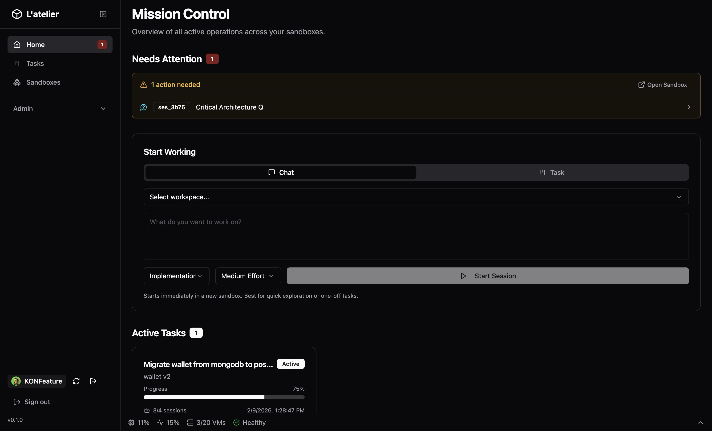
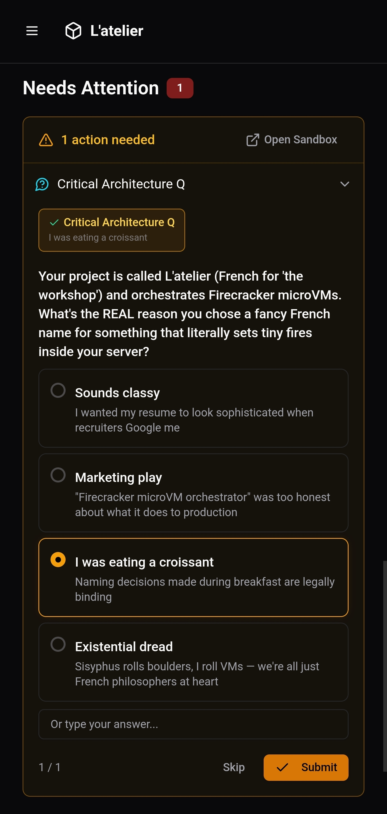
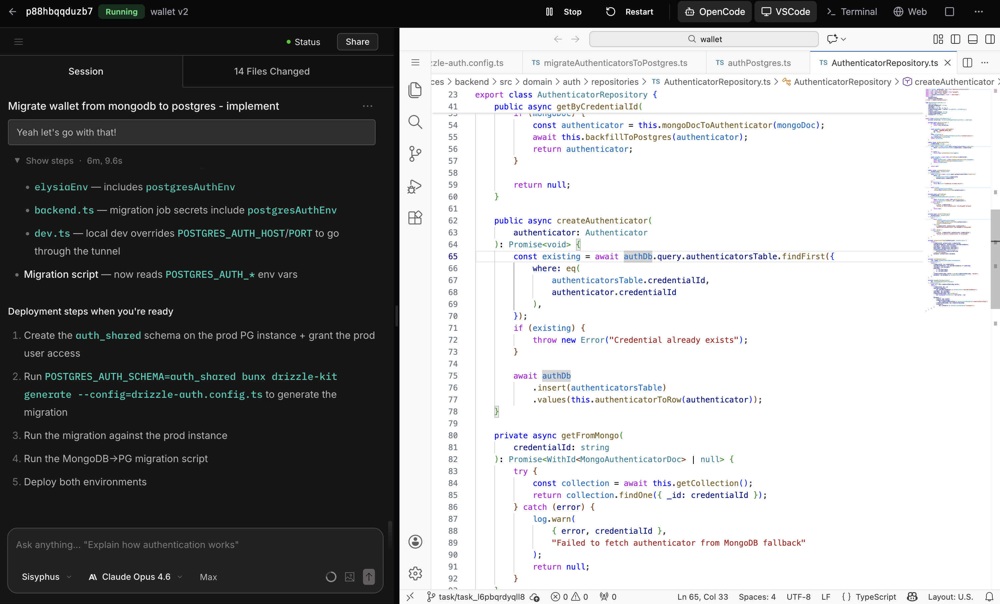
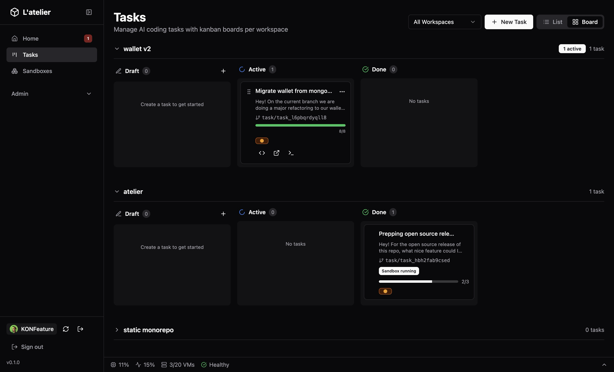

I was about to leave for a ski vacation. Two weeks off, a backlog of coding tasks I wanted to get done, and zero desire to sit in front of a laptop in a chalet when there's fresh powder outside.

AI coding agents — Claude Code, OpenCode, Cursor — are genuinely good now. Good enough that I trust them with real implementation work. But there's a catch nobody talks about: you can't walk away.



---

## The Babysitting Problem

Here's what "AI-assisted development" actually looks like today:

1. You open a terminal, start your AI agent
2. You give it a task
3. It starts working... then asks for file write permission
4. You approve. It works more. Then it has a question about your auth flow
5. You answer. It works more. Then it wants to install a dependency
6. You approve. Repeat for 45 minutes

You're not coding. You're not reviewing. You're *babysitting*. Sitting there, context-switching every few minutes, unable to do anything else meaningful because the agent might need you at any moment.

Now multiply that by three tasks in parallel. Three terminals. Three agents all needing input at different times. Your laptop fan is screaming. Context is colliding. You accidentally approve something in the wrong terminal.

This is not the "AI does the work while you think about architecture" future we were promised.

---

## Ramp Got There First

I'm not the first person to think about this. Ramp's engineering team built exactly this concept internally — they call it [Inspect](https://builders.ramp.com/post/why-we-built-our-background-agent). Each coding session runs in a sandboxed VM with their full dev stack, wired into Sentry, Datadog, GitHub, Slack, you name it. Engineers dispatch tasks, walk away, and check results later.

Their numbers speak for themselves: **~30% of all pull requests merged to their frontend and backend repos are written by their background agent.** It took just a couple of months to reach that level of adoption — without forcing anyone to use it.

Reading their post, I recognized everything I'd been frustrated by. Their framing crystallized it for me: background agents are strictly better than local when they're fast enough. Same intelligence, more power, unlimited concurrency. Your laptop doesn't need to be involved.

The difference: Ramp built Inspect as an internal tool for a 1000+ person company, backed by Modal for cloud VMs, Cloudflare Durable Objects for state, a Slack bot, a Chrome extension — the works. They published [a detailed spec](https://builders.ramp.com/post/why-we-built-our-background-agent) so anyone could replicate it.

I wanted the same thing, but self-hosted. One server, no cloud dependencies, no per-seat pricing. Something a solo dev or small team could run on a Hetzner box.

---

## What I Actually Wanted

The week before vacation, I wrote down what I needed:

- **Dispatch tasks and walk away.** Write a prompt, pick a repo, hit go. The agent gets its own isolated environment and starts working
- **Run tasks in parallel without conflicts.** Each task gets its own branch, its own sandbox, its own everything. No stepping on each other
- **Review from anywhere.** See progress, read code, check dev servers — from my phone, from a browser, from wherever I happen to be
- **Real isolation.** Not containers. Real VMs. If an AI agent goes rogue, it's trapped in a VM that I can kill, not a container namespace it might escape
- **Self-hosted.** I don't want to depend on Modal, Cloudflare, or anyone else's infrastructure. One bare-metal server, everything local

I looked at what existed. Cloud sandboxes (Codespaces, etc.) are vendor-locked and per-seat. Container-based "sandboxes" aren't real isolation. Ramp's spec was inspiring but assumed cloud infrastructure I didn't want to pay for.

So I built my own version. Different stack, same philosophy.

---

## L'Atelier

[L'Atelier](https://github.com/frak-id/atelier) is a self-hosted Firecracker microVM orchestrator. Each sandbox is a full virtual machine — VS Code, AI agent, browser, SSH — that boots in under 200ms.

The core idea — borrowed directly from Ramp's playbook: **treat AI agents like a dev team.** You're the manager, they're the ICs. Dispatch work, check progress, review results.

### Batteries Included

Every sandbox ships with a complete dev environment out of the box:

- **[code-server](https://github.com/coder/code-server)** — VS Code in the browser, zero local setup
- **[OpenCode](https://github.com/anomalyco/opencode)** — AI coding agent that runs inside the sandbox (same choice as Ramp — they called it "the strongest technical implementation")
- **Chromium via [KasmVNC](https://kasmweb.com/kasmvnc)** — full browser for previewing, testing, debugging
- **[Verdaccio](https://github.com/verdaccio/verdaccio)** — shared npm registry caching packages across all sandboxes

Each one accessible from any device via a unique `https://sandbox-{id}.your-domain.com` URL with auto-provisioned TLS.

---

## The Workflow: Dispatch, Ski, Review

Here's what my vacation actually looked like.

**Morning, on the ski lift:**

Open the dashboard on my phone. Create a new task: Migrate wallet authenticators from mongodb to postgres." Pick the workspace, pick "Implementation" at medium effort, hit start.

L'Atelier spawns a Firecracker VM, clones the repo, creates a git branch, injects the right secrets and OpenCode config, launches the AI agent with my prompt. Takes less than a seconds from prebuild.

I put my phone away. Go ski.

**Lunch break:**

Check the dashboard. The task card shows progress — the agent's todo list, which files it's touching, completion percentage. There's one item in the attention feed: the agent has a question about the project.


*Naming decisions made during breakfast are legally binding.*

I pick my answer, hit submit. The agent continues. I eat my tartiflette.

**Evening, back at the chalet:**

Task is done. I open the sandbox — OpenCode's summary on the left, VS Code on the right. 14 files changed. The migration script reads the right env vars,the auth repository handles both MongoDB fallback and Postgres, the deployment steps are laid out.


*OpenCode shows what it did. VS Code shows the actual code. Same sandbox, one click.*

I check the dev preview URL to make sure nothing's broken. Everything looks good. I mark the task complete.

Three tasks dispatched that day. Zero terminal babysitting. My laptop stayed in my bag.

---

## Task System: Your AI Kanban



The dashboard is mission control. Tasks live on a kanban board — **Backlog → In Progress → Done** — with each card showing:

- The prompt and target workspace
- Which git branch was created
- Real-time progress from the AI agent (todo items, completion %)
- An attention indicator when the agent needs human input

You define tasks with a prompt and a **session template**. Four built-in workflows:

| Template | What it does |
|----------|-------------|
| **Implementation** | Main dev work — 4 effort levels from Sonnet to Opus with plan mode |
| **Best Practices Review** | Code quality, patterns, anti-patterns |
| **Security Review** | Injection, auth, data exposure, dependency audit |
| **Simplification** | Remove complexity, consolidate, clean up |

Templates are customizable globally, and per workspace. You can define your own models, effort levels, and prompt templates.

**The real power is chaining.** Dispatch an implementation task. When it's done, dispatch a security review on the same branch. Then a simplification pass. Each one runs in its own sandbox, on its own schedule, without blocking you.

---

## Workspace Definitions: Configure Once, Spawn Many

A workspace defines everything a sandbox needs:

- **Git repositories** to clone
- **Init commands** — `bun install`, `cargo build`, whatever setup is needed
- **Dev commands** — `npm run dev` on port 3000 → gets a public HTTPS URL automatically
- **Secrets** — env vars and files injected at boot
- **Resource limits** — vCPUs (1-8) and RAM (512MB-16GB) per sandbox
- **OpenCode config** — model preferences, MCP servers, custom instructions — replicated to every sandbox

Define it once. Every sandbox spawned from that workspace gets the same environment. No "works on my machine." No 20-minute setup.

---

## Prebuilds: Why It's Fast

Ramp rebuilds their sandbox images every 30 minutes and restores from snapshots. Same idea here, but with bare-metal LVM instead of Modal's cloud snapshots.

Without prebuilds, spawning a sandbox means: boot VM → clone repo → install dependencies → ready. That's 2-5 minutes.

With prebuilds:

1. **Once (in background):** Boot VM → clone → install → snapshot the entire VM state (disk + memory)
2. **Every spawn after:** Restore from snapshot → ready. Under 200ms

The trick is **LVM thin provisioning**. Each sandbox's disk is a copy-on-write clone of the prebuild snapshot. The clone operation itself takes <5ms and uses zero additional disk space until the sandbox actually writes something. Only changed blocks are stored.

```
┌──────────────────────────────────────────────────────┐
│                  LVM Thin Pool                       │
│                                                      │
│  prebuild-myproject (5GB, fully set up)              │
│       │                                              │
│       ├── sandbox-abc (CoW clone, ~0 MB initially)   │
│       ├── sandbox-def (CoW clone, ~0 MB initially)   │
│       └── sandbox-ghi (CoW clone, ~12 MB delta)      │
│                                                      │
│  Only changed blocks stored per sandbox              │
└──────────────────────────────────────────────────────┘
```

This means you can run 20 sandboxes from the same prebuild and they'll collectively use barely more disk than the original. The Firecracker memory snapshot means the VM doesn't even need to boot the kernel — it restores mid-execution.

---

## Why Firecracker, Not Containers

This is where L'Atelier diverges most from Ramp's approach. They use Modal (cloud VMs). Most open-source sandbox tools use containers. We use [Firecracker](https://firecracker-microvm.github.io/) — the technology behind AWS Lambda and Fargate.

Why it matters: containers share the host kernel. An AI agent with root inside a container is one kernel exploit away from owning your host. Container escapes are a [well-documented attack class](https://nvd.nist.gov/vuln/detail/CVE-2024-21626). When you're giving an AI agent `sudo` and telling it "do whatever you need to get this working," you want real isolation.

Firecracker runs each sandbox in its own microVM with its own kernel. Hardware-level isolation via KVM. The attack surface is minimal: Firecracker's VMM is ~50k lines of Rust, purpose-built for multi-tenant isolation.

The tradeoff: you need bare-metal KVM. No running this on a Mac or inside another VM (nested virtualization aside). But a Hetzner dedicated server with KVM costs less than what you'd pay for 3 Codespaces seats — and you get unlimited sandboxes.

---

## Architecture: The 10,000ft View

```
┌─────────────────────────────────────────────────────-─┐
│  Dashboard (React)          CLI (Bun compiled binary) │
│       │                            │                  │
│       └──────────┬─────────────────┘                  │
│                  │ REST API                           │
│           ┌──────▼──────┐                             │
│           │   Manager   │  ElysiaJS on Bun            │
│           │  (port 4000)│  SQLite (Drizzle ORM)       │
│           └──────┬──────┘                             │
│                  │ vsock                              │
│     ┌────────────┼────────────┐                       │
│  ┌──▼──┐     ┌──▼──┐     ┌──▼──┐                      │
│  │ VM1 │     │ VM2 │     │ VM3 │  Firecracker VMs     │
│  │agent│     │agent│     │agent│  (Rust binary)       │
│  └─────┘     └─────┘     └─────┘                      │
│                  │                                    │
│           ┌──────▼──────┐                             │
│           │    Caddy    │  Auto HTTPS, dynamic routes │
│           └─────────────┘                             │
└─────────────────────────────────────────────────────-─┘
```

Four components:

- **Manager** — ElysiaJS API on Bun. Orchestrates sandbox lifecycle, task dispatch, workspace management. SQLite for state
- **Dashboard** — React SPA. Mission control for sandboxes, kanban for tasks, attention feed for agent requests
- **CLI** — Compiled Bun binary for server provisioning. `atelier init` sets up everything on bare metal
- **Sandbox Agent** — Rust binary running inside each VM, communicating with the manager via Firecracker's vsock

**Why Rust for the agent?** I went through three runtimes. Started with Bun — but vsock support was poor, and it crashes inside Firecracker VMs anyway (AVX instructions trigger SIGILL on the minimal CPU template). Switched to Deno — worked nicely, but the bundle size was massive for something running inside every VM. Landed on Rust: lighter binary, better memory and CPU efficiency, granular control over process management, and a proper watchdog with auto-restart that's painful to get right in a JS runtime. It ships as a static musl binary — no runtime dependencies, minimal footprint.


---
## Ramp's Spec vs. L'Atelier

For the curious, here's how L'Atelier maps to [Ramp's published spec](https://builders.ramp.com/post/why-we-built-our-background-agent):

| Ramp (Inspect) | L'Atelier | Notes |
|-----------------|-----------|-------|
| Modal cloud VMs | Firecracker microVMs | Self-hosted, bare-metal KVM |
| Cloudflare Durable Objects | SQLite + SSE | Simpler, no cloud dependency |
| Slack bot + Chrome extension + Web | Dashboard + VS Code + Terminal | Web-first, no Slack integration (yet) |
| Image rebuild every 30min | Prebuilds (on-demand snapshots) | Rebuild when you want, not on a timer (and track git branch hash, so rebuild when branch changes) |
| OpenCode | OpenCode | Same choice — best agent runtime |
| GitHub auth for PRs | GitHub App integration | Same approach |
| Multiplayer sessions | One user per sandbox | Not a priority for solo/small teams |

The biggest philosophical difference: Ramp optimizes for a large org with shared infrastructure. L'Atelier optimizes for independence — one server, no external services, full control.

---

## Running It

### On a server

```bash
curl -fsSL https://raw.githubusercontent.com/frak-id/atelier/main/infra/scripts/install.sh | bash
```

You need: Debian / Ubuntu, bare-metal KVM, x86_64 CPU, a domain with wildcard DNS, ports 80/443 open.

### Locally (mock mode)

No server needed. The manager runs with simulated sandboxes:

```bash
bun install
ATELIER_SERVER_MODE=mock bun run dev
# API:       http://localhost:4000
# Swagger:   http://localhost:4000/swagger
# Dashboard: http://localhost:5173
```

---

## What's Next

L'Atelier runs my daily workflow today. Current priorities:

1. **GitHub App integration** — trigger tasks from PR comments or issue labels
2. **Multi-server** — distribute sandboxes across multiple machines
3. **Cost dashboard** — track API spend per task, per workspace

The vision: a self-hosted AI dev team that scales with your ambition, not your wallet.

---

## Why Open Source This?

Ramp published their spec and said "anyone should be able to build this." I agree — but specs and working software are different things. Setting up Firecracker, LVM thin provisioning, vsock communication, dynamic Caddy routing, and stitching it all together with a dashboard is a few months of work even if you know what you're building.

I built L'Atelier because I needed it. The skiing vacation was the forcing function, but the underlying problem — AI agents are powerful but require constant attention — isn't going away. If anything, as agents get more capable, the orchestration layer around them becomes more important, not less.

Ramp proved the model works at scale. L'Atelier makes it accessible to everyone else.

---

## Links

- **L'Atelier**: [github.com/frak-id/atelier](https://github.com/frak-id/atelier)
- **Ramp's Inspect spec**: [builders.ramp.com/post/why-we-built-our-background-agent](https://builders.ramp.com/post/why-we-built-our-background-agent)
- **Firecracker**: [firecracker-microvm.github.io](https://firecracker-microvm.github.io/)
- **OpenCode**: [github.com/anomalyco/opencode](https://github.com/anomalyco/opencode)

---

**Tech Stack**:
- **Server**: Any bare-metal KVM host (Hetzner, OVH, etc.)
- **Runtime**: Bun (manager, CLI, dashboard), Rust (in-VM agent)
- **Framework**: ElysiaJS (API), React + TanStack (dashboard)
- **Infrastructure**: Firecracker, LVM thin provisioning, Caddy, SQLite
- **AI Integration**: OpenCode with customizable session templates
