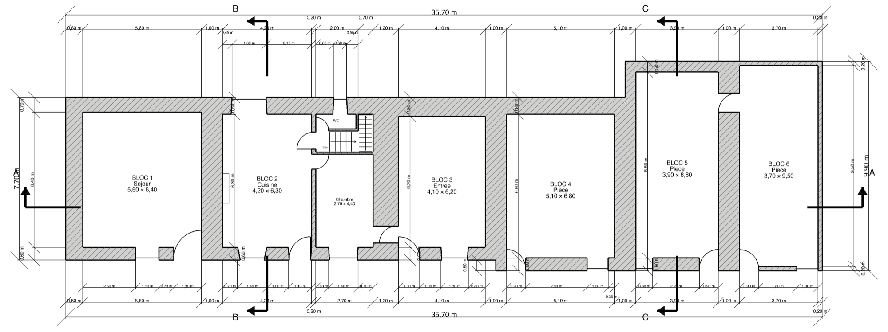
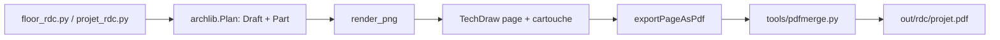
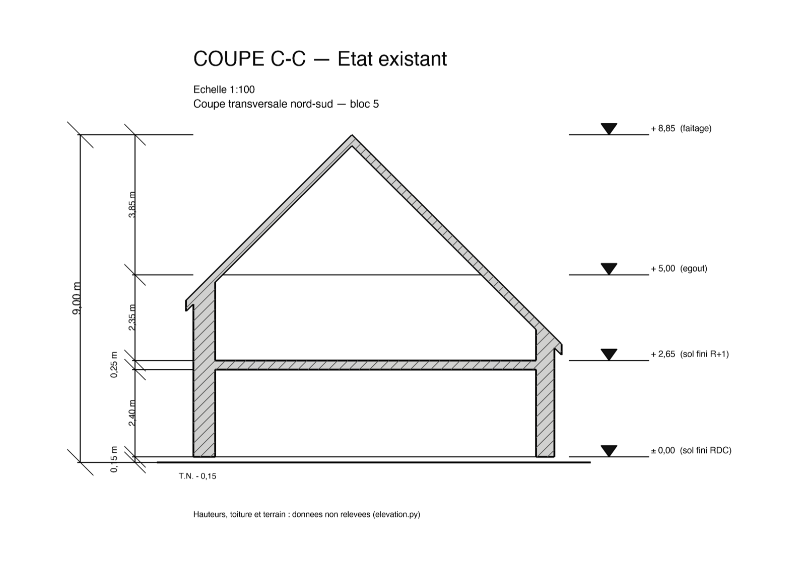

The house is a longère, a long farmhouse one room deep: six blocs in a row, 35.70 m end to end. The south front is stone, most other walls are bauge (cob: earth packed by hand into walls up to a metre thick), and bloc 6 is a parpaing (concrete block) shell. It is a family house. The west half is the old dwelling; the east half is a barn range that the project turns into rooms. Changing any of it takes paperwork, and in France the paperwork for building work is mostly drawings.

A permis de construire (building permit) dossier is a set of numbered drawings, and each one is a legal document. The floor area printed on a sheet goes onto the Cerfa, the official application form. The scale bar claims that a centimetre on paper is a metre on site. Leave a window off a plan and the sheet shows a blind wall where there is glass. None of these errors announce themselves: a sheet at the wrong scale looks exactly as tidy as one at the right scale.

I am not an architect, and I did not want to learn a GUI CAD package well enough to draw this by hand, then redraw it every time a tape measurement changed. So the plans are Python. FreeCAD does the geometry, an AI coding agent writes most of the code and drives FreeCAD through an MCP (Model Context Protocol) server, and I go to site with a tape measure. The private repo had 74 commits by 2 September, 48 of them in the last five days, when the floor plans grew into a full set with sections, facades and a site plan.

Every height on the sections and facades is still a placeholder, and whether I may sign the sheets at all is a question for the mairie (town hall). What I would carry to other projects is narrower than "CAD as code": the checks that caught real errors compared the drawing with something outside the geometry model.

## What a Permit Dossier Contains

For a house, the dossier pieces are numbered PCMI1, PCMI2 and so on (PCMI: permis de construire pour une maison individuelle et/ou ses annexes). The repo produces three of the drawn pieces, plus a floor plan per level:

| Piece | French name | What it shows |
|---|---|---|
| PCMI2 | plan de masse | the building on its plot, access, networks, trees (1:500 here) |
| PCMI3 | plan de coupe | a vertical section through the terrain and the building |
| PCMI5 | plan des façades et des toitures | each elevation and the roof |
| floor plans | plans de niveau | one plan per storey, at 1:100 |

ISO 7518 recommends issuing both the original building with the alterations marked and a drawing of the transformed one. So each floor plan exists in three states: `existant` (the survey), `travaux` (the proposed walls with a yellow demolition and red construction overlay) and `projet` (the same walls, plain). `travaux` and `projet` are one build rendered twice, and `verify_styles()` asserts that only the overlay differs. The coupes and facades are issued as `existant` and `projet`.

Demolition is also thin and crossed and new work thick and counter-hatched, so a black and white photocopy still reads. The tints are customary; the Code de l'urbanisme articles listing the pieces (R.431-7 to R.431-10) set no colour code.

`build_dossier(floor, variant)` writes one PDF per floor per state: the whole floor on A2, then the two halves (blocs 1 to 3, blocs 4 to 6) on A3, all at 1:100.

## Survey In, Geometry Out

The survey lives in Markdown, and the agent transcribes it into Python data modules. In June the geometry model already had a solver for irregular quadrilaterals, waiting for per-wall measurements. Those arrived in July: four wall lengths and a diagonal for most rooms of the old dwelling, a length and a width for the barn blocs, and widths and offsets for most openings. Then I asked for straight outer walls and rectangular rooms instead. The July rewrite set the solver aside, ignored the diagonals and rounded every measurement to 0.1 m.

Rounding that hard only works because of how walls are modelled. Each bloc is a cell, the rooms are placed inside it, and the hatched wall (the poché) is whatever is left: cell minus rooms minus openings. Adjacent cells fuse into one run of masonry. A shallow room just gets a thicker cob wall. That residual is also why I keep FreeCAD's Arch and BIM workbenches out: `Arch.makeWall` normally takes a centreline and a declared thickness, while this model treats thickness as whatever is left once the rooms are placed, and an Arch window cuts a straight opening, where a window in a metre of cob has a splayed reveal.



Everything else uses three FreeCAD workbenches: Draft (2D lines and dimensions), Part (the OpenCASCADE geometry kernel) and TechDraw (paper sheets with a title block, the cartouche). The plan itself reaches the sheet as a high-resolution PNG, because TechDraw's vector view drops every SVG text element, dimensions and labels included. A data module becomes a PDF in a handful of steps:



The same scripts run through the MCP server (how the agent works), in FreeCAD's Python console, or headless with `freecadcmd`. Headless, a missing GUI layer leaves every `ViewObject` (the display properties: line widths, colours, fonts) empty, and the export still writes a PDF without them.

## Three Surfaces Per Room

The first sheets printed one area per room under a caption reading "SURFACE UTILE". Two legal floor areas matter here, and the caption named neither (surface utile is itself a third legal term, from subsidised housing, which the table did not mean either). Each sheet now carries both, plus a raw sum:

| Column | What it is | Text | Used for |
|---|---|---|---|
| SDP | surface de plancher | Code de l'urbanisme R.111-22 | the permit form |
| SHAB | surface habitable | Code de la construction et de l'habitation (CCH) R.156-1 | leases |
| BRUTE | sum of finished floors | none | my renovation quantities |

For most rooms the three agree. They split exactly where the texts do, and two of those places run against intuition. A staircase counts in SDP at the level it stands on; what R.111-22 deducts is the trémie, the hole in the floor above. SHAB drops stairs entirely. And a chaufferie (boiler room) counts in SDP, because the "locaux techniques" deduction applies to buildings other than a single house, as R.111-22 itself says.

No surface rule looks at a room's name. A room declares a `usage`, and its counting rule comes from one table in `surfaces.py`:

```python
# usage -> (counts in SDP?, in SHAB?, is it floor at all?, why)
USAGES = {
    "habitable": (True,  True,  True,  "piece de vie, circulation interieure"),
    "technique": (True,  False, True,  "chaufferie/local technique: compte en SDP (R.111-22"
                                       " 6 ne vise que le collectif), mais exclu de la SHAB"
                                       " comme dependance (R.156-1: remises et autres"
                                       " dependances des logements)"),
    "escalier":  (True,  False, True,  "emprise au niveau de depart = SDP; R.156-1 deduit"
                                       " les marches et cages d'escaliers"),
    "tremie":    (False, False, False, "vide sur niveau inferieur: R.111-22 2"),
    # ...
}
```

The biggest row is the interior walls. SDP is measured from the inner face of the facades, so it includes every partition and every cross wall between blocs; SHAB deducts them. The room polygons are a SHAB basis, so a `cloisons` row adds the walls back. With cob cross walls 0.80 to 1.00 m thick, the first version of that row came to about 53 m², and SDP to 259 m².

Three challenges to the table came in the same night, and two of them were right. The first found a bug. The envelope came from insetting each cell by a uniform 0.80 m, but in the model bloc 5's north wall came out at 1.50 m and bloc 1's at 1.20 m. So 12 m² of exterior cob had been relabelled as interior partition, inflating the declared SDP. The envelope is now read off the outermost rooms, which is where the inner face of a facade is by definition. Cloisons dropped to 41.09 m² (it had been 53.25) and SDP to 246.85 m² (it had been 259.01). The second took the chaufferie out of SHAB, as a dépendance (an annex such as a shed or store); that is a judgement call worth 14.08 m² of SHAB, and reversing it is a one-word change.

The surface law now lives in `surfaces.py`, which runs without a CAD kernel. Its guard on the SDP figure, `surface_faults()`, used to test room corners against bounding boxes and overlaps on a 6×6 grid of sample points. A thin overlapping strip falls between those samples and lands silently in `cloisons()`, then on the form. It now triangulates and clips the polygons. Injected faults prove it: a 4.00 × 0.01 m overlap now reports 0.0400 m², where the old tests reported nothing.

The ground floor alone carries 246.85 m² of SDP, and past 150 m² a private individual loses the right to draw their own permit and has to engage an architect (R.431-2), judged on the total after works. Whether that applies depends on whether these works need a full permis de construire or only a déclaration préalable (the lighter prior declaration). That is open, and it decides who signs the drawings.

## Every PDF So Far Was Wrong

The scale was fixed once already in June: the sheets came out at 1:80, and the fix changed the render size until the arithmetic landed on 1:100. It landed there for one camera. On 31 August the coupes arrived with a much wider one, and the agent measured the exported PDFs against the scale bar. TechDraw draws that embedded PNG (a `DrawViewImage`) at its own pixel count taken as 254 dpi, times the view's `Scale`. `Width` and `Height` only crop. The sheets had been setting `Width` and leaving `Scale` at 1.0:

| Sheet | Drawing width on paper | Expected | Real scale |
|---|---|---|---|
| ground floor plan | 390.7 mm | 409.2 mm | 1:105 |
| coupe A-A | 275.5 mm | 440.0 mm | 1:160 |

At 4.7% off, a 5.00 m room measured 4.77 m on paper. The plans looked fine because the plan camera happened to give a scale close to 1:100. The fix pins `Scale` from the PNG's own header and raises if the image would be cropped:

```python
# archlib.py, Plan.sheet()
px_w, px_h = png_size(png)
img.ScaleType = "Custom"
img.Scale = img_width * IMAGE_PX_PER_MM / float(px_w)
# Width/Height still CROP. Scale is pinned on the width, so a PNG whose aspect does
# not match the paper box loses its top and bottom - silently, and only on the PDF.
placed_h = px_h / IMAGE_PX_PER_MM * img.Scale
if placed_h > img_height + 0.5:
    raise ValueError(
        # ...
        "build both from one archlib.render_window() via paper_size_mm()."
        # ...
    )
```

The re-measured coupe came out at 439.9 mm against 440.0. Scale errors are the one error a drawing cannot report, so the scale now has to be right by construction.

It was not the only error of that kind. `archlib.dim()` set five dimension properties inside one shared `try/except`, and the second, `ArrowSize`, does not exist in this FreeCAD version. Every sheet exported until then had no dimension terminators. Once the drawings were georeferenced against the cadastre, the compass, static template art asserting north is up, turned out 17.4 degrees off. Each of these produced a sheet that looked finished.

## Verifiers That Say What They Did Not Check

`build_plan.py` carries four verifiers for surfaces, dimensions, styles and openings. The openings one exists because of a specific failure. When the north facade was first drawn in elevation, it came back with one window on it. Three openings the survey had found were simply absent from the projet: a WC window downstairs, a bathroom window and a landing bay upstairs. A plan draws an opening as a gap in a wall, and a missing gap looks exactly like wall. `verify_openings()` now compares survey against projet on the outer face span, the hole the mason left, and fails on any opening that disappears. Removing one on purpose means naming it in `OPENINGS_CONDAMNEES`; omission is not a decision. The one real clash, a new bathroom wall landing across the landing bay, stays drawn so someone has to decide.

Running checks used to mean a GUI session, because `build_plan.py` used `App` without importing it. Once one import line fixed that, an adversarial review of the cleanup found that headless `verify_dims()` reported OK while doing almost nothing. Two of its three checks read `FontSize` and `TextPosition` off the `ViewObject`, which does not exist under `freecadcmd`, and both sat in a bare `except: continue`. The verifier now drives those checks off an explicit list of dimensions that have a view object and prints `NOT CHECKED` with the names of the skipped tests. A check that cannot run has to say so.

A small runner, `tools/check_headless.py`, then made the verifiers a command that answers in seconds:

```python
g = {"__name__": "check_headless", "__file__": os.path.join(ROOT, "build_plan.py")}
exec(open("build_plan.py").read(), g)

ok = True
ok &= bool(g["verify_surfaces"]())
ok &= bool(g["verify_dims"]())
print("CHECK HEADLESS:", "OK" if ok else "FAILED")
```

## Cheap Enough to Rerun

All of this only works if a full rebuild is cheap, and `build_all()` took 176 s. A `cProfile` run on one sheet found mostly work nobody asked for. Draft's `make_*` helpers end by selecting the object they created, a courtesy for someone drawing by hand: 251 calls, 2.5 s of a 4.9 s sheet build, now patched out by `archlib.quiet_draft()`. That patch, a smarter hatch and dropping one unread SVG export brought the build down to 95 s. Later the agent found that `build_dossier` never closed its page documents: the same work then took 358 s instead of 95 s, and with one more verifier ahead of it, FreeCAD crashed. Once that was fixed, `build_all()` ran in 85 s with the FreeCAD window in front (macOS throttles it in the background).

One old workaround went too. The poché used to be built through 3D solids, because a comment said 2D face-fuse was unreliable in OpenCASCADE. On OCC 7.8.1 the 2D result was identical and about seven times faster, provided the faces sit in a `Part.Shell`; on a plain compound, every seam between wall pieces survives as an ink line.

## A Z Axis, Profiled Before It Was Built

A coupe is required, and nothing in the repo knew how high anything was. Whether to move to BIM or to drop the solid modeller and draw raw 2D had been argued from intuition. The first had a short answer: IFC, the BIM exchange format, has no consumer when the deliverable is a PDF. A profiling script, `tools/profile_build.py`, answered the second: solid geometry was 7.4% of a full ground-floor sheet, and the output steps 44%.

So the library got a `Plane`, declared by its two in-plane axes, with the normal derived, because a left-handed frame renders a blank PNG and raises nothing. `elevation.py` holds levels, eaves, ridge and the sill and head of every opening, and every number in it is a placeholder until the site survey. The roof declares one ridge and derives the eaves, so blocs of different depth land lower instead of growing three ridges at three heights:

```text
  range      axis  footprint (m)    pente    egout derive  libre au mur R+1
  blocs 1-3  x      0.50..8.20  x 7.70  45.0 deg    5.00 / 5.00    2.35 / 2.35
  bloc 4     x      0.00..8.20  x 8.20  45.0 deg    4.50 / 5.00    1.85 / 2.35
  bloc 5     x      0.00..9.90  x 9.90  45.0 deg    4.50 / 3.30    1.85 / 0.65
  bloc 6     y     31.30..35.70 x 4.40  28.1 deg    6.85 / 4.50    4.20 / 1.85
```

In the columns, `axis` says which way the roof slopes, `pente` is the pitch, `egout derive` the derived eaves height on each side, and `libre au mur R+1` the wall height left upstairs. Bloc 6 is a lean-to (a monopente), a single pitch running west to east. Bloc 5's north eaves at 3.30 m came out of the geometry; nobody typed them. They leave almost no wall at the north end of its upstairs room.



The vertical data has to come from site, so I have a one-page checklist in French for the visit, with the assumed value beside each blank and the 25 exterior openings enumerated from the survey modules. With exposed joists, ceiling height is ambiguous by about 20 cm, so the height to take is under the joists. That height feeds the 1.80 m rule: floor under 1.80 m of headroom counts in neither SDP nor SHAB.

## When the Site Disagreed With the Model

I came back from site and reported that blocs 4, 5 and 6 stand about 50 cm further south than the rest of the front. The model had one south line for all six blocs, so bloc 4's depth was measured from a face 0.50 m too far north, and blocs 1 to 3 were carrying north walls of 1.20, 1.30 and 1.40 m to reach a line set by bloc 4. They are now 0.70, 0.80 and 0.90 m, and the west facade totals 7.70 m against a taped 7.8.

Bloc 6 taped 0.15 m walls where the model had assumed 0.80 m of cob, and the building got 0.60 m shorter (36.30 down to 35.70 m). Those measured walls now pin the north line of blocs 5 and 6, so bloc 5's north wall, the one unmeasured link on that facade, takes the slack: 0.50 m instead of an implausible 1.50 m.

The site plan taught the same thing at a larger scale. The yard was first drawn from a description, a 5 m strip along the facades. A screenshot from an online map, georeferenced by hand, showed a farmyard 15 m deep, three times the surface. The code had drawn the description faithfully. (The screenshot trace was itself corrected once official orthophotos replaced it.) Trees then came off a colour vegetation index across nine orthophoto campaigns, until the house's owner looked at the sheet and rejected two of them. A dense canopy is dark, so the detector had locked onto sunlit crown rims and put one tree 15 m from its trunk. Near-infrared fixed it. As the agent put it in the commit: "A detector that is confidently wrong satisfies validity checks, because validity checks ask whether an answer is well-formed, not whether it is true."

Accuracy was not enough either. Thirteen traced vegetation masses, correct to within a few percent, buried the building at 1:500, and the owner had most of them taken off.

## Who Does What

The commits, mostly written by the agent, quote me in the third person, and those quotes are where many corrections started: "Quentin: 'tier 2 lines are shorter than tier 1, is that normal?' Half of the premise is wrong and the other half found a real defect." Each facade carries three tiers of dimensions: openings innermost, then walls, then the overall length. The defect: on the north facade, which then carried a single window, the innermost dimension line carried a 26.85 m segment and ended up coarser than the line outside it.

My side is the tape measure, the site visits, reading the printed sheets, and the calls left open for a human, such as what to do about the landing bay clash. The agent's side is everything that can be checked: the geometry, the verifiers, the standards research behind each rule.

Two files make that split hold across sessions. `AGENTS.md` (220 lines, about 24 KB) is the rulebook, and its rules carry their reasons, so the next session does not relitigate them. `FOLLOWUP.md` is the memory: numbered open items and FreeCAD gotchas, such as the MCP server's async execute call crashing FreeCAD.

The split was not always clean. The survey file still ends with a block from the very first commit, headed "System Prompt for CAD Agent", telling the agent never to assume right angles. My July instruction said the opposite. A subagent doing the orthogonal rebuild flagged the footer as an injected instruction and ignored it. In effect, the injection was a stale instruction of mine. Instructions belong in `AGENTS.md`, never at the bottom of a data file.

## What Is Still Open

Every height is a placeholder until the elevation survey happens: floor levels, eaves, ridge, and sill and lintel for 25 openings. The sheets say so in their own text. The régime question (full permit or prior declaration) and the architect threshold still have to be confirmed with the mairie. The cadastre puts the west gable 1.2 to 3.6 m short of the model and skewed, and the survey fails to close at that same end by about a metre, so that gable needs a tape and a diagonal. Text on the two inner dimension tiers prints at 1.8 and 2.2 mm, under the 2.5 mm minimum usually quoted from NF P02-001. The model assumes no floor sits under 1.80 m of headroom, so upstairs SDP and SHAB are overstated until the roof is measured.

The [electrical panel optimizer](/articles/side-projects/tableau-elec-3-phase-optimizer/) took the same approach to a different rulebook: encode the rules as data and let a program check them. Checks that only looked at the model kept passing, and the real errors were caught by the site, the paper and the owner's eye.
