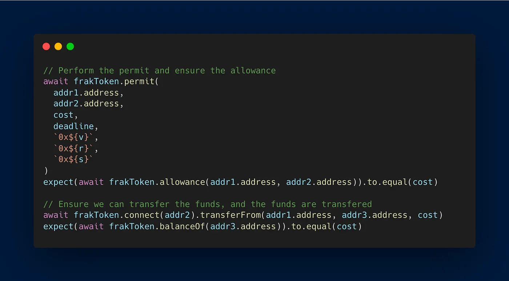
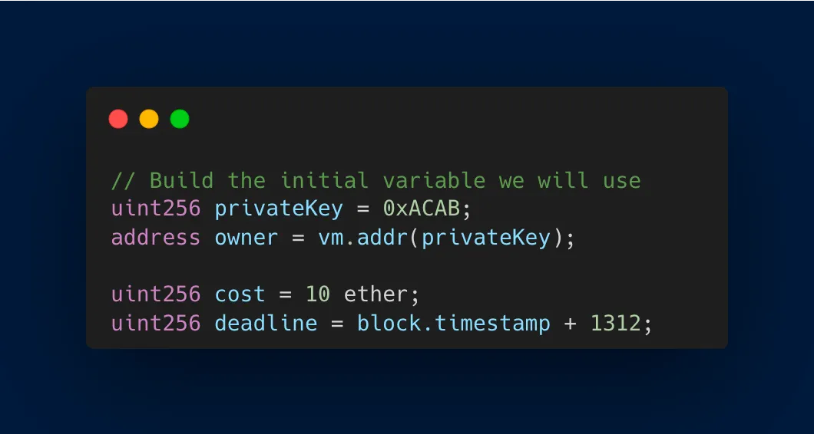

Hello everyone, and welcome to the third article in our series on ERC-2612! In the [previous articles](https://medium.com/frak-defi/erc-2612-the-ultimate-guide-to-gasless-erc-20-approvals-part-2-9c90c01eb69d), we’ve discussed the general overview of ERC-2612 and its implementation in Solidity using EIP-712, which enhances user experience and interactions with DeFi platforms like [Frak](https://frak.id/).

Now, it’s time to dive into the essential aspect of ensuring the **reliability** and **security** of your smart contracts: **unit testing**.

In this article, we’ll explore how to create comprehensive unit tests for your ERC-2612 implementation using popular development tools like [Hardhat](https://hardhat.org/) or [Forge](https://github.com/foundry-rs/foundry/tree/master/forge).

Here’s a recap of our article series:

*   [Part 1: General overview of ERC-2612 (March 13, 2023)](https://medium.com/frak-defi/erc-2612-the-ultimate-guide-to-gasless-erc-20-approvals-2cd32ddee534)
*   [Part 2: Solidity development of ERC-2612 (March 23, 2023)](https://medium.com/frak-defi/erc-2612-the-ultimate-guide-to-gasless-erc-20-approvals-part-2-9c90c01eb69d)
*   _Part 3: Unit testing with Hardhat or Forge (this article)_
*   Part 4: Implementation with Ether.js and Fireblocks (coming soon)

By the end of this article, you’ll be familiar with the best practices for unit testing ERC-2612 and EIP-712 implementations, ensuring the robustness and security of your ERC-20 tokens and their integration with DeFi platforms.

So, let’s jump into the world of unit testing!

## Prerequisites

Before diving into unit testing with Hardhat and Forge, there are a few prerequisites to ensure a smooth learning experience:

*   Solid understanding of Solidity and ERC-2612 implementation: Since this article focuses on unit testing the ERC-2612 and EIP-712 implementation, it’s essential to have a good grasp of Solidity and the concepts covered in the previous articles of this series. If you haven’t already, we highly recommend reading [Part 1: General overview of ERC-2612](https://medium.com/frak-defi/erc-2612-the-ultimate-guide-to-gasless-erc-20-approvals-2cd32ddee534) and [Part 2: Solidity development of ERC-2612](https://medium.com/frak-defi/erc-2612-the-ultimate-guide-to-gasless-erc-20-approvals-part-2-9c90c01eb69d) before proceeding.
*   Familiarity with unit testing in the context of smart contracts: This article assumes that you have basic knowledge of unit testing concepts and experience with either Hardhat or Forge for testing smart contracts. If you’re new to unit testing or need a refresher, consider checking out some introductory resources on [Hardhat testing](https://hardhat.org/hardhat-runner/docs/guides/test-contracts) or [Forge testing](https://book.getfoundry.sh/forge/tests) before diving in.
*   Required tools and environment setup: To follow along with the examples, make sure you have the necessary tools and environment set up for either Hardhat or Forge.

Now that we’ve covered the prerequisites, we’re ready to delve into unit testing our ERC-2612 and EIP-712 implementation with Hardhat and Forge. Let’s get started!

_Disclaimer: In this article, we will primarily focus on successful unit test cases. It is essential to implement unit tests for every error and edge case to ensure the robustness and security of your smart contract. Make sure to thoroughly test all possible scenarios when developing your own contracts._

## Unit Testing with Hardhat

In this section, we’ll walk through the process of setting up and executing unit tests for your ERC-2612 and EIP-712 implementation using Hardhat.

### Setting up variables for the hash (value, nonce, deadline)

To start, we’ll define the variables necessary for generating the hash, including the value to be approved, the nonce to prevent replay attacks, and the deadline to ensure the approval is time-limited.

### Building the domain data, types, and values for the hash

Next, we’ll construct the EIP-712 domain data, types, and values required for hashing and signing the permit function. This step ensures that our hash conforms to the EIP-712 standard.

### Signing the hash and extracting the r, s, and v values

With the hash properly constructed, we can now sign it using the private key of the approver. After signing the hash, we’ll extract the r, s, and v values from the signature, which are necessary for calling the permit function.

### Calling the permit function, ensuring allowance, and executing a transfer

With the r, s, and v values in hand, we can now call the permit function in our smart contract. After calling the permit function, we’ll check the allowance to verify that the approval has been successfully recorded.

Then, with the approval in place, we can then call the transfer function on behalf of the approver. We’ll verify that the transfer was successful by checking the updated token balances.

By combining these steps, we efficiently test the permit and transfer functions together, ensuring a seamless approval and transfer process in our ERC-2612 and EIP-712 implementation using Hardhat. This approach helps verify the proper functioning of your smart contracts and enhances their overall security and reliability.

## Unit Testing with Forge

In this section, we’ll walk through the process of setting up and executing unit tests for your ERC-2612 and EIP-712 implementation using Forge.

### Set up variables for the hash (value, nonce, deadline)

Just like with Hardhat, we’ll start by setting up the variables needed for the EIP-712 hash. You’ll need to define the value, nonce, and deadline:

### Build the domain data, types, and values for the hash

Next, build the domain data, types, and values required for the EIP-712 hash. This process remains the same as in the Hardhat example:

### Sign the hash and extract the r, s, and v values

To sign the hash using Forge, you can use the `vm.sign()`. Extract the r, s, and v values as shown below:

### Call the permit and ensure allowance, then execute the transfer and ensure its success

Finally, call the permit function, check the allowance, and execute the transfer using the Forge testing framework. The code snippet is the same as in the Hardhat example:

By following these steps, you can successfully implement unit testing for your ERC-2612 and EIP-712 implementation using Forge.

## Comparing Hardhat and Forge

When it comes to unit testing smart contracts, Hardhat and Forge are both popular choices. However, there are some notable differences between the two that can impact your development experience. In this section, we’ll compare the two frameworks, highlighting their **strengths** and **weaknesses**.

### Code Complexity and Readability

In my opinion, Hardhat’s testing syntax is more complex and less readable compared to Forge.

Hardhat relies on JavaScript for writing tests, whereas Forge allows you to write tests directly in Solidity. As a result, Forge tests tend to be cleaner and more focused on the Solidity code itself, making it easier to reason about the contract logic.

### Performance

Forge has a clear advantage when it comes to test execution speed. In our experience, Hardhat tests took 40ms to run, while Forge tests were significantly faster, taking only 9.03ms.

This difference can be crucial when working on large projects with many tests, where faster test execution can save valuable time.

### Flexibility and Ease of Use

Forge’s Solidity-based testing approach makes it much easier to test all edge cases, ensuring comprehensive coverage of your smart contracts.

This is because you can leverage the full power of Solidity when writing your tests, keeping your repository solely focused on the language you’re working with.

### Advanced Testing Capabilities

Forge offers some advanced testing features that can enhance the security of your smart contracts.

With Forge, you can easily perform fuzz testing, invariant testing, and even test your contracts against mainnet data using the Cast feature.

These advanced testing capabilities can help you uncover hidden vulnerabilities and ensure the robustness of your smart contracts.

In conclusion, both Hardhat and Forge are powerful unit testing frameworks with their own strengths and weaknesses. While Hardhat may be more familiar to some developers, Forge offers a clean, Solidity-centric approach to testing, along with advanced testing features that can significantly improve the security of your smart contracts. Ultimately, the choice between the two will depend on your personal preferences and requirements.

## Conclusion

Congratulations on completing the third instalment of our series on ERC-2612! You’ve gained valuable insights into unit testing with Hardhat and Forge, and now understand their differences, strengths, and weaknesses. By choosing the right testing framework for your needs, you can ensure the robustness and security of your ERC-20 tokens and DeFi protocols.

But we’re not done yet! The final article in this series will cover the implementation of ERC-2612 using Ether.js and Fireblocks, demonstrating how to make your smart contracts even more powerful and accessible.

If you found this article helpful, please give it a **clap**, **share it**, and **follow me** for more in-depth articles on Solidity, DeFi, and the blockchain world.

Are you ready to take the next step? Let’s continue our journey into the world of DeFi together!